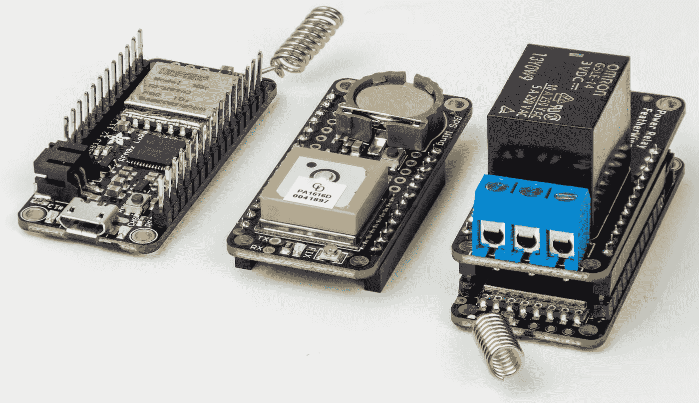
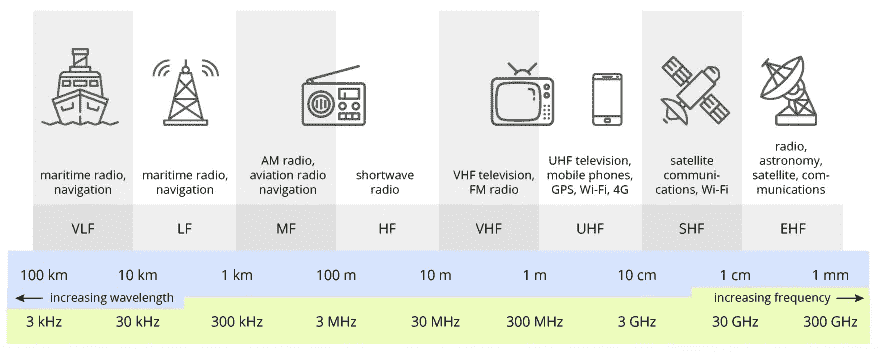
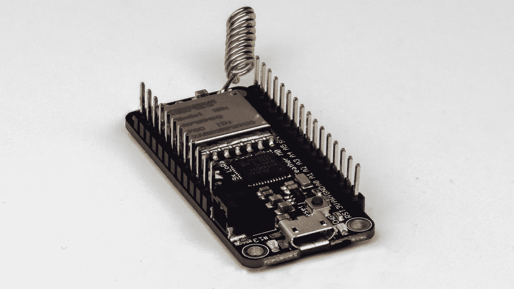
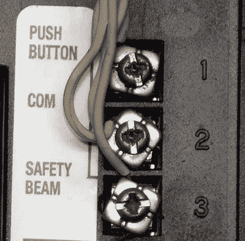
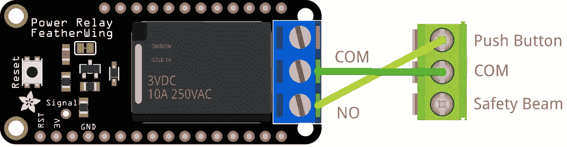
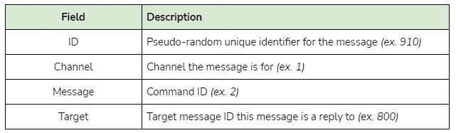
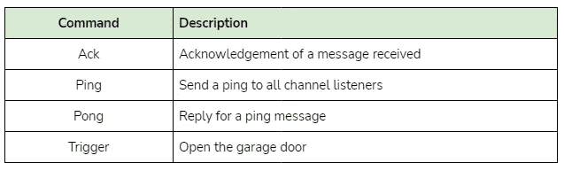

# 使用无线电频率和 Python 来控制世界

> 原文：<https://levelup.gitconnected.com/using-radio-frequency-and-python-to-control-the-world-52d99aa9cece>



我会把这个世界留到以后，但是我想我应该先从更小的开始——我的车库。我们的车库门慢得令人难以置信，所以即使我们从街上的几户人家触发了它，我们最终还是不得不在车道上等着。我已经看到了一些 LoRa 项目，它似乎很适合解决这个问题，因为我们可以在我家里与设备通信，即使不在我的 WiFi 网络范围内(并且不使用蜂窝数据)。

在这篇文章中，我想回顾一下我是如何构建一个系统的，当我把车开进我的小区时，这个系统可以远程打开我的车库门。这样，当我们停车的时候它就会打开，我们就不用等了。有了这么一个*重要的*问题要解决，我们开始吧！

# 劳拉

LoRa(来自 **Lo** ng **Ra** nge)使用低功率无线电通信来传输数据，使用三种频率:433 MHz、868 MHz 和 915 MHz。您应该使用哪种频率最终取决于您的国家(有时也取决于地区)。物联网有一个很好的汇总列表，但是你仍然应该检查你当地的法律以确保万无一失——除非你喜欢当地友好的政府机构来敲门。我将使用 915 兆赫无线电，因为我在美国，没有其他限制时，相比使用 433 兆赫。

在测试期间，我能够使用一个[基本天线](https://www.adafruit.com/product/4269)实现 215 米(700 英尺)的范围，因此使用一个更高级的天线，您可以获得更大的范围——最终取决于您的环境。如果你有一条天线之间的视线，你的范围会增加更多。

## 无线电频率

射频每天都在我们身边——您的 WiFi、无线鼠标/键盘、蓝牙、GPS 等等。然而，它们都工作在不同的频率上，这取决于应用(和所需的吞吐量)。LoRa 使用较低的超高频频率的好处是，与 WiFi 或蓝牙相比，即使使用基本的天线，我们也可以获得很好的覆盖范围。然而，这样做的缺点是，我们每个数据包可以发送的数据量非常有限。



通过 [TeraSense](https://terasense.com/terahertz-technology/radio-frequency-bands/) 的无线电频段图形

## 沟通限制

由于 LoRa 不是直接通信协议，我们发送的任何数据都可能被范围内的其他无线电设备看到。没有办法只将数据发送给特定的侦听器(除非您使用的是 LoRaWAN ),因此我们在构建解决方案时必须牢记这一点。解决这个问题的一个方法是对我们发送的数据进行加密，这样只有拥有加密密钥的人才能解密我们发送的内容，例如:

```
Encrypted: 240e805f37511b9ea82911de60775c623024a2730125f12805500b94
Decrypted: {"channel": 1, "message": "..."}
```

然而，并不是所有的微控制器都支持加密。在我的情况下，这最终成为一个限制因素，并使我从我的工作流程中删除了加密。但这是我将来会记住的事情，因为我认为这是一个有趣的方法，并保证没有第三方窥探。

## 洛拉万

LoRaWAN 是 LoRa 之上的网络协议。节点连接到网关，网关作为一个桥梁，允许节点从整个网络发送/接收数据包，而不是只从范围内的网络发送/接收数据包。如果您正在围绕 LoRa 构建一个完整的智能家居，或者想要整合多种设备，那么使用 LoRaWAN 是正确的选择。因为我想到的项目只使用两个节点，所以我可以只使用 LoRa——但是我已经看到如何利用 LoRaWAN 来实现一些未来的项目想法。

# 五金器具

为了给这个项目供电，我买了两台预装了 RFM95 无线电的阿达果羽毛 M0。这些无线电被称为“收发器”，这意味着它们可以发射和接收无线电波，这正是我们需要的，因为我们希望将数据从一个无线电传输到另一个无线电。

Adafruit 的 Feather 系列是一系列微控制器和配套板，称为 FeatherWings，支持许多不同的用例和外形。你也可以用一个羽毛装置使用多个翅膀，这非常有用。



阿达果羽毛 M0 RFM9x

不过，为这款器件 SAMD21 供电的 CircuitPython 构建和微控制器相当有限。它不能处理长整数，没有随机的硬件资源，没有现成的 JSON 支持，并且只有 32KB 的 RAM。虽然这看起来似乎足够了，但在 CircuitPython 单独加载之后，我们已经只剩下 17KB 的内存了。在加载了所有的库并解析了一些 GPS 数据之后，无论哪个羽毛处理 GPS 模块，最终都只有 500 字节到 1 KB 的 RAM 可用。

幸运的是，这刚好够完成我所需要的，但我会在结论中再次提到这一点。

## 车库五金

为了打开车库门，我将使用一个 [Adafruit 电力继电器羽翼](https://www.adafruit.com/product/3191)连接到其中一根羽毛上。对于我的车库门系统，我有一个硬连线按钮，我们可以按下它来打开/关闭门，它延伸到门电机的后面，连接到两个螺丝端子。



我车库门马达的后面

使用万用表，我发现引脚(交流或 DC)之间没有电压，当在连续性模式下检查时，我可以看到按钮在按下时只连接两个引脚。这使得我们的工作布线超级容易！我们将 COM 端口连接在一起，然后从 NO(常开-或默认情况下不连接)连接一根电线到开门器的顶部端子。这样，我们就不会在断电后系统通电时打开门。



接线图

在中继板的背面，我们可以焊接一个跳线垫，将信号线连接到羽毛上的特定引脚。然后，我们只需将该引脚的输出设置为高电平，以触发继电器:

```
import board
import digitalio
import time

# Setup the pin
relay = digitalio.DigitalInOut(board.A0)
relay.direction = digitalio.Direction.OUTPUT

# Switch the relay to NO (Normally Open)
relay.value = True

# Slight delay to simulate pressing the button momentarily
time.sleep(0.1)

# Switch the relay back to NC (Normally Closed)
relay.value = False
```

## 汽车硬件

为了追踪我的车的位置，我抓了一只[阿达果终极 GPS 羽翼](https://www.adafruit.com/product/3133)作为另一只羽毛。它将通过 UART 与羽毛通信，并允许我们看到我们的汽车的位置，速度，高度，如果需要的话。Adafruit 还发布了一个库，使使用 GPS 模块变得尽可能容易，让我们可以通过几个简短的命令轻松获取我们的坐标。


阿达果终极 GPS 羽翼

使用 Adafruit 的 GPS 库，我们可以像这样得到我们的位置:

```
import adafruit_gps
import board
import busio
import time

# Setup UART and the GPS module
uart = busio.UART(board.TX, board.RX, baudrate=9600, timeout=10)
gps = adafruit_gps.GPS(uart, debug=False)

# Set our mode to GGA/RMC
gps.send_command(b"PMTK314,0,1,0,1,0,0,0,0,0,0,0,0,0,0,0,0,0,0,0")
# Request updates every second (sent in ms)
gps.send_command(b"PMTK220,1000")

last_print = time.monotonic()
while True:
  current = time.monotonic()

  # Parse any GPS data if available
  gps.update()

  # Every second, check if we have a location fix 
  # and print out our location if so
  if current - last_print >= 1.0:
      last_print = current
      if not gps.has_fix:
          print("Waiting for GPS location fix...")
          continue

      print(f"GPS Location: {gps.latitude}, {gps.longitude}")
```

# 履行

为了检查我们是否应该打开车库门，汽车的羽毛将使用 GPS 模块每秒钟获取其活动位置。然后，它使用[哈弗辛公式](https://en.wikipedia.org/wiki/Haversine_formula)来计算从它的位置到触发区的距离。如果在 15 米之内，它会发出“开门”的信息。为了防止在我们离开附近时发出这种信息，我们首先必须在至少 200 米远的地方“激活”触发区。

来自我的一个初始测试的动画数据日志(不按比例)

## 发送命令

我的所有消息包含以下字段:



消息属性

每当发送消息时，我们使用 Python 的 [struct](https://docs.python.org/3/library/struct.html) 库将数据打包成二进制数据。这使有效载荷的大小保持最小，同时仍然给我们一个稍后解码消息的简单方法:

```
import struct

# Set the message format as four unsigned shorts
msg_format = '4H'

# Pack our example variables according to the format
packed = struct.pack(msg_format, 202, 20, 4, 429) 

print(packed)
# b'\xca\x00\x14\x00\x04\x00\xad\x01'

# Unpack the data
msg_id, channel, message, target = struct.unpack(msg_format, packed)

print(msg_id, channel, message, target)
# 202 20 4 429
```

对于这个项目，我们总共有四个命令:



消息命令

每当收到一条消息时，就会发送一条确认消息来确认收到消息(ping 除外，因为我们发送的是 pong 回复)。这是因为有时数据包可能会丢失，即使设备在范围内。如果在五秒钟内没有收到确认，它会自动重新发送信息，直到收到一个。这有助于解决我面临的一些消息传递问题，因为我可能会丢失 5-10%的数据包。

# 结论

总的来说，这是一个非常有趣的项目。几个月来，我一直渴望参与 LoRa 项目，现在终于有了机会。这个范围给我留下了深刻的印象(即使使用如此简单的天线)，使用更先进的设置，我只能想象无限的可能性。

对于我的下一个 LoRa 项目，我可能会考虑使用 LoRa 突破，而不是像我在这个项目中使用的羽毛板那样的集成解决方案。有限的资源是开发过程中的主要时间消耗，并且限制了我能做的事情，因为我不得不删除相当多的计划功能。我想如果我用 C++的话，事情会简单得多，所以我明年的一个主要计划就是用 C++提高技能。

感谢您的阅读，我希望这是一个有趣的阅读，并随时留下任何问题的评论。您可以在下面找到包含所有相关代码和一些额外文档的代码库。

# 资源

*   [代码库](https://github.com/makvoid/Blog-Articles/tree/main/LoRa-Garage)
*   [洛拉联盟](https://lora-alliance.org/)

# 分级编码

感谢您成为我们社区的一员！在你离开之前:

*   👏为故事鼓掌，跟着作者走👉
*   📰查看更多内容请参见[升级编码刊物](https://levelup.gitconnected.com/?utm_source=pub&utm_medium=post)
*   🔔关注我们:[Twitter](https://twitter.com/gitconnected)|[LinkedIn](https://www.linkedin.com/company/gitconnected)|[时事通讯](https://newsletter.levelup.dev)

🚀👉 [**加入升级人才集体，找到一份神奇的工作**](https://jobs.levelup.dev/talent/welcome?referral=true)