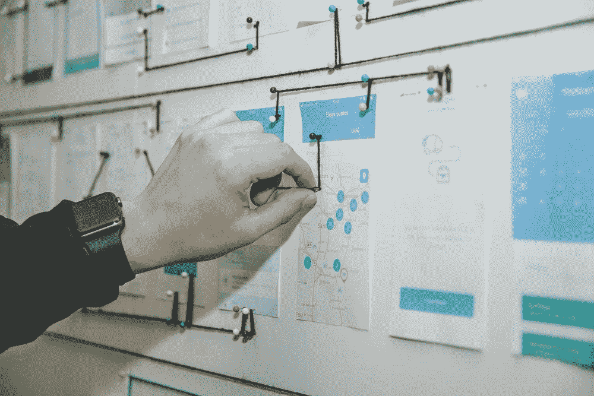
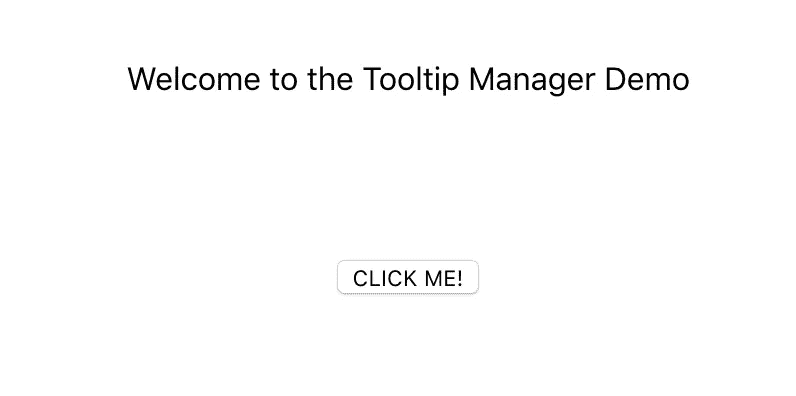
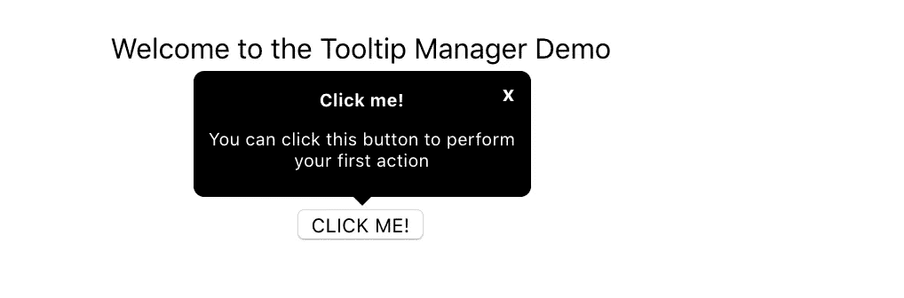
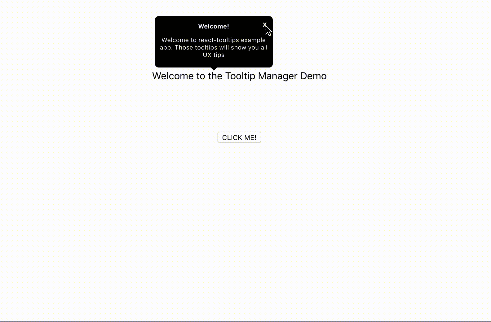

# 使用 React 16 门户为遗留应用程序构建全局 UX 工具提示管理

> 原文：<https://levelup.gitconnected.com/using-react-16-portals-to-build-a-global-ux-tooltip-management-application-f6389f24c1a7>

在本文中，我们将通过一个小而简单的教程来了解如何使用 React 16 的新特性 Portals 来显示交互式工具提示，以便在项目中获得更好的用户体验。



# 介绍

**我们为什么喜欢 React JS？**这个令人敬畏的库的主要优势之一是可以用 Javascript 创建可重用的组件来构建复杂的 UI。由于逻辑是用 Javascript 以声明性和结构良好的方式编写的——不需要 HTML 模板和 DOM 操作——当组件状态改变时，React 将有效地呈现/更新用户界面。

**这些问题是从哪里提出来的？**当您的前端应用程序完全用 React 编写时，React 非常强大——您可以通过 React 组件属性和状态完美地控制您的 UI，并且很容易在您的应用程序层次结构中注入新组件或更改现有组件以附加新事件或任何附加逻辑。

当然也有一些例外，即静态内容可以只是 HTML(但是无状态 React 组件在许多情况下也可以工作得很好)。但是想象一下，当你的前端应用程序的一部分以 Angular、jQuery 或普通 HTML 等格式呈现时，你正在处理遗留代码。—但是**不受你的 React 应用**控制。您需要将 React 应用程序或多个应用程序注入到现有项目中。在我看来，这是一个主要的弱点——当你需要处理结构良好的 JSX 之外的所有东西时。在这一点上，出现了许多问题:

*   你如何将这些应用程序渲染到现有项目中([示例](https://github.com/ngReact/ngReact))？
*   你如何在应用程序之间共享数据？
*   你将如何处理来自非反应源的事件？

等等。等等。等等。…..


与 Angular 或 jQuery 不同，React 在处理来自其他库/框架/普通 HTML 的遗留代码方面不太好。如果您需要将多个 React 应用程序中的一些公共逻辑集成到页面上的不同 DOM 节点中，您也可以从中获得很多乐趣。你可以反驳这一点，但这是我在工作中经常面临的挑战之一。

这方面的一个例子是[工具提示](https://en.wikipedia.org/wiki/Tooltip)。假设您想为用户提供一些提示，让他们了解您的整个应用程序——让他们知道如何使用它，主要功能是什么等等。您还希望这些工具提示是可忽略的(如果您不能关闭它，会很烦人)、交互式的(它们中的一些可以在某些事件或超时时弹出)并且理想地从一个应用程序控制(因此您只有一个地方来控制与提示和工具提示相关的 UI 的当前状态)。假设你的 UI 不是一个单独的 React 应用——它可以是多个应用+部分 HTML 代码+少量 Angular 或其他框架。或者你有一个复杂的 React 应用程序，它有很深的层次结构，这使得它很难为了工具提示而传递道具。

尽管您希望集成新的逻辑，尽可能避免复制/粘贴…


现在是时候让 [React 16](https://reactjs.org/) 及其令人惊叹的新功能[门户](https://reactjs.org/docs/portals.html)大放异彩了。让我们来看看官方文档。

```
Portals provide a first-class way to render children into a DOM node that exists outside the DOM hierarchy of the parent component.
```

它是这样工作的:

```
ReactDOM.createPortal(child, container)
```

其中`child`是一个 react 组件，而`container`是一个目标 DOM 节点。

听起来正是我们需要的。此外，根据 React JS 官方教程，各种模态和弹出窗口是 React 门户特性的良好用例。在本教程中，我们将尝试使用这个功能来建立一个交互式用户界面工具提示层。

# 任务定义和假设

我们需要建立应用程序来控制我们的 UI 工具提示，应该是:

*   能够指向从不同来源呈现的 UI 元素
*   可忽略—用户可以关闭工具提示
*   能够触发事件(即显示一个接一个的工具提示链)
*   能够在某些事件上显示(例如，点击按钮时，其他工具提示关闭)

对于本教程，我们还做了几个假设:

*   UI 部分在 React APP 中呈现，部分作为 HTML 模板呈现
*   我们需要一次只显示一个工具提示
*   我们使用一个简单的工具提示样式，取自 [w3schools](https://www.w3schools.com/css/c)
*   工具提示里面没有任何动作按钮(只有关闭按钮)
*   我们不使用任何国家管理工具——只有古老的`setState`:)

# 实施解决方案

为了简化应用程序创建过程，我们只需使用 facebook 提供的 [create-react-app](https://github.com/facebook/create-react-app) 工具。你可以遵循官方文档或者使用我的其他教程。对于本教程，我们不需要任何额外的包，只要确保你有一个现代版本的 [React JS](https://github.com/KilroggD/react-tooltip/blob/3e25d904d90d29b27e3e543c78c935c09aabe581/package.json#L6) 。如果你想看到整个解决方案的工作——随意克隆[https://github.com/KilroggD/react-tooltip](https://github.com/KilroggD/react-tooltip)并启动应用程序。

我将尝试解释我们需要为这个特定的教程做的主要步骤。

*   就约定达成一致。让我们用一个特定的类名***class = " tooltip-target "***来标记我们需要工具提示指向的所有块。同样，让我们给每个块一个唯一的 id 来表示工具提示位置，即`***id = " TM-event-tooltip "***`。假设`tm`是“工具提示管理器”的首字母缩写。
*   将用户界面的非反应部分添加到索引中。html 文件。让我们把欢迎标题放在我们的应用程序之外，再加一个隐藏的消息块。我们将通过单击 react 应用程序中的按钮来显示该块，并显示该事件的工具提示。`root`容器将包含主 React 应用程序。

```
 <div class="welcome-msg">
        <div id="tm-welcome-tooltip" class="tooltip-target">
            Welcome to the Tooltip Manager Demo
        </div>
    </div>
    <div id="root"></div>
    <div id="event-message" class="event-msg  hidden">
      <div id="tm-event-tooltip" class="tooltip-target">
        <span>This is the test app to show how we can use React Portals to create a Tooltip Manager.</span>
      </div>
    </div>
```

*   为工具提示属性定义[模板](https://github.com/KilroggD/react-tooltip/blob/master/src/tooltips/tooltip-templates.js)。让我们假设每个工具提示都有 3 个属性——标题、文本和位置(与给定工具提示所指向的组件的 id 相关)

```
"welcome": {
        title: 'Welcome!',
        text: 'Welcome to react-tooltips example app. Those tooltips    will show you all UX tips',
        position: 'welcome-tooltip',
    },
```

*   创建简单的无状态工具提示组件,它将呈现工具提示本身

```
**const** Tooltip = props => {
    **return** (
        <div className="tooltip">
            <div className="tooltip__content">
                <p className="tooltip__header">{ props.title }</p>
                <p className="tooltip__text">{ props.text }</p>
            </div>
            <button onClick={ props.onClose } className="tooltip__close-btn">x</button>
        </div>
    );
};
```

*   创建将呈现所有工具提示的组件。这是魔法开始的地方。让我们的组件只接受两个属性:`currentTooltip`——显示哪个工具提示当前是活动的，以及`onTooltipClose` —在 tooltipClose 上触发的回调。使用第一个工具，我们可以从模板对象中获得实际工具提示的道具

```
**import** TOOLTIPS **from** './tooltip-templates';**<...>****get** tooltipProps() {
    **return** TOOLTIPS[**this**.props.currentTooltip] || {};
}
```

该组件的主要用途是使用 React Portals 功能在 DOM 树的不同位置呈现工具提示

```
render() {
        if (!this.props.currentTooltip) {
            return null;
        }
        const tooltip = <Tooltip { ...this.tooltipProps } onClose={ this.props.onTooltipClose } />;
        return ReactDOM.createPortal(tooltip, this.tooltipContainer);
    }
```

但是我们不想完全替换目标 DOM 节点的内容。一个可能的解决方案是在目标 DOM 节点中创建一个容器 div(如果它不存在),并在创建的块中呈现一个工具提示。

```
**get** tooltipContainer() {
    **const** targetNode = document.querySelector(`#tm-${**this**.tooltipProps.position}`);
    **let** tooltipContainer = targetNode.querySelector('.tooltip-container');
    **if** (!tooltipContainer) {
        tooltipContainer = document.createElement('div');
        tooltipContainer.classList.add('tooltip-container');
        targetNode.appendChild(tooltipContainer);
    }
    **return** tooltipContainer;
}
```

我们还添加了删除这些容器的代码，以防万一:)

```
componentWillUnmount() {
    [].slice.call(document.querySelectorAll('.tooltip-containter')).forEach(el => { el.remove(); });
}
```

*   创建在 React 中呈现的 UI 部件。这里没什么特别的——只是简单的带有按钮的[主页](https://github.com/KilroggD/react-tooltip/blob/master/src/homepage.react-component.js)组件(带有 onClick 事件),如果你需要的话，你可以自由添加更多的组件:)

```
**const** Homepage = props => {
    **return** (
        <div className="app__homepage">
           <div className="app__action">
                <div id="tm-first-action-tooltip" className="tooltip-target">
                    <button onClick={ props.onClick }>CLICK ME!</button>
                </div>
            </div>
        </div>
    );
};
```



请注意，我们对工具提示目标节点使用相同的约定。

*   现在是时候创建我们的应用程序状态了。对于本教程，我们只是将整个状态保存在 [App](https://github.com/KilroggD/react-tooltip/blob/master/src/App.js) 容器中。为了使我们的应用程序更加强大，我们可以使用 [Redux](/enhancing-your-react-graphql-app-with-redux-and-redux-thunk-90c556aff1c5) 或 [MobX](/managing-react-application-state-with-mobx-full-stack-tutorial-part-1-372a7825847a) 作为状态管理库。如果你想这样做，你可以查看上面链接的我的教程，或者按照官方文档。因为我们只是保持简单

```
**class** App **extends** Component {

  constructor(props) {
    **super**(props);
    **this**.state = {
      currentTooltipName: **null**,
    };
  }
  render() {
    return (
      <div className="app">
          <Homepage onClick={ this.firstAction } />
          <TooltipManager
              currentTooltip={ this.state.currentTooltipName }
              onTooltipClose={ this.onTooltipClose }
          />
      </div>
    );
  }
}
```

正如你所看到的——我们在状态对象中只有一个键，定义了我们当前工具提示的名称。让我们默认执行步骤`'welcome'`

```
componentDidMount() {
  **this**.setState({ currentTooltipName: 'welcome' });
}
```


然后，我们定义一个方法来重置工具提示关闭时的状态

```
onTooltipClose = () => {
    **this**.setState({
        currentTooltipName: **null**,
    });
}
```

然后，让我们创建一个可能的场景——“链式”UI 工具提示一个接一个地打开，显示所有必要的提示，以获得更好的用户体验。

```
componentDidUpdate(prevProps, prevState) {
  **if** (prevState.currentTooltipName === 'welcome' && **this**.state.currentTooltipName === **null**) {
      **return this**.setState({ currentTooltipName: 'first_action' });
  }
}
```

如果`welcome`工具提示被关闭——立即打开`first_action`工具提示。



现在让我们为“CLICK ME”按钮创建一个动作，使我们的应用程序具有动态性和交互性。首先，我们为按钮创建一个动作。

```
firstAction = () => {
  setTimeout(() => {
      **this**.setState({ currentTooltipName: 'event' });
      document.querySelector('#event-message').classList.remove('hidden');
  }, 500);
}
```

该按钮将显示 React JS 外部呈现的`event-message`块，并将状态切换到`event`步骤。

别忘了添加一些花哨的[风格](https://github.com/KilroggD/react-tooltip/blob/master/src/App.css)——就是这样！我们的应用已经准备好了。



# 结论

*   如果您需要 React 组件在根应用程序节点之外呈现并由一个状态控制，React Portals 是一个非常棒的解决方案。
*   我们可以随时随地显示工具提示——在渲染时/在某些事件触发时/在其他工具提示关闭时等等。
*   它们也适用于异步呈现和向 DOM 中注入组件
*   各种模态、弹出窗口和工具提示都是门户的良好用例
*   使用 MobX 或 Redux(可能是不同的文章)这样的状态管理工具，本教程会更加强大和灵活
*   我们需要解决使用门户的 React 应用程序的单元测试问题