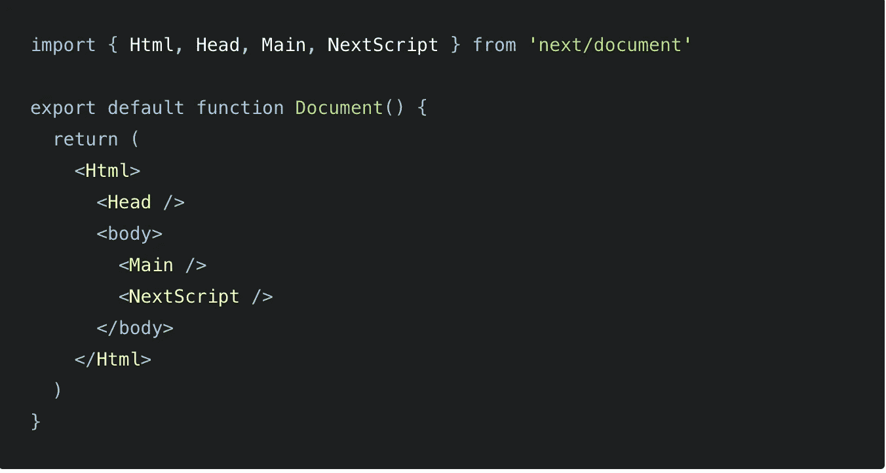
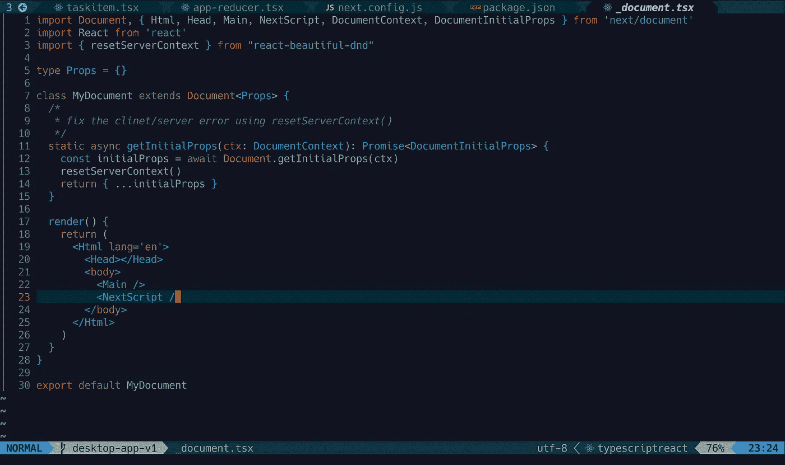
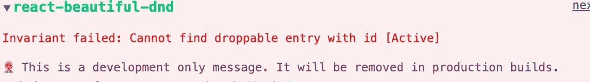

# 将 react-beautiful-dnd 与 Next.js 和 TypeScript 一起使用

> 原文：<https://levelup.gitconnected.com/using-react-beautiful-dnd-with-next-js-and-typescript-58a198b7266b>

## 在 Next.js 应用程序中创建一个漂亮的拖放组件。


图像由[Unable to find any drag handles in the context “0”

**解决方案**:覆盖`Document`](https://medium.com/u/9f2dc23bfffa#1 </strong> : <code class=) 

[Next.js 的服务器端呈现特性可能会打乱一个库的运行方式，其中一个这样的库就是](https://medium.com/u/9f2dc23bfffa#1 </strong> : <code class=)`[react-beautiful-dnd](http://twitter.com/types/react-beautiful-dnd).`为了解决上面的问题，我们需要在`Document`中使用`resetServerContext`调用，这样来自服务器的标记就不会与客户端库(依赖项)所期望的发生冲突(在我们的例子中是`react-beautiful-dnd` )。然后我们需要覆盖默认的`Document` ( `pages/_document.js`)，如下所示:



*你可以在这里跟踪* `*_document*` *的单据:*[*【https://nextjs.org/docs/advanced-features/custom-document】*](https://nextjs.org/docs/advanced-features/custom-document)

我们需要从`react-beautiful-dnd`导入`resetServerContext`，并在返回之前在我们的`getInitialProps`中调用它。这里是 `_document`的样子:



[李冠仪](https://medium.com/u/9f2dc23bfffa?source=post_page-----58a198b7266b--------------------------------)代码截图

**第二期:**

到目前为止，您可能仍然会看到与下面类似的问题:



**解决方案:**去掉`reactStrictMode`

你可以在 [Github 问题页面](https://github.com/atlassian/react-beautiful-dnd/issues/2396)上找到这个问题的讨论。不太坏，因为它只发生在开发环境中，而不是在生产环境中。然而，为了让我们的开发变得容易，我们只需要在`next.config.js`中注释掉下面的代码

```
// reactStrictMode: true,
```

# 使用 R `eact-Beautiful-Dnd, Next.js, and TypeScript`构建一个 Todo 应用程序

你可以在回购:[https://github.com/amy-juan-li/example-dnd-todo](https://github.com/amy-juan-li/example-dnd-todo)中使用`react-beautiful-dnd` 找到一个 Todo 应用

# 阅读关于构建 Next.js 应用程序的更多信息


[李冠仪](https://amyjuanli.medium.com/?source=post_page-----58a198b7266b--------------------------------)

## 网站开发

[View list](https://amyjuanli.medium.com/list/web-dev-db243e7bdf05?source=post_page-----58a198b7266b--------------------------------)6 stories

## 由[Alex rear don](https://medium.com/@alexandereardon?source=post_page-----d9f5770b4e6b--------------------------------)(`react-beautiful-dnd):`的作者)创建的有用资源和教程

*   📖[反思拖放](https://medium.com/@alexandereardon/rethinking-drag-and-drop-d9f5770b4e6b)
*   🎧 [React 播客:快速、易用、漂亮的拖放功能](https://reactpodcast.simplecast.fm/17)
*   🎞一门[免费课程上](https://egghead.io/courses/beautiful-and-accessible-drag-and-drop-with-react-beautiful-dnd) `[egghead.io](https://egghead.io/courses/beautiful-and-accessible-drag-and-drop-with-react-beautiful-dnd)` [🥚](https://egghead.io/courses/beautiful-and-accessible-drag-and-drop-with-react-beautiful-dnd)
*   💻[https://codesandbox.io/examples/package/react-beautiful-dnd](https://codesandbox.io/examples/package/react-beautiful-dnd)