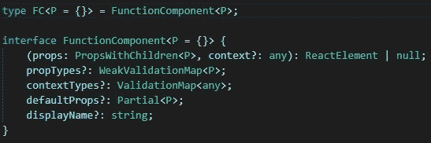
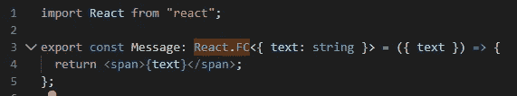
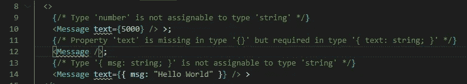
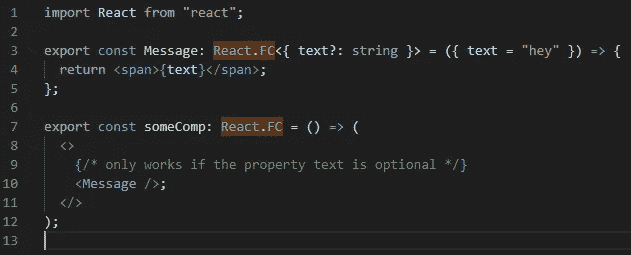
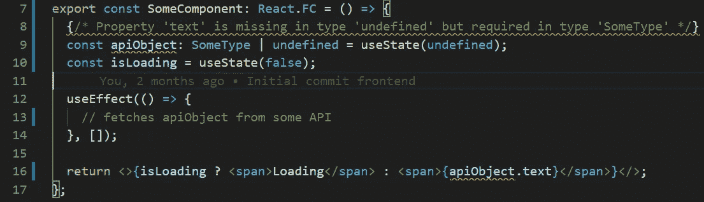
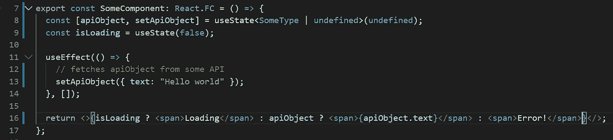
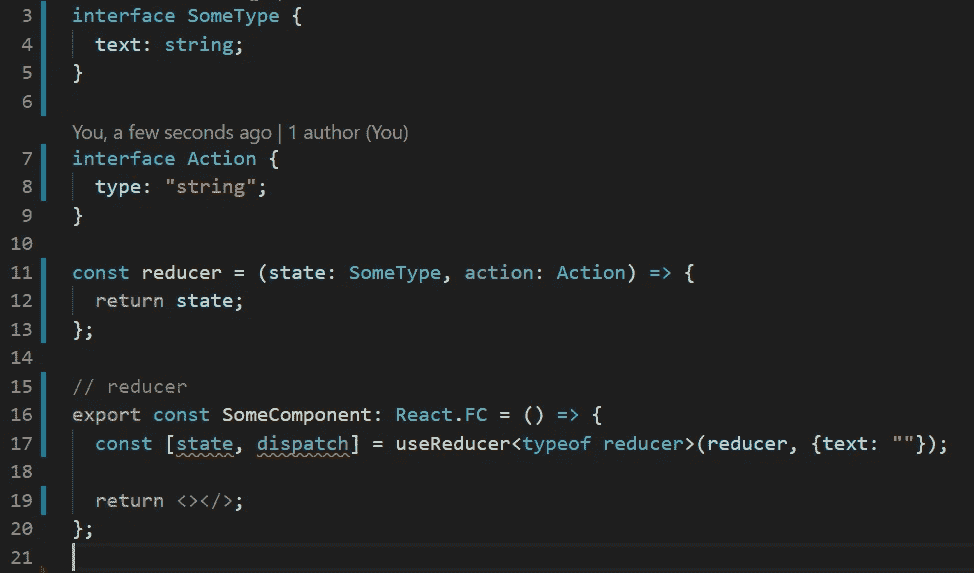

# 在 TypeScript 中使用带挂钩的 React 功能组件

> 原文：<https://levelup.gitconnected.com/using-react-functional-components-with-hooks-in-typescript-6d61075edddc>

照片由[émile Perron](https://unsplash.com/@emilep?utm_source=unsplash&utm_medium=referral&utm_content=creditCopyText)在 [Unsplash](https://unsplash.com/s/photos/programming?utm_source=unsplash&utm_medium=referral&utm_content=creditCopyText) 上拍摄

将 TypeScript 与 React 的类组件一起使用是很自然的，因为您只需扩展`React.Component`并立即从键入中受益。然而，当使用 React 功能组件时，可能会出现一些混淆。

Reacts 功能组件只是 JavaScript 函数，但这并不意味着它们不遵循任何约束。具体来说，也是最重要的，功能组件接受一个道具对象，我们需要输入这个道具。

当在 TypeScript 中创建一个功能组件时，我们首先需要使用类型`React.FC`，它基于 FunctionComponent 接口:

`React.FC`确保我们函数的签名是正确的，返回值是有效的 JSX。此外，由于 TypeScript 泛型，我们可以通过内联或提供接口/类型来传递我们的 props 类型。然后，这个被传递的类型被用于`props`、`defaultProps`(灵活地使用实用类型[部分](https://www.typescriptlang.org/docs/handbook/utility-types.html#partialt))和`propTypes`(当使用 TypeScript 时被废弃)，这样一切都被类型化。

上面的代码意味着现在无论我们在哪里使用我们的功能组件，我们都需要传递这个特定的属性集(这里是字符串类型的文本)。注意，使用[析构](https://developer.mozilla.org/en-US/docs/Web/JavaScript/Reference/Operators/Destructuring_assignment)，我们可以以简洁的方式访问它们。如果我们没有遵循正确的输入，或者忘记添加一个道具，我们就会遇到编译错误:

即使为我们的属性消息设置了默认值，我们仍然会收到一个错误。这是因为我们的文本属性类型需要是可选的，如下所示:

甚至可以为非可选字段设置默认值，这一事实对我来说很奇怪，在编译时没有任何影响。

## 钩住

钩子给我们的功能组件带来力量。当然，我们仍然希望从强类型中受益。最大的陷阱之一是在使用`useState`钩子时注意默认值:

这将无法编译，TypeScript 也不允许您提供默认值。上述错误的原因是，由于默认值，TypeScript 推断出了`apiObject`到`undefined`的类型，即使我们将它定义为联合类型“`SomeType |undefined`”。

我们可以通过在使用钩子时使用泛型来解决这个问题，因为当涉及到联合类型的缺省值时，类型推断会咬你一口，比如 optionals。如果我们想要 undefined 作为我们对象的缺省值，我们可以像这样传递我们的类型信息:

这也将迫使我们在访问功能组件中的对象之前检查它。

使用`useReducer`挂钩也是类似的。只需提供您的操作和状态类型。如果不这样做，那么简单地使用初始状态的类型进行类型推断也会遇到同样的问题。您提供的减压器功能需要:

*   接受动作类型(动作)的第一个参数
*   接受第二个参数或状态的类型(SomeType)
*   返回一个等价于你的状态类型(SomeType)的对象
*   useReducer 必须为您的状态提供初始值(SomeType)

## 结论

功能组件可能只是功能，但这并不意味着它们不应该或不能被有效地类型化。感谢阅读。