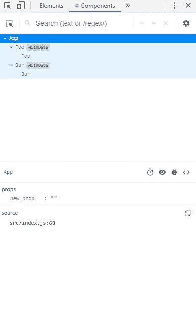

# 使用 React 高阶组件

> 原文：<https://levelup.gitconnected.com/using-react-higher-order-components-eda81ffe9b3e>


照片由 [QuickOrder](https://unsplash.com/@quickorder?utm_source=medium&utm_medium=referral) 在 [Unsplash](https://unsplash.com?utm_source=medium&utm_medium=referral) 上拍摄

React 是一个用于创建前端视图的库。它有一个庞大的图书馆生态系统与之合作。此外，我们可以用它来增强现有的应用程序。

在本文中，我们将研究如何使用高阶组件将公共代码重构到一个公共位置。

# 为什么我们需要高阶元件？

高阶分量(hoc)是接受一个分量并返回一个新分量的函数。

我们需要 hoc 来重用组件逻辑。这是可行的，因为 hoc 只是普通的函数，通过用新的组件包装传入的组件，向传入的组件添加一些新的东西。

hoc 的例子包括 Redux 的`connect`等等。

# 定义 hoc

例如，我们可以定义一个为每个传入的组件设置相同数据的特设，如下所示:

```
class Foo extends React.Component {
  render() {
    return (
      <div>
        {this.props.data.map((d, i) => (
          <p key={i}>{d}</p>
        ))}
      </div>
    );
  }
}class Bar extends React.Component {
  render() {
    return (
      <ul>
        {this.props.data.map((d, i) => (
          <li key={i}>{d}</li>
        ))}
      </ul>
    );
  }
}const withData = (Component, data) => {
  return class extends React.Component {
    render() {
      return <Component data={data} />;
    }
  };
};const DataFoo = withData(Foo, ["apple", "orange"]);
const DataBar = withData(Bar, ["apple", "orange"]);class App extends React.Component {
  render() {

    return (
      <div>
        <DataFoo />
        <DataBar />
      </div>
    );
  }
}
```

在上面的代码中，我们有`Foo`和`Bar`组件，它们是我们将使用`withData` HOC 操作的组件。

它们都只是显示一些来自道具的数据。

然后我们有了`withData` HOC，这只是一个普通的函数，其中`Component`参数是一个组件，第二个`data`参数是一些数据，我们假设它们是一个数组。

`withData`返回一个新组件，该组件将传入的`Component`和传入`Component`的`data`作为道具。

在`App`组件中，我们用同一个数组的`Foo`和`Bar`道具调用了`withData`组件。

然后我们只渲染从`withData`返回的组件，分别是`DataFoo`和`DataBar`。

如我们所见，我们没有改变原始组件。我们只是在原始组件周围包装了一个新组件。

这降低了改变原始组件的风险。当我们在一个元件上缠绕多个 hoc 时，这将变得更加重要。

我们可以从返回的组件向`withData`中的`Component`传递属性，如下所示:

```
class Bar extends React.Component {
  render() {
    return (
      <ul>
        {this.props.data.map((d, i) => (
          <li key={i}>{d}</li>
        ))}
        <li>{this.props.bar}</li>
      </ul>
    );
  }
}
const withData = (Component, data) => {
  return class extends React.Component {
    render() {
      return <Component data={data} {...this.props} />;
    }
  };
};const DataFoo = withData(Foo, ["apple", "orange"]);
const DataBar = withData(Bar, ["apple", "orange"]);class App extends React.Component {
  render() {
    return (
      <div>
        <DataFoo />
        <DataBar bar="bar" />
      </div>
    );
  }
}
```

我们从`withData`返回的组件中获取道具，然后通过编写`{…this.props}`将它传播到`Component`中。

然后我们有:

```
<li>{this.props.bar}</li>
```

在`Bar`中显示数据。

我们还是一样离开了`Foo`。

hoc 也可以用作向屏幕呈现数据的组件的容器组件。

# 容器组件

容器组件处理诸如订阅和状态之类的逻辑，并通过 props 将项目传递给处理数据显示的低层组件。

例如，我们可以写:

```
class Foo extends React.Component {
  render() {
    return (
      <div>
        {this.props.data.map((d, i) => (
          <p key={i}>{d}</p>
        ))}
      </div>
    );
  }
}
class Bar extends React.Component {
  render() {
    return (
      <ul>
        {this.props.data.map((d, i) => (
          <li key={i}>{d}</li>
        ))}
      </ul>
    );
  }
}
const withData = Component => {
  return class extends React.Component {
    constructor(props) {
      super(props);
      this.state = { data: [] };
    }
    componentDidMount() {
      if (Math.random() > 0.5) {
        this.setState({ data: ["apple", "orange"] });
      } else {
        this.setState({ data: ["mango", "grape"] });
      }
    }
    render() {
      return <Component data={this.state.data} {...this.props} />;
    }
  };
};const DataFoo = withData(Foo);
const DataBar = withData(Bar);class App extends React.Component {
  render() {
    return (
      <div>
        <DataFoo />
        <DataBar />
      </div>
    );
  }
}
```

在上面的代码中，我们让由`withData`返回的组件通过调用`componentDidMount`钩子中的`setState`来处理逻辑。

然后我们用`this.state.data`设置`data`道具的值。

然后`Foo`和`Bar`组件显示道具中的物品。


照片由[塞萨尔·卡里诺·阿拉贡](https://unsplash.com/@carlevarino?utm_source=medium&utm_medium=referral)在 [Unsplash](https://unsplash.com?utm_source=medium&utm_medium=referral) 上拍摄

# 包装显示名称以便于调试

HOCs 创建的容器组件像其他组件一样出现在 React 开发工具中。

我们可以通过设置组件的`displayName`属性来选择要在 React 开发人员工具中显示的显示名称。

例如，我们可以将上面的示例更改如下:

```
const getDisplayName = WrappedComponent => {
  return WrappedComponent.displayName || WrappedComponent.name || "Component";
};const withData = Component => {
  class WithData extends React.Component {
    constructor(props) {
      super(props);
      this.state = { data: [] };
    }
    componentDidMount() {
      if (Math.random() > 0.5) {
        this.setState({ data: ["apple", "orange"] });
      } else {
        this.setState({ data: ["mango", "grape"] });
      }
    } render() {
      return <Component data={this.state.data} {...this.props} />;
    }
  }
  WithData.displayName = `WithData(${getDisplayName(Component)})`;
  return WithData;
};
```

在上面的代码中，我们创建了一个新的`getDisplayName`函数来获取`WrappedComponent`的`displayName`属性。这显示在 Chrome 开发者控制台的组件选项卡下的 React 开发者工具中。

我们可以通过改变`displayName`属性的值来设置它，就像我们在新的`withData`特设函数中所做的那样。

首先，我们将名称`WithData`添加到类中，而不是返回一个匿名类。

然后我们补充道:

```
WithData.displayName = `WithData(${getDisplayName(Component)})`;
```

这样组件旁边就会显示出`WithData`标签。

我们现在应该看到如下所示的内容:



# 不要在 render 方法中使用 hoc

我们不应该在`render`方法中使用 HOCs，因为它会导致在每次渲染时挂载/重新挂载整个 DOM 子树。

这很慢，并且重新安装组件会导致组件及其所有子组件的状态丢失。

# 静态方法必须被复制

我们必须手动复制静态方法。

例如，如果我们有:

```
class Bar extends React.Component {
  render() {
    return (
      <ul>
        {this.props.data.map((d, i) => (
          <li key={i}>{d}</li>
        ))}
      </ul>
    );
  }
}Bar.static = () => console.log("static");const withData = (Component, data) => {
  class WithData extends React.Component {
    render() {
      return <Component data={data} />;
    }
  } WithData.static = Component.static;
  return WithData;
};const DataFoo = withData(Foo, ["apple", "orange"]);
const DataBar = withData(Bar, ["apple", "orange"]);class App extends React.Component {
  render() {
    DataBar.static();
    return (
      <div>
        <DataFoo />
        <DataBar />
      </div>
    );
  }
}
```

在上面的代码中，我们通过编写以下代码来定义`Bar.static`方法:

```
Bar.static = () => console.log("static");
```

然后在`withData`函数中，我们有一个新的行来复制`static`静态方法，通过写:

```
WithData.static = Component.static;
```

最后，在`render`方法中，我们可以调用`Bar.static`方法。

# 裁判没有通过

我们可以使用`React.forwardRef`在 hoc 中传递 ref。

例如，我们可以如下编写一个`logProp`组件来实现这一点:

```
function logProps(Component) {
  class LogProps extends React.Component {
    componentDidMount() {
      console.log(this.props);
    } render() {
      const { forwardedRef, ...rest } = this.props;
      return <Component forwardedRef={forwardedRef} {...rest} />;
    }
  } return React.forwardRef((props, ref) => {
    return <LogProps {...props} forwardedRef={ref} />;
  });
}
```

在上面的代码中，我们有:

```
return React.forwardRef((props, ref) => {
  return <LogProps {...props} forwardedRef={ref} />;
});
```

在回调的`return`语句中，我们传入来自`Component`组件的`props`，以及来自`Component`的`forwardedRef`。

然后 ref 被传入`Component`并被设置为我们想要访问的任何元素的 ref 值。

# 结论

高阶组件或简称 hoc，让我们通过创建一个函数来为多个组件添加可重用的逻辑，该函数接受一个组件，然后返回另一个组件。

组织 HOC 的最佳方式是将逻辑放在由 HOC 返回的组件中，然后通过 props 将数据传递给传递到函数中的组件。

我们还必须设置静态方法，并通过转发引用从包装的组件中获取引用。