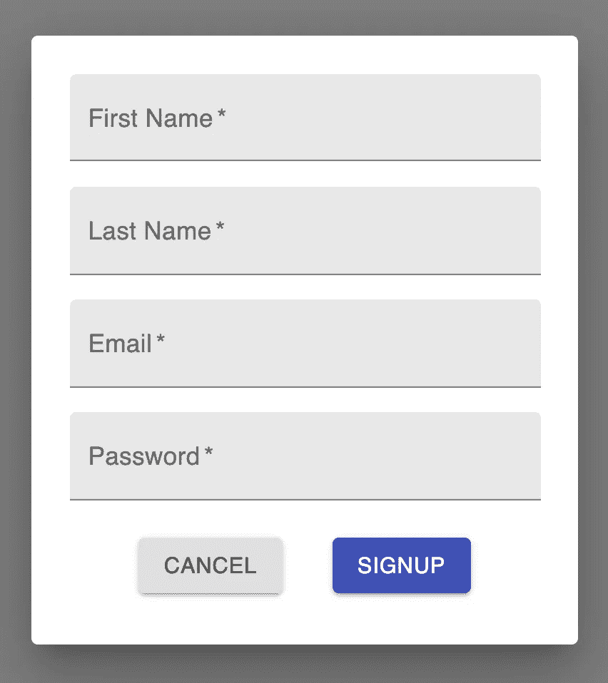

# 将 React 挂钩形式与材质 UI 组件一起使用

> 原文：<https://levelup.gitconnected.com/using-react-hook-form-with-material-ui-components-ba42ace9507a>

## 使用 Material-UI 时处理表单数据的更好方法


Jan Canty 在 [Unsplash](https://unsplash.com?utm_source=medium&utm_medium=referral) 上拍摄的照片

在上一篇文章中，我向您展示了如何使用 React 和 Material-UI 创建一个基本的注册页面。在那篇文章中，我们使用了受控组件和`useState`钩子来跟踪表单输入值。你可以看看下面这篇文章。

[](/create-a-signup-page-with-react-and-material-ui-9b203d18cf3f) [## 用 React 和 Material-UI 创建一个注册页面

### 了解如何为您的下一个网站创建一个对话框和表单

levelup.gitconnected.com](/create-a-signup-page-with-react-and-material-ui-9b203d18cf3f) 

在另一篇文章中，我们看了一个名为 React Hook Form 的库。我们学习了一种简单的方法来使用库处理基本形式的输入数据。

[](https://medium.com/dev-genius/the-easiest-way-to-deal-with-forms-in-react-ad6bc1250829) [## React 中处理表单的最简单方法

### 使用 React 钩子形式来提高应用程序的性能

medium.com](https://medium.com/dev-genius/the-easiest-way-to-deal-with-forms-in-react-ad6bc1250829) 

在本文中，我们将结合我们对这两者的了解。我们将使用 React Hook Form 来处理使用 Material-UI 组件的表单的数据。这与我们使用普通的 HTML `<input>`标签有一点不同。

这篇文章来得正是时候，因为 React Hook Form 第 7 版刚刚发布。点击查看他们的网站[。](https://react-hook-form.com/)

# 快速回顾

如果你错过了上一篇文章，让我们快速回顾一下。我们使用 Material-UI 创建了一个基本的注册页面，如下所示。该表单使用了 Material-UI 中的`TextField`和`Button`组件。



目前，我们用 React 的`useState`钩子将表单输入数据作为受控输入来处理。以下是名输入字段的示例。

在`TextField`组件中，我们将该值设置为`firstName`值，并使用`onChange`属性更新该值。

```
const [firstName, setFirstName] = useState('');<TextField
  label="First Name"
  variant="filled"
  required
  value={firstName}
  onChange={*e* => setFirstName(e.target.value)}
/>
```

# 使用 React 挂钩形式

相反，我们可以使用控制器包装组件来集成 React Hook 表单和 Material-UI 组件。

React Hook 表单被描述为*“具有易用验证的高性能、灵活和可扩展的表单。”*

让我们首先在我们的项目中安装这个库。

```
npm install react-hook-form
```

我们需要从库中导入`useForm`钩子和`Controller`组件。

```
import { useForm, Controller } from "react-hook-form";
```

从`useForm`钩子中，我们需要得到`handleSubmit`和`control`对象。

```
const { handleSubmit, control } = useForm();
```

# 控制器组件

[控制器](https://react-hook-form.com/api/usecontroller/controller)组件是一个包装器组件，它使得 React Hook Form 与 Material-UI 一起使用变得容易。例如，让我们构建名字输入字段。

控制器组件接受名称、控件、默认值、规则和呈现属性。

```
<Controller
  name="First Name"
  control={control}
  defaultValue=""
  rules={{ required: 'First name required' }} *// render to be explained in next section* 
/>
```

名称—这将是输入的名称，并在提交表单时使用。

control——我们将传递从`useForm`钩子获得的控制对象。这将注册该输入，以便与 React 钩子表单一起使用。

defaultValue —用作表单输入的默认值。

rules —我们可以在其中为输入指定验证规则的对象。您可以在这里看到您可以应用的规则列表[。例如，我们可以要求一个输入，并使用`rules={{ required: 'First name required ' }}`设置一个错误消息。](https://react-hook-form.com/api/useform/register)

# 渲染道具

我们将添加的最后一个道具是渲染道具。这是一个接受返回 React 元素的函数的属性。

在渲染道具中，我们将从`field`对象中获取`onChange`和`value`属性。然后我们将添加 Material-UI 中的`TextField`组件作为返回值。

在`TextField`组件中，我们可以像往常一样添加常用的道具。在我们的例子中会添加`label="First Name"`和`variant="filled"`。对于`value`和`onChange`属性，我们将传递从 field 属性获得的对象。

名字的输入看起来像这样。

```
<Controller
  name="firstName"
  control={control}
  defaultValue=""
  rules={{ required: 'First name required' }}
  render={({ field: { *onChange*, *value* } }) => (
    <TextField
      label="First Name"
      variant="filled"
      value={value}
      onChange={onChange}
    />
  )}
/>
```

# 添加验证

我们总是希望确保表单有客户端验证。

在 render 函数中，我们还可以从`fieldState`对象中获得一个`error`道具。这个错误对象将特定于输入，并且将来自我们前面编写的规则属性。

为了让我们的表单看起来更好，我们可以集成来自`TextField`组件的一些属性。

首先，我们将添加一个错误道具。这个属性必须是一个布尔值，所以我们可以使用`error={!!error}`根据错误是否有值来返回 true 或 false。

接下来，我们将验证错误消息作为帮助文本添加到组件中，如 so `helperText={error ? error.message : null}`。

现在，如果我们尝试提交没有名字的表单，我们将看到下面的错误。


# 完成表格

为了完成我们的表单，我们可以对姓氏、电子邮件和密码输入做同样的事情。在邮件输入中，我们还可以将`type="email"`作为道具添加到`TextField`组件中，以增加另一层验证。在密码输入中，我们可以添加`type="password"`来隐藏字符。

为了处理 submit 事件，它与我们在上一篇文章中所做的一样。您需要做的就是创建一个`onSubmit`函数，它从我们添加了控制值的输入中接收数据。然后，在表单中添加一个`onSubmit`监听器，使用 React Hook 表单中的`handleSubmit`函数，并将`onSubmit`函数作为参数传递。

在我们的例子中，我们只是将表单数据记录到控制台。


# 包扎

最终的 Form.js 文件将如下所示。

感谢阅读！如果您想查看该项目的完整源代码，请点击这里查看 GitHub 资源库。请务必查看 react-hook-form 分支，以查看本文的代码。

[](https://github.com/chadmuro/medium-signup/tree/react-hook-form) [## Chad muro/中型注册

### 这个项目是用 Create React App 引导的。在项目目录中，您可以运行:在…中运行应用程序

github.com](https://github.com/chadmuro/medium-signup/tree/react-hook-form)