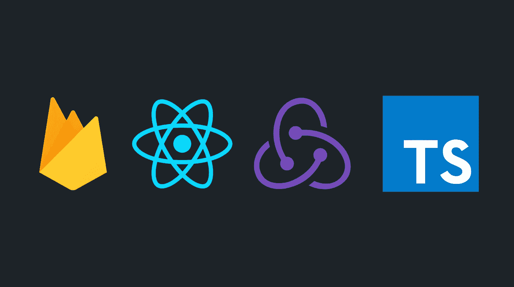

# 将 React + Redux 与 Firebase & TypeScript 一起使用

> 原文：<https://levelup.gitconnected.com/using-react-redux-with-firebase-typescript-4d47f32d7048>

利用 React hooks 的功能将云 Firestore 的实时优势与 Redux 的状态管理功能结合起来。

# 介绍

在这篇文章中，我将深入探讨如何将 Firebase，特别是 Cloud Firestore，连接到 React + Redux 应用程序。我也在使用 TypeScript，因为它在与 React 和 Redux 一起使用时有很多优点。如果你有兴趣学习如何构建一个 React + Redux + TypeScript 应用程序，这篇文章将对你有很大的价值。

 [## 如何构建你的 TypeScript + React + Redux 应用

### 一个简单的、声明性更强的 React + Redux 应用指南

medium.com](https://medium.com/swlh/how-to-structure-your-typescript-react-redux-app-877d1eba1c1e) 

这篇文章背后的一般思想和架构是在我们的 React 组件中设置对文档和集合的订阅，并注册当数据被创建、更新、删除等时被触发的动作创建者。

首先，让我们定义一个实用函数`dataFromSnapshot`，它将帮助我们在两个钩子中从 Firestore 快照中检索数据。让我们也定义一个`Entity`类型，它将代表我们从 Firestore 获得的所有数据。每个文档至少应该有一个`id`字段。

这是 Firebase 中处理文档的一种非常标准的方式，在接下来的步骤中非常有用。

# useDoc 挂钩

现在，让我们看看第一个 React 钩子，它将负责订阅 Firebase 文档并为每个事件注册动作创建者。

当调用这个钩子的 React 组件被分别挂载和卸载时，这个文档的订阅将被创建和销毁。当我们传递给`deps`数组的任何项目发生变化时，订阅也将被重新创建。将我们的订阅所依赖的任何道具或状态传递给这个`deps`数组是很重要的。我们将在后面的例子中对此进行研究。

# 钩子的事件

对于每个文档订阅，我们为订阅、取消订阅、数据和错误事件注册处理程序。

## 订阅

当创建订阅以及任何`deps`更改时触发。这对于建立一些初始状态是有用的。

## 取消订阅

当订阅被销毁以及任何`deps`发生更改时触发。我们将放弃旧的订阅并创建一个新的。这对于清除我们设置的任何初始状态非常有用。

## 数据

文档更新时激发。新文档将被传递给这个处理程序，我们可以用更新后的数据直接更新我们的 Redux 存储。

## 错误

如果在侦听文档快照时发生错误，则激发。这对于调试和更新某些指示应用程序运行不正常的状态非常有用。

# useCollection 挂钩

`useCollection`钩子与`useDoc`钩子非常相似，唯一的区别是它订阅了一个 Firebase 集合，而不是一个文档。

事件处理程序的工作方式与`useDoc`钩子几乎完全相同，除了数据处理程序将被传递一个数据数组而不是一个实体。

# 例子

让我们来看看如何使用这两个强大的钩子的一些实际例子。

## `useDoc`例子

下面是一个例子，说明如何使用这个钩子通过 id 检索一个人的数据，并注册事件处理程序来更新我们的 Redux 存储。然后，我们可以从 Redux 存储中检索数据，并将其显示在 UI 中！

## useCollection 示例

下面是一个例子，说明如何使用这个钩子来检索数据库中具有某种头发颜色的所有人。如果添加、删除甚至更新了一个具有该发色的新人，那么订阅将自动更新您的 Redux store 并出现在 UI 中。

这只是对结合 React、Redux 和 Firebase 的强大功能的介绍。您不需要遵循 TypeScript，但它对于防止运行时错误和加快开发过程非常有用。

如果您有任何问题或顾虑，请随时给我留言或回复。非常感谢您花时间阅读这篇文章，我希望这有助于您从概念上理解结合这些现代 web 技术可能需要什么。