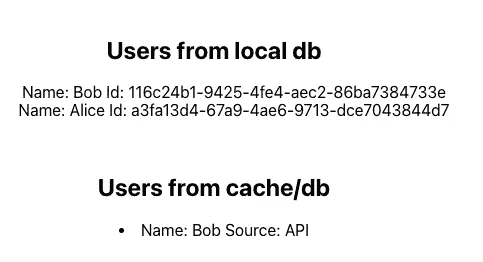

# 使用 Redis 进行缓存(2023)

> 原文：<https://levelup.gitconnected.com/using-redis-for-caching-2023-42602603dc8a>

*使用 Redis 进行缓存(2023)*

我们将简要介绍:

1.  使用 Redis 缓存 API(Go)
2.  使用发布/订阅的 Redis 订阅
3.  使用 React 调用 API

> 注意:本文假设读者了解缓存的概念

使用 Redis 进行缓存

# Redis 是什么？

Redis 代表**Re**mote**Di**dictionary**S**server，是一个快速、开源、内存中的键值数据存储。它提供了亚毫秒级的响应时间，支持每秒数百万个实时应用请求。

Redis 是一个基于键值的 [NoSQL](https://databasecamp.de/en/data/nosql-databases) 数据库，它将数据存储在内存中，即 RAM 中。

**Redis 的使用案例**

*   贮藏
*   地理空间的
*   聊天、消息和队列
*   游戏排行榜

**Redis 的优势**

*   简单、快速且易于使用
*   支持多种[数据结构](https://redis.io/docs/data-types/tutorial/)
*   允许存储最大`512 MB`的键和值对
*   使用 [Redis Sentinel](https://redis.io/topics/sentinel) 的高可用性

**Redis 的缺点**

*   需要巨大的 RAM(尽管取决于应用程序的类型)
*   如果主设备至少有`1`个从设备，就会发生故障转移
*   数据只能通过密钥访问


使用 Redis 进行缓存

## 设置 Redis

我们将使用 [Docker](https://hub.docker.com/_/redis/) 设置 [Redis](https://redis.io/download/)

```
docker run -d -p 6379:6379 --name redis redis
```

如今有一些主机提供商，如 [AWS](https://aws.amazon.com/redis/) 、 [Redis Labs](https://redislabs.com/) 或 [Upstash](https://upstash.com/?utm_source=goredis) 在云上提供 Redis。

连接 [Redis](https://redis.io/docs/clients/) 的方式有很多种。在我们的例子中，我们将使用`[RedisCLI](https://redis.io/topics/rediscli)`,因为我们已经准备好 docker 设置，让我们连接。

下面是一个使用`RedisCLI`工具从 Redis 数据库中设置、获取和删除值的例子。

一些其他有用的命令

`keys` *:寻找所有的钥匙

`FLUSHALL`:删除所有数据库中的所有密钥。
`FLUSHDB`:删除当前选中 DB 中的所有密钥。

`EXPIRE`按键 120:按键将在`120`秒后被删除

# 使用 Redis 缓存 API(Go)

[**Go**](https://redis.io/docs/clients/#go) 中有多个客户端可以实现 Redis。然而，在本文中，我们将使用`[Go-redis](https://github.com/go-redis/redis)`

**Go-Redis**

*   Go-Redis 是一个用于 Go 的类型安全的 Redis 客户端库。
*   它是一个 Redis 客户端，能够支持 Redis 集群，旨在随着集群的变化自动存储和更新插槽信息。
*   它支持类似`[Pub/Sub](https://redis.uptrace.dev/guide/go-redis-pubsub.html)` `[Sentinel](https://redis.uptrace.dev/guide/go-redis-sentinel.html)`和流水线的特性

**使用 Gorilla Mux 创建 API**

*   我们将使用 [Gorilla Mux](https://github.com/gorilla/mux) 在本地创建 API
*   它实现了一个请求路由器和调度程序来匹配传入的请求。

使用安装它

```
go get -u github.com/gorilla/mux
```

*   我们将注册以下端点:

`GET /users/:id` —根据 id 获取用户信息。样本响应

```
[
   {
      "id":"116c24b1-9425-4fe4-aec2-86ba7384733e",
      "name":"Bob",
      "age":29,     
      "source":""
   },
   {
      "id":"a3fa13d4-67a9-4ae6-9713-dce7043844d7",
      "name":"Alice",
      "age":29,
      "source":""
   }
]
```

`GET /users` —返回数据库中存在的用户。样本响应

```
{
   "id":"116c24b1-9425-4fe4-aec2-86ba7384733e",
   "name":"Bob",
   "age":29,
   "source":""
}
```

*   接下来，我们使用`mux.NewRouter()`创建路由器实例，并将上面创建的路由分配给各自的处理程序
*   将 ResponseWriter 和 Request 作为参数传递给每个相应的处理程序，这有助于将所需的响应返回给客户端。
*   然后，我们使用`http.Server`来指定运行 HTTP 服务器的服务器细节

`Handler`:这是响应传入 HTTP 请求的对象(我们在上面创建的)

`Addr`:指定服务器监听的 TCP 地址，默认为`80`

`WriteTimeout`:响应写入超时前的最大持续时间

`ReadTimeout`:读取整个传入请求的最大持续时间

*   最后，我们使用`ListenAndServe`运行服务器，它监听`Addr`中指定的网络地址，并基于`Handler`服务请求

## 设置 Postgres

我们将使用 Postgres 作为我们的数据库。使用 docker 安装它，如下所示

```
docker run \
  -d \                                     
  -e POSTGRES_HOST_AUTH_METHOD=trust \
  -e POSTGRES_USER=user \
  -e POSTGRES_PASSWORD=password \
  -e POSTGRES_DB=dbname \
  -p 5432:5432 \
  postgres
```

*   验证新容器是否已创建并运行在 0.0.0.0:5432
    `docker ps -a`上，以便从浏览器管理数据库，安装 [pgAdmin](https://www.pgadmin.org/download/) 并使用上述凭证连接到它，如果一切正常，您应该会看到


Postgres 数据库

我们将创建一个名为`users`的表，它将具有以下模式


用户表

让我们插入一些虚拟数据，使用

```
INSERT INTO public.users(
 id, created_time, name, updated_time, age)
 VALUES (uuid_generate_v4(), NOW(), 'alice', NOW(), 29);// IN CASE ANY ERROR RUN THIS
CREATE EXTENSION IF NOT EXISTS "uuid-ossp"
```

为了使用`Go`连接到 Postgres，我们将安装[这个](github.com/jackc/pgx/v4)下面是代码片段

下面是`users`的结构

一旦创建了 get users API 和 get users by id API，我们将使用 Gorilla Mux 创建一个`localhost`服务器并监听端点

## 缓存 API


数据库和客户端之间的 Redis

为了连接到`Redis`，我们使用`[NewClient](https://github.com/go-redis/redis/blob/v8.11.5/redis.go#L546)`创建一个 Redis 客户端，我们指定 Redis 所在的地址

*   配置选项可通过`redis.Options`参数获得。

`Addr`:主机和端口地址的字符串，因为我们在本地托管 Redis，所以值为`127.0.0.1`，默认情况下，Redis 在端口`6379`上运行

`DB`:连接到服务器后选择的数据库。选择`0`意味着使用默认数据库。

`DialTimeout`:如果我们与 Redis 服务器的连接中断，我们指定建立新连接的超时时间

`ReadTimeout`:这允许设置套接字读取超时。如果任何 Redis 服务器请求达到这个超时，调用它的命令将失败，而不是阻塞服务器。

*   为了检查我们是否连接到服务器，我们使用上面创建的客户端调用`[Ping](https://pkg.go.dev/github.com/go-redis/redis/v8#Client.Ping)`。如果没有错误，这意味着我们连接到 Redis 服务器。
*   最后，我们返回 Redis 客户机，它在内部可能有零个或多个连接。

```
if _, err := client.Ping().Result(); err != nil {
 return nil, err
}return &Client{
 client: client,
}, nil
```

**获取和设置密钥**

*   我们将遵循的用例是，每当前端请求特定用户的详细信息时，我们将从 API 中获取它，然后缓存它。
*   特定用户的后续请求将由缓存提供服务，直到缓存键过期(我们将其设置为`20 seconds`)
*   我们将利用`[Set](https://github.com/go-redis/redis/blob/v8.11.5/commands.go#L890)`来设置缓存中的值

> 注意:这里我们将`user`结构作为输入。然后我们将 Go 结构转换成 JSON(又名封送处理),因为 JSON 是一种独立于语言的数据格式。

*   我们用可选的过期参数`20 seconds`来设置密钥对，这意味着密钥将在给定的持续时间内自动过期。
*   如果没有过期参数，则表示`Zero expiration`表示密钥没有过期时间。

**获取钥匙**

*   我们将利用`[Get](https://github.com/go-redis/redis/blob/v8.11.5/commands.go#L784)`来检索键值

*   响应是字符串的形式，然后我们将字节数据转换成原始的`user`结构(也称为解组)
*   在这个函数中，我们另外添加了一个 Redis publisher(我们将在下一节中看到)。

**调用 API**

我们有这个本地托管的 API 端点`GET /users/:id`——根据 id 获取用户信息。

*   一旦客户端调用了这个端点，我们首先检查这个请求的值是否可以从缓存中提供。

> 注意:如果数据存在于缓存中，我们设置`source: "cache"`

*   从逻辑上讲，第一个请求总是命中服务器，因此获得响应的时间会更长。

> 注意:为了从服务器获取值，我们设置了`*source: "API"*`

*   正如我们在上面的代码片段中看到的，我们首先调用`redis.GetUser`来检查缓存。
*   该函数检查缓存中的 id，如果 id 存在，则返回值。
*   如果结果失败，函数返回 null，我们继续调用 API `GetUserByID`,它命中我们的 Postgres 数据库

```
{
   "id":"116c24b1-9425-4fe4-aec2-86ba7384733e",
   "name":"Bob",
   "age":29,
   "source":"API"
}
```

这是当 Redis 中没有这个键时的样子


Redis 中不存在密钥

*   然后，来自 API 的结果被缓存在 Redis 中，因此后续请求现在由缓存提供服务(直到`20 seconds`,这是密钥到期的持续时间)

```
{
   "id":"116c24b1-9425-4fe4-aec2-86ba7384733e",
   "name":"Bob",
   "age":29,
   "source":"cache"
}
```

这是 Redis 中存在密钥时的外观


Redis 中存在的密钥

## 使用发布/订阅的 Redis 订阅

*   在软件工程领域，发布-订阅是一种模式，其中发送者(发布者)将消息分类到通道中，而不知道是否有任何订阅者。
*   另一方面，订阅者对一个或多个频道感兴趣，并且只接收感兴趣的消息，而不知道是否有任何发布者。
*   发布者和订阅者的这种分离增强了更大的可伸缩性。

**Redis 发布/订阅**

*   我们将使用 Redis 发布/订阅，但是，还有各种其他的替代方案，如 Apache Kafka、Google cloud 发布/订阅等
*   为了订阅频道，例如，`foo`和`bar`，客户使用`[SUBSCRIBE](https://redis.io/commands/subscribe)`提供频道名称:

```
SUBSCRIBE foo bar
```

其他客户端发送到这些通道的消息将由 Redis 推送到所有订阅的客户端。

*   一旦 Redis 客户端订阅了一个频道，该客户端就不能再执行任何其他操作，只能取消订阅当前频道或订阅更多频道。

**Go-Redis 发行商**

`Go-redis`允许发布消息和订阅频道。当出现网络错误时，它还会自动重新连接到 Redis 服务器。

*   在我们的 get user 函数中，我们将使用`[redis.Publish(](https://github.com/go-redis/redis/blob/v8.11.5/commands.go#L3172))`创建一个发布者。这个函数有两个参数，我们要向其发送消息的**通道**的名称和**消息**。
*   在我们的例子中，我们将通道名设置为`send-user-name`，有效载荷是来自`redis.GetUser`的响应(见上文)
*   我们使用`Publish`将整理的有效载荷发送到通道，这是因为它允许像`[]byte`一样传输数据
*   因为我们使用的是用户结构，所以它可以被编码成一个`[]byte`

**Go-Redis 用户**

*   我们使用`[redis.Subscribe()](https://github.com/go-redis/redis/blob/v8.11.5/redis.go#L686)`函数创建一个订户。
*   我们将有一个参数，我们想要订阅的**频道**，在我们的例子中是`send-user-name`。
*   Subscribe 为客户端订阅指定的频道。因为这个方法不等待 Redis 的响应，所以订阅可能不会立即激活。
*   我们创建一个连接到同一个 Redis 实例的新文件，并调用以下代码

*   `subscribe`的结果是一个`PubSub`，我们从这个对象中提取频道属性
*   此通道返回一个 Go 通道，用于并发接收消息。如果信道已满 30 秒，则消息被丢弃。
*   我们在通道上循环，并从中提取数据，数据的类型是每个消息对象包含的`Message`

`Channel`:这是频道名称

`Payload`:通道接收到的编组数据

`Pattern`:消息的模式

*   消息中收到的数据可以使用`msg.Payload`获取，因为它已经被封送，我们将使用`UnmarshalBinary`解封它，并转换回`User` struct。
*   最后，我们可以访问 struct 属性并在控制台内部打印。我们还打印消息的频道名称，只是为了好玩！！


Redis 订户

这里，我们获得了消息通道名称`send-user-name`和`Bob`的用户详细信息

## 使用 React 调用 API

在上面的部分中，我们使用 [Gorilla Mux](https://github.com/gorilla/mux) 在本地创建并托管了 API。我们现在将使用 React 从前端使用这些 API

我们将使用 Axios 来调用 API。让我们安装这个依赖项。

```
npm install axios
```

*   Axios 是一个轻量级 HTTP 客户端，它使得调用请求非常直观。它类似于 JavaScript `Fetch API`
*   它可以很好地处理 JSON 数据，并完成设置请求头的繁重工作。
*   它对访问响应有更好的错误处理，并与 async-await 语法很好地集成。
*   它既可以在服务器上使用，也可以在客户端使用。

**融入反应堆**

我们将使用钩子`useEffect`和`useState`。钩子`hook`是一个特殊的函数，可以让你“钩住”React 特性。

**使用效果**

*   使用这个钩子，我们指示 React 我们的组件在渲染后需要做一些事情。默认情况下，`useEffect`在组件每次渲染后运行。
*   这个钩子的一个常见用途是获取数据并显示它。
*   React 会记住您传递的函数，并在 DOM 更新后调用它。

> 注意:我们在 useEffect 钩子的末尾有一个空数组，以确保内部函数只渲染一次。

*   如果我们希望我们的效果运行得不那么频繁，我们提供第二个参数(这是一个值数组)。这些可以被认为是效果的依赖关系，如果有任何变化(自上次以来)，效果将再次运行。

**使用状态**

*   它是一种给组件添加状态的方式和`preserve`函数调用之间的一些值。
*   通常，当函数退出时，变量会“消失”,但是状态变量会被 React 保留。
*   这种状态可以是数组、对象、数字、布尔值等。
*   传递给`useState()`的参数是初始状态。

*   为了使用 Axios 发出一个`GET`请求，我们使用了`.get()`方法。响应作为对象返回。
*   我们使用响应中的`.data`属性来获取请求的数据，并使用`setFetchedData`在钩子内部设置它

**请求响应:**

当页面第一次加载时，API 访问我们的后端。结果`fetchedData`随后显示在页面上。

> 注意，来源:API



资料来源:API

在下一个请求中，API 命中我们的缓存，显示为`source:cache`


来源:缓存

**结论**

在本文中，我们使用 Postgres 数据库存储用户数据。我们使用 gorilla mux 创建了端点。在这些端点之上，我们还集成了 Redis 来缓存从 React 应用程序调用的 API 响应。记住 Redis 是一个强大的工具，我们所涉及的只是冰山一角。此外，考虑阅读 [redis.io](http://redis.io/) 上的文档。

*网址:*[*https://flatteredwithflutter.com/using-redis-for-caching/*](https://flatteredwithflutter.com/using-redis-for-caching-2022%ef%bf%bc/)

```
 [Source Code for Go](https://github.com/AseemWangoo/golang-programs)[Source Code for React](https://github.com/AseemWangoo/expriments_with_react)
```

其他文章:

[](/unit-testing-in-react-7301989565f2) [## React 中的单元测试

### react 中的单元测试

levelup.gitconnected.com](/unit-testing-in-react-7301989565f2) [](/deploy-lambda-using-serverless-a44a66f3d603) [## 使用无服务器部署 lambda

### 使用无服务器部署 lambda

使用 serverlesslevelup.gitconnected.com 部署 lambda](/deploy-lambda-using-serverless-a44a66f3d603) [](/using-kafka-in-2022-f22602830e09) [## 在 2022 年使用卡夫卡

### 在 2022 年使用卡夫卡

在 2022levelup.gitconnected.com 使用卡夫卡](/using-kafka-in-2022-f22602830e09)