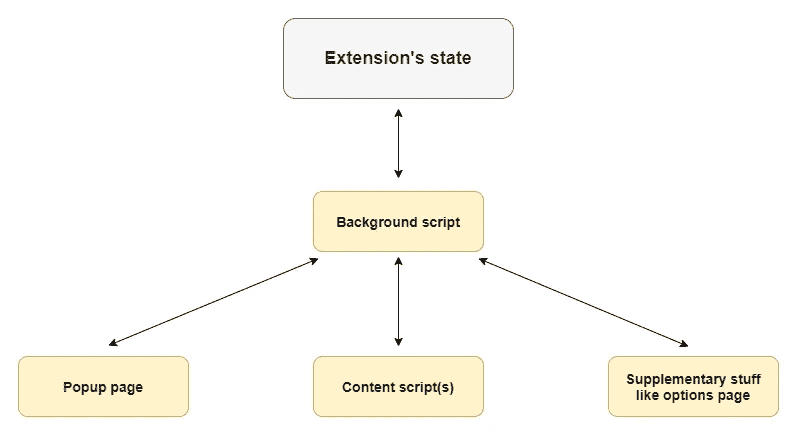
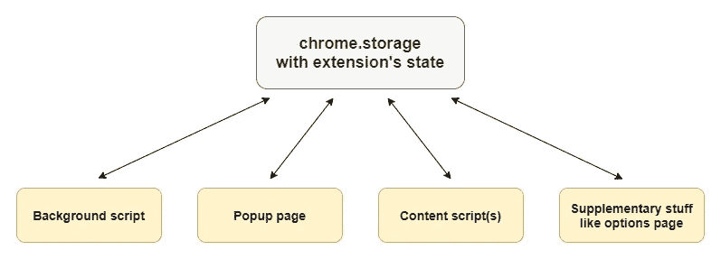

# 在事件驱动的 Chrome 扩展中使用 Redux:问题/解决方案

> 原文：<https://levelup.gitconnected.com/using-redux-in-event-driven-chrome-extensions-problem-solution-30eed1207a42>


这篇文章面向有经验的 web 开发人员，解决了在所谓的*事件驱动的*扩展中使用 Redux 的问题——Chrome 扩展实现了基于事件的模型。

# 事件驱动扩展的细节

2012 年发布的 Chrome 22 首次引入了基于事件的扩展模型。它假设一个[后台脚本](https://developer.chrome.com/extensions/background_pages)(如果有的话)只在需要的时候加载/运行(主要是响应事件)，空闲的时候卸载。

Chrome 开发者文档强烈建议[将](https://developer.chrome.com/extensions/background_migration)现有的持久扩展迁移到基于事件的模型，并将其用于新的扩展，唯一的例外是[。但是现在似乎很多扩展都是持久的，即使它们可能是事件驱动的。当然，它们中的许多都是在基于事件的模型为开发人员所知之前首次发布的。现在他们的作者没有动力去迁移到新的模型。这甚至更糟，因为它意味着几乎所有地方都要进行大量的更改，而不仅仅是在后台脚本中。](https://developer.chrome.com/extensions/webRequest)

此外，扩展开发者使用[跨浏览器方法](https://developer.mozilla.org/en-US/docs/Mozilla/Add-ons/WebExtensions/Build_a_cross_browser_extension)从相同的源代码为不同的浏览器构建扩展是很常见的。基于事件的模型是 Chrome 特有的特性，与大多数浏览器支持的持久模型有很大的不同。这使得跨浏览器开发成为一个相当困难的问题。

然而，一些相对较新的扩展也继续使用持久模型，尽管它们可能是潜在的事件驱动模型。最终，主要原因与迁移案例相同:基于事件的模型和持久模型之间的主要差异，这主要反映在如何处理/管理扩展的状态。

# Redux 的问题

状态管理是对现代 web 开发有特殊价值的事情之一。一旦变得足够复杂，每个 web 应用程序(以及浏览器扩展)都需要一种统一的、最好是简单的方式来管理其状态。而这正是 Redux 大放异彩的地方。Redux 是一个流行的库，它以一致且非常简单的方式帮助管理应用程序的状态。问题是 Redux 不支持 Chrome 扩展。

首先，所有扩展都有一个固有的问题(不仅仅是 Chrome 的)，这与一个叫做“真实的单一来源”的基本 Redux 规则有关，它要求所有的状态都存储在同一个地方。扩展通常由多个独立的组件(如背景或内容脚本)组成，因此很难遵守这一规则。幸运的是，这个问题是可以解决的，有像 [Webext Redux](https://github.com/tshaddix/webext-redux) 这样的库使用[消息传递](https://developer.chrome.com/extensions/messaging)来解决这个问题。不幸的是，由于已经提到的基于事件的模型和持久模型之间的差异，这种解决方案不能应用于事件驱动的扩展。现在是时候仔细看看这些差异以及它们所造成的影响了。

在 ***持久*** 模型中，通常在持久后台脚本中保存扩展的状态(通常在某个局部变量中),该脚本在浏览器关闭之前一直存在/运行，因此该状态总是可以通过后台脚本供其他扩展组件(例如弹出窗口或内容脚本)使用，从而扮演*服务器*的角色。这是 Webext Redux 等库使用的标准持久化方法。



持续的状态管理方法

关于 ***基于事件的*** 模型，不可能有上面这样的服务器，因为从生命周期的角度来看，包括后台脚本在内的所有组件都是*等于*。更具体地说，不能将状态存储在后台脚本中，因为后者可能在任何时刻*从内存中卸载*(这是事先无法知道的)。幸运的是这个问题也有解决方案。

# 解决办法

解决方案是使用`[chrome.storage](https://developer.chrome.com/extensions/storage)`作为存储/操作扩展状态的*直接*位置/方式。顺便提一下，这种方法是官方迁移指南明确建议的，它假设状态立即存储在 T1 中，每当需要改变状态或跟踪这种改变时，就会调用这个 API。



`chrome.storage`以国家管理为基础的方法

作为扩展 API 的一个集成部分，`chrome.storage`有许多优点，其中最重要的是任何扩展组件都可以直接访问它，而不需要任何中介。另一个优点(同时也是其规范的一部分)是通过浏览器会话的状态持久化，这是其开箱即用的内置特性。

同样值得注意的是，这种方法在基于事件的模型和持久模型中都有效(以同样的方式)。所以最终我们有了一个被大多数浏览器支持的统一解决方案，这使得跨浏览器开发(有点)更加合理。

唯一剩下的问题就是`chrome.storage`与 Redux 有差异，无法以 Redux 的方式使用。当然，你可以直接使用`chrome.storage`,或者为它写一些自定义的包装。然而，Redux 成为了当今国家管理中的某种标准。因此，最好以某种方式使`chrome.storage`适应 Redux 规则，或者换句话说，从`chrome.storage`获得 Redux。

在这篇文章中，我们的目标是为`chrome.storage`制作 Redux 兼容的接口，它将把它的行为转换成 Redux 的术语。在 API 方面，我们需要实现 Redux 功能的接口，立即处理 Redux 存储。它包括`createStore`函数，以及它返回的`Store`对象(代表 Redux store)。下面是它们用 JSDoc 标签表示的接口:

*注意*:还有一个`Store.replaceReducer`方法在我们的例子中是不需要的，因为内置了状态持久特性。像`combineReducers`或`applyMiddleware`这样的补充功能也是不需要的，因为它们不会立即处理 Redux store。

# 履行

所以我们要写一个实现`Store`接口的类。姑且称之为`ReduxedStorage`。

在我们的类中实现`getState`和`subscribe`方法非常简单，因为它们在`chrome.storage` : `[get](https://developer.chrome.com/extensions/storage#method-StorageArea-get)`方法和`[onChanged](https://developer.chrome.com/extensions/storage#event-onChanged)`事件中有紧密的对应关系。当然，它们不会被用来直接替换各自的`Store`方法，但是它们将有助于在我们的类中保持状态的最新本地副本。我们可以通过在`ReduxedStorage`创建/实例化时调用`chrome.storage`的`get`方法来初始化我们的类中的状态，然后，每当`onChanged`事件触发时，相应地更新状态。因此，我们确保状态总是最新的。那么`getState`将是我们类中一个微不足道的 getter。`subscribe`方法的实现有点困难:它将向一些侦听器数组添加一个侦听器函数，以便在`onChanged`事件触发时调用。

与`getState`和`subscribe`不同，`chrome.storage`没有与`dispatch`类似的方法。直接使用像`set`这样的`chrome.storage`方法与 Redux 原则不兼容:在 Redux 中，状态只在创建存储时设置一次，然后只能通过`dispatch`调用来更改。所以我们必须以某种方式在我们的`ReduxedStorage`类中复制`Store.dispatch`的行为。有两种方法可以做到。激进的一将意味着在`chrome.storage` API 上的相关 Redux 功能的实际再现。但也有一个折中的选择，将在这篇文章中使用。

关键思想是每当在我们的类中调度一些动作时，在内部实例化一个新的 Redux 存储。当然，这看起来有点奇怪，但这是实际复制的唯一选择。更具体地说，每当我们的`dispatch`方法被调用时，我们必须通过调用实际 Redux 的`createStore`函数来实例化一个新的 Redux 存储，用我们的类的当前状态来初始化它的状态，并调用`Store.dispatch`来传递我们的`dispatch`方法调用的动作参数。同样，在同一个 Redux store 上，我们必须添加一个一次性的 change listener，用分派的动作产生的新状态更新`chrome.storage`(一旦准备好)。每个这样的更新都应该由我们上面描述的`chrome.storage.onChanged`监听器来跟踪和处理。

关于状态初始化的一些注意事项:由于`chrome.storage`的`get`方法异步运行，我们不能在构造函数内部调用它。因此，我们必须将相关代码放在一个单独的方法中，在构造函数之后立即调用。这个方法，姑且称之为`init`，将在`get`完成时返回一个待解决的承诺。在`init`方法中，我们还需要实例化另一个实际的 Redux 存储，以便在`chrome.storage`当前为空时获得默认状态值作为后备。

这就是`ReduxedStorage`类在第一次近似时的样子:

*注意*:我们必须使用特定键(由`this.key`常量指定)下的一部分`chrome.storage`数据，以便能够在`chrome.storage.onChanged`监听器中立即获得新状态，而无需额外的`chrome.storage`的`get`调用。此外，如果状态应该表示为数组，这也是有用的，因为`chrome.storage`只允许普通对象存储在根级别。

不幸的是，上面的实现有一个不明显的缺陷，这是由我们通过`chrome.storage`的`[set](https://developer.chrome.com/extensions/storage#method-StorageArea-set)`方法和`chrome.storage.onChanged`监听器间接更新`this.state`属性造成的。这本身不是问题。然而，在`dispatch`方法中创建一个 Redux 存储依赖于`this.state`，这可能是一个问题，因为`this.state`可能不总是反映实际状态。如果一个人在一行中同时调度多个动作，就可能出现这种情况。在这种情况下，第二次和所有后续的`dispatch`调用处理`this.state`中的过期数据，由于`chrome.storage`的`set`方法的异步特性，这些数据在调用时还没有更新。因此，分派多个同步动作可能会导致意想不到的/不想要的结果。

为了解决上面的问题，可以修改`dispatch`方法，为多个动作重用相同的 Redux 存储(以及相关的状态)。这种缓冲存储必须在一小段超时时间后复位/重新创建，默认为 100 毫秒。这意味着我们必须为缓冲的 Redux 存储和相关状态分配额外的类属性。下面是这种缓冲的`dispatch`版本可能的样子:

正如经常发生的那样，解决一个问题可能会引发另一个问题。在我们的例子中，使用缓冲的可重用存储代替本地一次性存储可能会破坏 Redux 中的异步逻辑。默认情况下，Redux 中没有的异步逻辑可以使用中间件引入，如 [Redux Thunk](https://github.com/reduxjs/redux-thunk) 。使用 Redux Thunk，可以通过编写返回函数而不是动作的动作创建器来延迟动作的分派。下面是这种动作创建者的一个例子:

`delayAddTodo`延迟 1 秒发出`ADD_TODO`动作。

如果我们试图将这个动作创建器与上述缓冲的`dispatch`方法一起使用，我们在调用`this.buffStore.subscribe`回调中的`this.buffStore.getState`时会得到一个错误。这是因为在这种特定情况下，当`this.buffStore`已经被重置为`null`(从`dispatch`调用起 100 毫秒)时，在`dispatch`调用之后至少 1 秒将调用`this.buffStore.subscribe`回调。相比之下，以前的“dispatch”版本可以很好地处理这种异步动作创建器(以及单同步创建器),因为它使用一个本地存储，该存储对于相关的`subscribe`回调总是可用的。

因此，我们必须结合两种方法，即使用 Redux 存储的缓冲版本和本地版本。前者将用于同步操作，后者用于需要一些时间的异步操作，就像上面的`delayAddTodo`。然而，这并不意味着我们在一个`dispatch`调用中需要两个独立的 Redux store 实例。我们可以在`this.buffStore`类属性中实例化一次 Redux store(对应缓冲版本)，然后将其引用复制到一个局部变量中，姑且称之为`lastStore`。所以当`this.buffStore`被重置为`null`时，`lastStore`应该仍然引用同一个 Redux 存储，并可用于相关的`subscribe`回调。因此，如果`this.buffStore`不可用(这意味着异步操作),我们可以使用内部`subscribe`监听器中的`lastStore`作为后备。当在内部`subscribe`回调中处理状态变化时，取消订阅给定的回调/监听器并重置`lastStore`变量以释放相关资源会很有用。

此外，最好对整体代码进行一些改进/重构，例如:

*   使`this.areaName`和`this.key`属性可变/可定制。
*   把直接调用`chrome.storage` API 的代码移到一个单独的类中，姑且称之为`WrappedStorage`。

所以下面是结果实现:

它的用法类似于原始的 Redux，除了我们的商店创建者被包装在一个定制器函数中，并以异步方式工作，返回一个承诺而不是一个新的商店，这是由于`chrome.storage` API 的异步特性。

标准用法如下:

此外，随着`async/await`功能的推出(从 ES 2017 开始)，我们的界面可以以如下高级方式使用:

[这里的](https://github.com/hindmost/reduxed-chrome-storage)是我们刚刚做的库的源代码。你可以根据需要使用它。

它还提供 NPM 套装:

```
npm install reduxed-chrome-storage
```