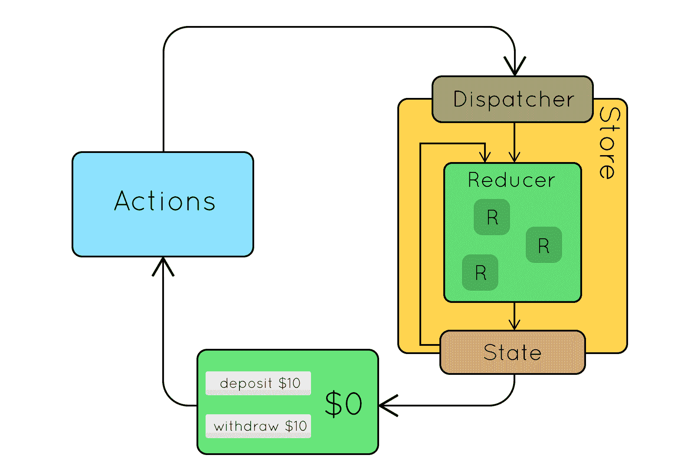
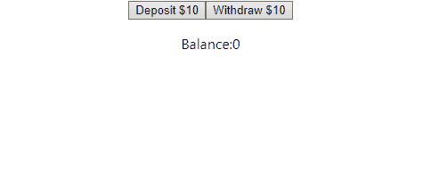

# 将 Redux 与 React 一起使用

> 原文：<https://levelup.gitconnected.com/using-redux-with-react-cb4414f53fd9>

## 或者说我是如何学会不再烦恼，热爱中央州的。

Redux 是集成到 React 中的一个非常棒的工具，因为它可以帮助简化组件并保持应用程序状态有组织。起初，这看起来有点吓人，但是一旦你理解了它的活动部分，在你的代码中应用和扩展它就成了一种条件反射。

让我们从复习 Redux 的基础知识开始。Redux 不是 React 的一部分，它是一个可以集成到大多数现代 JavaScript 框架中的库。它通常与 React 一起使用，因为 React 基于状态和属性的层次结构。Redux 仅仅是一种集中管理应用程序状态的方式，换句话说- **单一的事实来源。**



Redux 活动部件的演示。

Redux 功能可以分为 3 个步骤(本例中的所有代码都是普通的 Redux 和 JavaScript)

**第一步:调度一个动作**
一个动作是一个 ***对象*** 被调度到 Redux 的商店。该动作包含将在商店中更改的 ***数据*** ，以及告知商店将该数据放在哪里的 ***类型*** 。如上所示，调度一个提取$10 的操作如下所示:

**第二步:还原状态
Redux 中的**动作被分派到**存储**的一部分，称为**减速器**。减速器决定了**商店的哪个部分**需要更换。这基本上是一个巨大的`if` / `else`或`switch`声明。减速器检查的关键是调度动作的**型**:

**步骤 3:返回状态** 在上面的代码示例中，我已经将更改状态和返回状态合并到同一个步骤中。Redux 的一个关键规则是**状态永远不会被直接操作**，所以 reducer 实际上会复制状态并改变它。这就是为什么我们将状态作为参数和动作一起传递给 reducer。应用程序的缩减器、调度器和状态都存储在一个叫做**的存储中。当我们启动 Redux 时，我们需要用我们的 reducer 作为参数来创建我们的存储，所以我们运行这行代码:**

# 实现到 React

现在我们已经了解了 Redux 的基本工作原理，我们可以开始在 React 中实现它了。第一步是将 redux 和 react-redux 库安装到 react 应用程序中。运行这两个命令:

```
npm i --save react-redux
npm i --save redux
```

安装完这两个包之后，我们就可以开始设置我们的商店了。让我们把上面的例子转换成 React。首先，让我们从最高级的组件开始(这意味着组件层次结构中最高的组件)。我们将把我们的 ***缩减器*** 文件放在 React 目录中并导入它，还有 Redux 包中的`createStore`函数。

我们还需要从 React-Redux 包中导入 ***Provider*** 组件，并用我们创建的存储提供它的 prop“store”。provider 组件使我们的存储对包装在其中的所有组件可用，所以最容易放置它的地方是在我们的最高级组件周围。

我们已经成功了一半！现在我们的存储已经设置好了，我们可以将一个组件连接到存储，并开始向它分派操作。我已经创建了一个组件，包含 2 个按钮和一个平衡显示来模仿上面的 gif。

这是我们的基本组件在没有 Redux 的情况下的草图。让我们开始适应 Redux 范式。从技术上来说，由于提供者的父组件，这个组件已经连接到商店了——但是，这个组件不知道商店中的任何事情。为了连接它，我们从一个叫做`mapStateToProps` **的函数开始。**

函数`mapStateToProps`确实像它听起来的那样，**它将我们状态的片段映射到组件的道具**。我们将在我们的状态中获取平衡的值，并将其应用到我们的道具中。看起来是这样的:

看起来很简单，对吧？如果你想知道“state”和“props”参数从何而来，或者我们为什么返回对象，我会马上解释。只需知道我们的余额现在可以通过“this.props.balance”在组件中访问。为了改变我们的商店，我们需要一种方法来**分派动作**。我们将编写一个名为`mapDispatchToProps` **的函数。**

该函数返回一个对象，该对象的键对应于调用**调度函数**的函数。在 dispatch 函数内部，我们将放置我们的**动作，**动作也是以对象的形式出现的。与上面非常相似，现在可以分别通过“this . props . retract”和“this.props.deposit”使用分派功能。

让我们**使用 react-redux: `connect()` **提供的另一个函数将**连接在一起。**我们将它导入到文件的顶部，然后将它放在我们的类的底部， ***传入*** `***mapStateToProps***` ***和*** `***mapDispatchToProps***` ***作为参数*** 。

我知道，这看起来很奇怪——我会解释的。connect 函数需要两个参数，两个返回对象的函数，它返回一个*包装函数。*然后，这个包装函数接受我们的组件类*作为参数*，并使用我们在 mapStateToProps 和 mapDispatchToProps 中设置的参数返回一个与我们的存储连接的*组件。基本上，它创建了与我们的存储一起工作的组件的克隆。该克隆是被导出的克隆。理解这一点对于理解如何设置 Redux 来说并不重要，但是对于某些人来说，它确实解开了奇怪的语法之谜。*

您会注意到，我还将我们的道具添加到了组件返回的 JSX 中。你可以在这里克隆我为这个博客[创建的回购。一旦您在浏览器中旋转它，您将得到如下所示的内容:](https://github.com/Giagnus64/Redux-Fun)



我们的 redux 代码有效！

我们可以将 Redux 集成到任何其他组件中，只需建立我们的“map”函数，并连接到商店。一旦你掌握了使用 redux 的诀窍，你就可以开始组织你的代码，为你的动作、[创建单独的文件，有多个 reducer](https://redux.js.org/api/combinereducers)，或者[实现中间件](https://medium.com/@stowball/a-dummys-guide-to-redux-and-thunk-in-react-d8904a7005d3)，以便使用 Redux 范例异步查询你的 API。

感谢阅读！

# **来源:**

[](https://react-redux.js.org/introduction/quick-start) [## 快速启动反应还原

### React Redux 是 Redux 的官方 React 绑定。它让您的 React 组件从 Redux 存储中读取数据，并且…

react-redux.js.org](https://react-redux.js.org/introduction/quick-start) [](https://redux.js.org/basics/basic-tutorial) [## 基础教程:Intro Redux

### 不要被所有关于 reducers、中间件、存储增强器的花哨说法所迷惑——Redux 非常简单。如果你已经…

redux.js.org](https://redux.js.org/basics/basic-tutorial)