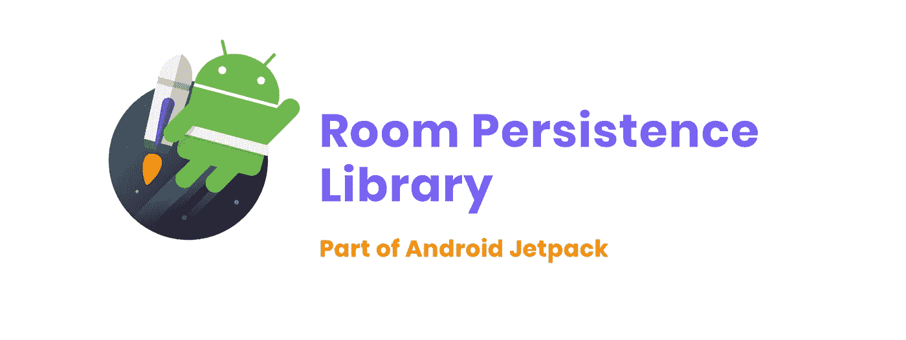
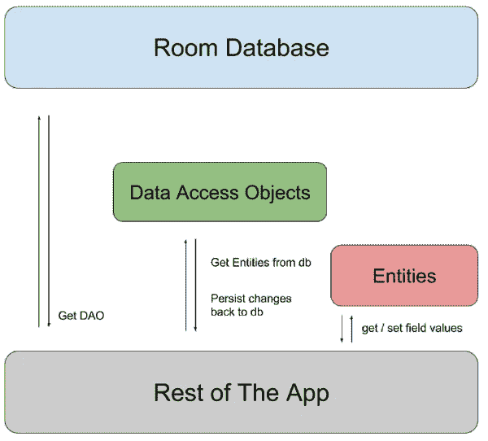
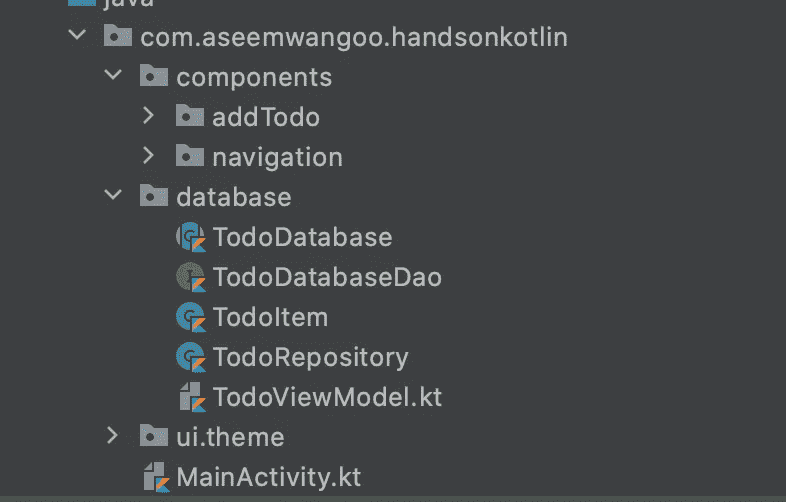
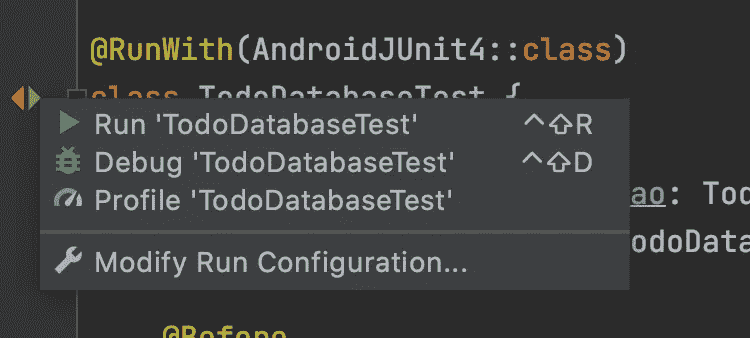
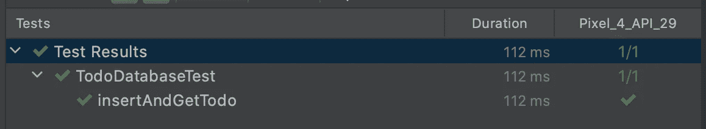

# 在 Jetpack Compose 中使用房间

> 原文：<https://levelup.gitconnected.com/using-room-in-jetpack-compose-d2b6b674d3a5>

在 Jetpack Compose 中使用房间

*文章在此:*[*https://flattered with flutter . com/using-room-in-jetpack-compose/*](https://flatteredwithflutter.com/using-room-in-jetpack-compose/)

在 Jetpack Compose 中使用房间

# 介绍

***等级:初级***

我们将简要介绍:

1.  在 Jetpack Compose 中使用房间
2.  编写 CRUD 操作
3.  为数据库编写测试

> 注意:本文假设读者了解 Jetpack Compose


在 Jetpack Compose 中使用房间

# 在 Jetpack Compose 中使用房间

[什么是房间](https://developer.android.com/jetpack/androidx/releases/room)？

根据文档，

> Room persistence 库在 SQLite 上提供了一个抽象层，在充分利用 SQLite 的能力的同时，允许更健壮的数据库访问。



喷气背包中的房间

## 在撰写中设置房间

要使用应用程序中的空间，请将以下依赖项添加到应用程序的`build.gradle`文件中:

```
dependencies {
  def room_version = "2.2.6"

  // FOR ROOM
  implementation "androidx.room:room-runtime:$room_version"
  kapt "androidx.room:room-compiler:$room_version"

  // optional - Kotlin Extensions and Coroutines support for Room
  implementation "androidx.room:room-ktx:$room_version"
  // END FOR ROOM
}
```

## 房间的组成

房间中有 3 个主要组件:

*   保存数据库的[数据库类](https://developer.android.com/reference/kotlin/androidx/room/Database)。
*   [代表应用数据库中表格的数据实体](https://developer.android.com/training/data-storage/room/defining-data)。
*   [数据访问对象(Dao)](https://developer.android.com/training/data-storage/room/accessing-data)提供了一些方法，应用程序可以使用这些方法来查询、更新、插入和删除数据库中的数据。



房间建筑

在我们的代码中，它看起来像这样



房间结构

有关在 jetpack compose 中使用状态，请参考以下内容

[](/using-state-in-jetpack-compose-b7445b697736) [## 在 Jetpack 撰写中使用状态

### 介绍 Jetpack 编写和使用状态

levelup.gitconnected.com](/using-state-in-jetpack-compose-b7445b697736) 

# 编写 CRUD 操作

让我们看看**数据库(上面的截图)**中的每个文件将会有什么

1.  [**TodoItem**](https://github.com/AseemWangoo/hands_on_kotlin/blob/master/app/src/main/java/com/aseemwangoo/handsonkotlin/database/TodoItem.kt)**(我们的实体类)**

我们创建一个名为 **TodoItem** 的实体

*   该类用@Entity 和表名进行了注释。

```
@Entity(tableName = "my_todo_list")
data class TodoItem( @PrimaryKey(autoGenerate = true)
    var itemId: Long = 0L, @ColumnInfo(name = "item_name")
    val itemName: String, @ColumnInfo(name = "is_completed")
    var isDone: Boolean = false
)
```

**2。**[](https://github.com/AseemWangoo/hands_on_kotlin/blob/master/app/src/main/java/com/aseemwangoo/handsonkotlin/database/TodoDatabaseDao.kt)****(我们的数据访问对象)****

**我们创建一个接口( **TodoDatabaseDao****

*   **这个类是用@ Dao 注释的**

```
@Dao
interface TodoDatabaseDao {
    @Query("SELECT * from my_todo_list")
    fun getAll(): LiveData<List<TodoItem>> @Query("SELECT * from my_todo_list where itemId = :id")
    fun getById(id: Int) : TodoItem? @Insert
    suspend fun insert(item:TodoItem) @Update
    suspend fun update(item:TodoItem) @Delete
    suspend fun delete(item:TodoItem) @Query("DELETE FROM my_todo_list")
    suspend fun deleteAllTodos()
}
```

*   **查询注释用于编写定制查询(就像我们的例子中的**读取**或**删除所有****
*   **注释插入，更新，删除执行 CUD 操作。**
*   **我们将这些函数标记为 [suspend](https://kotlinlang.org/docs/composing-suspending-functions.html) (这样我们可以在[协程](https://kotlinlang.org/docs/coroutines-overview.html)中调用它们)**

****3。**[](https://github.com/AseemWangoo/hands_on_kotlin/blob/master/app/src/main/java/com/aseemwangoo/handsonkotlin/database/TodoDatabase.kt)****(我们的数据库类)******

****我们定义了一个抽象类(**到数据库**，它扩展了`RoomDatabase`****

*   ****这个类是用@ Database 注释的****

```
**@Database(entities = [TodoItem::class], version = 1)
abstract class TodoDatabase : RoomDatabase() {
    abstract fun todoDao(): TodoDatabaseDao companion object { private var INSTANCE: TodoDatabase? = null fun getInstance(context: Context): TodoDatabase {
            synchronized(this) {
                var instance = INSTANCE if (instance == null) {
                    instance = Room.databaseBuilder(
                        context.applicationContext,
                        TodoDatabase::class.java,
                        "todo_list_database"
                    ).fallbackToDestructiveMigration()
                     .build() INSTANCE = instance
               } return instance
           }
       }
   }
}**
```

*   ****一个进入**同步**方法的线程获得一个锁，其他线程不能进入该方法，直到锁被释放。 **Kotlin** 提供了与**同步**注释相同的功能。****

******4。**[](https://github.com/AseemWangoo/hands_on_kotlin/blob/master/app/src/main/java/com/aseemwangoo/handsonkotlin/database/TodoRepository.kt)****(我们的仓库类)********

****我们创建一个存储库类( **TodoRepository** )，它接受 **TodoDatabaseDao** 作为构造函数参数****

```
**class TodoRepository(private val todoDatabaseDao: TodoDatabaseDao) { val readAllData : LiveData<List<TodoItem>> =  todoDatabaseDao.getAll() suspend fun addTodo(todoItem: TodoItem) {
        todoDatabaseDao.insert(todoItem)
    } suspend fun updateTodo(todoItem: TodoItem) {
        todoDatabaseDao.update(todoItem)
    } suspend fun deleteTodo(todoItem: TodoItem) {
        todoDatabaseDao.delete(todoItem)
    } suspend fun deleteAllTodos() {
        todoDatabaseDao.deleteAllTodos()
    }
}**
```

*   ****所有与数据库的交互都是通过这个存储库层完成的****
*   ****因为我们的实现是**暂停**功能，所以我们的定义也是如此****
*   ****我们公开了类型为 [LiveData](https://developer.android.com/topic/libraries/architecture/livedata) 的 **readAllData，**，因此我们可以观察到变化并通知 UI****

# ****为数据库编写测试****

****既然我们已经准备好了 TodoDatabase，让我们来测试它****

*   ****在**和**文件夹下创建一个测试类 [TodoDatabaseTest](https://github.com/AseemWangoo/hands_on_kotlin/blob/master/app/src/androidTest/java/com/aseemwangoo/handsonkotlin/TodoDatabaseTest.kt)****
*   ****我们用`AndroidJUnit4`注释我们的类，这是驱动单个类测试的东西。****

```
**@RunWith(AndroidJUnit4::class)
class TodoDatabaseTest {

    private lateinit var todoDao: TodoDatabaseDao
    private lateinit var db: TodoDatabase

    @Before
    fun createDb() {
        val context =               InstrumentationRegistry.getInstrumentation().*targetContext* db = Room.inMemoryDatabaseBuilder(context, TodoDatabase::class.*java*)
            .allowMainThreadQueries()
            .build()

        todoDao = db.todoDao()
    }

    @After
    @Throws(IOException::class)
    fun deleteDb() {
        db.close()
    }

    @Test
    @Throws(Exception::class)
    fun insertAndGetTodo() = *runBlocking* **{** val todoItem = TodoItem(itemId = 1, itemName = "Dummy Item", isDone = false)
        todoDao.insert(todoItem)
        val oneItem = todoDao.getById(1)
        assertEquals(oneItem?.itemId, 1)
    **}** }**
```

*   ****在测试运行之前，我们使用 **createDb** 创建数据库****
*   ****测试运行后，我们使用 **deleteDb** 删除数据库****
*   ****在测试运行期间，我们调用 **insertAndGetTodo******
*   ****由于这只是一个测试，因此我们使用[](https://kotlin.github.io/kotlinx.coroutines/kotlinx-coroutines-core/kotlinx.coroutines/run-blocking.html)**。******
*   *****创建一个 todo 并根据创建的值断言它*****

**********

*****运行测试*****

*   *****点击**运行至数据库测试**运行测试*****
*   *****如果一切正常，你应该会看到*****

**********

*****房间的测试结果*****

**********

```
***[Source code](https://github.com/AseemWangoo/hands_on_kotlin)***
```

*****感兴趣的文章:*****

*****[](/using-workmanager-in-android-be5cae1f155a) [## 在 Android 中使用工作管理器

### 在 Android 中使用工作管理器

在 Androidlevelup.gitconnected.com 使用工作管理器](/using-workmanager-in-android-be5cae1f155a) [](/using-state-in-jetpack-compose-b7445b697736) [## 在 Jetpack 撰写中使用状态

### 介绍 Jetpack 编写和使用状态

levelup.gitconnected.com](/using-state-in-jetpack-compose-b7445b697736) [](/testing-in-compose-d09b59337e4e) [## 撰写中的测试

### 撰写中的测试

levelup.gitconnected.com](/testing-in-compose-d09b59337e4e) [](https://proandroiddev.com/google-signin-compose-a9afa67b7519) [## Google 登录撰写

### Google 登录撰写

谷歌登录 Composeproandroiddev.com](https://proandroiddev.com/google-signin-compose-a9afa67b7519)*****