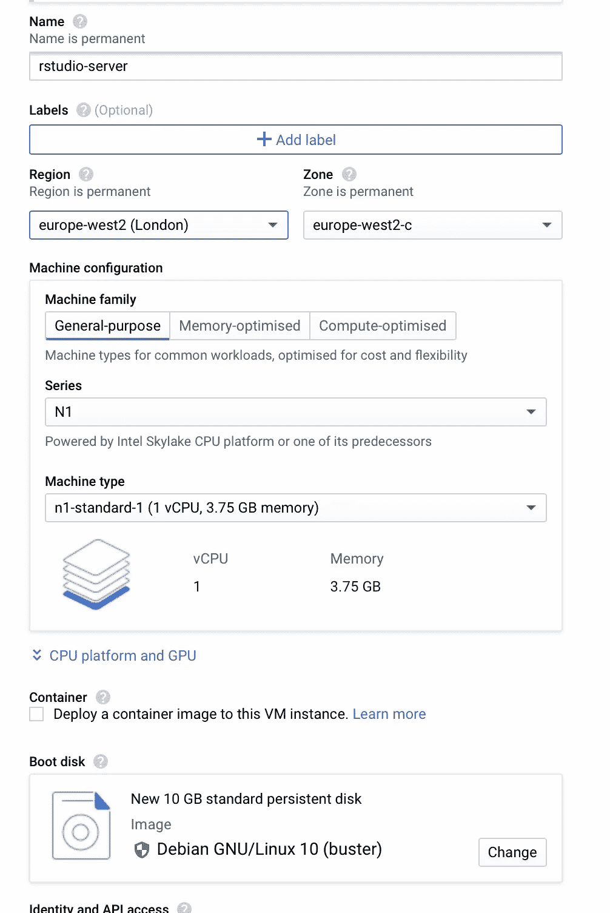
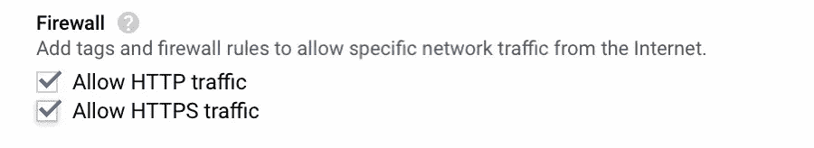
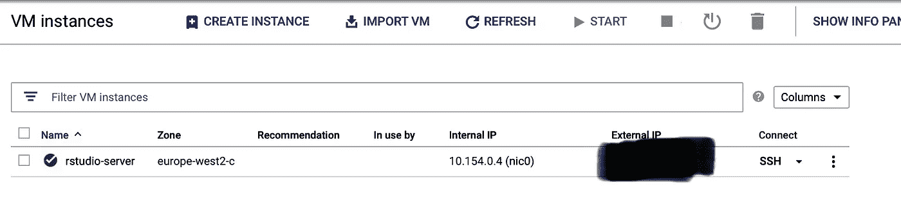
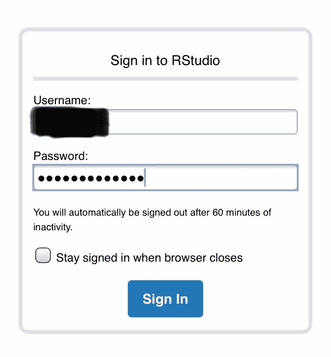
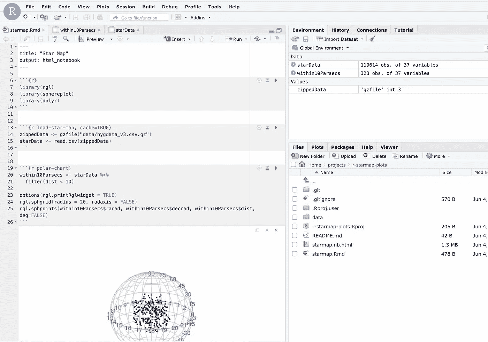

# 在 iPad 上使用 RStudio

> 原文：<https://levelup.gitconnected.com/using-rstudio-with-an-ipad-cb9f013bb3f>


[树懒 x 熊](https://unsplash.com/@slothxbear?utm_source=unsplash&utm_medium=referral&utm_content=creditCopyText)在 [Unsplash](https://unsplash.com/s/photos/ipad?utm_source=unsplash&utm_medium=referral&utm_content=creditCopyText) 上的照片

我爱我的 iPad。这并不完全是新的:这是三年前的 12.9 英寸型号。但即便如此，它也足够轻便快捷，不会让人感到痛苦。

我喜欢的是:

*   易于书写(我有[这个键盘](https://store.apple.com/uk/xc/product/MNKT2B/A)
*   用铅笔画画几乎和用笔和纸一样直接，控制几乎一样
*   当谈到阅读时，它对眼睛是很容易的
*   分屏模式非常适合阅读时记笔记
*   游戏很棒——我喜欢 iPad 对《博德之门》之类的东西的重新想象
*   当我在旅行的时候，我可以购买移动数据，它基本上是有效的

我可以用它来完成很多工程和 scrum 的工作:

*   我可以管理和询问 AWS 和谷歌云网络控制台
*   我可以使用谷歌驱动、文档、表格等。
*   我还可以访问我的 iCloud 文件存储

不过，我确实有些问题:

*   虽然我可以 ssh 到东西，并做一些脚本完整的开发是相当棘手的
*   我喜欢不时涉猎数据科学的想法，为此我通常使用 RStudio

我意识到有几个基于网络的数据科学平台，各种类型的 Jupyter 笔记本服务，但我仍然更喜欢 RStudio。除此之外，我的另一个博客是通过 blogdown 管理的，这很容易与 RStudio 打交道。我如何在 iPad 上使用这个工具？

## RStudio 云

一旦你发现它是一个东西，最明显的尝试就是 RStudio Cloud:

 [## RStudio 云

### RStudio Cloud 是 RStudio 在云中的托管版本，使专业人士、业余爱好者、培训师……

docs.rstudio.com](https://docs.rstudio.com/other/rstudio-cloud/) 

这几乎以基于浏览器的格式呈现了完整的 RStudio 体验，包括控制台、图形查看器等。在撰写本文时，它是免费的，尽管付费计划正在进行中。

我尝试了一段时间，效果很好——大部分时间。我会遇到奇怪的问题，有时整个事情会停止或崩溃。我试图找出原因，但收效甚微。免费版本有一个选项部分，显示 CPU 的限制。我怀疑我已经达到了这些极限，但目前没有办法进一步挖掘，或增加这些极限。

## 您自己的 RStudio 云

所以，我决定自己造一个。结果很简单:

1.  为 RStudio 服务器设置一台可访问互联网的机器，并安装合适的操作系统
2.  在上面安装 RStudio 服务器
3.  根据我的需要配置 RStudio 服务器

## 在 Google Cloud 上设置虚拟机

你可以使用任何标准的 Linux 机器来实现，但是第一步，我选择了一个装有 Debian 10 的 Google Cloud VM。如果您希望使用此功能，您将需要启用计费的谷歌云控制台访问。

我在这里选择了默认选项，1 个 CPU，3.75GB 内存，Debian 10。我还启用了 HTTP 和 HTTPS 的防火墙选项。



虚拟机规模



简单防火墙规则

创建后，您可以在虚拟机列表中找到它，并通过浏览器中的 SSH 获得 shell 访问权限:



显示我们新实例的虚拟机实例列表

## 安装 RStudio 服务器

我按照这里的说明做了一些小的调整:

[](https://rstudio.com/products/rstudio/download-server/debian-ubuntu/) [## 下载适用于 Debian 和 Ubuntu 的 RStudio 服务器

### 下载 RStudio Server for Debian & Ubuntu 先决条件 RStudio Server 需要 Debian 版本 8(或更高版本)或 Ubuntu…

rstudio.com](https://rstudio.com/products/rstudio/download-server/debian-ubuntu/) 

```
sudo apt-get install r-basesudo apt-get install gdebi-coresuso apt-get install wgetwget https://download2.rstudio.org/server/bionic/amd64/rstudio-server-1.3.959-amd64.debsudo gdebi rstudio-server-1.3.959-amd64.deb
```

为了让一些图形化的 R 库工作，我还安装了以下程序:

```
sudo apt-get install libglu1-mesa-dev
```

我的虚拟机没有 git，所以我也安装了它:

```
sudo apt-get install git
```

## 配置服务器

安装并运行 RStudio 后，我按照以下说明对其进行了调整以满足我的需求:

[](https://support.rstudio.com/hc/en-us/articles/200552316-Configuring-the-Server) [## 配置服务器

### 通过向两个配置文件添加条目来配置 Follow RStudio(注意，默认情况下这些文件不存在…

support.rstudio.com](https://support.rstudio.com/hc/en-us/articles/200552316-Configuring-the-Server) 

我想改变的主要是港口。我在 Google Cloud 中设置了 VM 来公开 HTTP，端口 80，所以我通过添加以下行来更改默认端口

```
www-port=80
```

到/etc/rstudio/rserver.conf 并重新启动该服务。然后，您可以在浏览器中连接到服务器的 IP 地址。注意，这里是 HTTP，不是 HTTPS！

在尝试登录之前，我添加了一个用户。默认情况下，RStudio 服务器将使用机器上的 UNIX 帐户，因此我专门为此创建了一个新用户:

```
user add -m your-usernamepasswd your-username
```

然后，您可以通过浏览器登录，只需访问您的实例的公共 IP 地址:



然后，您应该登录到您自己的 RStudio 服务器实例，并可以安装软件包、签出 git 存储库等。



尝试绘制 10 秒差距内的所有恒星…

## 限制

在 iPad 上访问 RStudio 服务器仍有一些问题。窗口很小，需要更多的滚动。

剪切和粘贴是…有问题的。它在大多数情况下工作得相当好，但是当您试图选择一个文本范围时，真正的麻烦就开始了。我似乎不能让这个在浏览器中工作。我能做的是选择所有的，然后把它削减到我想要的。

与 RStudio 云相比，我自己开发的版本存在以下具体问题:

*   这是 HTTP，不是 HTTPS——我仍然需要找到更安全的访问方式
*   它不是免费的——它的价格取决于您运行它的时间和 CPU 时间——确保您在不使用它时将其关闭。当然，如果您计划了一些繁重的使用，那么您可以构建一个更强大的虚拟机，这是您使用 RStudio Cloud 还无法做到的。

到目前为止，我在远离电脑的阳光下使用这个系统来检查各种报告，但是当我再次外出时，我会看到它的效果如何。