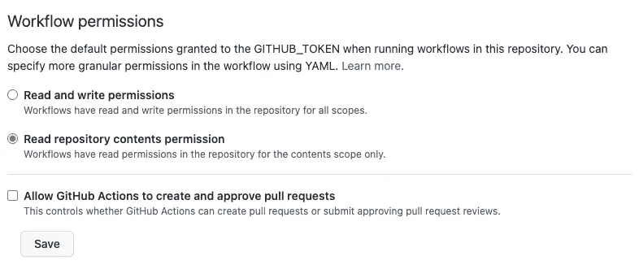

# 对 Github 动作使用语义发布

> 原文：<https://levelup.gitconnected.com/using-semantic-release-with-github-actions-c30d197829f1>


照片由[丹金](https://unsplash.com/@danielcgold?utm_source=medium&utm_medium=referral)在 [Unsplash](https://unsplash.com?utm_source=medium&utm_medium=referral) 上拍摄

让[语义发布](https://github.com/semantic-release/semantic-release)的目的是为了让我们可以经常向用户发布可用的版本。所以我们不应该发布不可行的版本，所以在我们开始使用语义发布之前，我们应该准备好我们的工作分支，并且发布应该只发生在主分支中。

对于今天的例子，我们将在 nodejs angular 应用程序上设置一个语义发布。我们首先将[语义发布 npm 包](https://www.npmjs.com/package/semantic-release)安装到我们的开发依赖中。

```
npm install -D semantic-release
```

然后我们为我们的语义发布创建一个配置文件，命名为`.releaserc`。

```
branches:
  - master
  - name: alpha
    prerelease: true
debug: true
ci: true
dryRun: false
plugins:
  - "@semantic-release/commit-analyzer"
  - "@semantic-release/release-notes-generator"
  - "@semantic-release/github"
```

在上面的例子中，我启用了语义发布，只在`master`分支或`alpha`分支上运行。我们指出`alpha`是一个预发布分支。我们也覆盖了默认插件，删除了`@semantic-release/npm`插件，因为我们不打算把它发布到 npm 注册表。

当 github 动作运行时，它使用一个名为`GITHUB_TOKEN`的[自动生成的令牌](https://thecodinganalyst.github.io/knowledgebase/Using-Semantic-Release-with-Github-Actions/(https://docs.github.com/en/actions/security-guides/automatic-token-authentication))作为运行所需动作的通道。为此，我们需要允许自动生成的令牌拥有写权限。因此，在`Settings`中，转到`Actions` > `General`，向下滚动到`Workflow permissions`部分，选择`Read and write permissions`单选按钮。不要忘记点击保存按钮。



然后，我们可以去 github 创建 github 动作工作流，这样就可以触发语义发布。单击 github 存储库中的`Actions`选项卡，并选择 Node.js 工作流。将脚本调整如下，并直接提交到主分支。它将被保存到文件夹`.github/workflows`中。

```
name: Node.js CIon:
  push:
    branches: [ master, alpha ]
  pull_request:
    branches: [ master, alpha ]env:
  GH_TOKEN: ${{ secrets.GITHUB_TOKEN }}jobs:
  build: runs-on: ubuntu-latest strategy:
      matrix:
        node-version: [16.x, 18.x] steps:
    - uses: actions/checkout@v3
    - name: Use Node.js ${{ matrix.node-version }}
      uses: actions/setup-node@v3
      with:
        node-version: ${{ matrix.node-version }}
        cache: 'npm'
    - run: npm ci
    - run: npm run build --if-present
    - run: npm test -- --watch=false --browsers=ChromeHeadless
    - run: npx semantic-release
```

在上面的脚本中，我们在脚本中创建了一个名为`GH_TOKEN`的环境变量，因为它是@semantic-release/github 插件所需要的[，我们通过使用`$`为自动生成的令牌赋值。](https://github.com/semantic-release/semantic-release/blob/master/docs/usage/ci-configuration.md#ci-configuration)

我们还添加了`-- --watch-false --browsers=ChromeHeadless`，因为我们使用 Karma 进行测试，如果默认情况下`watch=true`，它在完成测试后仍然会挂在那里。而且 github runner 中没有 chrome 浏览器，所以我们需要在运行`npm test`时为我们的浏览器指定`ChromeHeadless`。

在最后一部分，我们添加了`run: npx semantic-release`来运行它。

因此，每次我们向主分支或 alpha 分支推送或合并 pull 请求时，github 都会自动运行上面的脚本来提供 ubuntu，从这个存储库中签出代码，在 ubuntu runner 中设置 nodejs，并运行`npm ci`来安装这个项目的 package.json 中指定的所有必需的依赖项，运行构建和测试，最后运行 semantic-release。然后，它将检查提交，以确定是否需要发布。如果需要，将创建一个新的版本。

为了模拟创建预发布分支，由于我们还没有开始开发应用程序本身，我们可能还不应该发布。因此，我们将创建一个名为`alpha`的分支，创建一个带有一些模拟特性的文本，提交消息`feat(feat1): mock feature 1`，并将其推送到我们的 repo。正如预期的那样，语义发布将会运行，虽然它只是一个新的`feat`消息，应该只保证一个次要的发布，但是因为我们是在版本 0 上，并且语义发布的建议是从 1.0.0 开始，新的发布将是`v1.0.0-alpha.1`。在这个 alpha 分支中的后续发布将是`v1.0.0-alpha.2`等等。

然后，当我们准备好创建我们的产品版本时，我们创建一个 pull 请求，将 alpha 分支合并到我们的主分支。语义发布将运行并创建`v1.0.0`。

上述示例的样品可在[https://github.com/thecodinganalyst/semantic-node](https://github.com/thecodinganalyst/semantic-node)获得。

本文最初发布于[https://the coding analyst . Github . io/knowledge base/Using-Semantic-Release-with-Github-Actions/](https://thecodinganalyst.github.io/knowledgebase/Using-Semantic-Release-with-Github-Actions/)