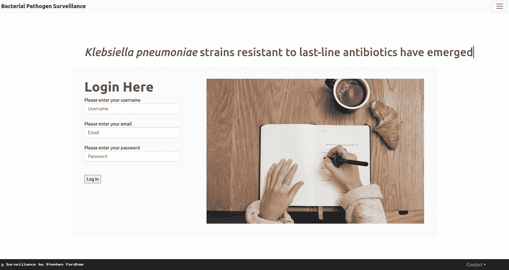

# 使用 Python 在 Flask 中使用会话和 Flash

> 原文：<https://levelup.gitconnected.com/using-session-and-flash-in-flask-with-python-72909194e95c>

## Flask 中登录和注销过程中的自定义消息

图片来自作者的个人 web 应用程序(生产中)。插图由凯瑟琳·拉威利通过 [unsplash](https://unsplash.com/@cathrynlavery) 提供

当用户登录到 web 应用程序时，个人显示消息可以为热烈的欢迎定下基调。在 Flask 中，向用户显示欢迎消息可以通过多种方式实现。我向用户显示欢迎消息的两种方式是通过会话变量或从 Flask 导入的 flash 函数。

我最近构建了一个 Flask web 应用程序，它使用了这两种方法。在我的 web 应用程序中，我有一个用户可以注册的注册表单。一旦注册，用户将他们的数据存储在一个数据库中。然后，用户可以登录以访问附加/特权用户服务。我们可以使用注册阶段提供的信息在登录时设置个人消息。

图一。注册后，用户可以通过登录页面登录访问更多内容

**方法一:会话变量**

在登录过程中，我首先检查登录表单是否填写正确。如果提供的电子邮件地址返回 None，则使用 redirect 和 url_for 函数将用户重定向到注册页面(参见 gist 逻辑，图 2)

接下来，我执行一点验证，以确保用户为其帐户提供的密码与存储在我的数据库中的散列密码相匹配。如果匹配，我使用从 flask_login 导入的 login_user 函数让用户登录。

接下来，我使用 flask 中的会话变量。使用会话变量涉及两个过程。我首先使用以下语法访问用户在登录时提供的名称:form.username.data .这里，username 属性是从我的用户登录表(在 Flask 中通常称为 model)中派生出来的，data 属性访问名称。我将这个名称赋给了变量 active_user。

然后，我像使用普通 python 字典一样使用会话变量。我将密钥设置为字符串“username ”,并将值赋给变量 active_user。然后，我使用 redirect 和 url_for 函数重定向到登录页面。

(在我的 app.py 里，我有一个标注为‘登陆页’的查看功能。这就是为什么我可以把登陆页面写成字符串的原因)。

图二。登录条件逻辑

使用会话变量的第二部分包括访问会话值并将其存储在变量中。

当在登录期间使用会话变量时，我们重定向到 web 应用程序的主页，即登录页面。然而，当用户第一次访问我的网站时，他们也到达了 landing_page，因此不存在会话对象。

要解决这一常见问题，只需将您的代码包装到一个 try-except 块中，这样，如果不存在会话对象，并且可能会引发一个关键错误，就可以捕捉到这一错误，使程序能够继续运行，并呈现没有任何个人欢迎消息的登录页面。

在 html 代码中，如果用户已经登录，我们可以使用 jinja 模板和条件逻辑向用户显示欢迎消息。如果用户已经登录，我们可以访问会话值，并将其作为变量传递给登录页面。然后我们使用 jinja 语法，这里用双括号显示变量 active_user。

如下所示，一旦登录，就会显示一条格式良好的欢迎消息。

**方法二:闪光功能**

我们还可以使用 flash 方法向用户显示有用的确认注销消息。首先，我们使用从 flask login 导入的@login_required 装饰器。这意味着，我们必须登录才能注销。

我们注销用户，并向 flash 函数写入两个参数。第一个是要显示的消息，第二个是类别。这在很大程度上是可选的，但却是一个好习惯。然后，在再次重定向到登录页面之前，我们可以将会话对象的值重新设置为 None。

在上面的登录页面 html 代码中，在第一个 jinja if else 块中，如果一个 flash 消息被提供了一个成功类别，那么它将被存储为一个列表项。可以提供具有消息的多种闪烁功能。在这个例子中，只使用了一个。

然后可以使用如下所示的 if 和 for jinja 语法遍历这个列表来显示消息。

现在会出现一条漂亮的注销消息。

您可能想要添加的一个好的技巧是为不同的设备改变注销警告框的大小。在这里，对于大屏幕，我使用 4 列来显示警告消息，而对于移动设备来说，使用所有 12 列可能会更好，如下图所示。

感谢阅读，希望这个例子展示了使用 Flask 构建 web 应用程序时 Python 中会话和 flash 的一个很好的用例。