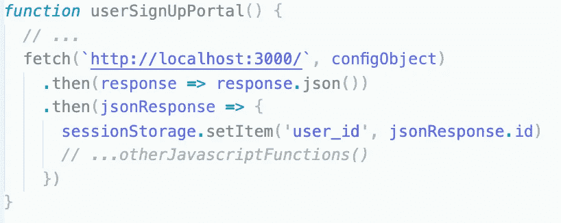
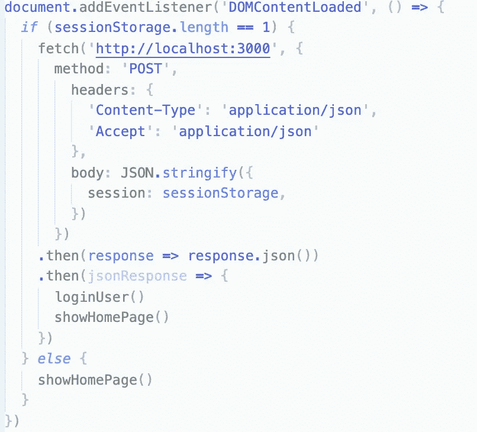
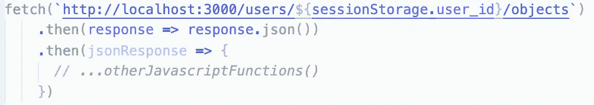
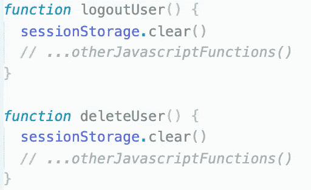

# 在 javascript 应用程序中使用会话存储

> 原文：<https://levelup.gitconnected.com/using-sessionstorage-in-a-javascript-application-9c920a546465>

最近，我构建了一个单页面应用程序，在前端使用普通的 JavaScript，在后端使用 Rails 作为 api。当构建这个应用程序时，我遇到的第一个问题是前端无法与后端通信，除非每次都向我的`SessionsController`发送一个`fetch`。

每次我需要检查谁登录时发送一个`fetch`，然后从第一个`fetch`的`response`发送另一个`fetch`来实际做我需要做的事情，这个过程对我来说似乎不是很有效。从全局来看，这并不是一个大问题，但是这有点乏味。我的大脑掉进了兔子洞，试图学习如何使用存储在浏览器中的会话 cookies。

不幸的是，我发现的所有文档都涉及到在我的应用程序中安装某种类型的中间件，这可能是因为我这边的用户错误，对我来说从来没有正常工作过。在几个小时的尝试之后，我觉得我被困在同一个地方太久了，我决定有一种更简单的方法来将我的登录用户`id`存储在前端，经过一番挖掘之后，我发现了 javascript 对象`sessionStorage`。根据 W3，*‘session storage 属性允许[您]在 web 浏览器中保存键/值对。’*这是我需要的金券，我将向你解释我是如何在应用程序中使用`sessionStorage`的。

已经建立了我的`user`模型，并且构建了用于`user`登录/注册的表单，当我重新加载页面以重置我的 DOM 时，我的问题不断出现。每次 DOM 加载我的应用程序时，我都不知道我在重新加载之前登录或创建的用户。作为任何网站的普通用户，我认为除非用户明确注销，否则会话应该持续。这不是一个普遍的规则，然而大多数网站(亚马逊、推特、GitHub)不会在`user`关闭或重新加载网页时注销`user`，如果他们注销了，那就有点烦人了。我看到的问题是我的前端需要识别有一个`user`登录。这就是`sessionStorage`建造的目的。实现这一点很简单；当一个`user`成功登录后，将`user`的`id`设置为`sessionStorage`对象内的`:user-id`键。

`user`登录时发送的获取

这将设置一个键/值对，使其在整个应用程序中保持原样，除非显式设置为其他值或重置。在我的应用程序中的任何地方，在我的会话中的任何时间点，`sessionStorage.user_id`将返回我当前的`:user_id`。这是有用的，原因有几个。首先，现在当我加载 DOM 时，我可以设置一个条件来检查`sessionStorage`对象。

DOMContentLoaded 事件侦听器

在我的 DOMContentLoaded 事件监听器中，javascript 检查`sessionStorage`对象，如果登录了一个`user`，则发送一个`fetch`，将`sessionStorage`对象作为`body`。在后端，`:user_id`被设置为`session[:user_id]`，用于我在 rails 中构建的任何其他需要我的当前`:user_id`的方法。如果我的`sessionStorage`对象是空的，javascript 只呈现我的主页而不记录`user`。这个`sessionStorage`对象的另一个，可能是最有用的功能是在`fetch`中使用`:user_id`的能力。当获取属于一个`user`的对象时，我的 api 的路径是`/users/:id/objects`。对于`sessionStorage`对象，一个简单的字符串插值是完美的。

获取属于当前用户的所有子对象

`sessionStorage`的最终用途是当`user`注销或删除他们的个人资料时清除`sessionStorage`。这是相当直接的。只需将`sessionStorage.clear()`添加到用于注销或删除`user`的功能中。这将重置`sessionStorage`为空对象。记住在这两个注销/删除函数上发送一个`fetch`很重要，这样前端的`sessionStorage`对象将匹配后端的`session`散列。这是一个使 javascript 对象和 ruby hash 匹配的手动过程，但是它允许我在构建应用程序时有更多的灵活性。

注销和删除用户功能

是我在构建应用程序时偶然发现的一颗未经雕琢的钻石，它确实让我的开发过程变得更加简单快捷。正如我前面提到的，这种将前端和后端的会话分开处理的特定方式会导致两者之间的一些差异。对我来说，使用`sessionStorage`让我免去了安装 gems 和中间件以及启用 cookies 和进入浏览器功能的麻烦，并允许我直接使用 javascript 和 rails 现成可用的东西。这也使我调试任何问题变得更简单，因为任何由会话问题引起的错误都来自我编写的代码行，而不是由我从未见过面的人编写的一些 gem。我并不是说这无疑是处理会话的最佳方式，但是我相信知道什么是`sessionStorage`以及如何使用它对将来开发新的应用程序是有帮助的。