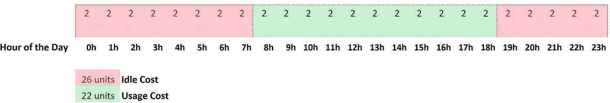
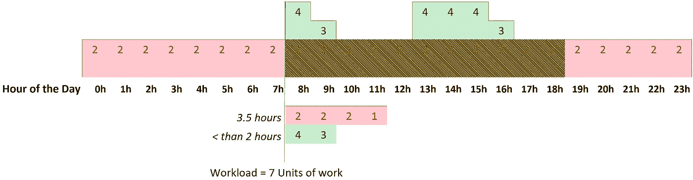
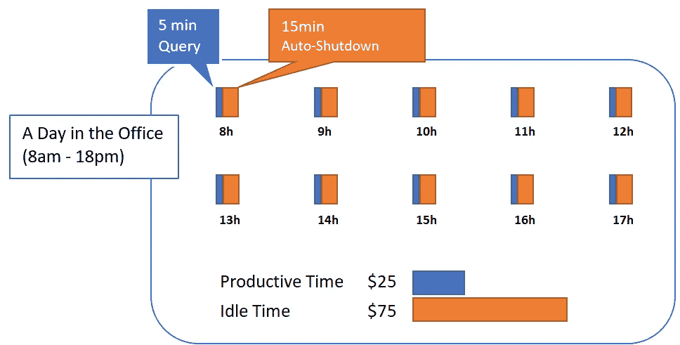
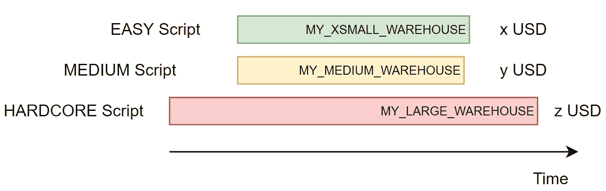

# 用雪花？不要犯这些代价高昂的错误

> 原文：<https://levelup.gitconnected.com/using-snowflake-dont-make-these-expensive-mistakes-66c1eaa7d1ee>

## 按使用付费的模式是惊人的，但它应该有一个巨大的红色标签:“小心使用！”

自从(数据库)时代开始以来，数据库就一直为我们服务，24/7 全天候，急切地等待着为下一个查询服务。我很确定，如果我们把过去几十年中所有的数据库空闲时间都加起来，我们将拥有几个世纪的可用性，而数据库却什么都没做…什么都没有！真是浪费…对吧？

> 不再是了！欢迎来到按使用付费的时代！

# 你更喜欢哪一辆:永远开着的菲亚特 Uno，还是需要时才开的法拉利？

在按使用付费的模式中，您不需要为可用性付费:任何人都不愿意为服务器空闲而付费…就像以前的性能调优所说的:*每当服务器不是以 100%的容量运行时，您就是在浪费金钱。*

显而易见,“按可用性付费”最终会导致空闲时间比实际使用时间花费更多。但它不仅仅是节省空闲时间:您不必拘泥于某种性能限制，这意味着您可以让用户的工作更有效率，同时花费相同的钱:

执行 7 个工作单元所花费的时间，以及如何在正确的时间使用“正确的”能力来提高团队的生产力

因为你不再为空闲时间付费，你可以根据手头的工作来调整你的仓库。在上面的示例中，绿色模式的成本仍然与上一个示例完全相同，但是我们没有使用 2 的容量运行 10 个小时，而是将容量转移到了需要的地方。

使用绿色模式的人的查询应该会得到更快的答复(更多的计算能力可用)，而且，由于数据专业人员往往比许可证更昂贵，您将节省人们的时间…

> 这是我喜欢按使用付费模式的原因之一，性能提高是双倍的:**每当我提高性能，我就节省了使用积分和人们的时间。**

更快的查询意味着更低的成本，更少的等待时间:这是一个双赢的局面！**但是，如果这真的如此神奇，为什么说服首席技术官踏上这一旅程如此困难？**

# 预算失控了！！

一段时间以来，我一直在努力让公司了解像雪花这样的按使用付费 MPP 平台的优势。我似乎一次又一次地发现一个阻力，那就是认为雪花是“预算大屠杀”。有一次，我的一位知名 CTO 客户，决定联系他的同行，询问有关雪花的情况，其中一半人说他们喜欢它，另一半人告诉他，尽管雪花很棒，但它已经完全破坏了他们的预算。

> 我很容易理解为什么…按使用付费的模式给你的用户巨大的力量，但是伴随着巨大的力量而来的是巨大的责任！

人们并不总是明白他们行为的后果。我不止一次看到当人们意识到他们的一个查询在一个 XLARGE 上运行 30 分钟要花费 24 美元*(虚构的数字，对于一个在一个 XLARGE 上运行 30 分钟的查询)时，他们脸上的表情。*对他们来说，他们只有一个数据库，而且他们使用了它…这让我们想到了公司在加入雪花时犯的第一个也是最大的错误。

# 错误 1:没有对用户进行按使用付费模式的教育

您的用户已经使用数据库很多年了，对他们来说，数据库就是他们随时需要使用的东西。在他们的头脑中，使用和成本之间没有联系，这是有原因的:因为那从来就不是一件事…直到现在！但是他们不会知道，除非你告诉他们！

> 不向你的团队解释他们的使用直接与成本相关，这是一个非常昂贵的错误！

不是他们不知道或者不能理解，以前没有人告诉过他们！如果你想让你的用户谨慎对待你的预算，就帮助他们这样做吧！

# 错误 2:让你的法拉利开着

假设你为你的用户建立了一个仓库，你把他们放在同一个仓库里:一个大的*(大约 8 个节点，大约 30 美元/小时)。* **因为你不知道更好，你给你的仓库配置了 15 分钟的“*自动关机*”。**假设您的所有用户的查询都需要大约 5 分钟才能在这个大型仓库中运行，并且它们都是“整点”运行的。

**由于您选择的配置和您拥有的查询模式，您现在要为非生产性工作支付比生产性工作更多的费用**。

要吸取的教训:根据你的使用模式调整你的自动暂停时间，并查看日志！雪花有所有事情的日志，你可以很容易地发现这种(和其他)类型的问题。当然，在这种情况下，解决这个问题非常简单:

*   把自动暂停改成 1 分钟(*是的，你可以！只是用 DDL 代替 UI*
*   教育您的用户在使用昂贵的集群时，在他们完成后暂停仓库！

您会很高兴地发现，如果您决定在查询仍在运行时暂停仓库，查询不会被中止。所有当前工作量都已完成。请注意，在群集关闭后，您的缓存将被删除，这可能会影响性能。

# 错误 3:同时使用多个仓库

一个仓库可以处理多个查询，处理高负载的最佳方式是使用多集群仓库(自动向外扩展和向内扩展)。如果你需要扩大规模，尽一切办法！但是你可以通过升级现有的仓库来轻松做到这一点，而不是运行一个额外的仓库。这是您试图避免的不良使用模式:

您希望避免的昂贵的仓库使用模式

在这种情况下，你支付(x+y+z)美元，而你可以只支付 z 美元。

> 这看起来似乎是微不足道的花费，但是如果你一年 365 天每天都这么做多次，相信我，它会很快累积起来…

我并不是说你应该只用一个仓库来运行整个数据仓库！但是仓库的数量应该与工作负载隔离和预算控制等相关，而不是与您正在运行的仓库的大小相关。

# 结论

按使用付费的模式确实是你能做的最好的，因为它激励了生产力。如果你有一项重要的工作要做，你只需要建一个大型仓库就可以了。不再有“那要花很多时间”的障碍，不再有“喝茶时间的询问”。另一方面，这种模式是非常不宽容的误用，如果你不“小心使用”,你的预算会感到痛苦…

因为我知道这种模式有多好，有多可行，而且在没有真正必要的情况下超支是多么容易，所以我个人对雪花信用的滥用有“深仇大恨”。我不断地监控雪花的使用，并使用各种技巧让我的客户朝着可持续使用的方向发展。我希望这篇文章也能帮助你做到这一点。

## 雪花系列

*这篇文章是我的(不断成长的)雪花系列的一部分。如果你很好奇想了解更多关于雪花的知识，这些文章可能也会让你感兴趣:*

*   [是什么让雪花比其他的好那么多](https://jmarquesdatabeyond.medium.com/what-makes-snowflake-so-much-better-than-others-58e839e29e80)
*   [*雪花 vs 红移的 RA3——对速度的需求*](/snowflake-vs-redshift-ra3-the-need-for-more-than-just-speed-52e954242715)
*   [*雪花中的近实时数据摄取(以及如何实现热/冷/冻结数据存储策略)*](/near-realtime-data-ingestion-in-snowflake-7033d45ce860)
*   [*使用外部表时的性能考虑*](https://jmarquesdatabeyond.medium.com/using-snowflake-external-tables-you-must-read-this-aeb66ae8e0e6)