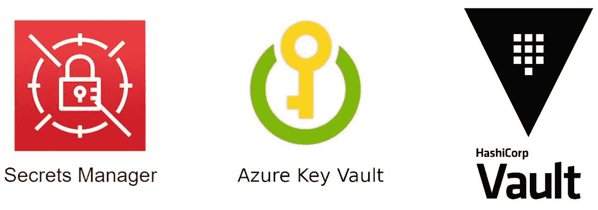
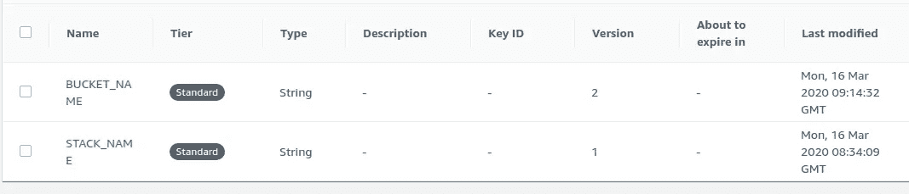
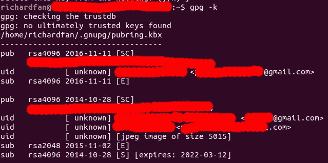
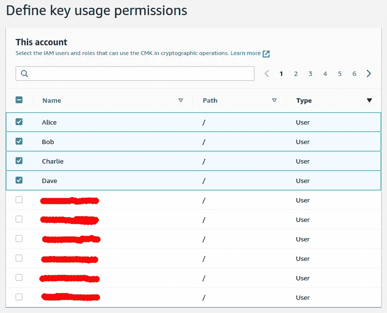
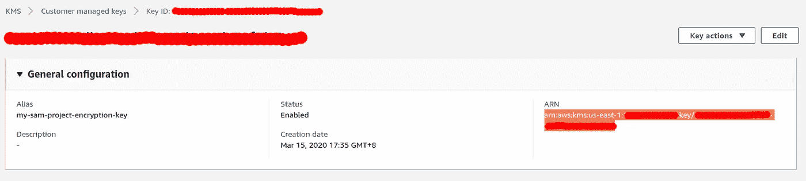
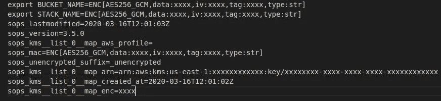

# 使用 sop 和 git 挂钩共享秘密—第 1 部分

> 原文：<https://levelup.gitconnected.com/using-sops-and-git-hook-to-share-secrets-part-1-d1d4475a4b46>

# DevOps 将一切都驱动到代码中(包括秘密)

DevOps 是一个教义，而不是一个框架。如果你问 10 个人什么是 DevOps，你会得到 10 个不同的答案。但是在这些答案中，自动化和作为代码的基础设施多少会是其中的一部分。由于有了可用的工具，我们现在可以将这些基础架构配置和手动部署命令交给计算机，并与每个人共享。然而，我们应该如何处理我们的秘密，比如访问密钥和密码？我们应该与我们的团队分享它们吗？我们应该把它们放在哪里？

# 场景:共享部署配置

假设我正在使用 AWS SAM 开发一个无服务器应用程序。我创建了下面的`Makefile`，这样我就可以用一个简单的`make`命令来部署这个应用程序。

```
deploy:
    sam build
    sam package --output-template packaged.yaml --s3-bucket $(BUCKET_NAME)
    sam deploy--template-file packaged.yaml --stack-name $(STACK_NAME) --capabilities CAPABILITY_IAM
```

我还创建了一个`.env`文件来存储 S3 存储桶名和 CloudFormation 堆栈名

```
export BUCKET_NAME=my-dummy-bucket
export STACK_NAME=dummy-stack
```

为了让我的队友(或者明天的我)知道我用的是哪个桶和哪个 CloudFormation 栈，我必须在某个地方保存`.env`。虽然这不是最高机密，但我不想让团队以外的人知道我使用的是哪种 S3 铲斗，或者我们的命名惯例是什么。因此，我不得不用另一种方式存储这个文件，而不是直接将它推送到存储库。

## 方法 1:使用参数存储/秘密管理器

这应该是最常用的方法。我们可以利用托管的参数存储或秘密管理器(例如 AWS 参数存储、秘密管理器/Azure Key Vault/[hashi corp Vault](https://www.vaultproject.io/))，而不是将信息存储在文本文件中。



有许多秘密经理选项

比如，我可以把`Makefile`改成这样:

```
BUCKET_NAME=$(shell aws ssm get-parameter --name BUCKET_NAME --query 'Parameter.Value' --output text)
STACK_NAME=$(shell aws ssm get-parameter --name STACK_NAME --query 'Parameter.Value' --output text)deploy:
    sam build
    sam package --output-template packaged.yaml --s3-bucket $(BUCKET_NAME)
    sam deploy --template-file packaged.yaml --stack-name $(STACK_NAME) --capabilities CAPABILITY_IAM
```

现在我用 awscli 从 AWS 参数库中抓取`BUCKET_NAME`和`STACK_NAME`。我可以授予我的队友访问权限，这样他们就可以像我在我的电脑上一样运行`make`命令。如果我的一个队友离开了公司，我可以简单地撤销他的访问权限，而不必担心在他的电脑上留下任何秘密。

然而，由于秘密保存在存储库之外，我们必须单独管理它们。我们如何跟踪哪些参数属于哪个项目？我们如何对这些参数进行版本控制？

很多参数存储支持版本化特性，但是管理两套版本树(代码库和参数存储)还是比较困难的。当问题出现时，我们必须匹配两个版本树的时间线，以获得状态变化的全貌。



AWS 参数存储支持版本控制

优点:
1。完全控制的秘密
2。本地计算机中没有明文副本

缺点:
1。需要管理两套资源

## 方法 2:加密机密

为了避免管理两个独立资源的开销，我们可以将秘密和代码放在同一个存储库中。但为了防止任何数据泄露，我们必须确保不把它们明文放在网上。

如果你在谷歌上搜索一些相关关键词，你可能会找到 [git-secret](https://git-secret.io/) 。这是一个非常好的工具，它允许你使用 GPG 加密任何文件。基本上，您添加来自队友的 GPG 公钥，git-secret 将使用它们来加密您指定的文件。

然而，git-secret 假设开发人员应该有他们自己的 GPG 密钥对，但我认为在许多组织中情况并非如此。此外，因为它使用每个人的公钥来加密文件。当新成员加入时，你必须收集他们的公钥，并再次加密每个文件，以便他们可以解密。同样，如果有人离开团队，您必须删除他的公钥并重新加密所有文件，这样他就不能再访问了。



管理 GPG 群岛是另一个地狱

这种方法的另一个问题是推和拉代码的过程。开发人员可能会意外地以明文形式推送秘密。或者他们可能在修改后忘记加密和推送秘密。

优点:
1。你可以在 1 库
2 集中管理项目的一切。易于开发，因为本地的所有内容都以明文显示

缺点:
1。管理密钥的开销
2。这使得推/拉过程变得复杂

# SOPS:使用中央密钥库加密

经过一番研究，终于找到了 Mozilla [SOPS](https://github.com/mozilla/sops) 。SOPS 的原理类似于 git-secret，它帮助您在将文件推送到存储库之前对文件进行加密。与众不同的是，除了 GPG，它还支持许多不同的主要商店，如 AWS KMS。使用 sop，我们现在可以在代码库中保存秘密，同时集中控制访问。

我将带你了解我是如何在项目中整合 sop 的

## 第一步:安装标准操作程序

转到 SOPS [发布页面](https://github.com/mozilla/sops/releases)并下载最新版本。它有 Windows，macOS，Ubuntu/Debian(。deb)和 CentOS(。rpm)版本。

## 步骤 2:配置 IAM 用户

SOPS 需要我们的凭证来访问 KMS 密钥，我将为我的每个队友创建 IAM 用户(如果他们还没有),并在我的计算机中配置访问密钥

1.  [创建具有编程访问权限的 IAM 用户](https://docs.aws.amazon.com/IAM/latest/UserGuide/id_users_create.html)
2.  [安装 AWS CLI](https://docs.aws.amazon.com/cli/latest/userguide/install-cliv2.html)
3.  运行`aws configure`向 AWS CLI 提供 IAM 用户的访问密钥

## 步骤 3:设置 KMS 自定义密钥

我们必须创建一个可以与所有队友共享的密钥，以便我们都可以使用它来加密/解密秘密。在我的情况下，我使用 AWS KMS，你可以使用其他支持的关键商店。

1.  转到[https://console.aws.amazon.com/kms/home#/kms/keys](https://console.aws.amazon.com/kms/home#/kms/keys)
2.  点击“创建密钥”，保留所有默认设置
3.  给它一个别名，例如“我的 sam 项目加密密钥”
4.  定义谁将是密钥管理员(谁可以配置密钥)
5.  定义谁可以使用密钥(将使用密钥加密/解密机密的用户)
6.  复制密钥的 ARN，我们稍后会用到它



选择将访问机密的用户



复制 KMS 密钥 ID 以备后用

## 步骤 4:配置 sop

sop 使用`.sops.yaml`文件来配置加密文件时使用的密钥。在我的项目中，我使用了以下配置:

```
creation_rules:
  - path_regex: \.env
    kms: 'arn:aws:kms:us-east-1:xxxxxxxxxxxx:key/xxxxxxxx-xxxx-xxxx-xxxx-xxxxxxxxxxxx'
```

这个文件只是告诉 SOPS 使用我指定的 KMS(我在上一步中复制的 ARN)来加密`.env`文件。如果有多个权限级别，可以在 KMS 创建多个关键字，并定义多个创建规则。

```
creation_rules:
  - path_regex: \.env$
    kms: 'arn:aws:kms:us-east-1:xxxxxxxxxxxx:key/xxxxxxxx-xxxx-xxxx-xxxx-xxxxxxxxxxxx'
  - path_regex: \.prod\.env$
    kms: 'arn:aws:kms:us-east-1:xxxxxxxxxxxx:key/yyyyyyyy-yyyy-yyyy-yyyy-yyyyyyyyyyyy
```

这样，我可以确保`.env`和`.prod.env`将使用两个不同的密钥进行加密。这样我就可以确保开发团队成员不一定能够访问生产环境。

## 步骤 5:加密秘密

在提交项目之前，我们可以运行`sops -e --output .enc.env .env`这个命令将文件`.env`加密成`.enc.env`如果你有多个

加密后，我的`.enc.env`看起来是这样的:



可以看到我的 bucket 名和 CloudFormation 栈名已经加密了。sop 还为文件附加一些元数据，尤其是用于加密的密钥。

## 步骤 6:将原始机密文件添加到。gitignore

为了防止开发人员意外地将明文秘密提交到存储库中，我们应该将它的文件名添加到`.gitignore`中，这样 git 就不会跟踪它们。在我的例子中，我的`.gitignore`应该是这样的:

```
# Do not commit secret files
.env
```

## 步骤 7:提取更新后解密机密

我们已经完成了加密部分，现在我的队友们必须在提取存储库后解密它。获取更新后，只需运行`sops -d --output .env .enc.env`即可。如果我的队友正确配置了访问密钥，并且可以访问 KMS 密钥，那么它会将文件解密为原始的`.env`

# 下一步是什么？

现在，我们可以通过同一个存储库安全地与队友共享项目秘密。我们还可以集中管理谁可以通过 AWS KMS 访问这个秘密。然而，仍然存在人工进程(加密和解密文件),这在 DevOps 世界中并不是一个好的实践。在第二部分中，我们将讨论如何自动化这些过程。