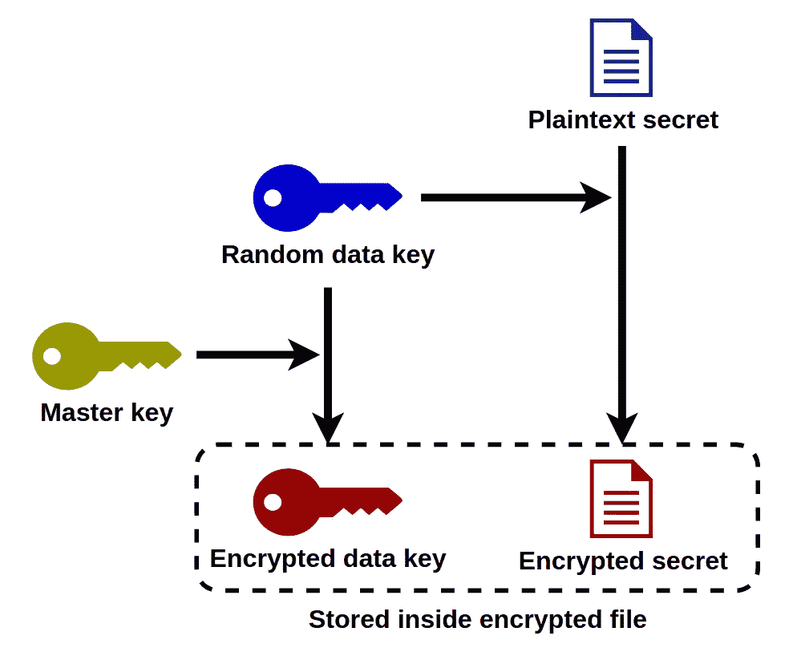
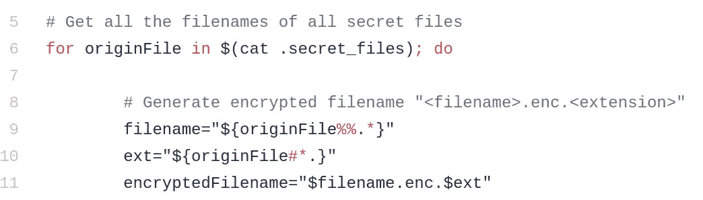
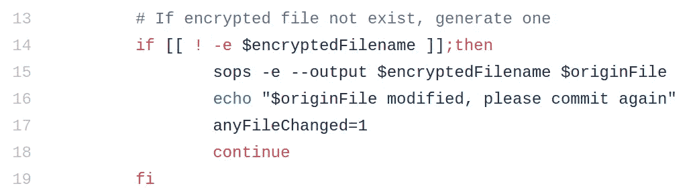
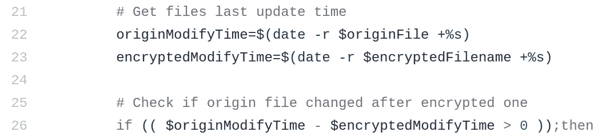
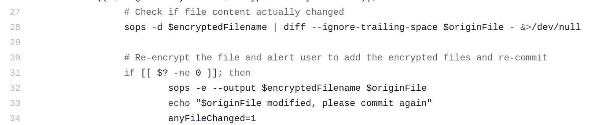
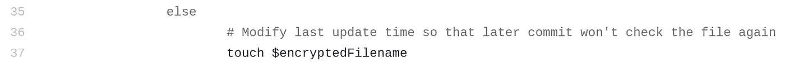
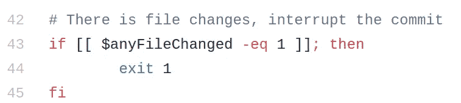
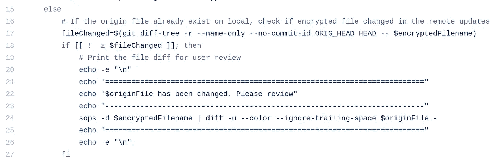

# 使用 sop 和 git 挂钩共享秘密—第 2 部分

> 原文：<https://levelup.gitconnected.com/using-sops-and-git-hook-to-share-secrets-part-2-38518be67a14>

# 我们到目前为止所做的

在[信封加密](https://medium.com/@richardfan1126/using-sops-and-git-hook-to-share-secrets-part-1-d1d4475a4b46#overview)，我们的数据不是由我们提供的密钥(主密钥)直接加密的(在我们的例子中，它是 KMS 客户密钥)。相反，它们由随机生成的密钥(数据密钥)加密，然后主密钥加密数据密钥。然后，加密的数据密钥将作为元数据存储在加密文件中。因为数据密钥是随机的，如果我们加密同一个未修改的文件，每次得到的结果仍然不同。

SOPS 使用随机数据密钥加密文件

如果我们在每次提交之前天真地加密每个文件，我们将每次都改变它，尽管我们实际上并没有。检测真正的文件更改是我们必须解决的第一个问题

## 问题 2:无法观察冲突

因为我们没有在存储库中存储明文文件，所以当发生冲突时，Git 只能提供加密文件的 diff 视图。但是我们的大脑不是解密器，我们必须看到在明文版本中冲突是如何发生的。这是我们要解决的第二个问题。

# 如何使用挂钩

githooks 是将在本地机器上运行的 shell 文件。出于安全原因，这些文件不能从远程存储库克隆。否则，黑客可以使用他们的存储库向计算机注入恶意代码。

要使用钩子，我们需要手动地将钩子文件复制到您克隆的存储库中的`.git/hooks`文件夹下。

# 让我们深入研究代码

## 1.秘密文件

为了让我的钩子知道我们的秘密文件在哪里，我在根级别创建了`[.secret_files](https://github.com/richardfan1126/sops-githooks/blob/master/.secret_files)`文件。这只是一个简单的文本文件，列出了我们想要加密的所有文件的相对路径。

## 2.预提交

`[pre-commit](https://github.com/richardfan1126/sops-githooks/blob/master/hooks/pre-commit)`是在提交实际发生之前触发的，我使用这个钩子来做数据加密。

钩子首先获得秘密文件的列表。对于每个文件，它将为加密版本生成相应的文件名(在文件扩展名前添加`.enc`)。

然后，它将检查加密版本是否存在。如果没有，它会通过加密明文创建一个，我后面会讲到`anyFileChanged`标志。

如果加密文件存在，它将继续比较明文和加密文件的上次更新时间。

我这样做是因为如果加密版本比明文版本更新，我可以假设加密版本是最新的。然后我可以跳过实际的内容比较来降低密钥的使用。(数据加密在成本和计算机资源方面都很昂贵)

当然，如果用户直接编辑加密文件，可能就是问题所在。

如果明文版本在加密版本之后被更新，钩子将检查它们的内容是否实际上不同。我通过解密加密版本，并使用`diff`来比较内容。

如果它们不同，它将加密明文版本并替换加密版本。请注意，我总是将明文版本视为真理，因为开发人员更了解明文而不是密码文本。

如果内容实际上是相同的，它不会加密文件。它解决了我们的第一个问题。

但是，钩子仍然修改加密文件的最后更新时间。这是为了防止钩子在以后的提交中反复比较未修改的文件。

最后是`anyFileChanged`旗。如果有任何机密文件被更改，用户将会得到通知，提交将会被非零退出代码终止。

用户现在可以暂存新加密的文件并再次提交。

## 3.后合并和后重写

这两个钩子实际上在做同样的事情。两者的区别在于`[post-merge](https://github.com/richardfan1126/sops-githooks/blob/master/hooks/post-merge)`会在`git merge`之后触发，而`[post-rewrite](https://github.com/richardfan1126/sops-githooks/blob/master/hooks/post-rewrite)`会在`git rebase`之后触发。开发人员通常通过合并或重定基础来拉远程更新，所以我将解密过程包含在这两个钩子中。

注意，这两个钩子是在动作之后触发的。所以远程文件已经更新到本地。

`post-rewrite`实际上是调用`post-merge`文件，所以我们可以简单地进入`post-merge`。

像`pre-commit`一样，钩子先在秘密文件列表上循环，并为加密版本生成相应的文件名。然后，它检查明文版本是否存在。如果没有，它会通过解密加密版本来创建一个。

如果明文版本存在，钩子的主要部分就会发生。首先，钩子将检查当前 pull 中是否包含秘密文件。我通过在`HEAD`(我们当前所在的提交)和`ORIG_HEAD`(合并/重定基础之前的提交)上运行`git diff-tree`来完成这个任务，并查看文件是否在这个 diff 中。

如果文件已经被更改，钩子将对当前的明文版本和新更新的文件执行`diff`，并将结果显示给用户。

我已经说过了，我一直把明文版本当做真理，所以钩子不会直接替换本地版本。它提示用户文件是如何被改变的，并让用户决定如何合并两个版本。

# 限制

## **1。仅适用于 CLI**

正如你所看到的，钩子依靠`echo`来提示用户文件的改变。虽然它在 CLI 上工作，但不能保证 GUI git 客户端会将这些`echo`输出重定向到用户。

我在 VS 代码上测试过，它在`pre-commit`钩子上工作。正确显示**“$ origin file 已修改，请重新提交”**消息在警告框上，并停止提交。但是在`post-merge` hook 上，虽然我的秘密文件已经在远程树上被修改了，它还是默默地完成了拉的动作。

## 2.用户可以忽略冲突提示

在`post-merge`钩子上，我提示用户解决冲突。然而，它并不像 git 那样强制执行，用户可能会忽略冲突，将他们自己的版本提交到远程树并覆盖他们队友的工作。

## 3.Git 操作很复杂

钩子可能在大多数情况下都有效。然而，Git 有许多不同的特性，如`stash`、**、**、**、**、`squash`等。结合所有的动作，有许多组合，很难测试这些钩子在那些情况下如何动作。