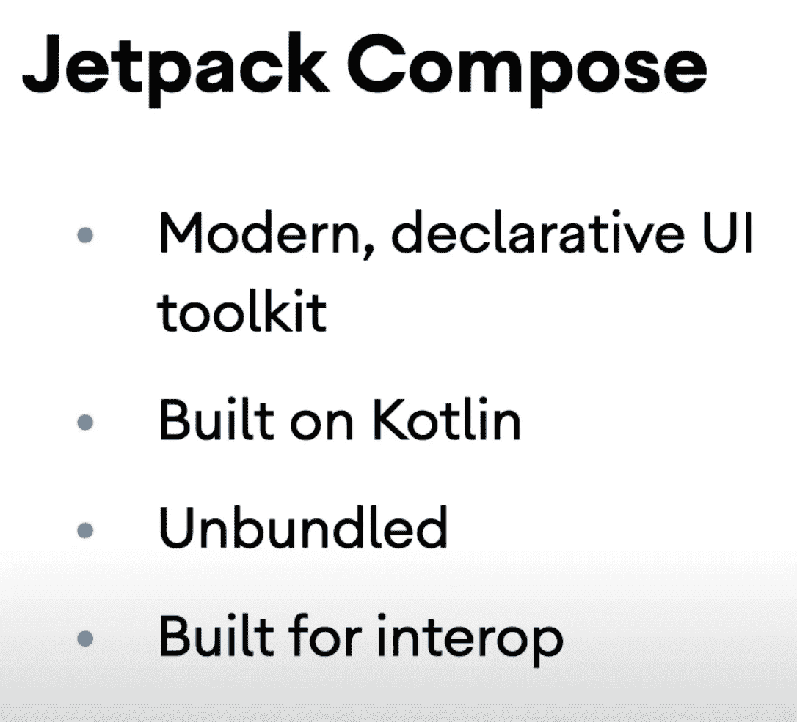
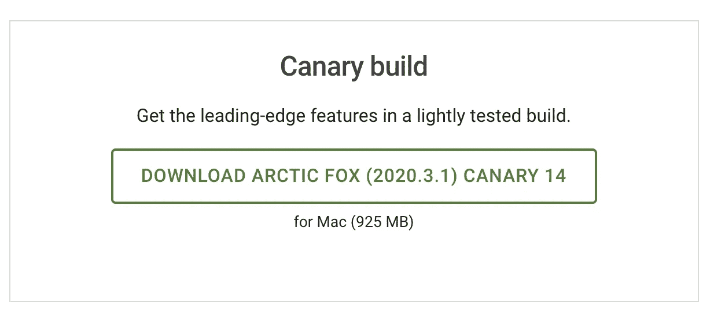
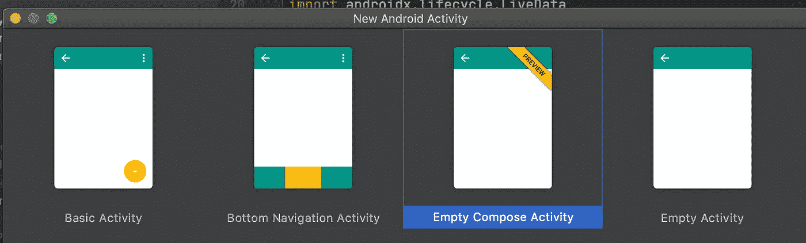
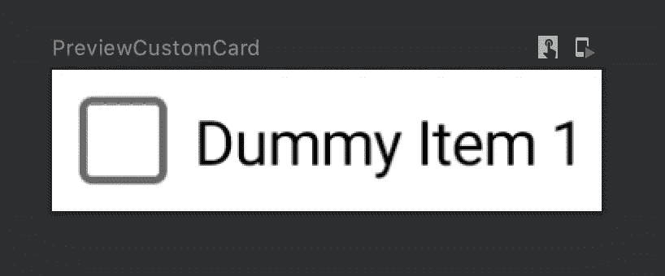
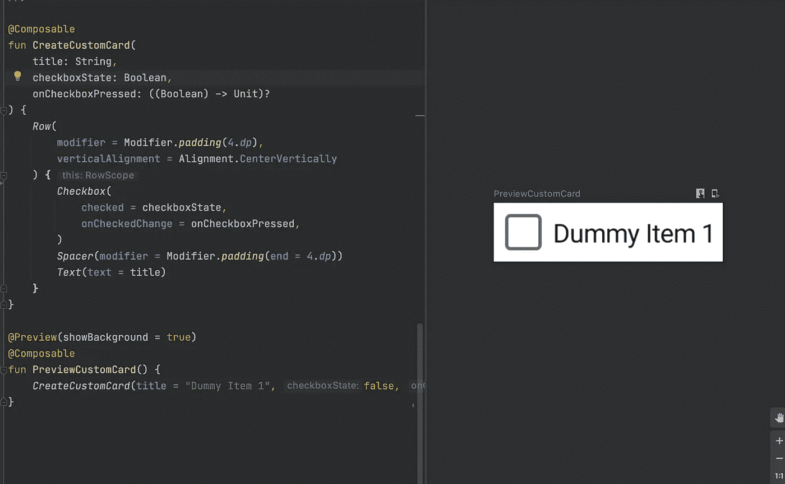
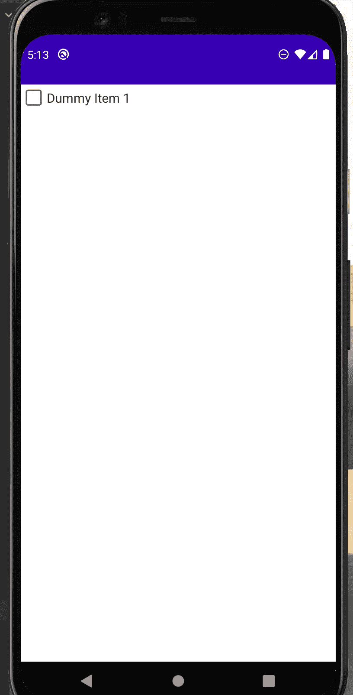

# 在 Jetpack 撰写中使用状态

> 原文：<https://levelup.gitconnected.com/using-state-in-jetpack-compose-b7445b697736>

介绍 Jetpack 编写和使用状态

*文章在此:*[*https://flattered with flutter . com/using-state-in-jetpack-compose/*](https://flatteredwithflutter.com/using-state-in-jetpack-compose/)

在 Jetpack 撰写中使用状态

# 介绍

***等级:初级***

我们将简要介绍

1.  Jetpack 撰写
2.  创建自定义卡片字段
3.  自定义卡中的使用状态

> 注意:Jetpack Compose 或 Compose 是相同的。


在 Jetpack 撰写中使用状态

# Jetpack 撰写

[什么是 Jetpack Compose？](https://developer.android.com/jetpack/compose)

根据文档，

> Jetpack Compose 是 Android 用于构建原生 UI 的现代工具包。它简化并加速了 Android 上的 UI 开发。



Jetpack 撰写

*   Compose 使构建 Android UIs 变得更快更容易
*   不需要编辑 XML 布局
*   相反，对所需的元素使用合成功能，并在预览中查看它们的变化。

## 设置

*   截至今天，当我写这篇文章时，Compose 仍处于测试阶段
*   你需要下载 [Android Studio 4.2 Canary](https://developer.android.com/studio/preview)



Android Studio 版本包含 Jetpack Compose

*   下载后，创建一个**新项目。**现在你会看到一个新的选项**空编写活动- >** 然后**完成(按照默认设置创建)**



空撰写活动

*   注意，这里没有`*activity_main.xml*` 布局。
*   您的**主活动扩展了一个组件活动**，而不是 AppCompatActivity。
*   打开你的模块 gradle 文件，注意

```
buildFeatures {
    compose true
}
```

*   检查依赖项部分中的依赖项

```
implementation "androidx.compose.ui:ui:$compose_version"
implementation "androidx.compose.material:material:$compose_version"
implementation "androidx.compose.ui:ui-tooling:$compose_version"// Can have some extra also
```

*有关 Jetpack 撰写的详细解释，请查看此*

[](https://medium.com/androiddevelopers/understanding-jetpack-compose-part-1-of-2-ca316fe39050) [## 了解 Jetpack 撰写—第 1 部分，共 2 部分

### 使用 Compose 构建更好的 UI

medium.com](https://medium.com/androiddevelopers/understanding-jetpack-compose-part-1-of-2-ca316fe39050) 

# 使用撰写自定义卡片字段



带文本的复选框—自定义卡片

*   在主活动中，您会看到类似这样的内容

```
setContent {
    HandsOnKotlinTheme {
         Surface(color = MaterialTheme.colors.background) {
              // YOUR COMPONENTS
         }
    }
}
```

> 注意:**HandsOnKotlin 主题**是一个变量名，这取决于你的项目的名字，(在我的例子中是 **HandsOnKotlin** )

在 **setContent** 中的任何内容都成为活动的根视图

[表面](https://developer.android.com/reference/kotlin/androidx/compose/material/package-summary#surface):一个受材质设计影响的容器，你在上面设计你的 UI。

*   为了制作定制卡，我们创建了一个[可组合的](https://developer.android.com/reference/kotlin/androidx/compose/runtime/Composable)函数。可组合函数(标有`@ Composable`)是用 Compose 构建的应用程序的构建块

```
@Composable
fun CreateCustomCard(
    title: String,
    checkboxState: Boolean,
    onCheckboxPressed: ((Boolean) -> Unit)?
) {
    Row(
        modifier = Modifier.padding(4.dp),
        verticalAlignment = Alignment.CenterVertically
    ) {
    Checkbox(
        checked = checkboxState,
        onCheckedChange = onCheckboxPressed,
    )
    Spacer(modifier = Modifier.padding(end = 4.dp))
    Text(text = title)
  }
}
```

修改器:允许你装饰一个可组合的东西

**行、复选框、分隔符、文本:**预定义的可组合函数

*   你可以通过编写另一个函数并用`@ Preview`和`@ Composable`标记来预览一个可组合的

```
@Preview(showBackground = true)
@Composable
fun PreviewCustomCard() {
    CreateCustomCard(title = "Dummy Item 1", false, null)
}
```



可组合预览

*   现在，将您的 CreateCustomCard 放入表面并运行您的应用程序

```
Surface(color = MaterialTheme.colors.background) {
    CreateCustomCard(title = "Dummy Item 1", false, {})      
}
```



运行应用程序时的输出

# 自定义卡中的使用状态

我们的复选框有一个状态，它可以是**选中(真)**或**未选中(假)。**

我们将研究 4 种保存状态的方法。

## 方法 1(记住)

在我们的 createCustomCard 中，让我们像这样定义一个变量

```
val checkboxState = remember { mutableStateOf(false) }
```

*   我们将使用 checkboxState 中的值，并将其分配给复选框 composable

```
// The lines with Row remain same, and won't be shown in next snippets
Row(
     modifier = Modifier.padding(4.dp),
     verticalAlignment = Alignment.CenterVertically
) {
     // Approach 1
     val checkboxState = remember { mutableStateOf(false) } Checkbox(
         checked = checkboxState.value,
         onCheckedChange = {checkboxState.value = it},
     )
     Spacer(modifier = Modifier.padding(end = 4.dp))
     Text(text = title)
}
```

*   checkboxState 值的任何变化都将触发重组(组件的重新构建)

缺点:

*   状态不会在配置更改(横向/纵向)中保留
*   我们的可组合组件与业务逻辑相耦合

## 方法 2(可记忆可保存)

在我们的 createCustomCard 中，初始化我们的 checkboxState，如下所示

```
val checkboxState = rememberSaveable() { mutableStateOf(false) }
```

> 其余与方法 1 相同

**rememberSaveable:** 保存配置变更的状态

缺点:

*   我们的可组合组件仍然与业务逻辑相结合

## 方法 3(状态提升)

状态提升是一种编程模式，在这种模式下，您可以将可组合对象的状态转移到该可组合对象的调用方。

从 CreateCustomCard 中提取参数、`checkboxState`和`onCheckboxChange`，并创建一个新的可组合的( **CustomCardState** )

```
//Approach 3: State Hoisting
@Composable
fun CustomCardState() {
   val checkboxState = rememberSaveable { mutableStateOf(false) } CreateCustomCard(
        title = "Dummy Item 1",
        checkboxState.value
   ) { checkboxState.value = it }
}
```

我们的 CreateCustomCard 看起来像

```
fun CreateCustomCard(
    title: String,
    checkboxState: Boolean,
    onCheckboxPressed: ((Boolean) -> Unit)?
) {
    Row(
        modifier = Modifier.padding(4.dp),
        verticalAlignment = Alignment.CenterVertically
    ) {
    Checkbox(
        checked = checkboxState,
        onCheckedChange = onCheckboxPressed,
    )
    Spacer(modifier = Modifier.padding(end = 4.dp))
    Text(text = title)
  }
}
```

*   通过这种方式，我们的可组合组件从逻辑上解耦，因此 createCustomCard 可以被测试和重用。

> 注意:如果有任何错误，请尝试在 app.gradle 中导入(如下)

```
implementation "androidx.compose.runtime:runtime-livedata:$compose_version"implementation "androidx.lifecycle:lifecycle-viewmodel-compose:1.0.0-alpha02"
```

## 方法 4(视图模型)

*   您可以使用`ViewModel`来公开一个可观察容器中的状态(如`LiveData`)，还可以处理影响该状态的事件。
*   我们实现了一个视图模型

```
// Approach 4: ViewModel
class CheckedViewModel : ViewModel() {

private val _isDone : MutableLiveData<Boolean> =  MutableLiveData(false)

    val isDone : LiveData<Boolean> = _isDone fun onCheckboxChange(state:Boolean) {
        _isDone.value = state
    }
}
```

*   **isDone** :保存当前状态的 LiveData。
*   onCheckboxChange :我们定义 UI 可以调用的事件。
*   我们的 **CustomCardState** (在方法 3 中定义)看起来像

```
@Composable
fun CustomCardState(itemViewModel: CheckedViewModel) {
   val state : Boolean by itemViewModel.isDone.observeAsState(false) CreateCustomCard(
        title = "Dummy Item 1",
        state
   ) { itemViewModel.onCheckboxChange(it) }
}
```

*   **observeAsState** :观察 **LiveData (isDone)** 并返回一个状态，每当 **LiveData** 改变时，该状态就会更新(使用 **onCheckboxChange**

> 注意:如果有任何错误，请尝试在 MainActivity 中导入(如下)

```
import androidx.compose.runtime.getValue
```

**从活动中调用**

*   我们创建一个变量 itemViewModel，并在 **onCreate** 中赋值

```
private lateinit var itemViewModel: CheckedViewModeloverride fun onCreate(savedInstanceState: Bundle?) {
     super.onCreate(savedInstanceState)
     itemViewModel = CheckedViewModel()

     setContent {
         // LINES OMITTED
         CustomCardState(itemViewModel)
     }
}
```

## 额外收获:展示祝酒词

*   因为我们使用的是 viewmodel，所以我们可以观察到值`isDone`
*   如果值为真，那么我们显示 toast

```
itemViewModel.isDone.observe(this, { status ->
     if(status) {
         // Show toast
     }
})
```


```
[Source code](https://github.com/AseemWangoo/hands_on_kotlin)
```

感兴趣的文章

[](/testing-in-compose-d09b59337e4e) [## 撰写中的测试

### 撰写中的测试

levelup.gitconnected.com](/testing-in-compose-d09b59337e4e) [](/using-workmanager-in-android-be5cae1f155a) [## 在 Android 中使用工作管理器

### 在 Android 中使用工作管理器

在 Androidlevelup.gitconnected.com 使用工作管理器](/using-workmanager-in-android-be5cae1f155a) [](https://proandroiddev.com/google-signin-compose-a9afa67b7519) [## Google 登录撰写

### Google 登录撰写

谷歌登录 Composeproandroiddev.com](https://proandroiddev.com/google-signin-compose-a9afa67b7519) [](/using-state-in-jetpack-compose-b7445b697736) [## 在 Jetpack 撰写中使用状态

### 介绍 Jetpack 编写和使用状态

levelup.gitconnected.com](/using-state-in-jetpack-compose-b7445b697736)