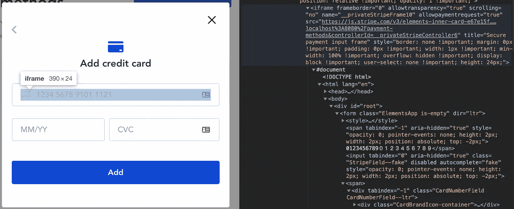
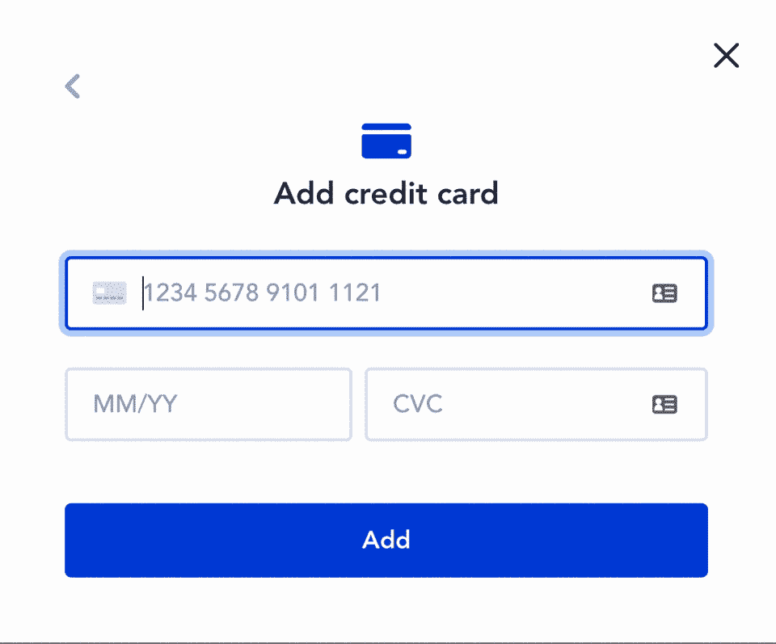

# 通过 Typescript 在 Vue 应用程序中使用条带组件

> 原文：<https://levelup.gitconnected.com/using-stripe-components-in-a-vue-app-with-typescript-146c008ed017>

## 带打字稿的 VUE

## 使用 Stripe 时如何管理 Vue 项目中的支付组件

您可能正在构建一个包含支付步骤的 web 应用程序。可以是电商平台，甚至更大的网站。选择 Stripe 是因为它的简单性和大量特性。

您的项目在 VueJS 中，您被要求集成支付组件，如 **IBAN** 、**卡号**、**卡到期日、**和**卡 CVC** 。Stripe 通过其库提供此类组件。

> 您可以选择在项目中使用 Typescript。但这不是强制性的。


卡组件

为了使用条纹组件，必须遵循几个步骤，以便它们以您想要的方式呈现。

# 1/3 —加载条带脚本

第一步是加载条带脚本。您可以下载它并将这个脚本包含在您的源代码中，但是您可能无法获得它的最新版本。此外，它使用 Stripe CDN 简化了您的代码库。

为了**动态加载脚本**，我们将使用 [vue-plugin-load-script](https://www.npmjs.com/package/vue-plugin-load-script) 库。

## 添加和配置 loadScript

遵循 doc 提供的说明:

`**Importing the library from NPM**`

```
npm install --save-dev vue-plugin-load-script
# OR
yarn add --dev vue-plugin-load-script
```

`**Adding the script to the main Vue instance**`

将这些行添加到您的 *main.ts* 文件中(如果您不使用 Typescript，则添加到 *main.js* 文件中)。

```
import LoadScript from 'vue-plugin-load-script'Vue.use(LoadScript)
```

> **如果使用 Typescript，**会得到一个关于导入的错误:
> `Could not find a declaration file for module ‘vue-plugin-load-script’`。
> 
> 事实上，这个图书馆不提供打字。不管怎样，让我们来解决它:
> 
> 在项目根目录下名为****@ types****的文件夹中添加一个*vue-plugin-load-script . d . ts*文件。其内容:
> `declare module ‘vue-plugin-load-script’;`
> 问题解决了！**
> 
> ***注意:*可能需要重新启动 IDE。**

**`**Creating a function to import the Stripe script**`**

**这样导入逻辑只需编写一次，我们就可以创建一个函数:**

**最好通过检查`!(window as any).Stripe`来检查脚本是否已经导入。**

## **类型脚本支持**

**使用`Vue.loadScript`将引发一个 Typescript 语法错误。事实上，Vue 对象并不知道这样的方法。我们需要做一个**模块扩充** ( [doc](https://www.typescriptlang.org/docs/handbook/declaration-merging.html#module-augmentation) )。尽管有这个名字，这一步非常简单:我们需要将这个新文件添加到 typings 文件夹中:**

**我们现在应该可以走了！**

## **预加载**

**我们应该把进口声明放在哪里？最佳地点在哪里？我们没有在所有的应用程序中使用支付组件(我假设)，所以**我们应该在最后一次**渲染包含 Stripe 元素的组件时加载脚本。**

**Vue 提供了很多**生命周期挂钩**，其中有一个非常有趣且方便我们使用的:[**beforeRouteEnter**](https://router.vuejs.org/guide/advanced/navigation-guards.html#in-component-guards)。**

> **当然，我可以在 router 文件中定义这个保护，但是就我个人而言，我更喜欢这个代码，尽可能接近它的用法。**

**现在，一旦我们需要，我们就动态加载 Stripe 脚本。到目前为止，我们没有操纵 Stripe 库来呈现支付组件。现在是我们阅读 Stripe 文档并创建我们需要的模型的时候了。**

# **2/3 —从条带文档创建数据模型**

**条带文档非常密集，可以提供大量信息。我让你在这里深入研究一下:**

 **[## Stripe: JavaScript SDK 文档和参考

### Stripe JavaScript SDK 的完整参考文档。

stripe.com](https://stripe.com/docs/js)** 

**你需要数据模拟来测试你的组件。好在 Stripe 这里提供了很多测试数据(卡号) :**

**[](https://stripe.com/docs/testing#cards) [## 测试|条纹支付|卡号

### 在上线之前，了解测试您的集成的不同方法。雇用一名 Stripe 认证专家或使用…

stripe.com](https://stripe.com/docs/testing#cards) 

还有这里(IBAN):

[](https://stripe.com/docs/testing#sepa-direct-debit) [## 测试|条纹支付| IBAN

### 在上线之前，了解测试您的集成的不同方法。雇用一名 Stripe 认证专家或使用…

stripe.com](https://stripe.com/docs/testing#sepa-direct-debit) 

## 条纹元素

本文档部分非常有助于我们理解如何创建条带元素:

 [## Stripe: JavaScript SDK 文档和参考|元素. create

### Stripe JavaScript SDK 的完整参考文档。

stripe.com](https://stripe.com/docs/js/elements_object/create_element?type=cardNumber) 

然后，我们可以定义这些模型:

## 样式条纹组件

定制条带组件是一项相对艰巨的任务。事实上，条带组件封装在一个`iframe`中，如您所见:



条带组件在 iframe 中

因此，必须为两个 DOM 部分定义一个样式:

*   元素容器
*   iframe 中的输入

`**Styling the element container**`

在创建 Stripe 元素时，我们可以提供一组 CSS 类，它们将根据 Stripe 元素的状态( [*类*对象文档](https://stripe.com/docs/js/elements_object/create_element?type=card#elements_create-options-classes))应用于 DOM 容器元素

`**Styling the input in the iframe**`

为了定制条纹输入的外观，库提供了一些特定的 CSS 属性。你可以在这里找到它们:

 [## Stripe: JavaScript SDK 文档和参考|样式对象

### Stripe JavaScript SDK 的完整参考文档。

stripe.com](https://stripe.com/docs/js/appendix/style) 

简而言之，我们可以在一个对象中定义两种样式:

# 3/3 —创建条带组件

现在，创建 Stripe 组件并对其进行操作的一切都已准备就绪:样式、配置选项。剩下要做的就是用正确的参数调用正确的方法。然而，文档对这个主题有点模糊:

[](https://stripe.com/docs/libraries#client-side--ui-libraries) [## API 库|条带

### 互联网业务的在线支付处理。Stripe 是一套支付 API，用于支持以下领域的商务活动…

stripe.com](https://stripe.com/docs/libraries#client-side--ui-libraries) 

我创建了一个可重用的函数来创建条纹元素:

该函数返回两个对象:

1.  用于进一步操作(支付方法注册、令牌创建等)的条带实例
2.  创建的元素容易处理(例如:破坏它)

您可以按如下方式使用此方法:

所有这些代码的图解示例如何？



# 最后的话

最后，在 Vue 应用中集成 Stripe 并不困难。要使它与 Typescript 一起工作，需要做一些调整。正如你在上面的 GIF 中看到的，脚本返回了一个错误状态，这大大简化了开发。**