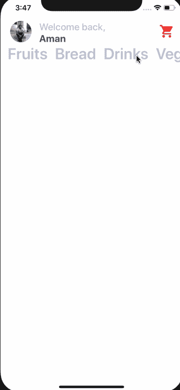
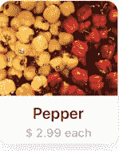

# 将样式化组件与 React Native 一起使用

> 原文：<https://levelup.gitconnected.com/using-styled-components-with-react-native-de645fcf4787>

## 通过构建两列布局 UI，了解如何在 React 本机应用程序中使用样式化组件。


# Tldr

*   介绍
*   关于样式组件
*   安装样式组件
*   使用样式组件
*   `props`在样式化组件中
*   构建应用程序—“杂货 UI”
*   添加用户头像图像
*   React Native 中的绝对定位
*   在 React Native 中添加图标
*   添加水平`ScrollView`
*   添加竖线`ScrollView`
*   构建卡组件
*   结论

# 介绍

无论您是 web 开发人员还是移动应用程序开发人员，您都知道如果没有合适的应用程序样式，UI 可能会很糟糕。应用程序的样式很重要。对于一个手机应用程序来说，拥有令人愉悦的设计和良好的色彩运用是多么重要，这一点我怎么强调都不为过。

如果你正在接触 React Native 或者已经尝试过，你应该知道可以用不同的方式来设计 React Native 应用程序。在下面的文章中，我已经讨论了一些基础知识和一些不同的方法来设计您的 React 本地组件。比如，创建一个新的样式对象你使用`**StyleSheet.create()**`方法并封装它们。去看看👇

[](/styling-the-react-native-way-3cc6d3ef52d0) [## 以本机方式设计 React

### React Native 附带了许多内置组件，您可以使用它们来设计跨平台应用程序的样式。造型 a…

levelup.gitconnected.com](/styling-the-react-native-way-3cc6d3ef52d0) 

本教程是关于使用 [**来设计你的 React 原生应用💅样式组件**](https://www.styled-components.com/docs/basics) 。是的，styled-components 是第三方库。使用它是一个选择的问题，但也是向应用程序添加样式的另一种方式，许多人可能会发现它很容易使用，特别是如果你以前在其他框架中使用过这个库。一个常见的用例是用 React 构建的 web 应用程序。

# 什么是样式组件？

Styled Components 是一个 *CSS-in-JS* 库，它使开发人员能够用自己的风格编写每个组件，并允许代码位于一个位置。通过将您的样式与组件相结合，可以优化开发人员的体验和输出。

在 React Native 中，组件的样式已经通过创建 JavaScript 对象完成了，如果你不 [**封装它们**](/styling-the-react-native-way-3cc6d3ef52d0) ，在大多数情况下，你的组件和它们的样式将会在一个地方结束。

React Native 在设计应用程序样式时往往会遵循某种惯例。比如所有 CSS 属性名都应该在`camelCase`里比如对于`background-color`在 React Native 里是:

```
backgroundColor: 'blue'
```

有时候，web 开发人员会对这些约定感到不舒服。使用像样式组件这样的第三方库可以让你插上翅膀。除了属性和 React Native 自己的 Flexbox 规则之外，您不必在约定的上下文之间切换太多。

在幕后，样式化组件只是将 CSS 文本转换成 React 本机样式表对象。你可以在这里查看[](https://github.com/styled-components/css-to-react-native)****。****

**故事讲够了，我们开始工作吧！**

# **安装样式组件**

**要在 React 原生项目中安装`styled-components`库，我们将首先初始化应用程序。为了快速入门，我打算用牛逼的 **Expo** 库。确保您已经安装了`expo-cli`。**

**当运行最后一个命令时，命令行提示会问你几个问题。第一个是`Choose a template`，我选择了`expo-template-blank`，然后输入你的应用程序的显示名称，然后使用`npm`或`yarn`来安装依赖项。我在用`npm`。**

**一旦安装了所有的依赖项，您就可以在您喜欢的代码编辑器中打开这个项目。下一步是安装最新版本的`styled-components`库。**

**安装到此为止。**

# **使用样式组件**

**打开`App.js`文件并做一些修改。**

**从您的终端运行命令:`npm run ios`如果您在 macOS 上。对于 Linux 和 Windows 用户，命令是`npm run android`，但是要确保你有一个 Android 虚拟设备在后台运行。我们的代码目前看起来如下。**

****

**让我们对它进行一些修改，并使用我们新安装的库。首先，像下面这样导入库。**

**对组件的渲染函数进行如下修改。用`Container`和`Title`替换`View`和`Text`。这些新元素将使用来自`styled-components`的语义进行定制。**

**`styled-components`利用带标签的模板文字，通过反斜线来设计组件的样式。当使用`styled-components`在 React 或 React Native 中创建一个组件时，每个组件都将被附加上样式。**

**请注意，该容器是一个 React Native `View`并且附加了样式。**

****

**修改后的`App.js`文件的完整代码。**

**在上面的代码片段中，请注意我们没有导入 React 本地核心组件，如`View`、`Text`或`StyleSheet`对象。就这么简单。它使用与原生布局相同的`flexbox`模型。这样做的好处是，您可以使用在 web 开发和标准 CSS 中一直使用的可理解的语法。**

# **在样式组件中使用道具**

**您经常会发现自己在为应用程序创建定制组件。这确实给了你保持干燥的优势。使用`styled-components`也没什么不同。您可以通过构建需要其父组件的自定义组件来利用这种编程模式。`props`通常被称为特定成分的附加属性。为了演示这一点，创建一个名为`CustomButton.js`的新文件。**

**在这个文件中，我们将创建一个定制按钮，它需要诸如`backgroundColor`、`textColor`这样的道具和按钮的文本本身。您将使用`TouchableOpacity`和`Text`来创建这个自定义按钮，但不使用功能组件`CustomButton`导入`react-native`库。**

**通过将插值函数`${props => props...}`传递给样式化组件的模板文字，可以扩展其样式。现在将该按钮添加到`App.js`文件中。**

**在运行模拟器时，您将获得以下结果。**

****

# **构建应用程序——杂货用户界面**

**在本节中，我们将为一个用于杂货店的应用程序构建一个 UI 屏幕。您将构建如下图所示的主屏幕。**

****

**我们将使用我们的`styled-components`知识，所以让我们开始吧！打开`App.js`。使用`styled`声明一个新的`Container`T20。在反斜线内，您可以用完全相同的语法放置纯 CSS 代码。一般来说，`View`元素就像 HTML 或 web 编程中的`div`。另外，在`Container`中创建另一个名为`Titlebar`的视图。**

**在`Titlebar`里面，会包含三个新元素。一个是图像`Avatar`，另外两个是文本:`Title`和`Name`。**

**运行`npm run ios`并查看它的运行情况。**

****

**现在，内容就在屏幕中间。我们需要在手机屏幕的顶部显示`Titlebar`及其内容。因此`Container`的样式如下。**

# **添加用户头像图像**

**我将使用存储在项目根目录下的`assets`文件夹中的图像。您可以自由使用自己的图像，但也可以从下面下载该项目的资源。**

**[](https://github.com/amandeepmittal/react-native-workspace/tree/master/03-RNgrocery-ui/assets) [## amandeepmittal/react-native-工作区

### ⚛️ + 📱对本土事物做出反应。通过在…上创建帐户，为 amandeepmittal/react-native-workspace 开发做出贡献

github.com](https://github.com/amandeepmittal/react-native-workspace/tree/master/03-RNgrocery-ui/assets) 

要使用`styled-components`创建图像，您需要`Image`组件。您可以使用`source`道具根据图像的位置来引用图像。

`Avatar`的样式将以`44`像素的宽度和高度开始。有一个`border-radius`正好是宽度和高度值的一半，这使得图像是一个圆。`border-radius`是您将经常用来创建圆角的属性。

你会得到下面的结果。


现在请注意，头像图像和文本堆积在一起。它们在屏幕上占据相同的空间。为了避免这种情况，您将使用`position: absolute` CSS 属性。

# React Native 中的绝对定位

CSS 属性如`padding`和`margin`用于增加 UI 元素之间的空间。这是默认的布局位置。但是，在您当前所处的场景中，使用 UI 元素的绝对定位并将所需的 UI 元素放在您想要的确切位置是非常有益的。

一般来说，在 React Native 和 CSS 中，如果`position`属性设置为`absolute`，那么元素相对于其父元素进行布局。CSS 对`position`有其他值，但是 React Native 只支持`absolute`。

修改`Avatar`样式如下。

通常，对于绝对位置属性，您将使用以下属性的组合:

*   顶端
*   左边的
*   正确
*   底部

在上面的例子中，我们使用的`top`和`left`都设置为`0`像素。您将获得以下输出。


# 在 React Native 中添加图标

Expo 样板文件带有一套不同的图标库，如 Ionicons、FontAwesome、Glyphicons、Material icons 等等。完整的图标列表你可以在这里找到[](https://expo.github.io/vector-icons/)**，一个可搜索的网站。**

**要使用这个库，您所要做的就是编写 import 语句。**

**在`Titlebar`视图中，添加图标。**

**每个图标需要道具的名称，你可以选择，大小和颜色。现在，如果你看看模拟器，你会注意到我们在添加头像时遇到的同样的问题。标题栏内的图标和其他 UI 元素之间没有空格。**

****

**为了解决这个问题，让我们使用绝对定位属性作为`<Ionicons />`的内嵌样式**

**为什么是内嵌风格？因为`Ionicons`不是使用样式化组件生成的。**

****

# **通过列表映射**

**在`components/`文件夹中创建一个名为`Categories.js`的新文件。这个文件将为杂货 UI 应用程序呈现一个类别项目列表。**

**所有的数据现在都是静态的。在`App.js`中导入该组件，并将其放在`Titlebar`之后。**

**您将获得以下输出。**

****

**可以有许多类别。为了使类别名称动态化，我们可以通过`App.js`文件发送它。**

**在上面的代码片段中，您使用 JavaScript 中的`map`函数来遍历一个数组，以此类别名称呈现一个项目列表。需要添加一个`key`道具。为了实现这一点，还要修改`Categories.js`。**

# **添加水平滚动视图**

**该列表现在不可滚动。为了使它可滚动，让我们将它放在一个`ScrollView`中。打开`App.js`文件，将类别放入`ScrollView`中，但是首先，从 React Native core 导入它。**

**您将注意到 UI 中没有任何变化。默认情况下，React Native 中使用`ScrollView`的可滚动列表是垂直的。通过添加道具`horizontal`使其水平。**

**它可以工作，但看起来不太好。**

****

**让我们给`ScrollView`添加一些内联样式。**

**现在看起来好多了。道具`showsHorizontalScrollIndicator`隐藏了默认情况下出现在类别名称下面的水平滚动条。**

****

# **添加垂直滚动视图**

**下一步是在`Container`视图中添加一个充当包装器的`ScrollView`，这样整个区域就可以垂直滚动了。这样做是有原因的。现在，您将把项目分成两列，作为带有与特定类别相关的文本的图像。**

**修改`App.js`文件。**

**请注意，我们添加了另一个名为`Subtitle`的样式组件，它只是一个文本。**

**它呈现如下。**

****

# **构建卡组件**

**在本节中，我们将创建一个 card 组件，它以文本的形式保存商品的图像、商品的名称和价格。每个卡片组件都有弯曲的边框和方框阴影。这就是它看起来的样子。**

****

**在`components`目录下创建一个名为`Card.js`的新组件文件。组件的结构将会是。**

**目前，它有静态数据，如图像、标题和内容。让我们在这个文件中为每个样式化的 UI 元素添加样式。**

**`Container`视图的默认背景为白色。这在从第三方 API 获取图像的情况下非常有用。此外，它还为图像下方的文本区域提供了背景。**

**在`Container`视图中，添加一个`Image`并将其包装在`Cover`视图中。在 React Native 中，有两种方法可以获取图像**

**如果您从静态资源中获取一个图像，就像我们的例子一样，您使用带有关键字`require`的`source` prop，该关键字包含存储在项目文件夹中的图像资产的相对路径。在联网图像或从 API 获取图像的情况下，您使用相同的道具和不同的关键字`uri`。这是一个从 API 获取图像的例子。**

**`Cover`视图使用带有`overflow`属性的圆角。这样做是为了反映圆角。如果图像来自子组件，iOS 会对其进行剪辑。在我们的例子中，图像来自于`Card`组件，它是`App`组件的子组件。**

**`Image`组件获取整个`Cover`视图的宽度和高度。**

**现在让我们将这个组件导入到`App.js`文件中，在`Subtitle`之后，让我们看看会得到什么结果。**

**在`Subtitle`之后添加一个新的视图叫做`ItemsLayout`。这将是一种布局，允许不同的卡被划分在每行的两列之间。这可以通过给这个视图一个值为`row`的`flex-direction`属性来实现。`ColumnOne`和`ColumnTwo`是两个空视图。**

**在渲染模拟器的屏幕上，看起来像下面这样。**

****

# **结论**

**你以前用过 React Native 的样式化组件吗？如果没有，你会在下一个项目中尝试吗？如果你觉得在 React 本地应用中使用`styled-components`不舒服，请在下面评论。你也可以扩展这个应用程序！让你的想象力漫游。如果您决定提交采购申请，我们欢迎您提交。**

**您可以在 Github repo 中找到本文的完整代码👇**

**[](https://github.com/amandeepmittal/react-native-workspace/tree/master/03-RNgrocery-ui) [## amandeepmittal/react-native-工作区

### ⚛️ + 📱对本土事物做出反应。通过在…上创建帐户，为 amandeepmittal/react-native-workspace 开发做出贡献

github.com](https://github.com/amandeepmittal/react-native-workspace/tree/master/03-RNgrocery-ui) 

> 如果你喜欢这篇文章，请随意点击那个按钮👏帮助其他人找到它。

**我在**[**Twitter**](https://twitter.com/amanhimself)**上有空，所以如果你需要的话，请随时给我发 DM。我也给那些有兴趣了解更多 web 技术和 React Native 的开发者发送一份** [**每周简讯**](https://upscri.be/e51a31/) **👇**** **[](https://gitconnected.com/learn/react-native) [## 学习 React Native -最佳 React Native 教程(2019) | gitconnected

### 十大 React Native 教程-免费学习 React Native。课程由开发者提交并投票…

gitconnected.com](https://gitconnected.com/learn/react-native)****