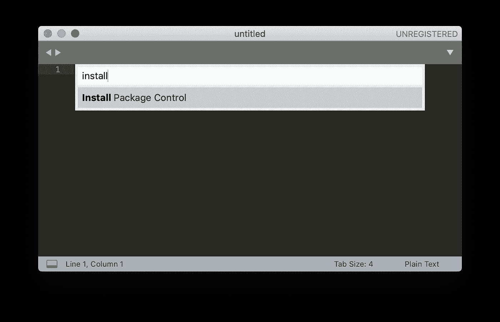
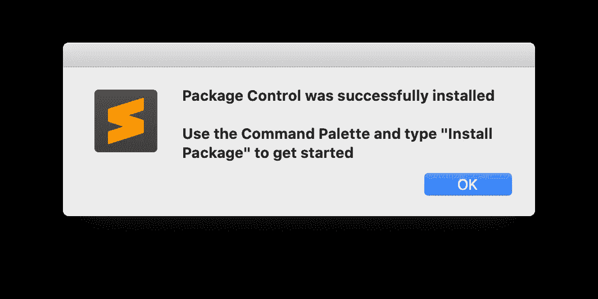
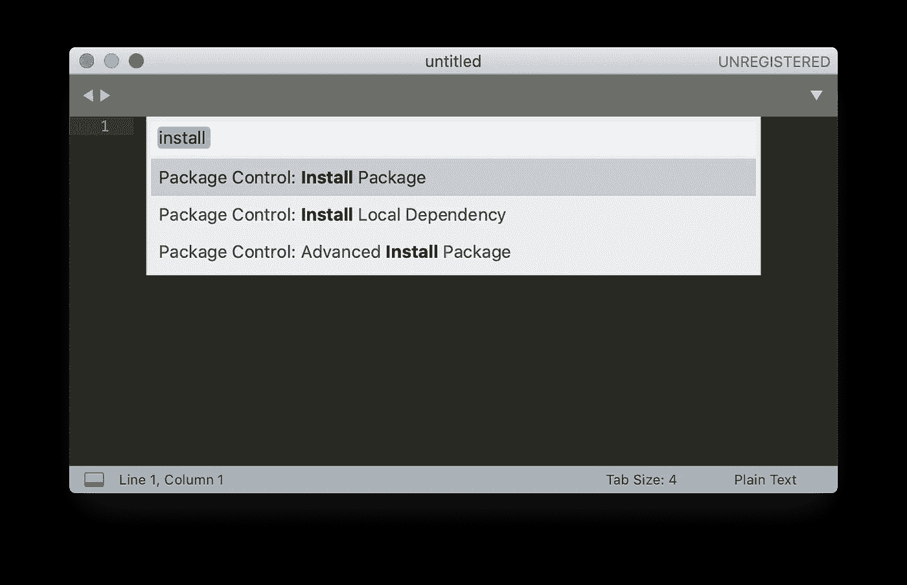
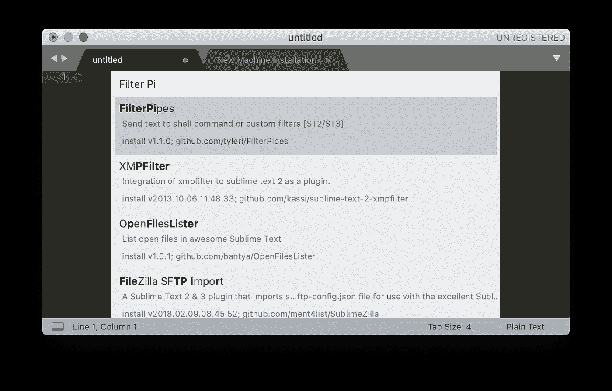
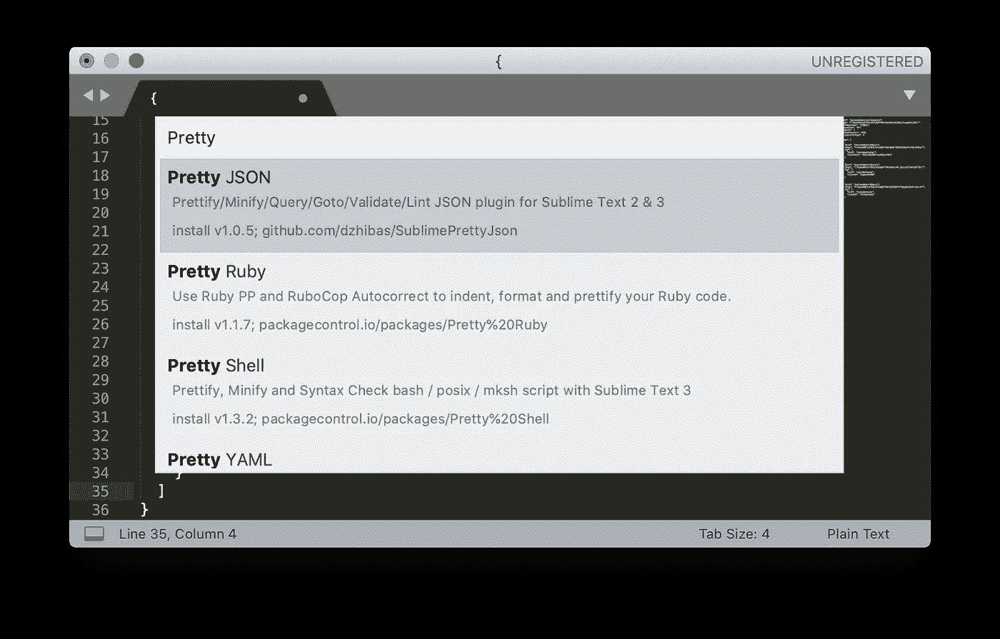
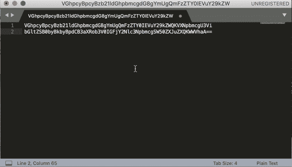
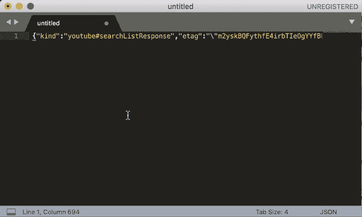
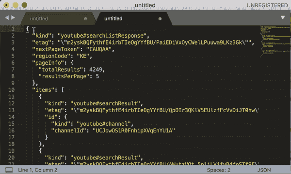

# 使用 Sublime 进行 Base64 解码和 JSON 格式化

> 原文：<https://levelup.gitconnected.com/using-sublime-for-base64-decode-and-json-formatting-3d6a6602d01b>

## 文本处理

## 无需使用任何互联网网站即可轻松管理有效负载数据

图片由 [Wild0ne](https://pixabay.com/users/Wild0ne-920941/) 在 [Pixabay](https://pixabay.com/photos/typewriter-vintage-write-letters-1170657/) 上拍摄

M 任何时候，我们在调试中看到的有效负载(例如，使用 Charles 代理)，都有 base64 编码的 JSON 文本。

为了清楚地查看数据，首先，我们需要解码它，然后正确格式化 JSON。一种方法是使用一些网站来帮助，例如

 [## Base64 解码和编码—在线

### 使用高级格式选项从 Base64 解码或编码到 Base64。进入我们的网站，获得一个易于使用的在线工具。

www.base64decode.org](https://www.base64decode.org/)  [## JSON 格式化程序和验证程序

### JSON Formatter & Validator 用高级格式化和验证算法美化和调试 JSON 数据。

jsonformatter.curiousconcept.com](https://jsonformatter.curiousconcept.com/) 

不得不访问互联网这样做是不好的，因为

*   因为我们必须去网站，从一个网站复制粘贴到另一个网站，并按下按钮处理文本，所以速度较慢。
*   向万维网提供由网站收集的有效载荷数据的风险。

## 崇高来拯救

刚刚了解到我们可以使用 [Sublime](https://www.sublimetext.com/) 通过一些快捷键来完成所有这些！🤩

# 一次性设置

只需要安装包控制。你可以按 Shift+Command+P，然后输入`Install Pacakge Control`

一旦你点击进入，它将需要几秒钟来安装，下面将显示。

现在我们可以使用包控制来安装相关的包来帮助完成任务。再次使用 Shift+Command+P 并键入`Install Package`

然后按回车键，你会看到下面的仓库加载标志…

## 安装过滤管

当这些包被加载后，输入`FilterPipes`，下载它。这将有 Base64 编码和解码。(也可以选择`Base Encoder`)

## 安装漂亮的 JSON

类似地，在加载包存储库之后，您可以键入将用于 JSON 格式化的`Pretty JSON`

# Base 64 解码/编码

当你有一段想要进行 base64 编码/解码的文本时，只需键入 Shift+Command+P，然后键入`Base64`，选择编码或解码，然后万岁！皈依！

# JSON 格式

当您有一个需要格式化和处理的 JSON 字符串时，您现在可以

*   Control+Command+J =正确格式化 JSON 文本

*   Command+K+2 =向下折叠第二层的所有 JSON 文本(确保按键光标位于文本的顶部)
*   Command+K+J =全面展开各级 JSON。

Sublime 是一个非常强大的文本编辑器。如果你发现了什么，请随时分享更多的发现。