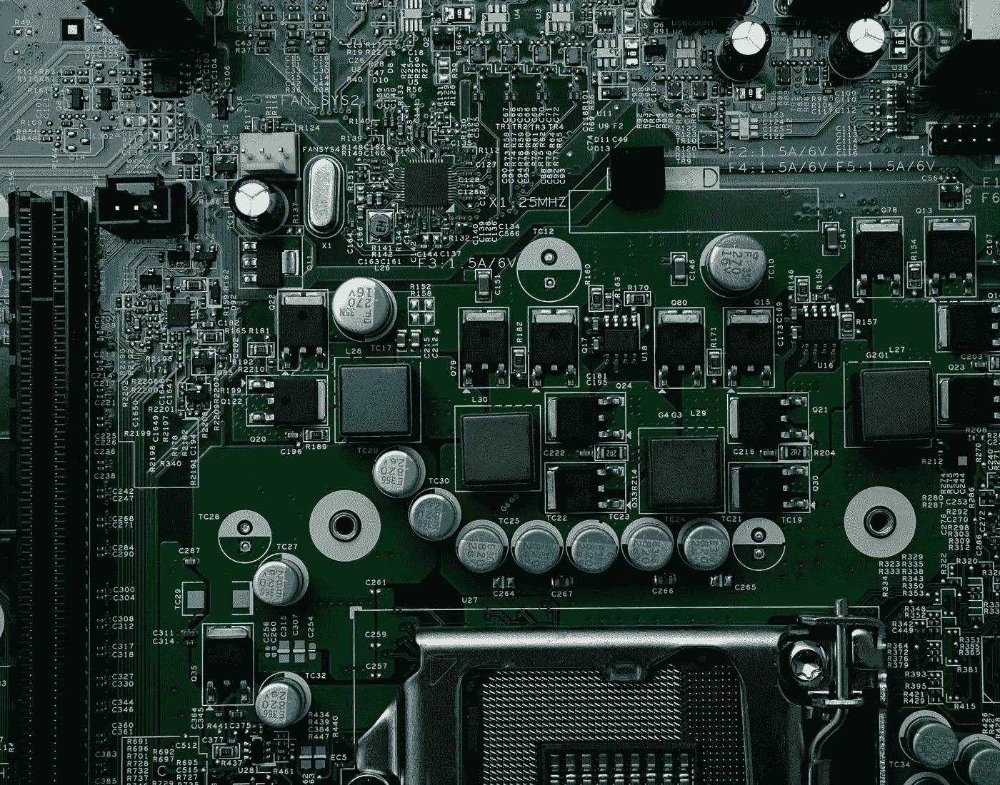

# 使用 sudo 不好，但你能做些什么呢？

> 原文：<https://levelup.gitconnected.com/using-sudo-is-bad-but-what-can-you-do-about-it-a5bce9080e6c>

利用 Linux 强大功能的开发人员指南



照片由 [Michael Dziedzic](https://unsplash.com/@lazycreekimages?utm_source=unsplash&utm_medium=referral&utm_content=creditCopyText) 在 [Unsplash](https://unsplash.com/s/photos/linux?utm_source=unsplash&utm_medium=referral&utm_content=creditCopyText) 拍摄

每当我们需要安装一些新程序或访问 Linux 系统时，每个教程都说你不应该使用`sudo`来运行任何命令。

避免 sudo 被认为是一个好习惯。但这是为什么呢？

今天我们将学习使用 sudo 有什么不好，以及如何通过创建新用户来避免使用 sudo。我们今天最常用的命令是`adduser`。

# 须藤是做什么的？

当您在 Linux 机器上运行以 sudo 为前缀的任何命令时，它会授予您对系统的特权。这样你就可以运行任何东西。系统信任你。

只要你知道自己在做什么就好。但大多数时候情况并非如此，因为我们是人，人都会犯错。

# 为什么过度使用数独不好

*   你甚至可以在不知道的情况下弄乱你系统的敏感部分。比如你可以用 sudo 删除整个`/`文件夹，
*   默认情况下，`sudo`缓存密码 15 分钟。因此，如果您忘记注销或关闭会话，其他人可能会对您的系统进行危险的更改。
*   如果你在使用 sudo 命令时做了一个`typo`，这可能会破坏你的机器的敏感设置，并且很难处理。
*   过度使用`sudo`意味着你违反了最小特权**原则**，所以尽量避免。

# 好吧好吧...告诉我该做什么

我们可以将 sudo 视为成为管理员用户的途径。相反，我们可以创建多个具有特定权限的其他用户，以便他们只能访问执行特定任务所需的资源。

例如

*   创建一个用户来管理 Tomcat 服务器
*   创建另一个用户来管理 Nginx 服务器
*   创建另一个用户，并允许只做开发工作。

对于多个用户有如此多的用例。我们稍后将了解它们。

首先，让我们看看如何在基于 Linux 的系统中创建新用户。

## 创建新用户

允许我们创建新用户的命令是

```
sudo useradd username
```

`username`可以是您选择的任何名称。例如，以下命令将创建一个名为`faisal`的新用户。

```
sudo useradd faisal
```

## 为用户设置密码

现在，为了给这个用户设置密码，我们可以做的是

```
sudo passwd faisal
```

它会提示我们输入想要为这个特定用户设置的密码。

## 用新用户登录

创建新用户后，我们可以使用以下命令登录到该用户

```
su faisal
```

这个命令将提示我们输入之前设置的密码，瞧！我们现在在那个用户里面。

让我们再多谈谈`useradd`命令…..

# 好的，我已经创建了一个新用户。现在怎么办？

如果我们想知道可以对新创建的用户做些什么，我们必须对这个`useradd`命令有更多的了解…

## 这个`useradd`命令是做什么的？

当我们运行`useradd`命令时，它做 3 件事

1.  **保存用户信息**

`etc/passwd`、`etc/shadow`、`etc/group`、`etc/gshadow`

*   前两个文件用于保存用户`authentication`信息
*   后两个文件用于保存用户`group`信息

2.**为新用户设置主目录**

3.**设置新创建用户的权限**

让我们谈一谈这些东西，以及我们可以根据自己的需要定制哪些东西。

## 设置用户 ID

我们可以用下面的命令为新创建的用户设置一个`user id`

```
sudo useradd -u 1234 faisal
```

这将创建一个 id 为 1234 的新用户。

## 设置用户组

我们可以将用户分配到特定的组来跟踪和管理他们。默认情况下，该命令使用相同的用户名和相同的`userid`创建一个组。

我们可以使用以下命令设置用户`groupid`

```
sudo useradd -g group_name
```

> 记住一件事。该组必须在此命令之前存在，才能正常工作

所以如果我们想创建一个新用户

*   命名为`faisal`
*   属于开发人员组
*   有一个特定的用户标识= 999

```
sudo useradd -u 999 -g developers faisal
```

根据设计，任何用户都可以属于一个主要组和多个次要组。我们可以通过`-G`标志来做到这一点。

以下命令将创建一个属于`developers`组并且也包含在`juniors`组中的用户

```
sudo useradd -u 999 -g developers -G juniors faisal
```

## 设置默认主目录

大多数 Linux 发行版在创建新用户时不会自动创建新的主目录。

如果我们想在`/home/username`下默认创建一个新用户的主目录，我们可以传递`-m`标志。

```
sudo useradd -m faisal
```

该命令将在`home`目录中为新创建的用户创建一个新文件夹。

## 设置选择的主目录

但是如果我们想在另一个位置为这个用户创建一个主目录呢？

为此，我们必须传递- `d`标志。如果我们想在`/opt/username`下为用户创建一个新的主目录，我们可以做的是

```
sudo useradd -m -d /opt/faisal faisal
```

## 创建系统用户

我们可以创建一个带有`-r`标志的系统用户。这种类型的用户与普通用户没有太大的区别，但大多数情况下，我们创建系统用户来安装一些程序。

创建一个名为`tomcat`的新系统用户

```
sudo useradd -r tomcat 
```

这些系统用户没有任何截止日期，他们的用户 id 是自动选择的，这不同于普通用户。

## 设置外壳

Shell 是一个接受并解释用户命令的程序。默认情况下，一些发行版将`/bin/bash`作为默认 shell，其他发行版将`/bin/sh`作为默认 shell。

但是，如果您想为新创建的用户设置默认 shell，您可以使用`-s`标志。

要创建一个使用`/usr/bin/zsh`作为登录 shell 的用户，您可以编写以下命令

```
sudo useradd -s /usr/bin/zsh faisal
```

## 添加评论

如果您想对该用户发表评论，您可以使用`-c`命令。

```
sudo useradd -c "Mohammad Faisal" faisal
```

然后将创建一个新用户，并带有与之相关联的注释。

## 用户的到期日期

您可以为用户设置到期日期。之后，用户将无法登录。

```
sudo useradd -e 2019-01-22 faisal
```

这对于希望更好地控制机器并防止对机器进行不必要的访问的办公环境非常有用。

如果你想看到用户的密码到期，你可以输入

```
sudo chage -l faisal
```

这将提供该用户的历史记录。

## 查看详细信息

要查看任何用户的详细信息，您可以键入以下命令

```
grep username /etc/passwd
```

它将为我们提供 userid 或 groupid 以及关于我们指定的`username`的其他相关信息。

## 创建后更改用户

您可以使用 Linux 的命令`usermod`来更改所有这些属性。例如，如果您想更改用户的默认 shell，您可以做的是…

```
usermod --shell /bin/bash username
```

这将把名为`username`的用户的默认 shell 更改为`/bin/bash`

就是这样。我希望现在您对 Linux 中的`useradd`命令有了更好的理解，该命令用于创建新用户并为用户设置边界。您还可以检查其他命令，如`chown`来了解我们如何更改文件或目录的所有权，以便特定类型的用户可以访问它。

另外，我不是系统管理员，或者我对 Linux 没有深入的了解。作为一名日常软件开发人员，这些命令对我很有用。因此，如果我在这里提到的任何事情是错误的，请随时纠正我。

今天到此为止。编码快乐！:D

**通过** [**LinkedIn**](https://www.linkedin.com/in/56faisal/) **或我的** [**个人网站**](https://www.mohammadfaisal.dev/) **与我取得联系。**