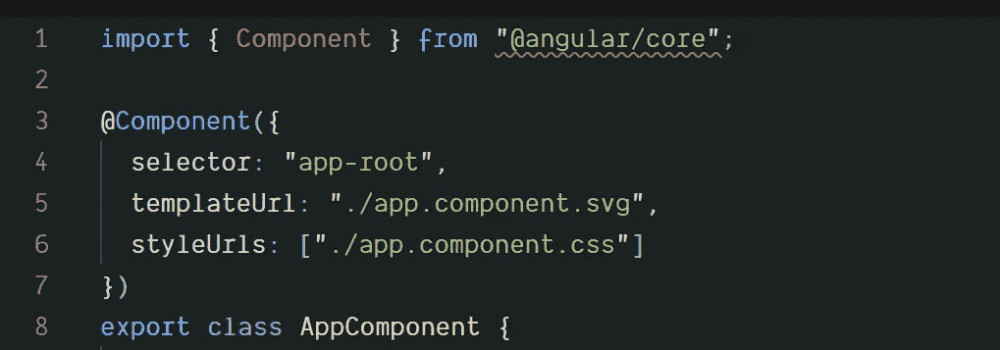

# 使用 svg 文件作为 Angular CLI 的组件模板

> 原文：<https://levelup.gitconnected.com/using-svg-files-as-component-templates-with-angular-cli-ea58fe79b6c1>

使用。svg 图形作为组件模板来动态生成交互式图形。

借助 Angular CLI 8(-beta 5 或更高版本)，您将能够使用。svg 文件，而不是。不需要任何额外的配置。

你为什么要用？svg 作为模板，而不是简单地将其作为图像添加到您的应用程序中？

当您使用 svg 作为模板时，您将能够像使用 html 模板一样使用指令和绑定。这意味着您将能够动态生成交互式图形。

让我们看一个简单的例子:

带有的角分量。svg 作为模板

正如您在示例中看到的，`app.component.ts`的`templateUrl`属性被设置为一个. svg 文件，就像您将一个. html 文件用作模板一样。在 svg 文件中，您可以使用您习惯使用的所有功能。html 文件，如绑定或指令。

在这个例子中，我绑定到了`attr.fill`，而不仅仅是绑定到了`fill`。这是因为 Angular 不知道 svg 元素的模式，否则会出现“无法绑定到' fill ',因为它不是' svg:rect '的已知属性”的错误。

在迪亚曼软件公司，我们使用。我们的一个项目中的 svg 模板显示了发票处理流程图。用户可以单击图中的不同步骤在应用程序中导航，我们还可以根据应用程序状态动态显示或隐藏图像的某些部分。的。svg 图像是由我们的市场部创建的，只需稍加修改就可以用作模板。

的其他使用案例。svg 文件作为模板可以生成图表。我正在制作一个图表示例，计划很快发布。

这个特性是作为`@ngtools/webpack`的一部分实现的，所以你也可以在没有 Angular cli 的情况下在你自己的 webpack 配置中使用它。

将此功能添加到 Angular CLI 是我对 Angular CLI 的第一个贡献。如果你喜欢它或者觉得它有用，请告诉我。我可能还会写博客，讲述我在添加 Angular CLI 特性时学到的一些东西。顺便说一下，Angular CLI 团队在我处理 pull 请求时非常有帮助。他们很快回答了我的问题，并提供了宝贵的反馈。

 [## 学习角度-最佳角度教程(2019) | gitconnected

### 前 48 角教程-免费学习角。课程由开发人员提交和投票，使您能够…

gitconnected.com](https://gitconnected.com/learn/angular)