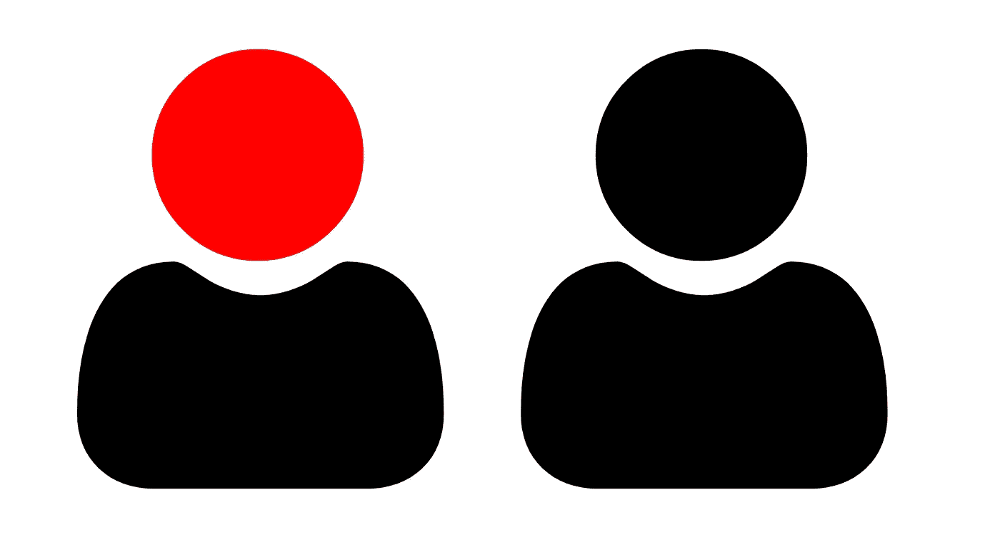

# 在 Web 上使用 SVGs 一次深入的探索

> 原文：<https://levelup.gitconnected.com/using-svgs-on-the-web-a-deep-dive-d3de6b0cc5d5>

## 在我们的网站上实现 SVG 并没有一个最好的方法，因为每种方法都有其优点和缺点。对于一个优秀的 Web 开发人员来说，了解它们的区别是一项至关重要的技能。

欢迎来到第二期的 **D** eep **D** ives，在这里我们通过简单的解释获得关于一个话题的深入知识。

## [⏪](/cdns-a-deep-dive-1f1de5853386) [🔛](https://jportella93.medium.com/dd-deep-dives-adb717e0709e)

**可缩放矢量图形(SVG)** 允许您呈现轻量级的图片，并且无需像素化即可缩放。

然而，我们可以在我们的网站中以几种方式实现它们，一些方法允许一些其他人不允许的功能。

# 依赖于实现的 SVG 特性

这里有一个特性列表，根据您提供 SVG 的方式，您可以拥有或不拥有这些特性。

## Alt 和 title 属性可用性

`alt`属性设置图像不可用时呈现的文本描述，而`title`属性通常在悬停图像时显示在工具提示中。这些用于可访问性和 SEO。

## 浏览器缓存

导致更快的加载时间，因此，更好的 UX 和搜索引擎优化排名。

## 交互性

SVG 可以用 CSS 和 JavaScript 来操作和制作动画。它们还可以包含环绕其形状的超链接。

## 搜索引擎索引

重要的一点是，谷歌宣布他们将开始抓取和索引 SVG。

## 包装

SVG 可以包含类和 id，它们不应该与页面上其他 SVG 的这些属性冲突。

# SVG 实现方法

既然我们已经知道了哪些特性取决于我们如何嵌入 SVG，那么让我们来比较一下这些嵌入方法。

根据方法，它们可以分为两组:

1.  **将浏览器指向 SVG 文件 URL 的相关方法**。这些通常可以从浏览器缓存中受益，但交互性有限。
2.  **与在静态资产如 HTML、CSS 或 JS 文件中硬编码 SVG 相关的方法**。这些不能单独缓存，因为它们嵌入在文件中，但是由于这个原因，我们保存 HTTP 请求，这很有趣，因为不使用 HTTP2 的浏览器只能处理有限数量的并发请求。此外，它们最适合对用户交互做出反应。

# 1.与将浏览器指向 SVG 文件的 URL 相关的 SVG 实现方法。

# 1.1 作为 src

## 特征

*   ✅ Alt/title 属性
*   ✅浏览器缓存
*   ❌互动
*   ✅搜索引擎索引
*   ✅封装

## 另外，请注意

*   如果宽度/高度没有指定为属性或 CSS 规则，则使用原始的 SVG 文件大小。
*   它们是封装的，所以它们的 id 和类不会与其他 SVG 冲突。

## 何时使用

*   当交互性不成问题时，例如，如果您的 SVG 在用户输入时没有动画效果。

# 1.2.作为 CSS 背景图片

## 特征

*   ✅ Alt/title 属性
*   ✅浏览器缓存
*   ❌互动
*   ✅搜索引擎索引
*   ✅封装

## 另外，请注意

*   与方法 1.1 相同，但这次我们可以使用任何 HTML 标签来代替`img`。

## 何时使用

*   当交互性不成问题时。
*   当你不能使用`img`标签时。
*   当您希望将 SVG URL 保存在 CSS 文件中而不是 HTML 文件中时。

# 1.3 作为一个数据

## 特征

*   ❌ Alt/title 属性
*   ✅浏览器缓存
*   🟡互动
*   ❌搜索引擎索引
*   ✅封装

## 另外，请注意

*   它有些交互性，因为它允许在 SVG 的某些部分设置超链接。但是，不能用 JS 或者 CSS 修改。
*   Y [设置 tabindex 属性](https://wet-boew.github.io/wet-boew-documentation/decision/1.html)可能会有问题。

## 何时使用

*   当您在 SVG 的某些部分需要超链接时。

# 1.4 和 1.5 作为或<embed> src

后两种方法在过去被使用过，但是现在它们的使用已经减少了。通常不建议使用它们。

被用作`iframe` src 的 SVG 引发了对损害 SEO 的担忧。此外，使用这种方法，我们失去了 SVG 的可伸缩性。

用作 src 的 SVG 主要集中在 Flash 这样的浏览器插件上，大多数浏览器已经不再支持它了。

# 2.SVG 实现方法与在静态资产(如 HTML、CSS 或 JS 文件)中硬编码 SVG 代码有关。

# 2.1 HTML 中的内联 SVG

基本上将整个 SVG 代码写入 HTML 文档。这就是一些流行的 SVG 库如 d3 所做的。

## 特征

*   ❌ Alt/title 属性
*   ❌浏览器缓存
*   ✅互动
*   ❌搜索引擎索引
*   ❌封装

## 另外，请注意

*   以这种方式实现的 SVG 完全可以用 CSS 和 JS 操作，因为它们的内部标记被视为 DOM 节点。
*   由于 SVG 代码嵌入在 HTML 中，我们保存了对资产的 HTTP 请求，尽管现在 HTML 文件更重了。

## 何时使用

当您需要在 SVG 中的任何标签上设置动画属性时，例如颜色/填充、不透明度和移动。

# 2.2 作为数据 uri

类似于 1.1 和 1.2，但在这种情况下，不是将图像的 src 属性或 CSS URL 指向外部资产，而是将 SVG 代码作为值放在那里。

或者

## 特征

*   ✅ Alt/title 属性
*   ✅浏览器缓存
*   ❌互动
*   ✅Search 引擎索引
*   ✅封装

## 另外，请注意

*   SVG 可以编码成浏览器能够理解的任何形状。在这个例子中，它是用 [URL 编码的](https://yoksel.github.io/url-encoder/)，但是它也可以是 base 64 编码的，例如。
*   由于 SVG 代码嵌入在 HTML/CSS 中，我们保存了对资产的 HTTP 请求，尽管现在 HTML/CSS 文件更重了。

## 何时使用

当 SVG 不需要交互性，并且足够轻便，我们宁愿将它嵌入到 HTML 文件中，而不是对它进行 HTTP 请求。

# 结论

在 web 上实现 SVG 没有一种通用的方法，这取决于您正在寻找的特性。

感谢阅读，永远不要停止学习！😄

## [⏪](/cdns-a-deep-dive-1f1de5853386) [🔛](https://jportella93.medium.com/dd-deep-dives-adb717e0709e)

# 我用来研究这篇文章的资源

在 html 5–20 中使用 SVG | html 5&CSS3 基础:绝对初学者的开发 — MSDN

[如何在 CSS 和 HTML 中使用 SVG 图像—初学者教程](https://www.freecodecamp.org/news/use-svg-images-in-css-html/) — FreeCodeCamp

[09:带数据 URIs 的 SVG](https://css-tricks.com/lodge/svg/09-svg-data-uris/)—CSS 技巧

[在 Web 浏览器中显示 SVG](http://tutorials.jenkov.com/svg/displaying-svg-in-web-browsers.html)—jen kov

[网络上的 SVG 实用指南](https://svgontheweb.com/) —网络上的 SVG

[向 web 添加矢量图形—学习 Web 开发](https://developer.mozilla.org/en-US/docs/Learn/HTML/Multimedia_and_embedding/Adding_vector_graphics_to_the_Web) — MDN

[在 HTML 上嵌入 SVG 的最佳方式(2021)](https://vecta.io/blog/best-way-to-embed-svg) — Vecta