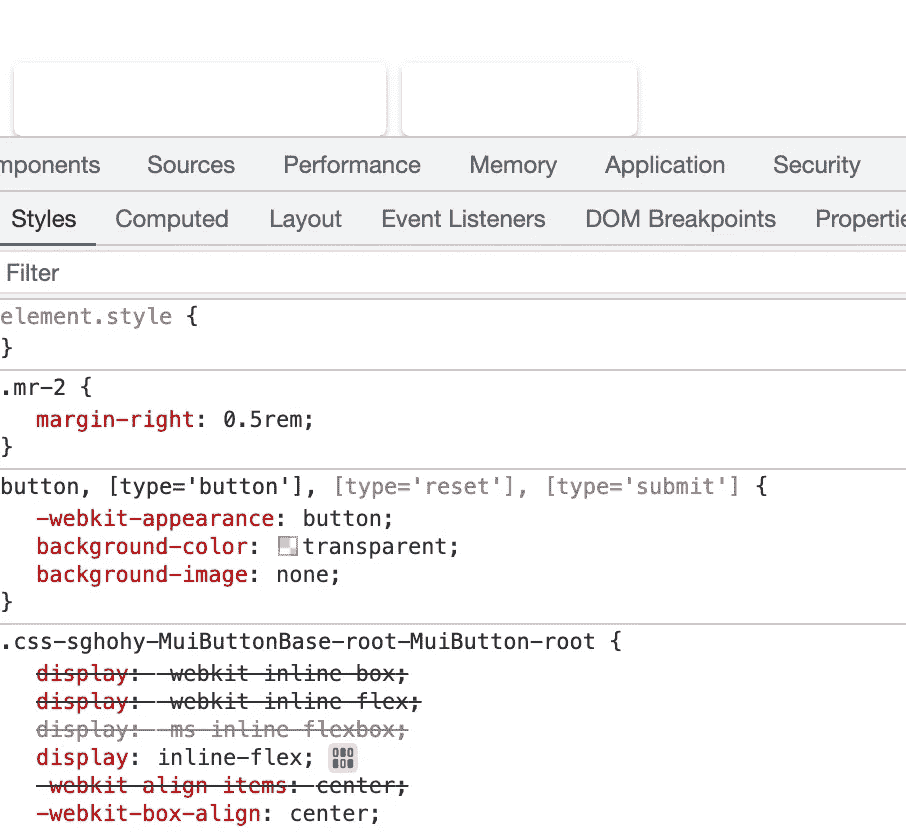
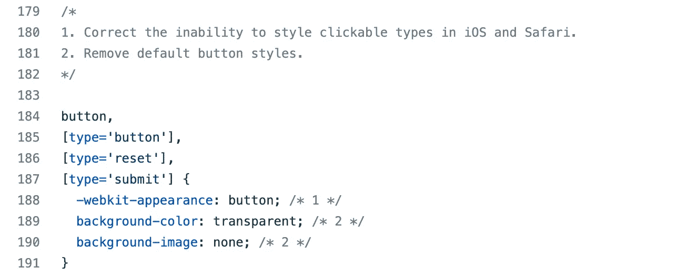

# 使用 TailWind CSS 自定义材质 UI 组件样式

> 原文：<https://levelup.gitconnected.com/using-tailwind-css-to-customize-material-ui-component-style-64506123dba>

## 如何在素材 UI 组件中使用 tailwind CSS


## 前言

在我的 Next.js 项目中，我尝试使用[材质 UI](https://mui.com/material-ui/getting-started/overview/) 作为 UI 库来提高效率。为了定制布局，使用了[顺风 CSS](https://tailwindcss.com/) 。但是按照他们的教程导入后会有一些冲突。

在这篇文章中，我们将看看如何使它们很好地工作。

## 风格冲突

当我想使用 Material UI 的`Button`组件时，我发现它的背景有一些意想不到的效果:



按钮的样式

按钮的背景被 Tailwind CSS 覆盖，因为我们需要在`global.css`文件中添加`@tailwind`指令:

```
@tailwind base;
@tailwind components;
@tailwind utilities;// other global css
```

`@tailwind base`会自动添加一个`[preflight.css](https://github.com/tailwindlabs/tailwindcss/blob/master/src/css/preflight.css)`文件到项目中，该文件包含重置按钮背景的规则。



当我们知道了风格冲突的原因后，就会有两种方法来解决这个问题:

1.  不要通过删除`@tailwind base`指令来导入`preflight.css`文件。
2.  用 style 属性重写按钮样式，或者添加权重较高的选择器。

我用了第一种方法，因为其他组件也可能有冲突样式。但是这种方式可能会导致一些元素过时，比如 img，我们不得不在`global.css`中添加一些需要重置的 css 规则:

```
// from the tailwind's preflight.cssimg,svg,video,canvas,audio,iframe,embed,object {  
  display: block; /* 1 */  
  vertical-align: middle; /* 2 */
}
img,video {  
  max-width: 100%;  
  height: auto;
}
```

如果你在其他元素上也有一些问题，看看你是否缺少了`[preflight.css](https://github.com/tailwindlabs/tailwindcss/blob/master/src/css/preflight.css)`中的一些重置样式规则。

## 自定义材质 UI 组件样式

如果我们只需要在按钮之间添加一些空间或一些小的布局变化，我们可以通过向这些组件添加 className 来实现，如下所示:

```
<Button className="mr-2">Click Me</Button>
```

但是在某些情况下，我们需要自定义所有样式的组件，最好的方法是使用非样式组件:

```
import {ButtonUnstyled, ButtonUnstyledProps} from "@mui/base";

const CustomButton = (props: ButtonUnstyledProps) => <ButtonUnstyled {...props} componentsProps={{
  root: {
    className: `hover:text-cyan-500 p-2 border-2 border-indigo-600`
  }
}} />
```

而且你可以从[按钮无样式](https://mui.com/base/react-button/)和[与顺风 CSS](https://mui.com/base/guides/working-with-tailwind-css/) 一起工作中学到更多。

## 结论

使用 Tailwind CSS 和 Material UI 可以使网页开发变得更加容易，在本文中，我们将学习如何使用 Tailwind CSS 来定制 Material UI 组件的样式。在 Next.js 项目中可能会有一些冲突，我们可以在不使用`@tailwind base`指令的情况下删除 Tailwind CSS 的重置规则。

感谢阅读，希望这能帮到你~