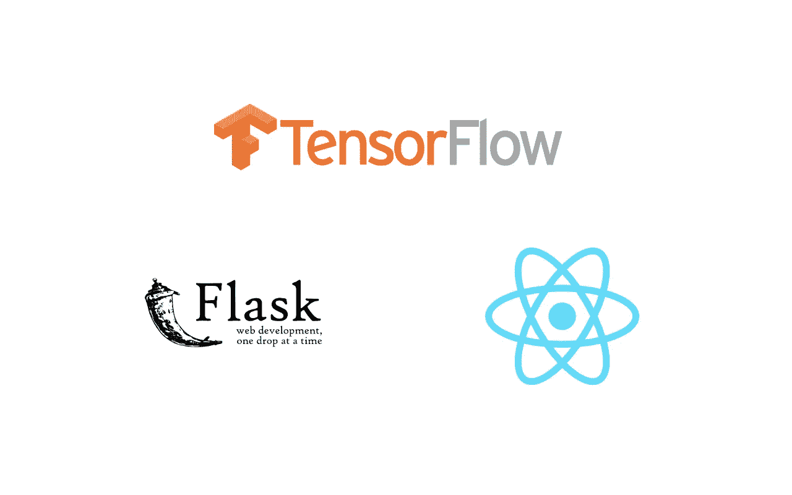
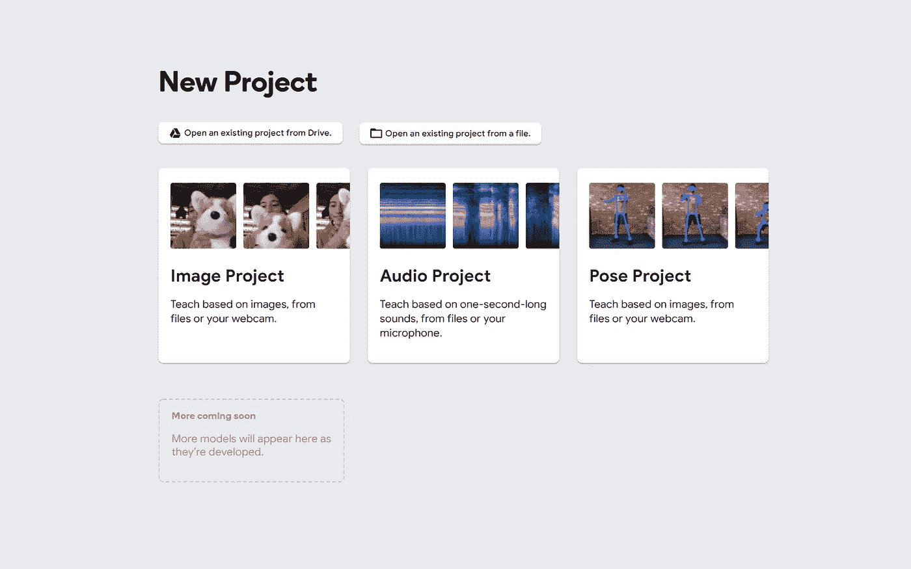
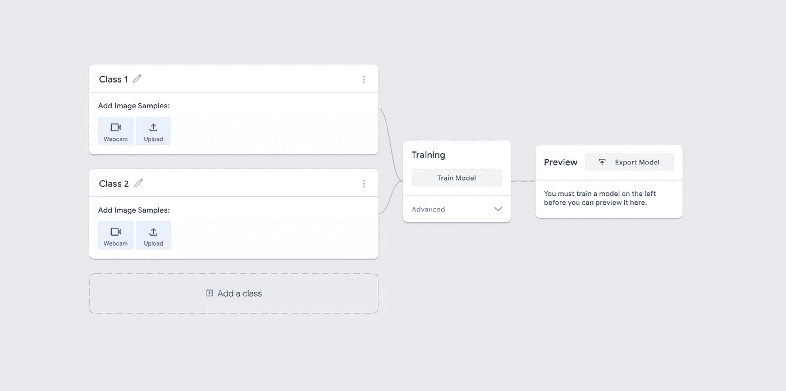
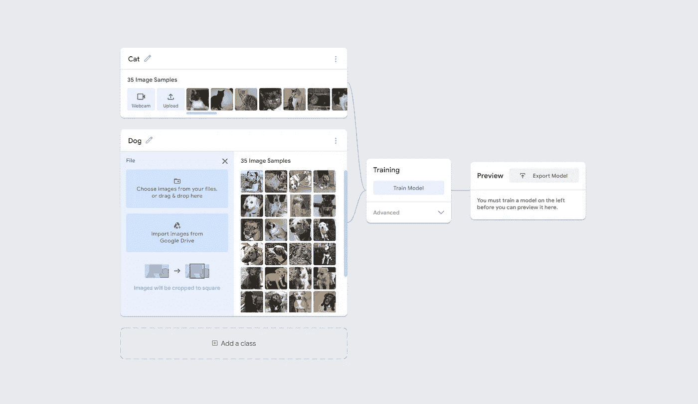
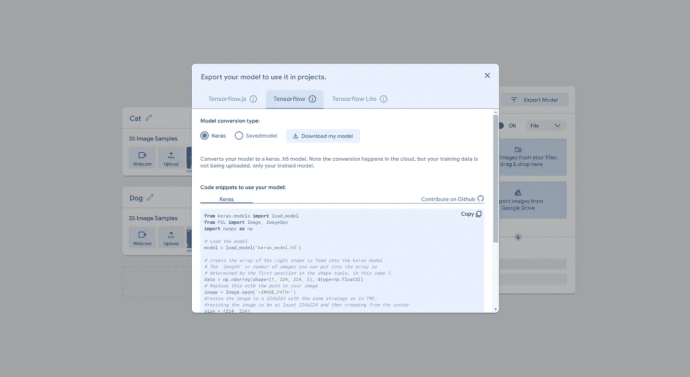
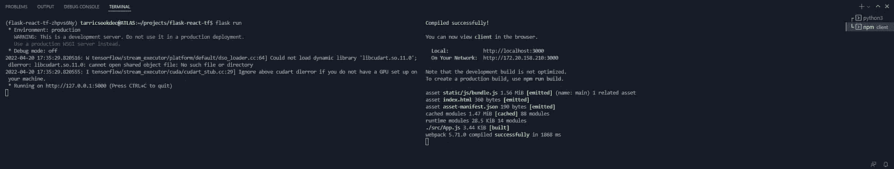
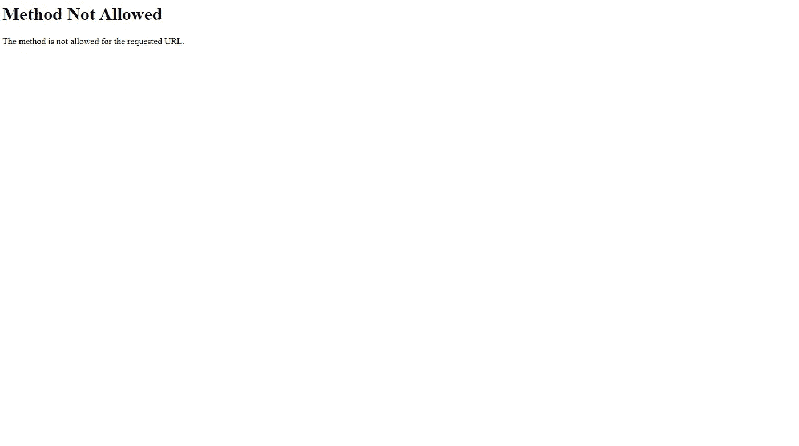
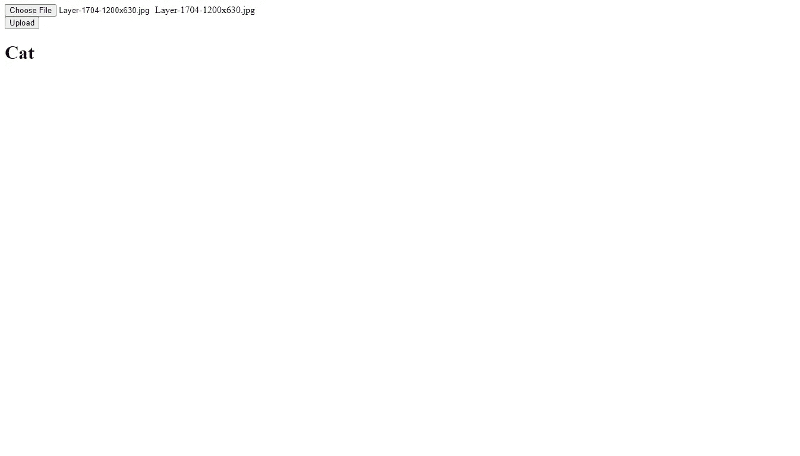

# 使用 TensorFlow 和烧瓶进行反应

> 原文：<https://levelup.gitconnected.com/using-tensorflow-with-flask-and-react-ba52babe4bb5>

## 一个全栈机器学习的例子



张量流、烧瓶和反应徽标

**TensorFlow** 是 Google Brain 团队维护的一个流行的机器学习框架。TensorFlow 使您能够轻松访问高级功能来训练、分析和运行机器学习模型。

**Flask** 是一个基于 Python 的 web 框架。因为 Flask 使用 Python，所以它允许您使用 Python 的充满第三方库的惊人的 PIP 生态系统。

**React** 是一个由脸书维护的前端 JavaScript 框架。React 对于创建健壮和轻量级的前端客户端非常有用。

本文介绍了如何将这三种技术结合到一个 web 应用程序中。想象一下，你有一个训练有素的机器学习模型，并希望你的用户通过 web 应用程序与它进行交互。由于 TensorFlow 有一个很棒的 Python 包，而 Flask 是一个 Python 框架，所以您可以很容易地将您的模型托管在用 Flask 编写的 web 服务器上。通过这样做，您可以通过 Flask 中的 API 端点公开模型。然后，您可以使用 React 来消费 API。

**要求**

我假设你知道 Flask 的基本知识，有反应，并且已经有一个训练有素的机器学习模型。

**训练模型**

本文不会使用 TensorFlow 来训练模型。经过训练的模型应该导出到扩展名为 **h5 的文件**。如果您已经有一个带有 h5 文件的训练模型，跳到**项目设置**部分。

我们将通过一个简单的例子，使用一个叫做[可示教机器](https://teachablemachine.withgoogle.com/)的便利工具来创建一个模型。

我们将要构建的样本模型接受狗和猫的图像，并对它们进行分类。您可以在这里获得所用的数据[。如果有必要，创建一个 Kaggle 帐户，下载 **train.zip** 文件，并将其解压缩到您的机器上。这将包含大约 25，000 张狗和猫的图片。如果你想更好地组织数据，为狗图片创建一个文件夹，为猫图片创建一个文件夹。请注意，25，000 是一个很大的数量，将它们移动到不同的文件夹并训练模型可能需要一段时间来处理这么多照片。大部分随意删。为了这个例子，我建议总共保留 2000 张照片。一千只狗和一千只猫。](https://www.kaggle.com/competitions/dogs-vs-cats/data?select=train.zip)

前往[可示教机器](https://teachablemachine.withgoogle.com/)。在那里，点击**开始**。您应该会看到一个页面，要求您选择一个项目类型。我们正在做一个**形象工程**。如果提示选择图像项目的类型，选择**标准图像模式**。



用于选择项目类型的可示教机器界面

您现在应该会看到如下所示的页面:



可示教机器模型训练设置

将`Class 1`文本改为猫，将`Class 2`改为狗。之后，在猫类中选择`upload`，然后选择`Choose images from your files`。选择你的猫图像并载入。对 Dog 类遵循相同的步骤。

完成后，你应该可以点击`Train Model`按钮。我通常将所有的高级设置保留为默认值，但是如果你愿意的话，可以尝试一下。



数据加载后可示教的机器

一旦你点击`Train Model`，可教的机器将通过裁剪和调整图像大小来预处理你的图像。然后模型会训练。根据加载的图像数量，这可能需要一些时间。

一旦训练完毕，你应该有一个选项`Export Model.`这将允许你导出你的模型的 h5 文件，以及给出一个关于如何使用模型的代码片段。



可示教机器代码片段和模型导出

从`Export Model,`中选择`TensorFlow`选项卡并选择`Keras`选项。下载您的模型，并注意所提供的代码片段。

当您的模型下载时，它应该是一个 zip 文件。解压缩后，该文件夹中应该有一个扩展名为 h5 的文件。这是一个文件，存储了你训练好的神经网络的所有参数。

**项目设置**

既然您已经有了一个经过训练的模型，那么是时候设置项目了。

为项目创建一个目录，并将`cd`放入其中:

```
mkdir flask-react-tf
cd flask-react-tf
```

您将使用 Pipenv 设置一个 Python 3.9 环境。如果你没有安装 Pipenv，我这里有一篇关于使用 Pipenv [的文章](/beginners-guide-to-pipenv-9340a6c35147)。

运行以下命令来设置 Python 3.9 环境。请注意，您需要在您的机器上安装 Python 3.9。

```
pipenv install --python 3.9
```

设置完成后，使用以下命令激活虚拟环境 Pipenv 设置:

```
pipenv shell
```

现在用 Pipenv 安装项目依赖项:

```
pipenv install flask tensorflow pillow flask-cors
```

这些依赖关系是什么？

**flask** :用 Python 创建 web 应用和 API 的微型 web 框架。

**tensorflow** :官方 TensorFlow python 包。这将允许您与 TensorFlow 的 API 以及 h5 文件进行交互。

**pillow** :一个 python 库，为你提供了操作图像的工具。由于机器学习模型会摄取猫和狗的图片，pillow 将使处理这些图像变得容易。

**flask-cors** :允许您设置 cors 策略以允许来自 React 的请求。

**项目结构**

在您的项目目录中，您应该有一个 **Pipfile** 和 **Pipfile.lock** 文件。

在项目根目录下，创建一个名为 **app.py** 的文件，并将 **keras_model.h5** 文件也移动到这里。

您应该有一个如下所示的文件夹结构:

```
- flask-react-tf
-- app.py
-- keras_model.h5
-- Pipfile
-- Pipfile.lock
```

现在您可以将 React 添加到项目中。您可以使用`create-react-app.`来完成此操作

在项目的根目录下创建一个名为`client`的文件夹，并在其中运行`create-react-app`命令。您需要安装节点和 NPM。

```
mkdir client
cd client
npx create-react-app .
```

这将在`client`目录中创建一个准系统的样板 React 应用程序。

您的文件夹结构现在应该是这样的:

```
- flask-react-tf/
-- app.py
-- keras_model.py
-- Pipfile
-- Pipfile.lock
-- client/
--- README.md
--- node_modules/
--- package-lock.json
--- package.json
--- public/
---- favicon.ico
---- index.html
---- logo192.png
---- logo512.png
---- maifest.json
---- robots.txt
--- src/
---- App.css
---- App.js
---- App.test.js
---- index.css
---- index.js
---- logo.svg
---- reportWebVitals.js
---- setupTests.js
```

`create-react-app`船上有很多样板文件。对于这个示例应用程序，将只编辑`src/App.js`。

现在一切都已经设置好了，是时候集成这 3 种技术了。

**烧瓶 App 和张量流**

打开项目根目录下的`app.py`文件。

首先导入所需的库和包。

接下来设置一个 Flask 应用程序的实例。

声明了一个名为`app`的变量，并将其设置为 Flask app 的一个实例。在下面一行中，`flask_cors`用于包装 Flask app 实例。这将允许来自任何域的请求，包括 React。

现在，使用 Flask 实例创建一个将图像上传到的路由。

通过添加这个，您创建了一个到`[http://127.0.0.1:5000/upload](http://127.0.0.1:5000/)` 的路由，它只接受 POST 请求。我们需要这个，因为我们将发送图像到这个端点。

接下来，是时候使用我们训练模型时可教机器提供的代码片段了。提供的代码片段使用经过训练的 TensorFlow 模型，预处理传入的图像，并进行预测。

这里有很多东西要打开。

经过训练的模型被加载并存储在名为`model.`的变量中

接下来，numpy 数组描述了将存储在其中的图像的形状。这个 numpy 数组存储在`data`变量中。

当端点被点击时，`image`变量存储 React 传入的图像。

剩下的代码是预处理图像并将其存储到定义的 numpy 数组中。

`prediction`变量存储预测值。

最后一步是分析预测，返回一些东西来反应。

如果你把预测变量打印出来，你会注意到它是一个列表，里面有一个包含两个十进制数的列表。如果第一个十进制数大于 0.50，那么预测是一只猫。否则，就是狗。

您可以在终端中从项目根目录使用`flask run`运行 Flask 服务器，以确保 Flask 服务器正在运行。

**React 客户端**

虽然`create-react-app`创建了许多样板文件，但是对于这个例子，只有`App.js`文件需要编辑。

在`App.js`中会有一些样板代码，我们将去掉它们，使文件看起来像这样。

这将删除 div 标记之间的所有代码，并将函数组件转换为箭头函数。

现在让我们添加向 Flask 服务器发出请求的逻辑，以及一些状态。

以下状态添加了`useState:`

*   **文件**:存储图像文件。它开始时是一片空白的状态。
*   **文件名**:存储图像文件的名称。它以“选择文件”的初始状态开始，所以当一个文件没有被选择时，选择文件的按钮中有文本“选择文件”。
*   **预测**:存储 Flask 服务器发回的预测。初始状态为空，因为没有初始预测。

新增功能描述:

*   **onChange** :当表单中的数据发生变化时，调用该函数。因此，每当上传或更改文件时。它改变文件和文件名的状态。
*   **onSubmit:** 提交表单时调用。该函数处理传入的文件，并为 Flask 服务器创建获取请求。第二个。然后从 Flask 服务器获取响应，并将其保存在预测状态中。

最后一步是添加表单以使用定义的函数和状态。

**演示**

现在是时候演示该应用程序了。

您需要同时运行 Flask 和 React 服务器，这样才能工作。您必须在两个不同的终端窗口中完成此操作。在 VS 代码中，应该是这样的:



运行 Flask 和 React 服务器的终端窗口

要运行 Flask 服务器，请确保 Pipenv 创建的 Python 环境正在终端窗口中运行。如果是，请在根目录下运行以下命令:

```
flask run
```

要运行 React 服务器，您需要位于终端窗口中的客户端目录中。运行以下命令:

```
npm start
```

如果你访问`[http://127.0.0.1:5000/upload](http://127.0.0.1:5000/upload)`，你应该会看到一个不允许方法的页面。这是因为只有 POST 请求可以到达这个端点。我们希望看到此错误，因为它意味着端点设置正确。



不允许的方法页面

接下来，如果您在 `[http://localhost:3000](http://localhost:3000/)`访问 React 服务器，您应该会看到选择您希望上传的图像的表单。


将页面与表单反应以上传图像

当两台服务器都在运行时，单击 React 页面上的 Choose File 并选择要上传的图像。

选择图像后，单击上传提交表单。

给程序一点时间，一些文本应该与预测一起显示。



做出预测后对页面做出反应

如果你喜欢这篇博文，并且觉得它很有用，可以考虑为它鼓掌，并在 Medium 上关注我。此外，考虑使用我的推荐链接在这里注册媒体。只要你还是会员，我就能得到一点回扣。如果你愿意，你也可以在这里给我买杯咖啡[！非常感谢！](https://www.buymeacoffee.com/tarricsookdeo)