# 用 TensorTrade 做一个简单的交易算法

> 原文：<https://levelup.gitconnected.com/using-tensortrade-for-making-a-simple-trading-algorithm-6fad4d9bc79c>

在本教程中，我将展示如何使用光线与 TensorTrade (TT)，以创造一个有利可图的算法对可预测的正弦曲线。你可能会问自己，当真实世界难以预测时，为什么要使用如此简单的东西呢？这是一个非常好的问题，有一个简单的答案。

> 搬动一座山的人是从搬走小石头开始的
> - 孔子

在尝试进入复杂的交易环境之前，可以用一条简单的正弦曲线来检查你的交易算法。使用的奖励和行动计划应该能够以可预测的模式赚钱。如果不能，那么在更复杂的环境中就不可能成功。

在浪费时间和资源开发一个算法之前，有一些问题要问。首先，奖励功能是否正确地指定了目标？在本教程中，我将展示一个奖励和行动方案，可以用来训练代理人在正弦曲线上做出有利可图的决策。

# 体系结构

首先，我们需要安装一些库。

```
$ pip install tensortrade==1.0.1b0 ray[tune,rllib] symfit
```

现在让我们导入运行代码所需的一切。

让我们定义我们的投资组合中想要的两种工具。我们将使用美元和一种叫做 TensorTrade 硬币的假硬币。

理想情况下，我们希望我们的代理人在高峰时卖出，在低谷时买入。我将定义允许我们执行此行为的操作。我构建的`ActionScheme`非常简单，只依赖于两个内部状态:`cash`和`asset`。

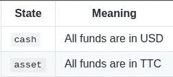

状态意义表

下面是一个转换图，显示了状态以及可以进行的动作:`stay`和`move`。

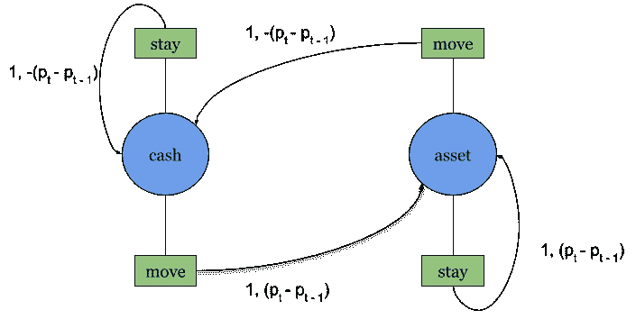

推移图

例如，如果我从`cash`开始并选择`move`，那么我将转换到`asset`并接收`P(t)-P(t-1)`作为奖励，其中 *P(t)* 是资产在时间步长 *t* 的价格。归因于这些箭头的奖励将在下面进一步详细描述。

行动方案

接下来，我将创建一个奖励方案来反映我们在环境中的位置。本质上，我们需要一个映射来反映我们所处的每个状态的正确回报。

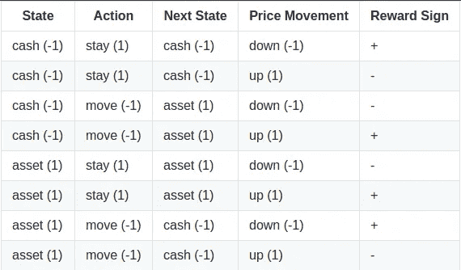

奖励符号表

下表显示了在不同的情况下，奖励应该有什么标志。例如，在第一行中，假设代理人处于`cash`状态，并在价格下跌时选择`stay`，那么将会有正回报。其他行可以以相同的方式读取。为了获取这个奖励函数，我将创建一个基于位置的奖励(PBR)方案。设 *s(t)* 、 *a(t)* 、 *p(t)* 分别为时间步长 *t* 的状态、动作和价格*。*那么我们可以定义奖励，*【t】*，为:

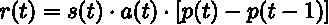

奖励方程式

之前，我提到一个例子，我们从`cash`开始，选择`move`。根据上面的等式，这可以转化为:

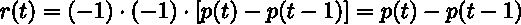

如前所述，该功能产生的奖励显示在转换图的箭头上。

奖励计划

最后，我们要确保我们能看到代理商是否在最高点卖出，在最低点买入。这里有一个`Renderer`，可以使用`Matplotlib`显示这些信息。

渲染器

# 火车

为了在`ray`中使用我们的定制环境，我们必须首先编写一个从配置字典中创建`TradingEnv`实例的函数。

由于环境已经注册，我们可以使用`rllib`中的近似策略优化(PPO)算法来训练我们的代理。

要检查是否一切正常，设置低`episode_reward_mean`以便快速检查(设置为 10)。一旦一切正常，将其设置为 500 并运行训练。培训完成后，我们可以通过从最后一个检查点恢复来访问代理的策略。

现在，让我们通过渲染环境来可视化正弦曲线上的代理决策。

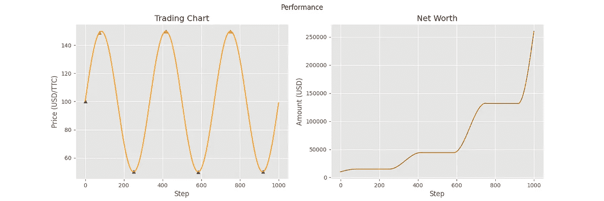

正弦曲线测试

从图表中，我们可以看到代理正在对环境做出接近最优的决策。这符合我们的预期，并确认奖励功能正常工作。现在让我们把代理放在它不习惯的环境中，看看它会做出什么样的决定。

# 评价

为了让价格曲线更具挑战性，我使用了`symfit`库来拟合随机生成的几何布朗运动(GBM)的 5 阶傅立叶级数。

现在，我可以创建评估环境，看看代理的表现如何。虽然这不是一个合适的评估，但它仍然提供了一个很好的直观启发来衡量代理在不同情况下的反应。

以下图表来自使用该评估环境的 6 个不同样本。

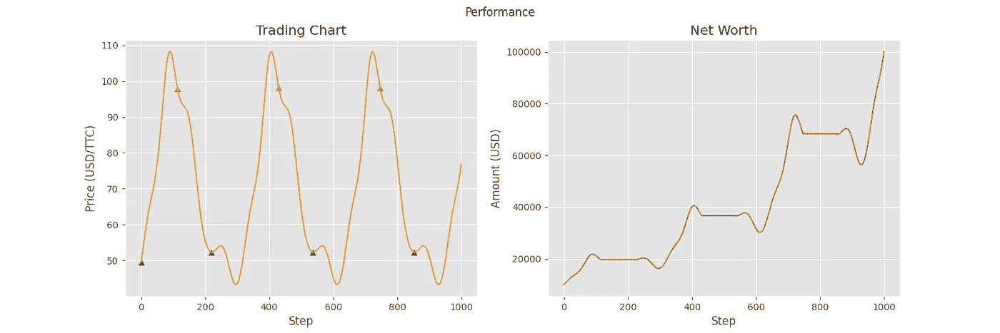

样本 1

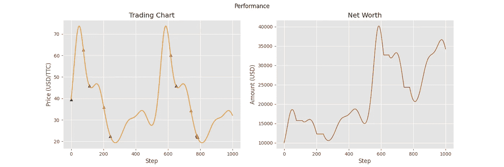

样本 2

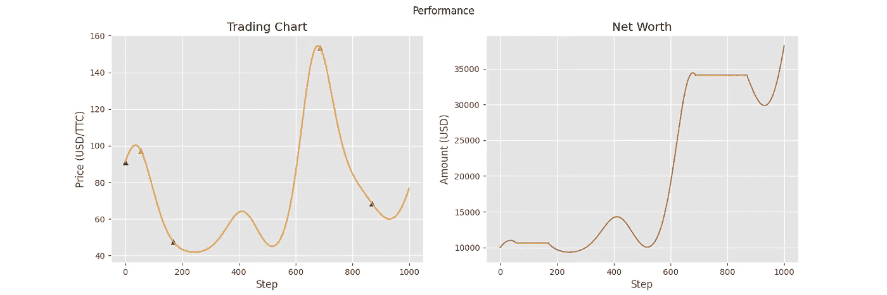

样本 3

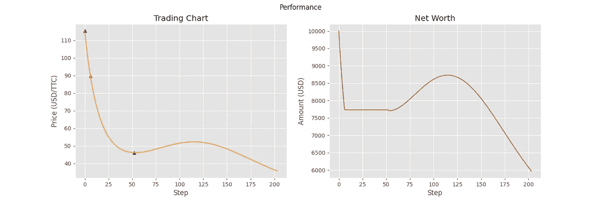

样本 4

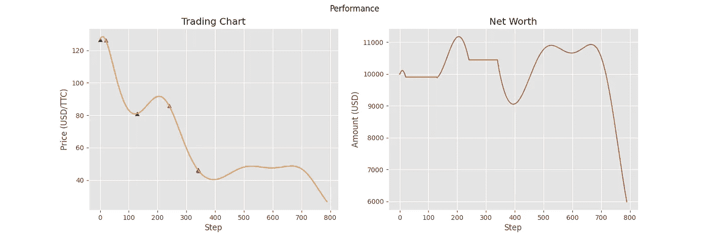

样品 5

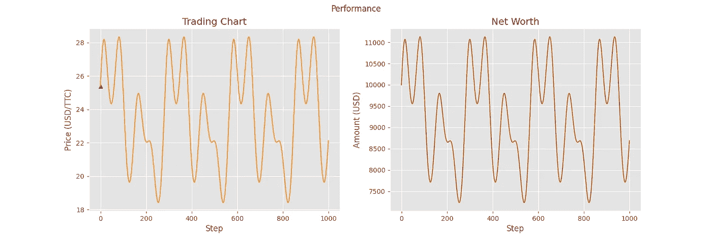

样本 6

正如你所看到的，代理已经能够在一些价格曲线上做出正确的决定，但不是所有的。特别是，最后三条曲线展示了代理的一些缺点。在样本 4 和样本 5 中，它似乎不明白总体趋势是下降的，它应该将其所有资产转换为现金。对于样本 6，代理似乎完全停止了决策。这很可能是由于价格曲线的高波动性，相对于前三条曲线包含许多局部最小值和最大值。由于价格变化如此之快，代理人决定最好的选择是一直持有。

# 结论

我们的主要目标是测试我们的奖励和行动方案可以用来训练代理人在简单的正弦曲线上做出有利可图的决策。尽管后面的一些样本表现欠佳，但我们的目标是深入了解代理商的决策，并告知我们如何设计未来的奖励计划。从这些基本概念出发，你可以逐步建立更复杂的行动和奖励方案，从中可以得出成功的算法。TensorTrade 创造的交易环境没有种类限制，我鼓励每个人尝试不同的可能性。这就结束了这个教程！你可以查看一下 [TensorTrade](https://github.com/tensortrade-org/tensortrade) 库，学习如何使用它来创建你自己的交易环境。

我们学到了什么？

*   在 TensorTrade 做一个环境。
*   创建一个定制的`ActionScheme`、`RewardScheme`和`Renderer`组件。
*   使用简单的价格曲线来了解我们用例中更多的行动和奖励。
*   使用`ray`训练和恢复代理。
*   创造评估环境，为代理人的决策提供洞察力。

**代码**

*   [谷歌 Colab](https://colab.research.google.com/drive/1XWshsubfeH7sXq4Rby3COHcQDAaLCgAW?usp=sharing)
*   [GitHub](https://github.com/mwbrulhardt/simple-sine-curve)

下期教程再见！