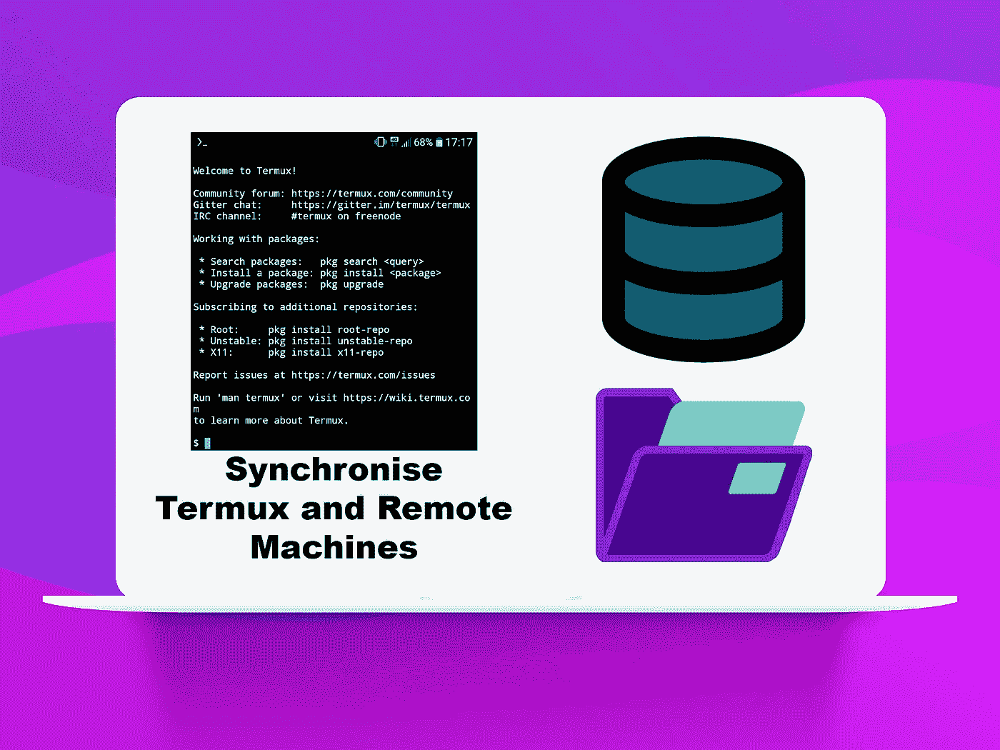

# 使用 Termux 与远程机器同步(Linux/MacOS)

> 原文：<https://levelup.gitconnected.com/using-termux-to-synchronise-with-remote-machines-linux-macos-5826978a3328>



使用 SSH 和 rsync 在移动中的机器之间轻松共享文件

这个想法是使用一个 Android 手机作为文件服务器，这样我们就可以一直带着我们的文件。我用的是 LG G5，它有一个方便的 SD 卡插槽，我可以放一个 128 Gb 的卡来存储我每天在 4 台不同的机器上使用的文件。在本文中，我们将了解 Termux、SSH、scp 和 rsync 如何帮助我们在不依赖云的情况下改进工作流。

首先，你必须确保通过 F-Droid 应用程序库或 Google PlayStore 安装所有与 Termux 相关的(附加组件),但不要混合两者的附加组件。

Termux 只能读取外部存储器(SD 卡)；但是使用下面的命令，它将创建一个 Android/data/com.termux/files/目录，您可以在其中使用 termux 进行读写操作:

```
termux-setup-storage
```

该命令还会在 Android 设备上的 Termux 文件夹中创建符号链接。

现在让我们更新 Termux 环境并安装 SSH:

```
pkg up # or apt-get update
pkg install openssh
```

我们希望 SSH 服务器在 Termux 运行的任何时候都能运行。通过创建(如果不存在)和编辑*，您可以在每次登录 Termux 时运行命令。 *home* 目录下的 bash_profile* 文件:

```
nano ~/.bash_profile
```

这里，我们添加了一个条件，只启动 SSH 服务器并只运行脚本一次，我们在临时目录中创建一个文件，每次 Termux 启动时都会清除该文件，并检查该文件是否存在，以便不再运行任务:

```
#!/data/data/com.termux/files/usr/bin/bashif [ ! -e “$TMPDIR/termux-started” ]
then
 sshd
 touch “$TMPDIR/termux-started”
fi
```

我个人添加了另一行代码，将我工作的目录更改为 Termux 在 SD 卡上可以控制的目录。它应该在 if 条件之外，以便在我每次登录 Termux 时执行:

```
cd ~/storage/external-1/
```

让我们把重点放在无缝的 SSH 连接上(不需要密码)。
要从 Termux 连接到您的远程机器，请在 Termux 中创建 SSH 公钥:

```
ssh-keygen -b 4096 -t rsa
```

将密钥复制到远程计算机:

```
ssh-copy-id -i ~/.ssh/id_rsa.pub [username@192.168.xx.xx](mailto:username@192.168.xx.xx)
```

要从远程机器连接到 Termux，请在远程机器上创建 SSH 公钥:

```
ssh-keygen -b 4096 -t rsa
```

将 SSH 公钥复制到 Termux，以建立到 Termux 的 SSH 连接，同样使用 *ssh-copy-id* 命令，您需要使用 Termux 监听端口 8022:

```
ssh-copy-id -p 8022 -i ~/.ssh/id_rsa.pub [username@192.168.xx.xx](mailto:username@192.168.xx.xx)
```

从现在开始，要通过 ssh 连接到 Termux 实例，我们只需输入以下命令:

```
ssh -p 8022 192.168.xx.xx
```

使用 Termux，您可以访问您的 Android 设备的功能。您必须安装 *Termux:API* 附加组件。
在 termux 中安装以下软件包:

```
pkg install termux-api
```

现在，您可以访问您的电池信息，例如:

```
termux-battery-status
```

为了解析通过前面的命令获得的 json 格式的信息，安装 json 解析器(在 macOS 上“brew install jq”):

```
pkg install jq
```

现在你可以输入*jq-r’得到你需要的东西。'字典 _ 关键字'。*

让我们设置我们的 *RSYNC* 工作流程，下面是它的工作方式:

虽然 RSYNC 脚本将持续运行，但我们需要每 5 分钟检查一次电池状态，并将结果写入文件。然后，我们使用设备的 mac 地址在网络上找到 Android 设备的 IP 地址(它可以作为热点或在本地网络上)，将文件从 Android 设备传输到远程机器，如果剩余空间足够大(阈值为 20%)，则继续传输，或者如果接通电话，我们从 Android 设备传输到远程机器，然后反之亦然，检查文件夹或文件是否有更改。

在 Termux 上安装 rsync:

```
pkg install rsync
```

我们使用以下代码执行脚本 ad vitam aeternam:

```
while true
do
done
```

获取电池状态并将 *JSON* 响应写入*。json* 文件备用。

```
echo $(termux-battery-status) > ~/storage/external-1/battery/script/folder/battery.json
```

与大多数脚本相反，我们没有把脚本解释器#！/bin/bash ( *#！/data/data/com . Termux/files/usr/bin/sh*in Termux)因为我们将把解释器放入命令中。

我们需要创建一个后台运行脚本的守护进程。为此，首先使脚本可执行:

```
chmod +x ~/path/to/battery/script.sh
```

然后运行以下命令:

```
daemonize -p $PREFIX/var/run/script.pid $PREFIX/bin/bash ~/path/to/battery/script.sh
```

现在，您可以在每次使用相同的*登录 Termux 时运行一个命令。bash_profile* 文件:

```
nano ~/.bash_profile
```

并补充:

```
#!/data/data/com.termux/files/usr/bin/bashif [ ! -e “$TMPDIR/termux-started” ]
then
 sshd
 daemonize -p $PREFIX/var/run/get-battery.pid $PREFIX/bin/bash ~/storage/external-1/development/get-battery.sh
 touch “$TMPDIR/termux-started”
fi
```

我们得到远程机器的 IP 地址:

```
IP=`ifconfig en0 2>/dev/null|awk ‘/inet / {print $2}’`
```

然后，声明一个变量来记录 IP 字符串的最后一个字符:

```
LAST_IP=”${IP: -1}”
```

并执行一个循环，每次删除字符串的最后一个字符，在第一个“.”处停止这样我们就有了我们所在网络的 IP 配置。

```
while [ “${LAST_IP}” != “.” ]
do
 IP=${IP%?} # Here we remove the last character of the IP string
 LAST_IP=”${IP: -1}”
done
```

之后，我们通过 ping 扫描映射网络上的所有 IP 地址:

```
echo $(nmap -sP “${IP}”0/24 >/dev/null)
```

然后，我们得到与我们的 Android 设备的 mac 地址相匹配的 IP 地址:

```
IP_ADDRESS=`arp -an | grep mac:address:android:device | awk ‘{print $2}’ | sed ‘s/[()]//g’`
```

我们的远程机器将使用 *scp* 通过 ssh 将电池文件复制到当前文件夹:

```
scp -P 8022 192.168.xx.xx:~/storage/external-1/path/to/battery/script/folder/battery.json /path/to/remote/machine/folder/
```

我们从 *battery.json* 文件中获取电池状态:

```
PLUGGED=`cat battery.json | jq -r ‘.plugged’`
PERCENTAGE=`cat battery.json | jq -r ‘.percentage’`
```

检查设备是否接通电源，或者百分比是否足够高(这里我们将其设置为 20%电量):

```
OPERATIONAL=”false”
if [[ “$PLUGGED” | jq -r ‘.plugged’ == *”PLUGGED_AC”* ]]
then
 OPERATIONAL=”true”
elif [[ “$PERCENTAGE” -ge “20” ]]
then
 OPERATIONAL=”true”
fi
```

如果其中一个条件为真，我们使用 rsync 开始同步:

```
if [ “${OPERATIONAL}” == “true” ]
then
 rsync -avr -e ‘ssh -p 8022’ — exclude-from=’/path/to/rsync-exclude.txt’ $IP_ADDRESS:~/storage/external-1 /path/to/remote/machine/folder
 fi
```

将文件从 Android 手机同步到远程机器。我们使用选项 *— exclude-from=* 来使用一个文件，在该文件中我们声明我们不想同步哪些文件和文件夹。

```
#!/bin/bashwhile true
do
    IP=`ifconfig en0 2>/dev/null|awk ‘/inet / {print $2}’`
    LAST_IP=”${IP: -1}”
    while [ “${LAST_IP}” != “.” ]
    do
        IP=${IP%?}
        LAST_IP=”${IP: -1}”
    done
    echo $(nmap -sP “${IP}”0/24 >/dev/null)
    IP_ADDRESS=`arp -an | grep mac:address:android:device | awk ‘{print $2}’ | sed ‘s/[()]//g’`scp -P 8022 “${IP_ADDRESS}”:~/storage/external-1/development/battery.json .
    PLUGGED=`cat battery.json | jq -r '.plugged'`
    echo "${PLUGGED}"
    PERCENTAGE=`cat battery.json | jq -r '.percentage'`
    echo "${PERCENTAGE}"
    OPERATIONAL=”false”
    if [[ $PLUGGED == *”PLUGGED_AC”* ]]
    then
        OPERATIONAL=”true”
    elif [[ “$percentage” -ge “20” ]]
    then
        OPERATIONAL=”true”
    fi if [ “${OPERATIONAL}” == “true” ]
    then
        rsync -avr -e ‘ssh -p 8022’ — exclude-from=’/path/to/rsync-exclude.txt’ $IP_ADDRESS:~/storage/external-1/ /path/to/remote/machine/folder
    fi
    echo “sleep”
    sleep 60s
done
```

当我们想从 MacOS 同步到 Android 时，我们使用类似的方法，除了我们首先检查文件和文件夹是否在我们同步的目录中被修改或添加。
首先，我们用 *touch* 命令创建一个日志文件来记录 rsync 的结果，这样我们可以很容易地看到过去的同步是否成功。

```
LOGFILE=/path/to/remote/machine/folder/rsync_logs.txt
if [ ! -f “$LOGFILE” ]
then
 touch “$LOGFILE”
fi
```

我们创建另一个文件来记录 rsync 成功运行的日期和时间；因为该脚本是第一次运行，所以我们创建了一个 last_sync.txt 文件来写入上次同步的日期和时间。我们创建变量 *FILES* ，它将在运行 rsync 之前用于修改文件的条件检查。

```
LASTSYNC=/path/to/remote/machine/folder/last_sync.txt
if [ ! -f "$LASTSYNC" ]
then
    touch "$LASTSYNC"
    FILES="first time"
else
    LASTDATE=`cat "${LASTSYNC}"`
    echo "${LASTDATE}"
    LASTDATE=`date -r "$LASTDATE" +"%s"`
    echo "${LASTDATE}"
    now=`date +%s`
    echo ${NOW}
    PERIOD=$(( ($NOW - $LASTDATE) / 60 ))
    echo ${PERIOD}
    FILES=`find /path/to/remote/machine/folder -mmin -"${PERIOD}" | sort -n -r`
fi
```

如果文件已经存在，我们使用“cat”从文件中获取最后的日期和时间，然后将日期解析为 unix 纪元时间。

```
LASTDATE=`cat “${FILE}”`
LASTDATE=`date -r “$LASTDATE” +”%s”`
```

然后我们用最近的日期和时间减去当前的 unix 纪元时间，得到分钟数:

```
PERIOD=$(( ($now — $last_date) / 60 ))
```

现在，让我们使用“查找”命令来检查同步文件夹中的更改。下面的命令将返回一个列表，列出文件夹中所有的修改，以及同步文件夹中所有按大小排序的文件。

```
FILES=`find ~/remote_machine_sync_folder -type f -mmin -”${period}”` 
```

如果 files 变量不为 null，我们运行 rsync，然后检查命令是否成功(当我们写入日期和时间时),并将结果记录到 rsync_logs.txt 文件中:

```
if [[ $SYNCING -eq 0 ]]
then
    echo “${SYNCING}” > “${LOGFILE}”
    echo `date +%s > “${LASTSYNC}”`
    echo “success and sleep”
    sleep 10s
else
    echo “${SYNCING}” > “${LOGFILE}”
    echo “fail and sleep”
    sleep 10s
fi
```

最后，我们将日期和时间写入 last_sync.txt 文件。

将文件从 MacOS 同步到 Android

```
#!/bin/bashwhile true
do
    LOGFILE=/path/to/remote/machine/folder/rsync_logs.txt
    if [ ! -f “$LOGFILE” ]
    then
          touch “$LOGFILE”
    fi
    LASTSYNC=/path/to/remote/machine/folder/last_sync.txt
    if [ ! -f “$LASTSYNC” ]
    then
        touch “$LASTSYNC”
        FILES=”first time”
    else
        LASTDATE=`cat “${LASTSYNC}”`
        echo “${LASTDATE}”
        LASTDATE=`date -r “$last_date” +”%s”`
        echo “${LASTDATE}”
        NOW=`date +%s`
        echo ${NOW}
        period=$(( ($NOW — $LASTDATE) / 60 ))
        echo ${period}
        FILES=`find /path/to/remote/machine/folder -mmin -”${period}” | sort -n -r`
    fi
    if [ “${FILES}” ]
    then
        IP=`ifconfig en0 2>/dev/null|awk ‘/inet / {print $2}’`
        LAST_IP=”${IP: -1}”
        while [ “${LAST_IP}” != “.” ]
        do
            IP=${IP%?}
            LAST_IP=”${IP: -1}”
        done
        echo $(nmap -sP “${IP}”0/24 >/dev/null)
        IP_ADDRESS=`arp -an | grep mac:address:android:device | awk ‘{print $2}’ | sed ‘s/[()]//g’`scp -P 8022 “${IP_ADDRESS}”:~/storage/external-1/development/battery.json /path/to/remote/machine/folder/
        PLUGGED=`cat battery.json | jq -r '.plugged'`
        echo "${PLUGGED}"
        PERCENTAGE=`cat battery.json | jq -r '.percentage'`
        echo "${PERCENTAGE}"
        OPERATIONAL=”false”
        if [[ $PLUGGED == *”PLUGGED_AC”* ]]
        then
            OPERATIONAL=”true”
        elif [[ “$percentage” -ge “20” ]]
        then
            OPERATIONAL=”true”
        fi if [ “${OPERATIONAL}” == “true” ]
        then
            rsync -avr -e ‘ssh -p 8022’ — exclude-from=’/path/to/rsync-exclude.json’ /path/to/remote/machine/sync/folder $IP_ADDDRESS:~/storage/external-1
            SYNCING=$?
            if [[ $SYNCING -eq 0 ]]
            then
                echo “${SYNCING}” > “${LOGFILE}”
                echo `date +%s > “${LASTSYNC}”`
                echo “success and sleep”
                sleep 10s
            else
                echo “${SYNCING}” > “${LOGFILE}”
                echo “fail and sleep”
                sleep 10s
            fi
        fi
    fi
done
```

为了在远程机器上运行这些脚本，我们也可以使用 *daemonize* ，或者我们可以使用 crontab，它将在给定的时间或时间段为我们执行脚本。

首先删除脚本中的 while 循环集。在 Linux 和 macOS 中，授予脚本权限:

```
chmod u+x /path/to/remote_to_android.sh
```

使用 *cron* 调度脚本，在终端中键入:

```
crontab -e
```

然后键入 *i* 来编辑文件:

```
10 * * * * /path/to/remote_to_android.sh
```

每个 *** 对应于:
**分钟小时天月工作日** 通过编写 *10 * * * ** 脚本将在每小时的第十分钟运行。
通过编写 **/10 * * * ** 脚本将每隔十分钟运行一次。

如果您想从我们在脚本中创建的回显中获取日志。日志将在 */tmp/* 、 *stdout.log* 中找到，以获取回显命令，并在 *stderr.log* 中找到错误:

```
10 * * * * /path/to/remote_to_android.sh >/tmp/stdout.log 2>/tmp/stderr.log
```