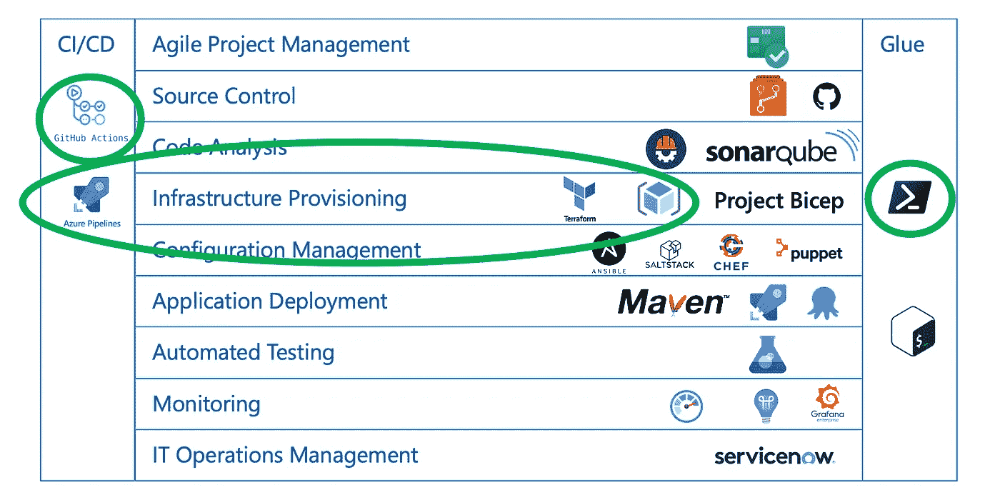

# 将 Terraform 与 Azure、Azure Pipelines 和 GitHub 操作一起使用

> 原文：<https://levelup.gitconnected.com/using-terraform-with-azure-azure-pipelines-github-actions-86e043bd0d9e>

## Azure CLI 和 PowerShell 是您的朋友

Terraform(基础设施供应)、Azure Pipelines (CI/CD)和 GitHub Actions (CI)都非常受欢迎。所以它们经常一起使用也就不足为奇了。虽然我使用了一些 Azure DevOps 扩展和 GitHub 动作，但我发现自己主要依赖脚本进行集成。

在这篇文章中，我分享了我用来将 Terraform 与 Azure Pipeline 或 GitHub Action workflow 集成的方法，我如何处理 Terraform 资源提供者不支持某个特定功能的情况，以及一些其他技巧。

因为我是一个 Azure 的家伙，我将专注于用 Terraform 创建 **Azure** 资源。我将跳过地形基础知识，[这里有很棒的(视频)学习内容作为介绍](https://learn.hashicorp.com/collections/terraform/azure-get-started)。其他技术选择是 PowerShell 作为脚本外壳的选择，以及 YAML Azure 管道，即忽略经典(ClickOps)管道。下面的模式也适用于其他超大规模和工具。

我将在下面介绍的主题是:

*   Azure 提供程序配置
*   提供者版本控制
*   Azure 后端配置
*   地形版本化
*   输入变量
*   功能回退到 Azure CLI
*   输出变量
*   拆卸
*   端到端示例

作为参考，使用的工具及其在 DevOps 工具分类中的位置:

关于 DevOps 工具的完整参考模型，请参考[周期表](https://digital.ai/periodic-table-of-devops-tools):

 [## DevOps 周期表

### DevOps 工具周期表是行业内识别最佳工具的首选资源…

数字. ai](https://digital.ai/periodic-table-of-devops-tools) 

# **Azure 提供者配置**

我从来没有为 Terraform 使用单独的凭证。交互使用 Terraform，支持继承 Azure CLI 用户凭证，如这里的[所述](https://registry.terraform.io/providers/hashicorp/azurerm/latest/docs/guides/azure_cli)。使用 Azure CLI 或 Terraform 时，基本上有两种类型的脚本可以确保订阅保持一致:

使用 Azure CLI 以交互方式向 Terraform 进行身份验证，ARM_SUBSCRIPTION_ID 优先

或者

使用 Azure CLI 以交互方式向 Terraform 进行身份验证，订阅连接优先

这是交互式的。那么，如何在自动化中共享凭证呢？Terraform 仅支持在作为用户而非服务主体进行身份验证时使用 Azure CLI 会话。对于 **Azure Pipelines** ，还有另一种方法，但是您需要为您的管道配置一个 Azure 服务连接。如果你还没有这样做，创建一个描述[在这里](https://docs.microsoft.com/en-us/azure/devops/pipelines/library/service-endpoints?view=azure-devops&tabs=yaml)。使用 [Azure CLI 任务](https://docs.microsoft.com/en-us/azure/devops/pipelines/tasks/deploy/azure-cli?view=azure-devops)，并将其配置为将服务主体凭证公开为环境变量(`addSpnToEnvironment: true`)。这允许您捕获服务主体凭证，并使用相同的凭证配置 Terraform:

Terraform 身份验证继承 Azure 管道服务连接凭据

注意零合并操作符`??=`的使用。环境变量只有在尚未定义时才会被设置，如果已经定义，则不会被覆盖。

在 **GitHub Actions** 中,(目前)没有与 Azure 的原生集成，即预先存在的连接可以被重用。相反，Azure 登录操作需要配置一个密码，如这里的[所述](https://github.com/marketplace/actions/azure-login)。这将像下面这样存储一个 json 值作为秘密:

GitHub Azure 登录操作的 Azure 服务主体凭据

一旦存储，相同的秘密可用于 Terraform:

Terraform 身份验证重用 GitHub Azure 操作凭据

由于其他平台提供者或者不需要配置(例如，[证书](https://registry.terraform.io/providers/hashicorp/tls)、[云初始化](https://registry.terraform.io/providers/hashicorp/cloudinit)、[随机](https://registry.terraform.io/providers/hashicorp/random)生成器)，或者基于另一个提供者(例如， [Azure](https://registry.terraform.io/providers/hashicorp/azurerm) 、 [AAD](https://registry.terraform.io/providers/hashicorp/azuread) )创建的资源的输出来动态配置(例如， [DNS](https://registry.terraform.io/providers/hashicorp/dns) 、 [Helm](https://registry.terraform.io/providers/hashicorp/helm) 、 [Kubernetes](https://registry.terraform.io/providers/hashicorp/kubernetes) )，这覆盖了 99%的

# 提供者版本控制

这实际上是标准的 Terraform，但我将在这里介绍它:提供者依赖关系(从版本 0.14 开始)在 [.terraform.lock.hcl 依赖关系锁文件](https://www.terraform.io/docs/language/dependency-lock.html)中捕获。Hashicorp 建议将该文件包含在源代码控制中，以便在自动化中使用。

# Azure 后端配置

Terraform 可以在[后端](https://www.terraform.io/docs/language/settings/backends/index.html)中维护其状态，而不是在本地磁盘上。我使用的是 [azurerm 后端](https://www.terraform.io/docs/language/settings/backends/azurerm.html)，它使用一个存储帐户，需要额外的配置。为了能够使用后端，而不将任何敏感信息检查到 Git 中，我使用了[部分配置](https://www.terraform.io/docs/language/settings/backends/configuration.html#partial-configuration)。也就是说，我有一个 backend.tf 模板，它被部分填充，然后在初始化 Terraform 时将其余部分作为参数传入:

Azure Pipeline 中的 Terraform 后端设置

为了确保 Terraform 能够访问用于后端的存储帐户，可以定义`ARM_SAS_TOKEN`(我推荐使用容器级 SAS 令牌)`ARM_ACCESS_KEY`(存储帐户密钥，不推荐)，或者授予运行 Terraform 的服务主体[存储 Blob 数据贡献者](https://docs.microsoft.com/en-us/azure/role-based-access-control/built-in-roles#storage-blob-data-contributor)角色。

Terraform 后端支持的一件事是使用不同的工作空间，例如用于开发、测试等的不同配置。如果你使用的是 Terraform 后端，那么通过`TF_WORKSPACE`变量锁定要使用的工作空间是个好主意。这确保了 Terraform 不会接触到在其他工作空间中创建的资源。

# 地形版本化

为了与所用的 Terraform 版本保持一致，我使用了一个[。本地带有](https://github.com/tfutils/tfenv#terraform-version-file) [tfenv](https://github.com/tfutils/tfenv) 的 terraform-version 文件(仅在 Linux & macOS 上工作)。要在 Azure 管道中使用该文件中存储的版本:

在 Azure Pipeline 中使用首选的 Terraform 版本

或者在 GitHub Actions 中，类似的方法是:

在 GitHub 操作中使用首选的 Terraform 版本

# 输入变量

在 Azure 管道中，输入变量需要特殊处理。环境变量总是被转换成大写，而输入变量(按照命名约定)是小写的。假设有一个输入变量`foo`:

地形变量' foo '

为了覆盖一个变量的值，定义了一个 Azure Pipeline 变量`TF_VAR_foo="bar"`，但是它将被转换成一个环境变量`TF_VAR_FOO="bar"`，因此 Terraform 将看不到它，并将使用“notbar”作为`var.foo`的值。

为了解决这个问题，需要一些环境变量的巫术。以下代码涵盖了 Linux 和 Windows 两种版本(纯 Linux 版本可能更短):

修复 Azure Pipeline 中 TF_VAR 环境变量的情况

`TF_VAR_FOO`将被转换回`TF_VAR_foo`，Terraform 将使用“bar”作为`var.foo`的值。

由于 **GitHub Actions** 不修改环境变量(hurray)的情况，所以没有什么需要修复的。

当我们讨论环境变量时，请确保也设置了`TF_IN_AUTOMATION=true`和`TF_INPUT=0`。这将防止 Terraform 在自动化过程中因用户输入而停止。

# 功能回退到 Azure CLI

任何使用 Terraform 的人都知道，云服务提供商通常不会实现 100%的底层服务。给定的资源完全不受支持，或者受支持的资源的某些功能无法通过提供程序进行配置。事实上，这(资源 API 覆盖率)是使用 Terraform 的主要缺点。

好吧，如果你能两全其美呢？terra form[Azure RM](https://registry.terraform.io/providers/hashicorp/azurerm/latest/docs)provider 拥有[Azure RM _ resource _ group _ template _ deployment](https://registry.terraform.io/providers/hashicorp/azurerm/latest/docs/resources/resource_group_template_deployment)资源作为一种包罗万象的方法，但我个人更喜欢另一种技术:使用 terra form[local-exec](https://www.terraform.io/docs/language/resources/provisioners/local-exec.html)provisioner 和 Azure CLI:

使用 Azure CLI 扩展 Terraform

在这种特定情况下，[azure RM _ application _ insights](https://registry.terraform.io/providers/hashicorp/azurerm/2.51.0/docs/resources/application_insights)资源尚不支持与日志分析工作区的集成(在[azure RM provider 2.51 版](https://registry.terraform.io/providers/hashicorp/azurerm/2.51.0/docs))。Azure CLI 在创建资源后调用，以执行 Terraform 无法提供的那部分配置。注意，没有指定 shell，所以不管使用 Bash 还是 PowerShell，都可以工作。由于我们将 Terraform 设置为使用与 Azure CLI 相同的安全凭证，订阅排队，并且 Azure CLI 是等幂的，这就可以工作了。

# 输出变量

基础设施只是包括应用程序在内的整体解决方案的一部分。Terraform 供应完成后，需要在已创建的资源上加载数据和部署应用程序。但是为了能够做到这一点，我们需要知道实际的资源 id 或名称是什么。这些通常作为 Terraform 输出变量提供。下面的代码片段将这些变量导出为 **Azure Pipeline** 任务输出:

将 Terraform 输出导出为 Azure 管道任务输出

**GitHub Actions** 有多个模型在步骤之间传递数据。一个作为步骤输出，另一个作为环境变量。这个代码片段实现了这两个功能:

将 Terraform 输出导出为 GitHub 操作步骤输出

# 拆卸

如果您在 CI 中运行 Terraform 来测试资源调配，那么一旦验证通过，您也会破坏基础架构。如果这最后一步失败了，基础设施和相关的成本可能会堆积起来，尤其是在使用夜间构建时。因此，为了确保基础设施总是被破坏，即使在 Terraform 失败的情况下，我有以下方法。首先，我确保定义元数据，以便识别创建了哪些资源:

能够拆卸的 Terraform 仪器

有了上面的标签，下面的任务就能够在 **Azure Pipelines** 中执行拆卸:

拆除 Terraform 在 Azure Pipeline **创造的资源(使用风险自担！)**

同样针对**的 GitHub 动作**是:

在 GitHub actions **中拆除 Terraform 创建的资源(使用风险自担！)**

# 端到端示例

上面的例子都经过了修改，只解决了所描述的问题。它们可以在端到端场景中结合使用，我在这里不做介绍，只是简单地链接到:

[示例 azure 管道(作为 YAML 模板):azure-vdc](https://github.com/geekzter/azure-vdc/blob/master/pipelines/templates/vdc-terraform-apply.yml)
[示例 Azure 管道(作为 YAML 模板):synapse-performance](https://github.com/geekzter/synapse-performance/blob/main/pipelines/templates/synapse-terraform-apply.yml)
[示例 GitHub 动作工作流程:azure-minecraft-docker](https://github.com/geekzter/azure-minecraft-docker/blob/main/.github/workflows/ci-vanilla.yml)