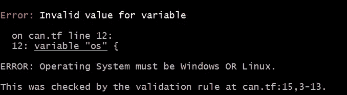
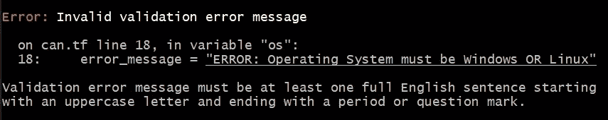
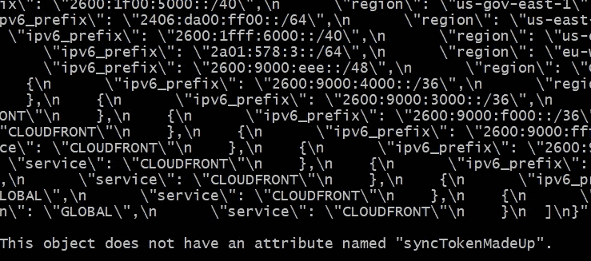
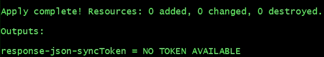

# 使用 Terraform 的 try()、can()和输入验证

> 原文：<https://levelup.gitconnected.com/using-terraforms-try-can-and-input-validation-eb45037af2b2>


塞萨尔·卡里瓦里诺·阿拉贡在 [Unsplash](https://unsplash.com/s/photos/tools?utm_source=unsplash&utm_medium=referral&utm_content=creditCopyText) 上的照片

HashiCorp 在 Terraform 中增加了两个新工具。从 Terraform `v.12.20`开始，消费者可以使用两种新功能`try()`和`can()`。除了这两个功能之外，还有一个实验特性可用，`variable_validation`。在本文中，我们将研究这些新功能是如何使用的以及它们是如何工作的。

**所有代码片段都可以在**[**https://github.com/karl-cardenas-coding/terraform-functions**](https://github.com/karl-cardenas-coding/terraform-functions)找到

注意:*变量验证是从* `*v12.20*` *开始的一项实验性功能，请谨慎使用，因为此时不建议用于生产用途。*

> `can`和`try()`函数只能捕捉和处理*动态*错误，这些错误是由于访问运行时才知道的数据而产生的。它不会捕捉与表达式相关的错误，这些错误对于任何输入都是无效的，例如格式错误的资源引用。

# 可以()

`can()`函数试图执行其内部提供的以下代码，并返回一个布尔值。`can()`功能背后的主要目的是根据官方[文档](https://www.terraform.io/docs/configuration/functions/can.html)进行输入验证。让我们来测试一下。

要启用`input_validation`，请将以下代码块添加到您的 Terraform 配置中。

```
terraform {
  experiments = [variable_validation]
}
```

向 [@d-henn](https://github.com/d-henn) 喊出正则表达式的例子

在上面的例子中，我们有一个名为“os”的变量，是“操作系统”的缩写。这个变量还利用了新的验证功能。让我们在这里分解一下。验证模块有两个组件:

*   条件(必需)
*   错误消息(必需)(**不支持插值**)

条件组件是`can()`开始起作用的地方。在上面的例子中，我们使用正则表达式来确定输入值是“linux”还是“windows”。在这个场景中，`can()`函数将通过`regex()`返回一个布尔值。

`can()`的语法是`can(logic for test, value or variable to test)`。在上面的例子中，变量将值“linux”硬编码为默认值。让我们将它改为另一个值，比如“z/OS ”,看看它在`terraform plan`或`terraform apply`上的表现如何



出错信息

相当整洁！由于我们有能力编写错误消息，所以它非常具有描述性。Terraform 还返回文件中不正确变量值为`can.tf:15,3–13`的文件名和位置。

*有趣的事实是，变量验证是固执己见的，因为它期望正确的英语语法*👵🏻*。*



正确的语法女士们先生们

没有`can()`也可以使用输入验证。在下面的代码片段中，您可以看到对变量“word”的长度进行了评估，以确定它是否大于 1。该变量与随机宠物提供者相关联，并将指示在生成的单词串中有多少宠物。

HashiCorp 在他们的文档中指出`can()`不应该用于错误处理，或者输入验证之外的任何上下文(尽管技术上是可能的)。对于其他场景，建议使用`try()`。因此，在这一点上，让我们继续到`try()`

# 尝试()

`try()`计算所有传递给它的[ **参数…** ]表达式，它将返回第一个没有返回错误的**的值。此时，推荐在[局部值变量](https://www.terraform.io/docs/configuration/locals.html)中使用`try()`。这一建议背后的主要原因是为了降低代码的复杂性，并且只将其用于规范化。也许未来的使用将允许消费者将资源块包装在一个`try()`中？**

在我们深入下面的示例代码之前，让我们从高层次上讨论一下。

**目的**:查询一个端点。该查询检索 AWS 服务的所有公共 IP。[https://ip-ranges.amazonaws.com/ip-ranges.json](https://ip-ranges.amazonaws.com/ip-ranges.json)

**如何**:Terraform 数据资源`http`将查询返回 JSON 响应的 Amazon 端点。

本地人:这是我们的逻辑开始发挥作用的地方，对于我们的三个变量，`syncToken, services, and regions`。

**原因:**`try()`块背后的原因是为了防止亚马逊改变 JSON 模式，或者服务不再公开公共 IP。如果一个突破性的变化发生，那么我们可以考虑到这一点。

既然解释已经结束，让我们深入到`local`模块。第一个变量`syncToken`，试图对来自`data.http.primary-server.body`的响应使用`jsondecode`。

```
syncToken = try(jsondecode(data.http.primary-server.body).syncToken,
              "NO TOKEN AVAILABLE"
              )
```

`jsondecode`函数将 JSON 对象转换成 HCL，然后允许我们通过在末尾使用点符号来访问 syncToken 值。如果服务器不返回 syncToken，那么我们有一个“没有可用令牌”的后备值。后退值可以设置为消费者想要的任何值。如果没有`try()`函数，这将导致一个难看的错误。



没有尝试就出错()

没有`try()`块，这停止了我们的地形运行。使用我们代码中的`try()`块观察下面的结果。



With try()

尽管我们没有收到来自端点的`syncToken`,我们的回退值开始生效，我们的 Terraform 运行得以完成。整洁！

# 用于()

*如果您熟悉`for`循环，请跳到结论。

为了检索所有 AWS S3 IP 地址的过滤列表，我们可以简单地利用 Terraform `for` [循环表达式](https://www.terraform.io/docs/configuration/expressions.html#for-expressions)。如果你没有玩过`for`循环，不要被下面的代码吓倒。请允许我逐行分解:

1.  把它缠绕在一个`try()`上`#line 3`
2.  通过`distinct()` `#line 3`检索所有唯一值
3.  我们希望结果是列表类型的，所以让我们使用`[]`并将我们的`for`循环包装在它的`#line 3`中
4.  使用关键字`for`声明循环。让我们使用一个名为`items`的临时变量来保存我们遍历提供的列表时的每个唯一值。该循环中提供的列表将是来自`data.http.primary-server.body`的资源属性引用。但是，因为我们不想使用原始的 JSON 对象，所以让我们将它转换成 HCL 类型，这样我们就可以使用点符号。因此我们将列表包装在`jsondecode()`中。最后，因为我们可以使用 expect 点符号，所以让我们来看看对象中的`prefixes`属性。`#line 4`
5.  当我们在循环中迭代时，让我们添加每个 IP 地址，但前提是它的服务是 S3 `#line 5`
6.  让我们结束循环，如果传递给循环的列表不存在，就传递回退值。在这种情况下，我们返回一个解释问题的字符串。

*从*[*https://ip-ranges.amazonaws.com/ip-ranges.json*](https://ip-ranges.amazonaws.com/ip-ranges.json)*看 JSON 对象有助于更好地理解点符号。*

# 结论

`can()`和`try()`函数非常简洁，肯定会给消费者的配置模板增加很多价值。在开始使用这些新功能之前，请记住以下经验法则。

*   `can()`用于实验特征`input_validation`，表达式必须返回一个布尔值。
*   `try()`应该用于与规范化相关的操作，最好是在`locals{}`代码块中。
*   如果提供了多个参数`[arguments…]`，则`try()`将返回第一个非错误结果表达式。
*   这两个函数都不能处理运行时才知道的数据访问导致的动态错误。

希望你学到了新的东西！走出去，远离 clickOps，让你的生活自动化！