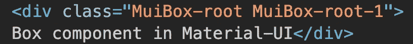
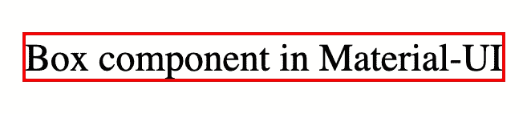
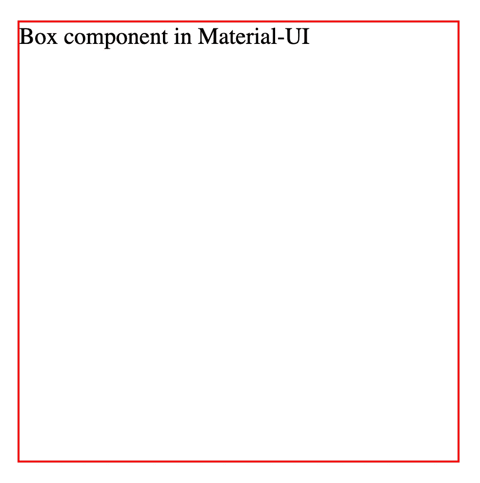
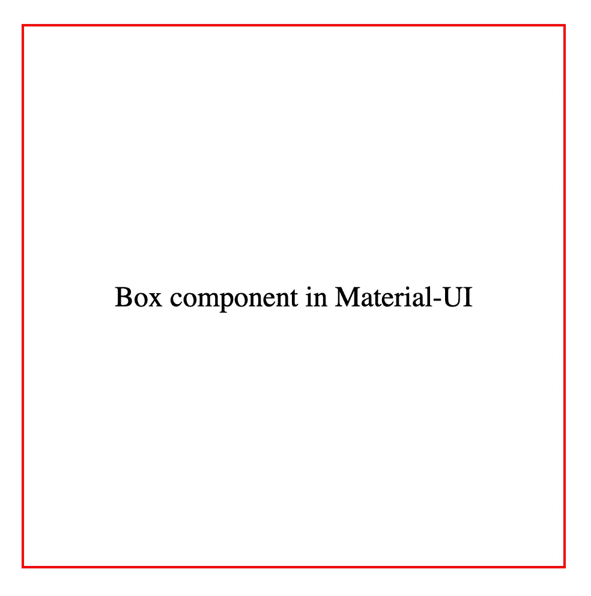
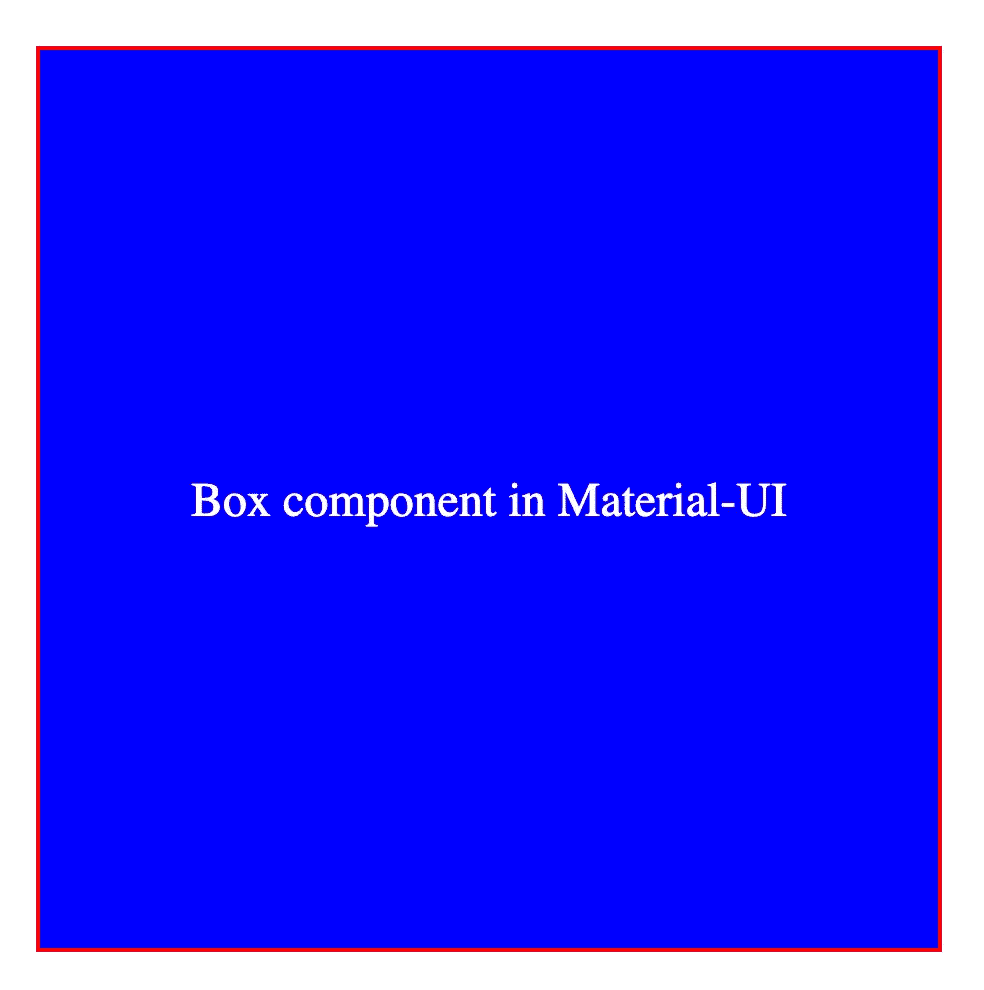
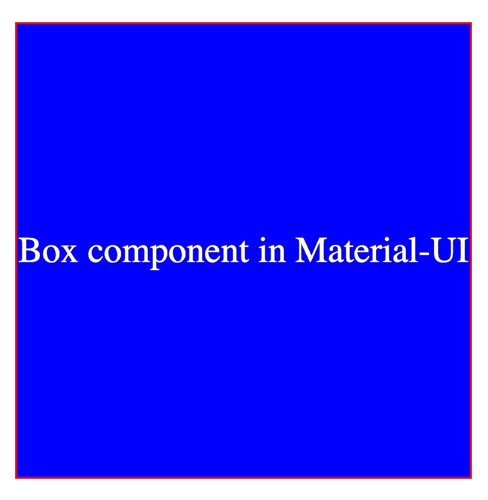

# 使用 Material-UI 中的 Box 组件轻松设置项目样式

> 原文：<https://levelup.gitconnected.com/using-the-box-component-in-material-ui-to-easily-style-your-project-532894edd205>

## 不使用 CSS 文件、CSS-in-JS 或内联样式来设计您的应用程序


[Erda Estremera](https://unsplash.com/@erdaest?utm_source=medium&utm_medium=referral) 在 [Unsplash](https://unsplash.com?utm_source=medium&utm_medium=referral) 上拍照

Material-UI 中的 Box 组件对于设计 React 应用程序中的元素非常有用。你可以不使用任何单独的 CSS 文件，或者使用常用的内置`makeStyles`钩子来实现。

当我第一次了解 Material-UI 时，直到后来才开始接触 Box 组件。现在我每天都在工作中使用它，我意识到它是多么有用。我希望这篇文章能让你对这个组件有所了解，并帮助你设计你的项目。

在本文中，我们将看看 Material-UI 中的 Box 组件。我们将首先讨论它是如何工作的，然后深入一些例子。

如果你是 Material-UI 的新手，看看下面的文章就可以开始了。

[](https://medium.com/swlh/create-a-customized-color-theme-in-material-ui-7205163e541f) [## 在材质界面中创建自定义的颜色主题

### 为下一个 React 项目定制颜色主题很容易

medium.com](https://medium.com/swlh/create-a-customized-color-theme-in-material-ui-7205163e541f) [](https://medium.com/geekculture/what-really-happens-when-you-use-the-textfield-component-in-material-ui-1e62652196f) [## 在 Material-UI 中使用 TextField 组件时，实际会发生什么？

### 让我们更深入地调查一下

medium.com](https://medium.com/geekculture/what-really-happens-when-you-use-the-textfield-component-in-material-ui-1e62652196f) 

# 盒子组件

根据[文档](https://material-ui.com/components/box/)，

> " Box 组件作为一个包装器组件满足了 CSS 实用程序的大部分需求."

你可以把它想象成 HTML 中的一个`<div>`元素。如果我们仔细观察一下，呈现 Box 组件将为我们创建一个 DOM 元素，这是一个`<div>`。

```
<Box>Box component in Material-UI</Box>
```



如果我们想这样传递一个`component`道具，我们可以把这个`<div>`改成另一个元素。

```
<Box component="span">This will now be a span</Box>
```

除了更改 DOM 元素之外，您几乎可以向 Box 组件添加任何 CSS 样式。

以下是您可以使用的不同样式功能的列表。这些都是来自`@material-ui/system`。你可以在这里阅读更多信息[。](https://material-ui.com/system/basics/)

*   [边框](https://material-ui.com/system/borders/#api)
*   [显示](https://material-ui.com/system/display/#api)
*   [柔性盒](https://material-ui.com/system/flexbox/#api)
*   [调色板](https://material-ui.com/system/palette/#api)
*   [职位](https://material-ui.com/system/positions/#api)
*   [阴影](https://material-ui.com/system/shadows/#api)
*   [上浆](https://material-ui.com/system/sizing/#api)
*   [间距](https://material-ui.com/system/spacing/#api)
*   [排版](https://material-ui.com/system/typography/#api)

让我们通过一些例子来看看我们可以使用的一些属性。我们将使用上面创建的 Box 组件。

```
<Box>Box component in Material-UI</Box>
```

# 边境

为了让我们更好地看到我们的例子，让我们添加一个边框。我们可以通过向 Box 组件添加以下道具来实现这一点。

```
border={1} borderColor="red"
```

通过添加这些道具，你可以看到它为我们创造了一个 1px 的红色边框。



# 胶料

我们可以通过添加以下道具来增加盒子的宽度和高度。

```
height={300} width={300}
```

这将使它的高度和宽度各为 300 像素。



# Flexbox

如果我们想让文本居中，我们可以像在 CSS 中一样使用 flexbox。将下列属性传递给组件。

```
display="flex" justifyContent="center" alignItems="center"
```

现在我们的文本在框的中间居中。



# 调色板

我们可以使用颜色属性来控制颜色，使用背景颜色属性来控制背景颜色，如下所示。

```
bgcolor="blue" color="white"
```



# 排印

因为 Box 组件只是为我们创建了一个`<div>`元素，我们可以用它来设计文本的样式。

让我们调整字体大小。

```
fontSize={24}
```



# 间隔

也可以添加边距和间距。Material-UI 为此给了我们一些捷径。我们可以使用 m 和 p 来代替输入边距或填充。

这里列出了我们可以在 Box 组件中使用的所有间距道具。

*   m =保证金
*   mt =页边距-顶部
*   mr =边距-右侧
*   mb =页边距-底部
*   ml =左边距
*   mx =左边距，右边距
*   my =页边距-顶部，页边距-底部
*   p =填充
*   pt =顶部填充
*   pr =右填充
*   pb =底部填充
*   pl =左填充
*   px =左填充，右填充
*   py =顶部填充，底部填充

# 结论

感谢阅读！如果您按照我的示例进行操作，您的最终代码将如下所示。

对于 Material-UI 中的 Box 组件，您还可以做很多我们没有涉及到的事情。如果想在您的应用程序中使用它们，我建议查看它们的文档。

[](https://material-ui.com/components/box/) [## 反应盒组件-材料-用户界面

### Box 组件充当了大多数 CSS 实用程序所需的包装器组件。盒子组件封装了所有的…

material-ui.com](https://material-ui.com/components/box/) 

在 Material-UI 中使用 Box 组件很简单。添加一堆道具有时会变得很混乱，但这使得用最少的代码来设计我们的元素变得很容易。如果你不喜欢添加太多属性，你总是可以选择其他方法来样式化。这确实取决于你的偏好。

如果你想继续学习更多关于 Material-UI 的知识，可以看看下面的两篇文章。

[](/using-breakpoints-and-media-queries-in-material-ui-47470d3c43d9) [## 在 Material-UI 中使用断点和媒体查询

### 如何使用 Material-UI 使您的应用程序响应迅速

levelup.gitconnected.com](/using-breakpoints-and-media-queries-in-material-ui-47470d3c43d9) [](https://medium.com/dev-genius/how-to-apply-dark-mode-using-material-ui-18de9d095d9a) [## 如何使用 Material-UI 应用黑暗模式

### 只需一个开关，即可将 React 应用程序从亮模式切换到暗模式

medium.com](https://medium.com/dev-genius/how-to-apply-dark-mode-using-material-ui-18de9d095d9a)