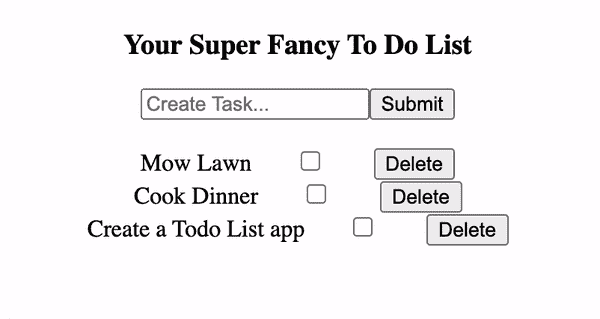
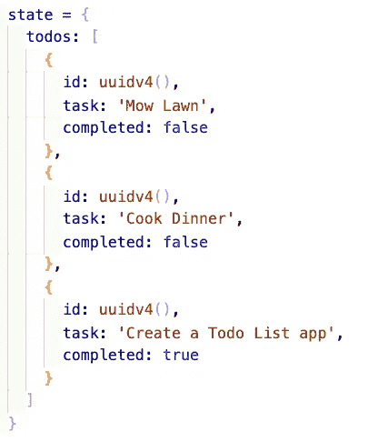
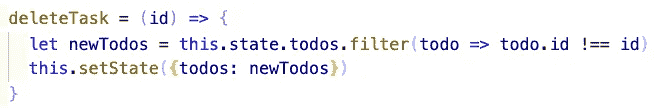

# 在 JavaScript 和 React 中使用过滤函数！

> 原文：<https://levelup.gitconnected.com/using-the-filter-function-in-javascript-and-react-317ff155da73>


JavaScript 的。filter()函数是一个高阶数组函数，它接受回调函数作为参数。它是**非破坏性的**——它将创建一个新数组，然后根据回调的参数将原始数组的内容过滤到新数组中。

这是一个我们的过滤函数的例子。假设我们这里有一组数字:

```
let arr = [1,2,3,4,5,6,7,8]
```

我们想把偶数过滤到一个新的数组中。一种方法是创建一个函数，它接受一个整数数组作为参数。我们将在这个函数中创建一个新的数组，然后创建一个 for 循环，遍历原始数组的每个索引。在每次迭代中，将会检查整数是否能被 2 整除。如果整数是可分的，那么它被压入新数组。然后在 for 循环后返回新数组。

```
function filter(anArray){ let newArr = [] for(let i =0; i< anArray.length; i++){ if(anArray[i] % 2 === 0){ newArr.push(anArray[i]) } } return (newArr)}
```

当我们用之前定义的数组作为参数调用这个函数时，它将返回:


现在随着。filter()高阶函数，这九行代码可以缩减为一行，如下所示:

```
let filtered = arr.filter(num => num % 2 == 0)
```

而当我们对 console.log()变量进行过滤时，我们得到的是和以前一样的数组。

的回调函数性质的更多详细信息。filter()，可以查看一些文档[这里](https://developer.mozilla.org/en-US/docs/Web/JavaScript/Reference/Global_Objects/Array/filter)！

# **滤镜在反应**

的。filter()函数用于多种情况。基本上，该函数主要用于从 state 对象中的嵌套数组中删除对象。让我们来看看我构建的 todo 列表应用程序，它展示了这一点。



这是应用程序的初始状态:



对于要显示的每个任务，这个数组都用一个. map()函数进行迭代。如果您对这个特定应用程序的架构以及每个组件如何通信感兴趣，您可以在这里找到我的博客文章[，或者您可以在这里](/your-basic-props-guide-for-react-js-825cb9574018)找到这个项目的 GitHub 资源库[！](https://github.com/jonathanbrierre/ToDo-Props-Demo)

由于 npm 包 UUID，我们状态中的每个任务对象都有一个惟一的 ID。更多关于 UUID 的信息，你可以在这里找到。

现在，当我们单击 Delete 按钮时，它将获取它所连接的任务的 ID，然后在这里触发这个函数，同时给它一个任务 ID 的参数。



该函数获取当前状态，并根据作为参数传入的 ID 进行过滤。如果 ID 与当前正在迭代的任务的 ID 不匹配，则该任务将被推入新的筛选数组中。如果 ID 匹配，那么它将被过滤函数拒绝。

新数组被保存到一个变量中，然后我们将状态的 todos 数组设置为指向这个变量。

**注意**:这是我们使用这个过滤功能的许多方法之一。如果您对构建动态搜索特性感兴趣(应用程序在用户输入时搜索)，您将需要使用. filter()函数。你可以在我写的名为[的博客中找到如何在 React.js](/building-a-simple-dynamic-search-bar-in-react-js-f1659d64dfae?source=your_stories_page---------------------------) 中构建一个简单的动态搜索栏的方法。编码快乐！

# **资源:**

[](https://developer.mozilla.org/en-US/docs/Web/JavaScript/Reference/Global_Objects/Array/filter) [## Array.prototype.filter()

### 方法创建一个新数组，其中所有元素都通过了由提供的函数实现的测试。函数是一个…

developer.mozilla.org](https://developer.mozilla.org/en-US/docs/Web/JavaScript/Reference/Global_Objects/Array/filter) [](/your-basic-props-guide-for-react-js-825cb9574018) [## React.js 的基本道具指南

### 关于在构建应用程序中使用 props 的演练。

levelup.gitconnected.com](/your-basic-props-guide-for-react-js-825cb9574018) [](https://github.com/jonathanbrierre/ToDo-Props-Demo) [## 乔纳森·布里尔/托多-道具-演示

### 这个项目是用 Create React App 引导的。在项目目录中，您可以运行:在…中运行应用程序

github.com](https://github.com/jonathanbrierre/ToDo-Props-Demo) [](/building-a-simple-dynamic-search-bar-in-react-js-f1659d64dfae) [## 在 React.js 中构建一个简单的动态搜索栏

### 今天，我们将在 React.js 中创建一个动态搜索栏！

levelup.gitconnected.com](/building-a-simple-dynamic-search-bar-in-react-js-f1659d64dfae) [](https://www.npmjs.com/package/uuid) [## uuid

### 对于 RFC4122 UUIDs 的创建完整-支持 RFC4122 版本 1、3、4 和 5 UUIDs 跨平台-支持…

www.npmjs.com](https://www.npmjs.com/package/uuid)