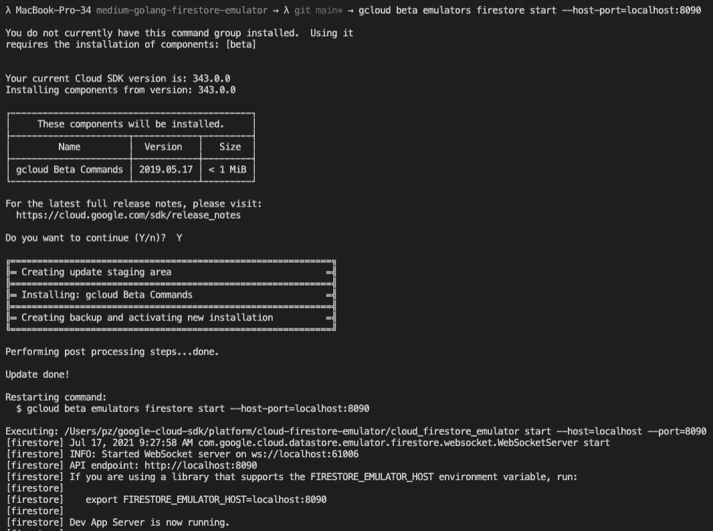
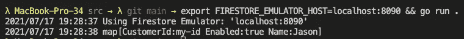

# 使用 GCP Firestore 仿真器进行本地 Go 应用程序开发

> 原文：<https://levelup.gitconnected.com/using-the-gcp-firestore-emulator-for-local-go-application-development-a4aa812e59bf>

本文将简要介绍如何在您的本地机器上使用 GCP Firestore 模拟器来开发您的 Go 应用程序，而不是使用实际的 GCP 项目。

由[前进](https://unsplash.com/@headwayio)在[前进](https://www.unsplash.com/)拍摄

## 本简短教程的要求

*   工作 Go 环境
*   已安装 gcloud SDK

## 为什么首先要使用模拟器？

使用本地仿真器有很多(显而易见的)原因。尽管如此，我将很快列出最重要的，但不会进入详细的解释。

*   无需建立实际的 GCP 项目即可开发
*   与其他开发人员的开发环境没有“冲突”，例如，当多个开发人员在同一个“沙盒”Firestore 上工作时
*   每次启动模拟器时 Firestore 服务的干净状态。→当需要播种数据时，这也是完美的
*   与使用“真正的”服务相比，不涉及任何费用
*   在进行本地开发时，没有关于服务帐户权限的问题。→当然，在将其推向生产之前，您应该在实际的沙盒环境中进行测试。😉

## 安装 GCP Firestore 模拟器

安装 GCP Firestore 模拟器不能再容易了。你只需要使用`gcloud beta emulators firestore start`命令来启动 Firestore 模拟器。如果您尚未安装，gcloud SDK 将询问您是否要安装包含 Firestore 模拟器的`beta`命令。在那里你只需要点击`Y`，你就可以开始了。

在下图中，您可以看到 SDK 是如何请求您允许安装 gcloud beta 命令的。安装完成后，它会自动重启`firestore start`命令，并使您的本地 Firestore 服务器可以被您的应用程序访问。

安装“gcloud beta 命令”

在上面的例子中，我显式地将`--host-port`参数设置为`localhost:8090`，以告诉 gcloud 我希望 Firestore 服务器在`localhost:8090`时可达，这非常重要，这样我们就可以稍后用 Go 应用程序连接到它。

## Go 应用程序

这一节想要检查我们需要连接到本地 Firestore 实例的 Go 应用程序代码。

作为一个小小的免责声明:我故意没有包括正确的错误处理和将逻辑拆分到多个文件，因为这是一个非常基本的例子。这将使这一目的变得不必要的复杂。

我还为您提供了一个公共的 GitHub 库，如果您想查看完整的演示项目代码，可以查看一下。

 [## abszisex/medium-golang-firestore-仿真器

### 小例子项目使用 GCP Firestore 仿真器与 Go 编程语言。##启动 Firestore 模拟器…

github.com](https://github.com/Abszissex/medium-golang-firestore-emulator) 

下面的代码片段显示了`go.mod`文件。如您所见，我们只需要一个依赖项。`cloud.google.com/go/firestore`包提供了与 GCP·凡斯托通信的方法。

如果你已经和 GCP·凡士多在围棋上合作过至少一次，下面的`main.go`文件应该非常简单。但是同样，如果你以前没有使用过它，它应该还是很容易理解的。

本文最重要的部分是`1.`。这里的代码检查是否有一个名为`FIRESTORE_EMULATOR_HOST` set 的环境变量。但是，如果变量可用，它只打印到命令行，但不引入任何业务逻辑。这里“神奇”的部分是你的代码不需要知道任何关于`FIRESTORE_EMULATOR_HOST`变量的事情。幸运的是`cloud.google.com/go/firestore`包完全在内部处理它。在包内，代码检查这个环境变量是否可用。它使用该变量的值作为 Firestore 服务的主机地址。我添加了上面的检查来验证您的本地环境是否一切正常。

步骤 2-6 非常简单。我们创建一个新的客户端(2。)并确保如果应用程序关闭，它将被关闭(3。).步骤 4 在我们的`customers`集合中创建新的`customer`文档，其中文档 ID/key 是`customerId`。在第 5 步之后，在第 6 步中，从 Firestore 检索刚刚编写的文档，并将文档数据打印到控制台。这里没什么特别的。

## 将 Go 应用程序指向本地 Firestore

既然我们知道不必为本地 Firestore 实例做任何修改，我们只需以某种方式将变量传递给我们的应用程序，一切都将按预期运行。

细心的读者可能已经注意到，本地 Firestore 实例会告诉您在启动它时应该做什么，就像我们在本文开始时安装并启动它一样。它告诉你你只需要`export`这个变量，Firestore Go 包就可以访问它。

在下面的代码片段中，您可以看到最简单的方法。

我们正在设置`FIRESTORE_EMULATOR_HOST`变量，并分配我们在启动本地 Firestore 实例时定义的主机地址。如果您不确定是否可以检查本地 Firestore 的 CLI 输出，它会再次告诉您确切的命令。在我们设置了环境变量之后，我们通过`go run .`运行我们的`main.go`文件。这样，我们的 Go 应用程序就知道了`FIRESTORE_EMULATOR_HOST`环境变量并可以使用它。

如果你在 GitHub 上使用我的演示项目，在运行上面的命令之前，你必须首先导航到`src`文件夹。

运行上面的代码片段后，您应该会看到以下输出:

正如您在上面的图片中看到的，希望在您的本地机器上也能看到，应用程序告诉我们，我们正在我们定义的`localhost:8090`主机地址上使用 Firestore 模拟器，并且接收到的文档的输出看起来也不错。

除此之外，您还应该在启动本地 Firestore 实例的终端上看到一些日志。

# 摘要

如您所见，出于开发目的使用本地 Firestore 实例毫不费力。因此，在我看来，除了最后的测试之外，与使用真实的情况相比，这应该总是首选的情况。

您唯一需要做的就是安装 gcloud beta 命令，启动服务器，并在启动应用程序时导出环境变量。没有比这更容易的了。😉

## 你想联系吗？

如果你想联系我，请在 LinkedIn 上打电话给我。

另外，请随意查看我的书籍推荐📚。

 [## 我的书籍推荐

### 在接下来的章节中，你可以找到我对所有日常生活话题的书籍推荐，它们对我帮助很大。

mr-pascal.medium.com](https://mr-pascal.medium.com/my-book-recommendations-4b9f73bf961b)  [## 通过我的推荐链接加入 Medium—Pascal Zwikirsch

### 作为一个媒体会员，你的会员费的一部分会给你阅读的作家，你可以完全接触到每一个故事…

mr-pascal.medium.com](https://mr-pascal.medium.com/membership)