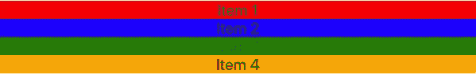
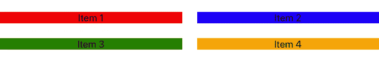
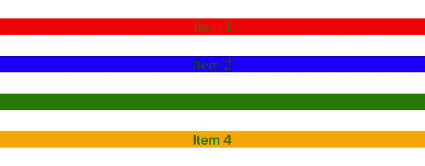
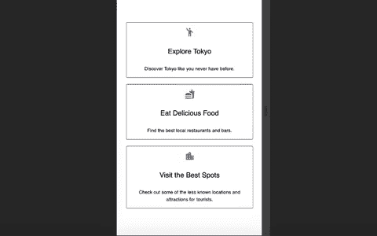

# 使用 Material-UI 中的网格组件创建响应式布局

> 原文：<https://levelup.gitconnected.com/using-the-grid-component-in-material-ui-to-create-responsive-layouts-7b9de0d11c6>

## 了解网格容器和网格项目之间的区别


萨姆·穆卡达姆在 [Unsplash](https://unsplash.com?utm_source=medium&utm_medium=referral) 上拍摄的照片

在本文中，我们将了解如何使用 Material-UI 中的网格组件为 React 应用程序创建响应性布局。

我们将首先了解网格容器和网格项是如何工作的。然后，我们将看看如何使用断点、填充和 flexbox 来创建响应性布局。

最后，我们将继续构建网站的系列。在上一篇文章中，我们添加了一个带有背景视频的英雄部分。如果你错过了那篇文章，你可以点击查看[。您还可以在下面找到本系列所有文章的链接。](/how-to-create-a-hero-section-with-video-using-react-player-aa46445094db)

1.  [用 React 和 Material-UI 创建一个注册页面](/create-a-signup-page-with-react-and-material-ui-9b203d18cf3f)
2.  [将 React 挂钩形式与 Material-UI 组件一起使用](/using-react-hook-form-with-material-ui-components-ba42ace9507a)
3.  [如何用 Material-UI 创建导航栏](/how-to-create-a-navigation-bar-with-material-ui-9cbcfcec2570)
4.  [如何使用 React 播放器创建带有视频的英雄部分](/how-to-create-a-hero-section-with-video-using-react-player-aa46445094db)
5.  **使用 Material-UI 中的网格组件创建响应式布局**

我们开始吧！

# 网格组件是如何工作的？

根据[文档](https://material-ui.com/components/grid/)，以下列表描述了网格组件的工作方式:

*   它使用 [CSS 的柔性盒模块](https://www.w3.org/TR/css-flexbox-1/)以获得高灵活性。
*   布局有两种:*集装箱*和*物品*。
*   项目宽度是以百分比设置的，因此它们总是相对于其父元素而变化和调整大小。
*   项目具有填充以在各个项目之间创建间距。
*   有五个网格断点:xs、sm、md、lg 和 xl。

为了演示网格组件，我将创建一个如下所示的基本示例。

```
<Grid container>
  <Grid item>
    <div style={{ backgroundColor: 'red', textAlign: 'center' }}>
      Item 1
    </div>
  </Grid>
  <Grid item>
    <div style={{ backgroundColor: 'blue', textAlign: 'center' }}>
      Item 2
    </div>
  </Grid>
  <Grid item>
    <div style={{ backgroundColor: 'green', textAlign: 'center' }}>
      Item 3
    </div>
  </Grid>
  <Grid item>
    <div style={{ backgroundColor: 'orange', textAlign: 'center' }}>
      Item 4
    </div>
  </Grid>
</Grid>
```

在这个例子中，我创建了一个网格容器，在这个容器中，我有 3 个网格项。请记住，物品应始终包装在一个容器内。在每个网格项中，我还添加了一个具有不同背景颜色的子元素`<div>`,以帮助可视化正在发生的事情。我们现在应该看到的是这个。


## 创建响应式布局

在每个网格项目中，可以使用断点来创建流体网格布局。要了解更多关于 Material-UI 中断点的信息，请查看下面的文章。

[](/using-breakpoints-and-media-queries-in-material-ui-47470d3c43d9) [## 在 Material-UI 中使用断点和媒体查询

### 如何使用 Material-UI 使您的应用程序响应迅速

levelup.gitconnected.com](/using-breakpoints-and-media-queries-in-material-ui-47470d3c43d9) 

Material-UI 中的响应 UI 基于 12 列网格布局。为了更好地理解这一点，想象你正在看的网站被分成 12 个偶数栏。您传递的数字会将网格设置为在断点宽度中占据那么多列。

比如，我们给每个网格项添加`xs={12}`作为道具。这意味着任何时候页面的宽度在`xs`断点或以上，项目将占据 12 列(整个屏幕的宽度)。因为我们没有为更高的断点设置任何值，所以该项将总是占据 12 列。



如果我们也给每个项目添加`sm={6}`，当我们点击`sm`断点及以上时，每个项目将只占 6 列(屏幕宽度的 50%)。


我们还可以为`md`、`lg`和`xl`断点添加相同的道具。

## 添加间距

为了增加每个网格项目之间的间距，我们可以向网格容器组件添加一个间距属性。此间距作为填充添加到每个网格项目中。如果我们将`spacing={3}`作为道具添加到网格容器中，我们将会看到以下内容。



## 使用 flexbox 属性

Material-UI 中的网格组件是基于 CSS Flexbox 的。如果你不熟悉 flexbox，我强烈推荐你学习它，因为它对现代网站开发至关重要。

我们还可以将 flexbox 属性添加到网格容器中。如果我们向容器组件传递一个属性`direction="column"`，它将指向 flex-direction 属性。这将导致以下结果。



我们也可以通过使用`justify`和`alignItems`属性来设置内容对齐和项目对齐。

# 将其实施到我们的项目中

现在我们已经了解了网格组件是如何工作的，让我们将它合并到我们的项目中。我们将使用网格组件为我们正在开发的网站构建一个功能部分。

特色部分将包含 3 张卡片。当处于`xs`宽度时，每张牌将占据 12 列。当在`sm`宽度及以上时，每张牌将占据 4 列。因为我们有三张牌，如果每张牌占据 4 列，那么这些牌将总是在一行中。

首先，创建一个名为`Features.js`的新文件。然后创建一个名为 Features 的样板组件并导出它。最后，导入`App.js`文件中的组件，渲染到 Hero 组件下。

`App.js`文件现在将被更新成这样。

```
import Navbar from './Navbar';
import Hero from './Hero';
import Features from './Features';const App = () => {
  return (
    <div className="App">
      <Navbar />
      <Hero />
      <Features />
    </div>
  );
};export default App;
```

在`Features.js`文件中，我将从 Material-UI 导入以下组件和图标。

```
import { makeStyles } from '@material-ui/core/styles';
import Grid from '@material-ui/core/Grid';
import Typography from '@material-ui/core/Typography';
import Container from '@material-ui/core/Container';
import EmojiPeopleIcon from '@material-ui/icons/EmojiPeople';
import FastfoodIcon from '@material-ui/icons/Fastfood';
import LocationCityIcon from '@material-ui/icons/LocationCity';
```

像我们之前的练习一样，创建一个网格容器和 3 个网格项作为子元素。在网格容器中，传递`spacing={3}`和`alignItems="stretch"`的道具。每个网格项目都有道具`xs={12}`和`sm={4}`。

```
<Grid container spacing={3} alignItems="stretch">
  <Grid item xs={12} sm={4}>Card 1</Grid>
  <Grid item xs={12} sm={4}>Card 2</Grid>
  <Grid item xs={12} sm={4}>Card 3</Grid>
</Grid>
```

在每个网格项目中，我们将创建一张如下所示的卡片。

```
<div className={classes.card}>
  <EmojiPeopleIcon
    color="primary"
    fontSize="large"
    className={classes.icon}
  />
  <Typography variant="h5" component="h3" className={classes.title}>
    Explore Tokyo
  </Typography>
  <Typography className={classes.featureList}>
    Discover Tokyo like you never have before.
  </Typography>
</div>
```

我们还使用 Material-UI 中的`makeStyles`钩子生成器来给卡片添加样式。

```
const useStyles = makeStyles(*theme* => ({
  root: {
    padding: theme.spacing(12, 4),
  },
  card: {
    height: '100%',
    width: '100%',
    display: 'flex',
    flexDirection: 'column',
    alignItems: 'center',
    border: '1px solid black',
    borderRadius: '5px',
    textAlign: 'center',
  },
  icon: {
    padding: theme.spacing(2, 0),
  },
  title: {
    padding: theme.spacing(2),
  },
  featureList: {
    padding: theme.spacing(2),
  },
}));
```

我们要做的最后一件事是将整个网格容器包装在一个容器组件中。这个容器组件将在整个网格上设置一个最大宽度，并为我们添加一些填充。

最终的`Features.js`文件将如下所示。

# 结论

感谢阅读！最终的特性部分将如下所示。



Material-UI 中的网格组件使得为网站创建响应性布局变得容易。

如果你想看这个项目到目前为止的完整源代码，请查看下面我的 GitHub repo。请务必检查*功能-章节*分支的最新代码。

[](https://github.com/chadmuro/medium-signup/tree/features-section) [## Chad muro/中型注册

### 这个项目是用 Create React App 引导的。在项目目录中，您可以运行:在…中运行应用程序

github.com](https://github.com/chadmuro/medium-signup/tree/features-section) 

对了，我终于决定了我要把这个网站往什么方向走。这将是去日本东京的游客的简单旅行指南。我已经在这里生活了 7 年多，希望分享一些我最喜欢的地方。

我的计划是完成网站 UI 的构建，并使用 Netlify 进行部署。我还在考虑使用 Firebase 进行用户认证和存储用户数据(整个项目从注册表单开始，所以我们也可以利用它)。

敬请期待更多文章！我希望在我们一起构建的过程中，您一直喜欢这个系列。

如果你错过了上一篇文章，我们用背景视频创建了一个英雄部分，看看下面。

[](/how-to-create-a-hero-section-with-video-using-react-player-aa46445094db) [## 如何使用 React-Player 创建带有视频的英雄部分

### 用背景视频突出你的英雄部分

levelup.gitconnected.com](/how-to-create-a-hero-section-with-video-using-react-player-aa46445094db)