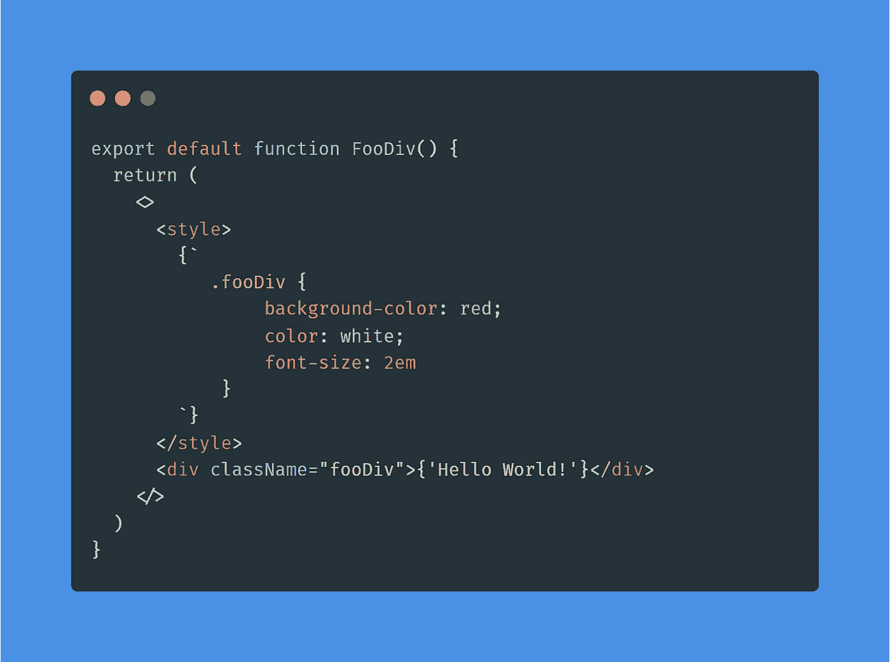

# 使用 HTML 样式标记来样式化 React 组件

> 原文：<https://levelup.gitconnected.com/using-the-html-style-tag-to-style-a-react-component-b3203e8eb0d9>

## 您知道吗，您可以使用原始 CSS 而无需额外文件来设计 React 组件的样式？

在 React 中，有许多方法可以对组件进行样式化，但是有些方法比其他方法更受欢迎。假设您想要使用原始 CSS。此外，为了简单起见，您不希望将样式定义外化到另一个文件中。

你知道这在香草反应中实际上是可能的吗？你如何实现这个目标？感谢 HTML `[style](https://developer.mozilla.org/en-US/docs/Web/HTML/Element/style)`元素！

> HTML 元素包含了一个文档或者文档的一部分的样式信息。它包含 CSS，应用于包含`<style>`元素的文档内容。— [<样式>:样式信息元素](https://developer.mozilla.org/en-US/docs/Web/HTML/Element/style)

因此，让我们看看如何使用 HTML `style`标签来定义一个具有原始 CSS 中定义的样式的单文件 React 组件。

# 用

使用`<style>`来设计一个组件非常简单，如下所示:

您可以在这里测试这种方法:

基于`<style>-`的方法正在发挥作用

通过修改包含在`style`元素中的原始 CSS 规则，您可以看到`FooDiv`组件在外观上发生了相应的变化。

请记住，`<style>`的这种用法不符合[当前 HTML 规范](https://html.spec.whatwg.org/)。如这里所说的，`<style>`应该用在需要元数据内容的地方，或者用在作为`[head](https://developer.mozilla.org/en-US/docs/Web/HTML/Element/head)`元素的子元素的`[noscript](https://developer.mozilla.org/en-US/docs/Web/HTML/Element/noscript)`元素中。换句话说，它不应该在`body`标签中使用。另一方面，所有现代浏览器都支持这种用法，甚至[https://google.com](https://google.com)目前也依赖它。

在组件定义中使用`<style>`就像定义下面的`style.css`文件:

并将其导入组件，如下所示:

最后一种方法是最流行的方法之一，但是它涉及两个文件。相反，通过使用`<style>`,你可以在使用原始 CSS 的时候用一个文件定义一个样式化的组件。

您可以使用 [CSS-in-JS](https://reactjs.org/docs/faq-styling.html#what-is-css-in-js) 方法定义一个样式化的组件，如下所示:

这允许您将样式化的组件定义保存在一个文件中，但是这涉及到 CSS-in-JS 语法。而通过采用 HTML `style`标签，你可以使用原始的 CSS。

# 结论

在 React 中有几乎无穷无尽的方法来设计组件的样式，但是使用 HTML `style`元素是最有创意和最不寻常的方法之一。这种方法允许您使用原始 CSS，同时将样式化的组件定义减少到一个文件。因此，它结合了外部样式文件方法和 CSS-in-JS 方法的主要特征。使用`<style>`很简单，并且展示了如何去做，这也是本文的主题。

感谢阅读！我希望我的故事对你有所帮助。如果有任何问题、意见或建议，请随时联系我。