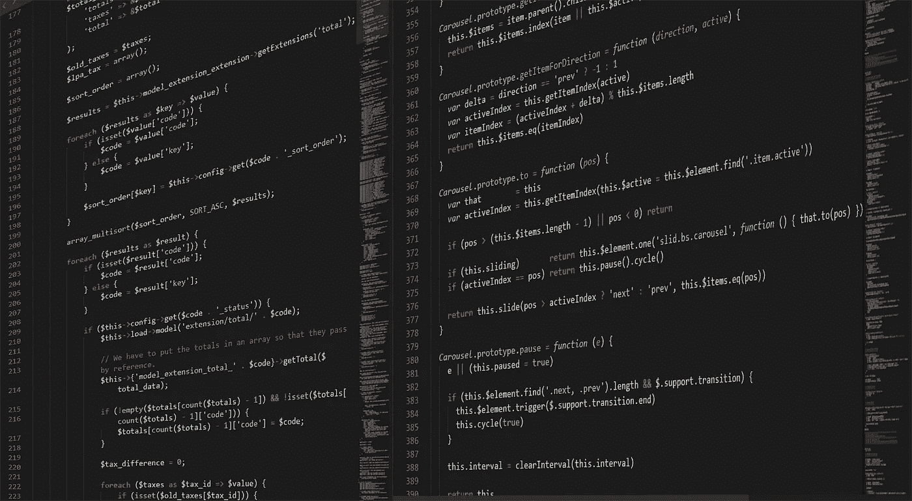
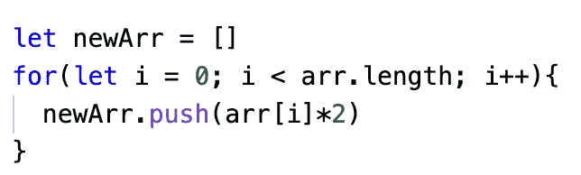
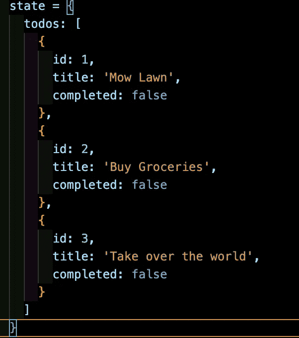
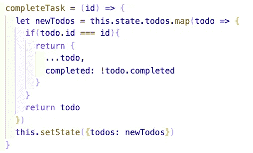
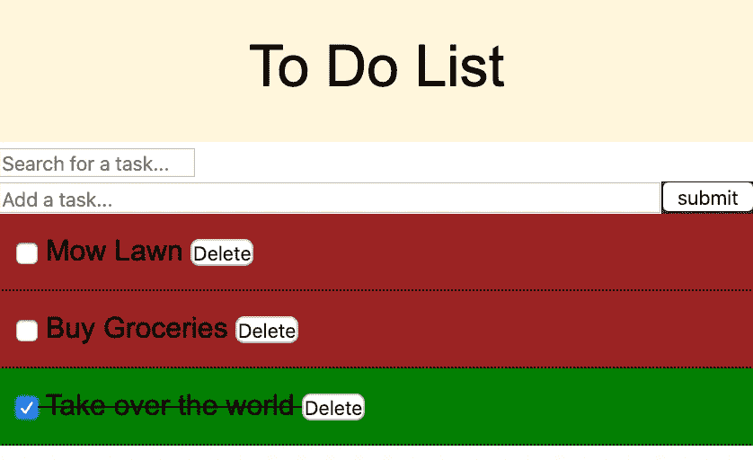

# 在 Javascript 和 React 中使用 Map 函数！

> 原文：<https://levelup.gitconnected.com/using-the-map-function-in-javascript-react-b433736759d4>



今天我将介绍如何在 Javascript 和 React 中使用`.map`高阶函数。Map 是一个可以在元素数组上调用的函数，它允许程序员以特定的方式修改元素。

假设我们有一个包含不同数字的数组:

```
const arr = [2,3,4,5]
```

不管出于什么原因，我们都希望所有这些数字都被加倍，并作为一个单独的数组返回。我们可以用`.map`的方法！

```
const doubledArr = arr.map( function(num){return num * 2})
```

`map`被认为是一个高阶函数，因为它接受一个回调函数的参数来操作你的数据。上述内容也可以使用 ES6 的箭头函数语法重写:

```
const doubledArr = arr.map(num => num * 2)
```

现在，如果我们将`doubledArr`登录到我们的控制台，我们将得到一组数字，如下所示:

```
[ 4, 6, 8, 10 ]
```

发生这种情况是因为在幕后，我们的`.map`的行为就像一个 for 循环，遍历数组中的每个元素，根据需要修改元素，然后将修改后的元素推入一个新的数组:



# 反应中的贴图

**假设:**
——你知道如何给组件
添加事件监听器——你知道如何在组件内传递函数作为道具。我推荐我的博客文章，标题是“React.js 的基本道具指南”，不仅是道具指南，也是下面的待办事项列表应用程序的架构指南。

假设我们想要构建一个待办事项列表应用程序。在我们的 App.js 文件中，我们可以如下定义我们的状态:



在上图中，我们将待办事项列表定义为一个键，指向状态对象中的待办事项对象数组。每个任务对象都有一个键，“completed”指向一个布尔值，表示我们是否已经完成了一个单独的任务。

现在，为了使这个待办事项列表应用程序有效，我们想假设有一个点击事件，它以一种方式改变状态，其中单个待办事项任务将其“已完成”布尔值更改为相反的值。我们现在将使用`.map`方法来演示如何改变 react 应用程序的状态。



在上面的例子中，我们将单个任务的 ID 传递给我们定义的方法`completeTask`。这样，我们可以在状态对象中引用单个任务。

有了 id，我们可以在 todos 的当前状态上使用`.map()`来查找传入的 ID 与被迭代的 todo 的 ID 相匹配的地方。当它们匹配时，我们将创建一个与原始 todo 对象具有相同内容的新对象，除了将`completed`键设置为相反的值。这样就可以避免直接突变我们的状态！

如果 id 不匹配，那么我们将简单地返回被迭代的对象。

一旦 map 函数运行完毕，新的对象数组将被保存到一个新的变量`newTodos`中。然后，我们使用`this.setState()`作为一种手段，通过将`todos`设置为`newTodos`来编辑我们的当前状态。

正如我之前提到的，这个方法是针对单个点击事件的。假设每个任务对象都与一个组件相关联，该组件通过所述点击事件呈现一个 div。当每个任务组件呈现时，每次我们用指定的事件侦听器单击 div，我们现在将通过使用 map 方法来更改该任务的 completed 键的值。



# 参考资料:

[](https://developer.mozilla.org/en-US/docs/Web/JavaScript/Reference/Global_Objects/Array/map) [## Array.prototype.map()

### map()方法创建了一个新的数组，该数组填充了对…

developer.mozilla.org](https://developer.mozilla.org/en-US/docs/Web/JavaScript/Reference/Global_Objects/Array/map) [](https://dev.to/damcosset/higher-order-functions-in-javascript-4j8b) [## Javascript 中的高阶函数

### 在 Javascript 中，函数是值(一等公民)。这意味着它们可以被赋给一个变量和/或…

开发到](https://dev.to/damcosset/higher-order-functions-in-javascript-4j8b) [](https://skilled.dev) [## 编写面试问题

### 一个完整的平台，在这里我会教你找到下一份工作所需的一切，以及…

技术开发](https://skilled.dev)