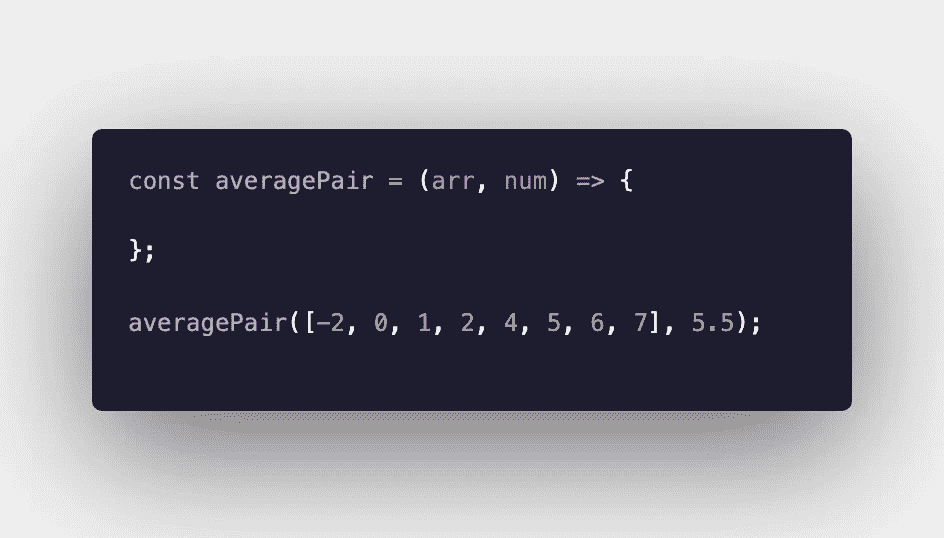
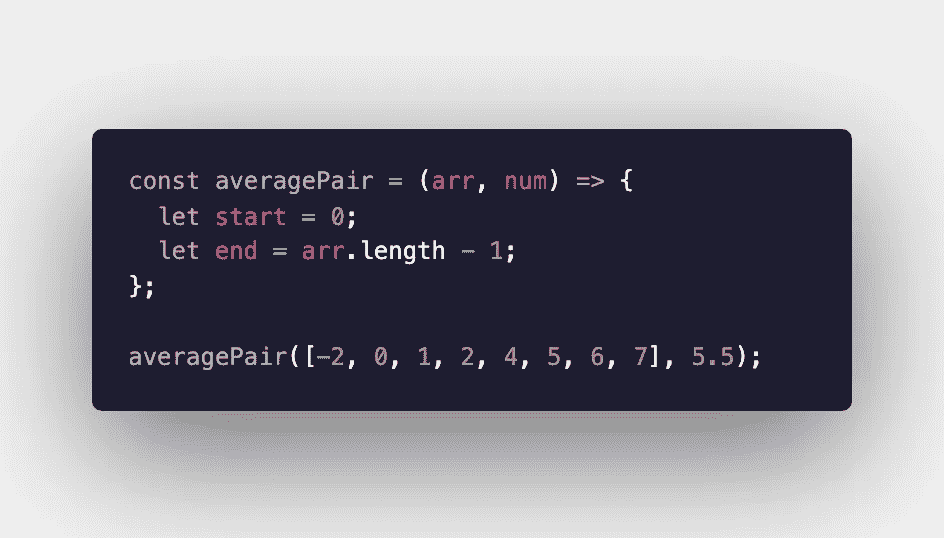
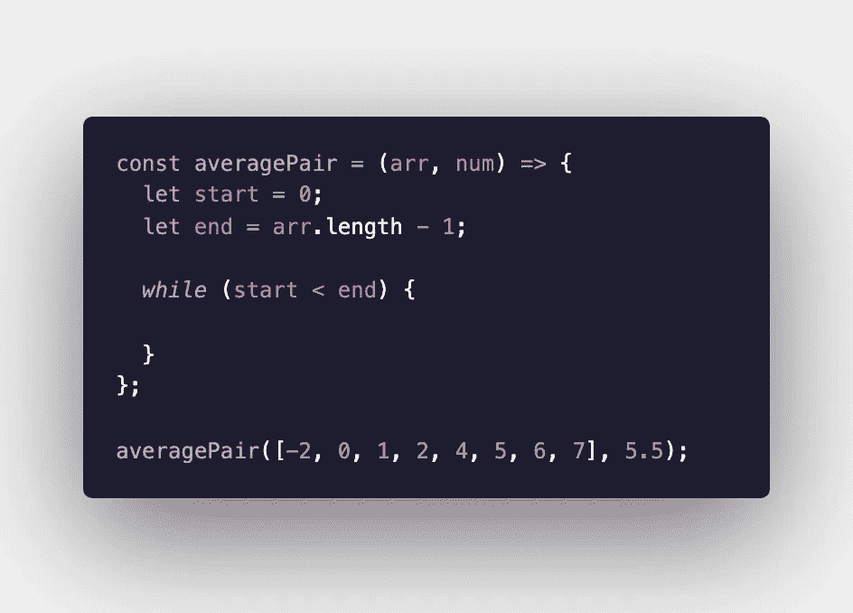
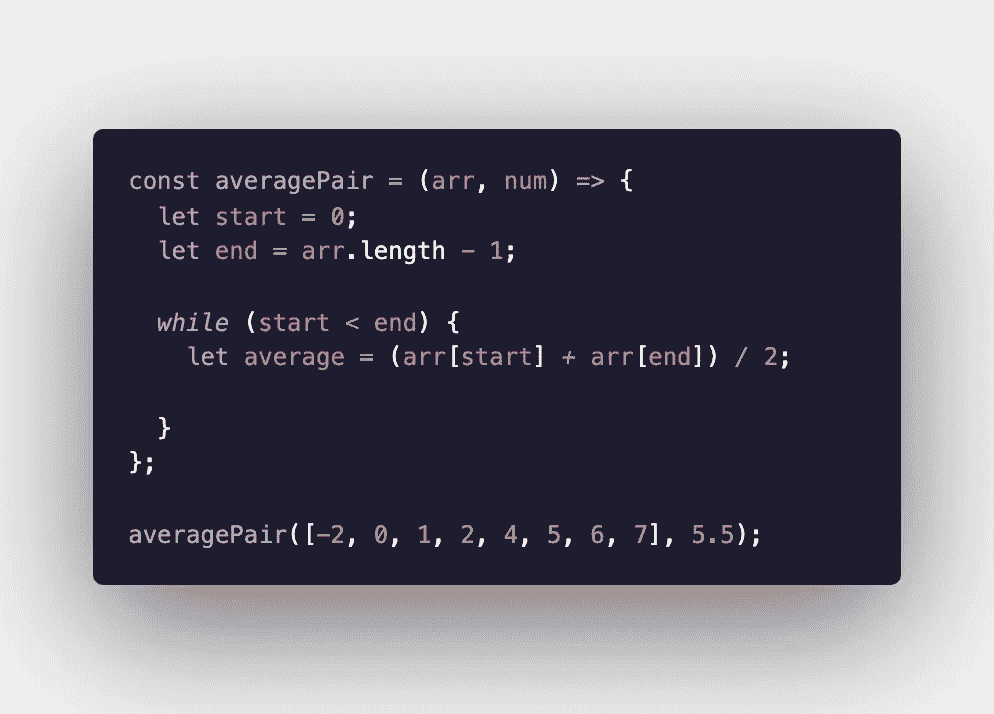
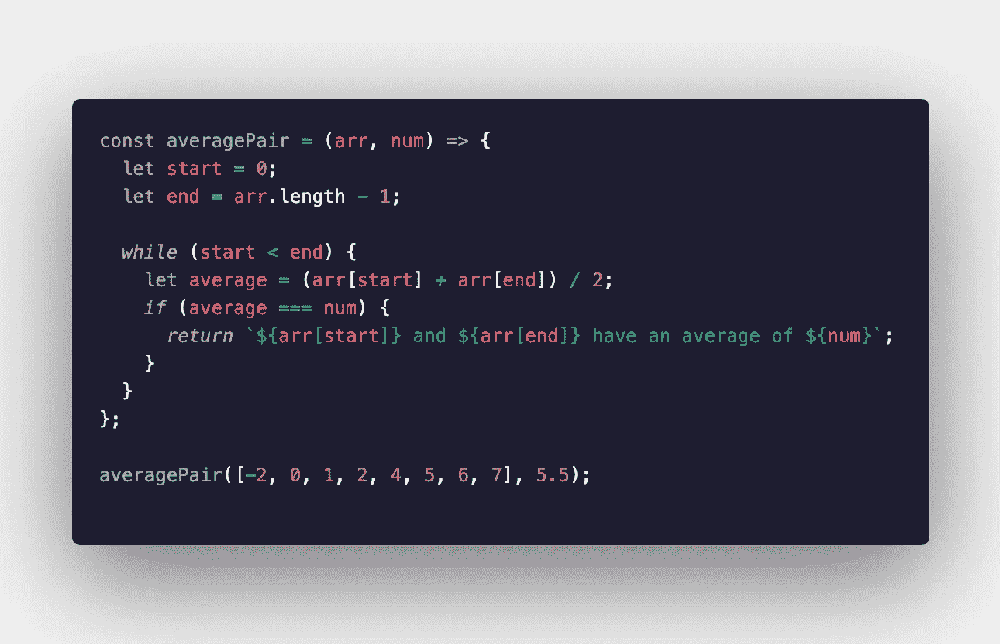
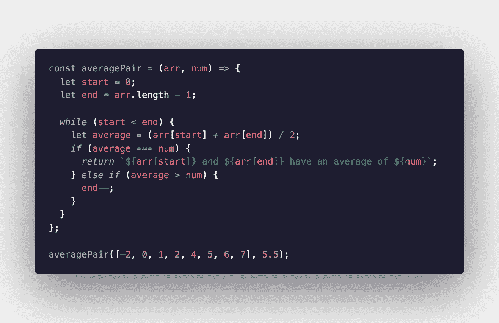
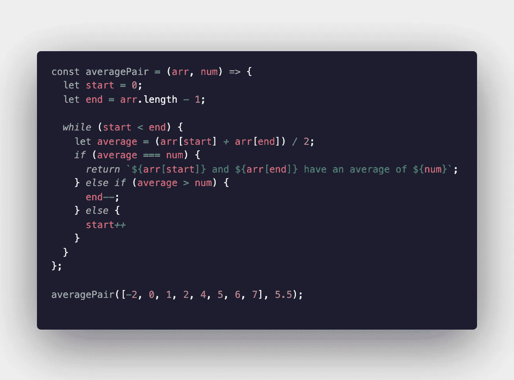
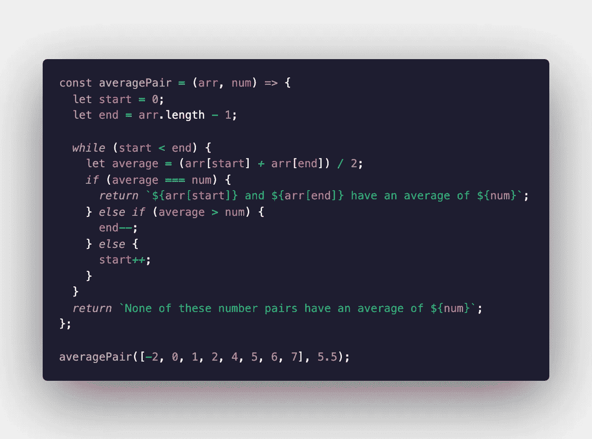

# 利用多指针策略求解算法

> 原文：<https://levelup.gitconnected.com/using-the-multiple-pointers-strategy-to-solve-algorithms-b90a98f854db>

无论您是刚刚开始学习算法以准备技术面试，还是希望微调您的技能，多指针策略都是解决各种算法的重要工具。这是一种以最小的空间复杂度解决问题的有效方法。

# 多个指针

该策略的基本思想是创建两个值或指针，每个值对应于数组中的一个索引，并根据提供的条件将这些指针移向数组的开头、结尾或中间。

我整理了这个指南来帮助任何水平的人理解如何使用这个技术。我将一步一步地解决一个算法，并尽可能保持简单。出于本指南的目的，我将使用 JavaScript。

# 平均对

我们将在本指南中求解的算法称为“平均配对”目标是找出在一个**排序的**数组中哪两个数字的组合平均值等于给定的数字。

例如，如果给定的数组是[2，3，4]，给定的数字是 3.5，那么我们希望算法返回 3 和 4，因为 3 和 4 的平均值是 3.5。请注意，给定的数组必须首先进行排序，或者必须作为函数的一部分进行排序。

*   和往常一样，我们要做的第一件事是声明一个函数并传入参数。

再次重申，我们希望在这个数组中搜索两个整数，它们的平均值等于数组外部给定的数字。

*   我的计划是将一个指针放在数组的开头，另一个放在数组的结尾，然后将它们向相反的两端移动，直到找到满足条件的指针对。为此，我们需要声明我们的两个指针。

第一个指针“start”将从数组的第一个索引开始，第二个指针“end”将从数组的最后一个索引开始，这可以通过从数组的长度中减去 1 得到。

*   为了迭代这个数组，我将使用一个 while 循环。只要第一个指针小于第二个指针，我就想继续迭代。

*   从这里开始，我们要声明一个变量，在这个变量中，我们将跟踪当前两个数字在每次迭代中的平均值。该变量将等于数组中的两个数相加并除以二。

*   在每次迭代中，我们都要检查这个变量是否等于我们要检查的数字。我们需要写一个 if 语句来检查这个条件。如果这两个数相等，我们就找到了我们要找的两个数，我们想跳出这个循环。根据算法的要求，我们可能希望在这里返回“true”。我想返回这两个数字，我决定插入一个格式化的字符串。

*   如果我们还没有找到我们的数字对，我们需要继续迭代，直到找到为止。如果' average '变量的值大于我们要寻找的数字(' num ')，那么我们知道应该将第二个指针(' end ')移到更靠近数组开头的位置。这是因为数组是排序的。

*   如果“平均”变量的值小于我们与之比较的数字，这是我们还没有考虑的唯一条件，那么我们应该向前移动左指针(“开始”)。

*   如果我们遍历整个数组，没有发现任何两个数字的平均值等于给定的数字，那么我们知道不存在这样的数字对。我们可以返回' false '，但我决定再次插入一个字符串。

我们做到了！希望这能帮助你理解如何使用多指针技术来求解算法。同样的策略可以用在不同难度的不同算法中，所以试一试吧！

阿曼达·特劳特勒