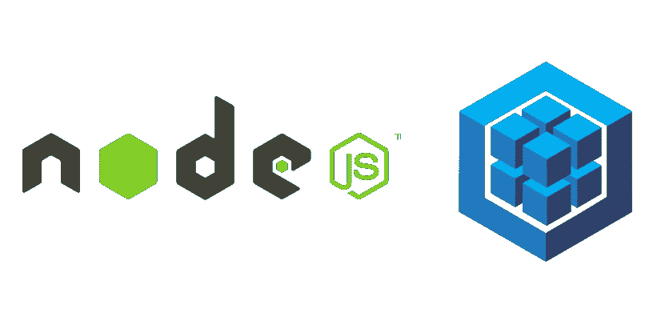

# 使用序列 CLI 和查询

> 原文：<https://levelup.gitconnected.com/using-the-sequelize-cli-and-querying-4ba8d0ac4314>



Sequelize 是一个流行的、易于使用的 JavaScript 对象关系映射(ORM)工具，可用于 SQL 数据库。如果您已经[开始使用 Sequelize 命令行界面(CLI)](https://medium.com/@brunopgalvao/getting-started-with-sequelize-cli-c33c797f05c6) 创建 Sequelize 项目，下一步是学习如何查询您的数据库。

在本演练中，我们将使用 [Sequelize CLI](https://github.com/sequelize/cli) 来创建模型、迁移和种子数据，然后编写查询来查找、创建、删除和更新 Postgres 数据库中的条目。

让我们从安装 Postgres、Sequelize 和 Sequelize CLI 开始:

```
mkdir sequelize-querying
cd sequelize-querying
npm init -y
npm install sequelize pg
npm install --save-dev sequelize-cli
```

接下来，我们将初始化一个 Sequelize 项目，然后在代码编辑器中打开它:

```
npx sequelize-cli init
code .
```

让我们通过在`/config`目录中找到`config.json`并将代码替换为以下代码来配置我们的 Sequelize 项目，以便使用 Postgres:

`seqeulize-querying/config/config.json`:

```
{
  "development": {
    "database": "sequelize_querying_development",
    "host": "127.0.0.1",
    "dialect": "postgres"
  },
  "test": {
    "database": "sequelize_querying_test",
    "host": "127.0.0.1",
    "dialect": "postgres"
  },
  "production": {
    "database": "sequelize_querying_production",
    "host": "127.0.0.1",
    "dialect": "postgres"
  }
}
```

很好，现在我们可以告诉 Sequelize CLI 创建数据库了:

```
npx sequelize-cli db:create
```

接下来我们将创建一个模型，我们称之为`User`:

```
npx sequelize-cli model:generate --name User --attributes firstName:string,lastName:string,email:string,password:string
```

运行`model:generate`会自动创建一个模型文件和一个带有我们指定属性的迁移。您不需要担心(或编辑)这些来运行我们将在下面编写的查询。

> 要了解更多有关序列化 CLI 如何生成模型的信息，请参见:
> [**序列化 CLI 入门**](https://medium.com/@brunopgalvao/getting-started-with-sequelize-cli-c33c797f05c6)

现在我们将执行迁移，在数据库中创建`Users`表:

```
npx sequelize-cli db:migrate
```

现在让我们创建一个种子文件:

```
npx sequelize-cli seed:generate --name user
```

您将在`/seeders`中看到一个新文件。在该文件中，粘贴以下代码以创建一个“John Doe”演示用户:

```
module.exports = {
  up: (queryInterface, Sequelize) => {
    return queryInterface.bulkInsert('Users', [{
        firstName: 'John',
        lastName: 'Doe',
        email: 'demo@demo.com',
        password: '$321!pass!123$',
        createdAt: new Date(),
        updatedAt: new Date()
      }], {});
  },down: (queryInterface, Sequelize) => {
    return queryInterface.bulkDelete('Users', null, {});
  }
};
```

一旦我们保存了种子文件，让我们执行它:

```
npx sequelize-cli db:seed:all
```

进入`psql`并查询数据库，查看`Users`表:

```
psql sequelize_querying_development
SELECT * FROM "Users";
```

# 询问

现在我们已经使用 Sequelize CLI 建立了数据库，我们可以使用 JavaScript 和 Sequelize 来查询它。创建一个新文件来保存我们的查询函数:

```
touch query.js
```

在本文的最后，您将找到运行一系列查询的完整代码，但首先我们将讨论每个查询函数是如何实现的。

首先，在文件的顶部，我们需要 Sequelize 本身和我们之前生成的`User`模型。我们还将把`Op`设置为一种速记，以便在查询中使用序列操作符。

```
const { User } = require('./models')
const Sequelize = require('sequelize');
const Op = Sequelize.Op
```

有了这些，我们可以添加函数来查询数据库，并使用`console.log()`打印结果。下面的函数将简单地查找所有用户:

```
// Find all users
// Raw SQL: SELECT * FROM "Users";

const findAll = async () => {
    const users = await User.findAll();
    console.log("All users:", JSON.stringify(users, null, 4));
}
```

每个 Sequelize 模型都有[内置的查找器方法](https://sequelize.org/v5/manual/models-usage.html#data-retrieval---finders)来方便查询。上面，我们使用了`.findAll()`来返回`User`模型的所有实例。

我们可以将选项(作为 JavaScript 对象编写)传递给 finder 方法来定制我们的查询:

```
// Find all users where firstname is John
// Raw SQL: SELECT * FROM "Users" WHERE firstName = "John";const findAllJohns = async () => {
    const johns = await User.findAll({
        where: {
            firstName: "John"
        }
    })
    console.log("All users with first name John:", JSON.stringify(johns, null, 4));
}
```

我们还可以使用`.create()`方法，通过将属性值作为 JavaScript 对象传入来创建模型的新实例:

```
// Create a new user
// Raw SQL: INSERT INTO "Users" (id, firstName, lastName, email, userName, password, jobTitle) VALUES (DEFAULT, 'Jane', 'Doe', 'jane@jane.com', 'janedoe', '123456789', 'Systems Analyst')const createUser = async () => {
    const jane = await User.create({ firstName: "Jane", lastName: "Doe", email: "jane@jane.com", userName: "janedoe", password: "123456789", jobTitle: "Systems Analyst" })
    console.log("Jane's auto-generated ID:", jane.id)
}
```

当然，我们也可以使用`.destroy()`方法删除约翰或简。该功能将删除`"Jane"`中`firstName`的*所有*行:

```
// Delete everyone named "Jane"
// Raw SQL: DELETE FROM "Users" WHERE firstName = 'Jane'const destroyUser = async () => {
    const destroyed = await User.destroy({
        where: {
            firstName: "Jane"
        }
    })
    console.log("Destroyed:", destroyed);
}
```

我们还可以使用`.update()`方法更新现有记录。在下面的函数中，我们将两个对象作为参数传递给该方法。第一个参数`{ lastName: "Smith" }`，定义了我们想要做的改变；第二个是`{ where: { lastName: "Doe" } }`，决定哪些条目会受到影响。

```
// Change lastname "Doe" to "Smith"
// UPDATE "Users" SET lastName='Smith' WHERE lastName = 'Doe'const updateUser = async () => {
    const updated = await User.update({ lastName: "Smith" }, {
        where: {
            lastName: "Doe"
        }
    })
    console.log("Updated:", updated);
}
```

我们可以将其他选项传递给模型方法，以形成我们得到的数据。这个函数将查找所有的`User`实例，但是将只返回每个实例的`email`属性:

```
// Find all users and only show their email
// Raw SQL: SELECT email FROM "Users";const findAllEmails = async () => {
    const emails = await User.findAll({
        attributes: ['email']
    })
    console.log("All user emails:", JSON.stringify(emails, null, 4));
}
```

[序列操作符](https://sequelize.org/v5/manual/querying.html#operators)(我们在上面介绍为`Op`)支持更复杂的查询——比如这个使用`Op.or`来查找名为 John 或 Jane 的条目:

```
// Find all users where firstname is either John or Jane
// Raw SQL: SELECT * FROM "Users" WHERE firstName = "John" OR firstName = "Jane";const findAllJohnsOrJanes = async () => {
    const johnOrJanes = await User.findAll({
        where: {
            [Op.or]: [{ firstName: "John" }, { firstName: "Jane" }]
        }
    })
    console.log("All users with first name John or Jane:", JSON.stringify(johnOrJanes, null, 4));
}
```

为了查看*所有*这些功能的运行情况，将以下内容粘贴到`query.js`中:

```
const { User } = require('./models')
const Sequelize = require('sequelize');
const Op = Sequelize.Op

// Find all users
// Raw SQL: SELECT * FROM "Users";
const findAll = async () => {
    const users = await User.findAll();
    console.log("All users:", JSON.stringify(users, null, 4));
}

// Create a new user
// Raw SQL: INSERT INTO "Users" (id, firstName, lastName, email, userName, password, jobTitle) VALUES (DEFAULT, 'Jane', 'Doe', 'jane@jane.com', 'janedoe', '123456789', 'Systems Analyst')const createUser = async () => {
    const jane = await User.create({ firstName: "Jane", lastName: "Doe", email: "jane@jane.com", userName: "janedoe", password: "123456789", jobTitle: "Systems Analyst" })
    console.log("Jane's auto-generated ID:", jane.id)
}

// Delete everyone named "Jane"
// Raw SQL: DELETE FROM "Users" WHERE firstName = 'Jane'const destroyUser = async () => {
    const destroyed = await User.destroy({
        where: {
            firstName: "Jane"
        }
    })
    console.log("Destroyed:", destroyed);
}

// Change lastname "Doe" to "Smith"
// UPDATE "Users" SET lastName='Smith' WHERE lastName = 'Doe'const updateUser = async () => {
    const updated = await User.update({ lastName: "Smith" }, {
        where: {
            lastName: "Doe"
        }
    })
    console.log("Updated:", updated);
}

// Find all users and only show their email
// Raw SQL: SELECT email FROM "Users";
const findAllEmails = async () => {
    const emails = await User.findAll({
        attributes: ['email']
    })
    console.log("All user emails:", JSON.stringify(emails, null, 4));
}

// Find all users where firstname is John
// Raw SQL: SELECT * FROM "Users" WHERE firstName = "John";
const findAllJohns = async () => {
    const johns = await User.findAll({
        where: {
            firstName: "John"
        }
    })
    console.log("All users with first name John:", JSON.stringify(johns, null, 4));
}

// Find all users where firstname is either John or Jane
// Raw SQL: SELECT * FROM "Users" WHERE firstName = "John" OR firstName = "Jane";
const findAllJohnsOrJanes = async () => {
    const johnOrJanes = await User.findAll({
        where: {
            [Op.or]: [{ firstName: "John" }, { firstName: "Jane" }]
        }
    })
    console.log("All users with first name John or Jane:", JSON.stringify(johnOrJanes, null, 4));
}

const run = async () => {
    await findAll()
    // await createUser()
    // await destroyUser()
    // await updateUser()
    // await findAllEmails()
    // await findAllJohns()
    // await findAllJohnsOrJanes()
    await process.exit()
}

run()
```

`run()`函数将调用任何未被注释掉的查询函数——在本例中是`findAll()`。只需添加或删除`//`即可启用您想要执行的任何查询！

酷！现在执行该文件，看看它是如何工作的:

```
node query.js
```

现在你已经知道如何编写定制查询函数，你可以通过 [**定义序列关联**](https://medium.com/@brunopgalvao/creating-sequelize-associations-with-the-sequelize-cli-tool-d83caa902233) 来丰富你的模型，或者通过 [**集成你的序列设置和 Express**](https://medium.com/@brunopgalvao/sequelize-cli-and-express-fb3ddefb9786) 来开始传递数据！

> 这篇文章是与纽约市的软件工程师、编辑和作家杰里米·罗斯(Jeremy Rose)合著的。

## 有关 Sequelize CLI 的更多信息:

*   [sequel ize CLI 入门](https://medium.com/@brunopgalvao/getting-started-with-sequelize-cli-c33c797f05c6)
*   [使用序列 CLI 创建序列关联](https://medium.com/@brunopgalvao/creating-sequelize-associations-with-the-sequelize-cli-tool-d83caa902233)
*   [使用 Faker 开始 Sequelize CLI](https://medium.com/@brunopgalvao/getting-started-with-sequelize-cli-using-faker-824b3f4c4cfe)
*   [对 CLI 和 Express 进行排序](https://medium.com/@brunopgalvao/sequelize-cli-and-express-fb3ddefb9786)
*   [使用序列 CLI 和快速路由器构建快速 API](https://medium.com/@brunopgalvao/build-an-express-api-with-sequelize-cli-and-express-router-963b6e274561)
*   使用序列 CLI 和单元测试构建 Express API！

# 资源

*   [https://sequelize.org/master/manual/migrations.html](https://sequelize.org/master/manual/migrations.html)
*   [https://sequelize.org/master/manual/querying.html](https://sequelize.org/master/manual/querying.html)

[](https://skilled.dev) [## 编写面试问题

### 一个完整的平台，在这里我会教你找到下一份工作所需的一切，以及…

技术开发](https://skilled.dev)