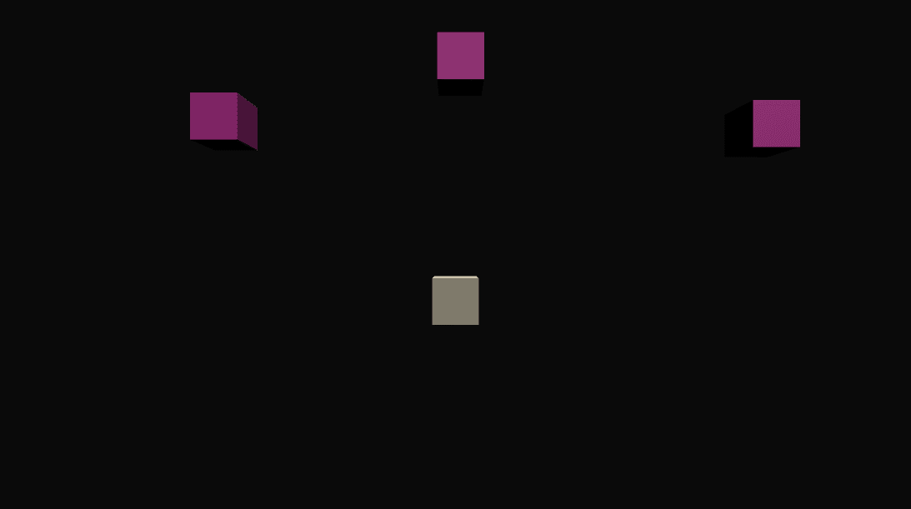
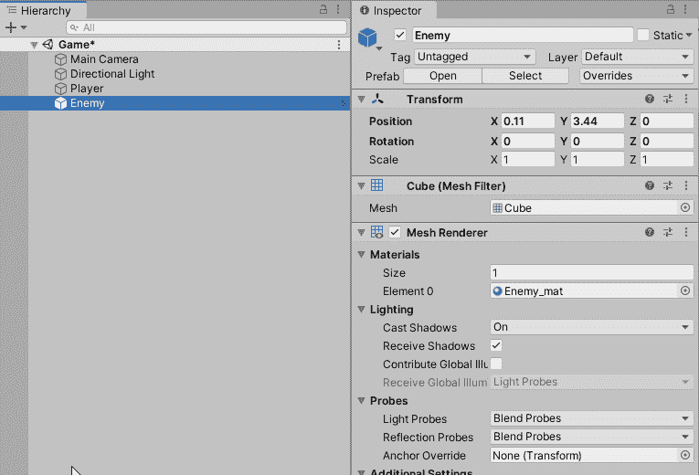
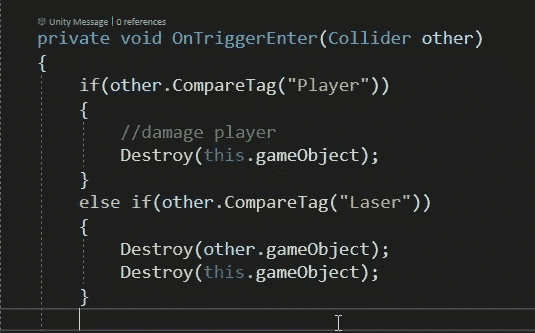
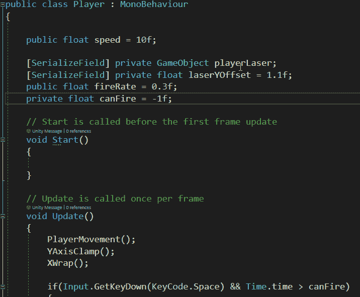
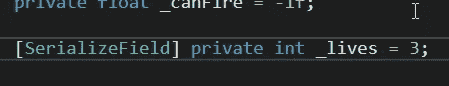
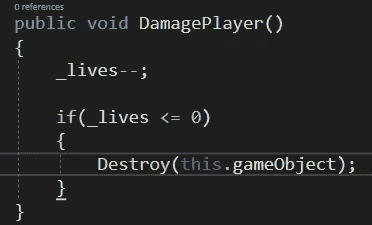
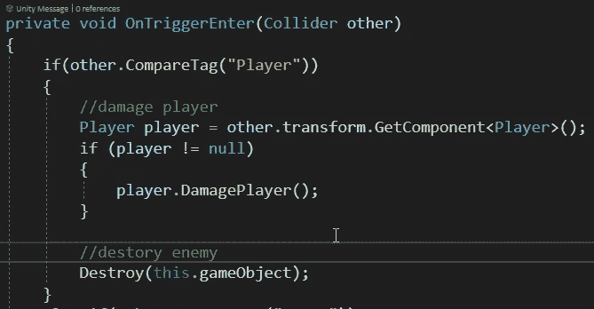
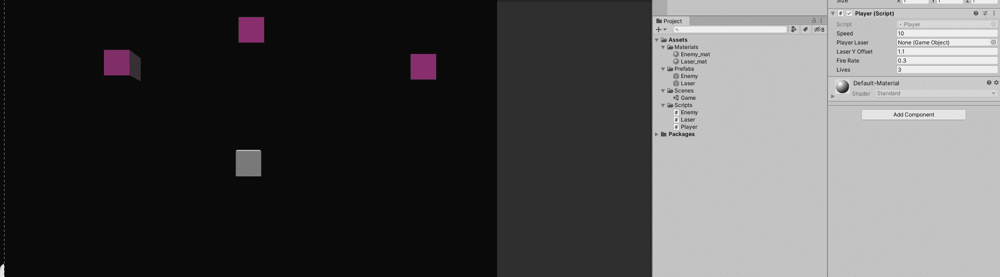

# 在 Unity 中使用标签系统并损坏播放器

> 原文：<https://levelup.gitconnected.com/using-the-tag-system-in-unity-and-damaging-the-player-f8267c1c7420>

在 Unity 中，标签是一个非常有用的系统，它让我们很容易判断哪些对象正在相互交互，以及它们应该如何在我们的代码中交互。

它们与触发器、碰撞器和刚体齐头并进。他们是这样工作的！

敌人现在可以被正确消灭了！

# 标签系统

使用**标签**系统简单明了。它给一个**对象**一个**标签**，或者**名字**，以便于**引用**。然后当一个对象**与那个**标签分类的任意成员**交互**时，以同样的**方式与每个**成员**执行一个动作。**

给一个对象一个**标签**，它位于**检查器**窗口中其**名称**下**。**

有些是预制的，但是你可以在任何给定的情况下创造你自己的。在我们的例子中，我们将为我们的**激光器**创建一个。

给我们的球员一个标签，并为我们的激光创造一个。

现在在我们的**敌人**代码中，我们可以选择**在**碰撞检测**期间** it **如何与每个**标签**交互**，通过使用 **if/else 语句**，以及**检查**标签— **other。CompareTag("Player")** 。

你也可以使用— **other.tag == "Player"** 。他们都工作。

如果**敌人与**我方**玩家**发生碰撞，**只会摧毁**敌人，而**会伤害**玩家(后面会详细介绍)。如果**敌人**接触到**激光**，**摧毁两个物体**。

在敌方脚本中设置我们的标签。

实际代码:

# 玩家代码清理—重命名私有变量

接下来我们将创建我们的伤害玩家逻辑。不过在此之前我想**清理一下**的**玩家代码**。

用**下划线“_”前缀**命名**私有**变量是**最佳实践**和**行业标准**。我仍然经常搞砸，但是这给了我一个很好的机会向你展示如何**有效地重命名变量**，并且**而不是**搞乱你的整个代码。

如果你想重命名一个变量，如果你仅仅改变了一个引用的引用，你的 T2 代码将会破坏 T3，因为你所有的其他变量的实例现在都是不正确的。

**最好的**方法是**选择你想要重命名的变量**，确保**高亮显示**，然后按两次 **CTRL+R** 。这允许您重命名变量及其每个实例。超级得心应手！

另一个快捷方式，我在上面的例子中使用的，是在按下 CTRL+R 两次后，我按下 **Home** 键，转到变量的开头，输入我的下划线。而不是像在 _canFire 示例中那样重新键入整个变量名。

# 损坏播放器

现在回到我们定期安排的节目。

为了损坏我们的球员，我们必须做一些事情。创建一个变量，创建一个公共方法，然后从我们的敌人脚本中调用该方法！

创建我们的**私有 int _ lifes**。出于调试目的，我将它设为**【serialized field】**——以确保它正常工作。它也是私有的，所以没有任何代码可以随意改变它。他们将不得不使用我们专用的方法。

创建我们的生活变量。

还有我们的 **DamagePlayer()** 函数:

每调用一次，我们的**生命**将**减少**1。如果**_ lifes**等于**等于**或者**小于 0** (比如我们有一个伤害更大的超级强敌)，那么我们的玩家就是**被摧毁**！

现在从另一个脚本调用这个函数/方法！这就需要一些**脚本沟通**。这是另一天的大主题，但是我们将使用**get component<>()**函数来实现这一点。

在我们的敌人剧本中:

**如果****其他**标签是**播放器**，那么我们**创建**一个**类型播放器**的**变量**称为**播放器**，它需要获取一个对其**播放器脚本**的引用，作为**组件**。(于是**get component<Player>()**)。

**如果(玩家！= null)** 是一个空检查，以防有一个 bug 不能准确地从' **other** '对象中检索到**组件**。

现在我们有了变量 **player** ，它正确地引用了它的**脚本组件**，我们可以调用 **Player 脚本**中的任意函数。在这种情况下，它将是我们刚刚创建的 **DamagePlayer()** ！

以下是我们的完整代码:

你可以看到我们每打一个敌人生命就减 1！

现在我们有进展了！现在成为一个糟糕的飞行员是有后果的！

接下来，我们将通过一个繁殖管理器来繁殖敌人，并介绍协程！