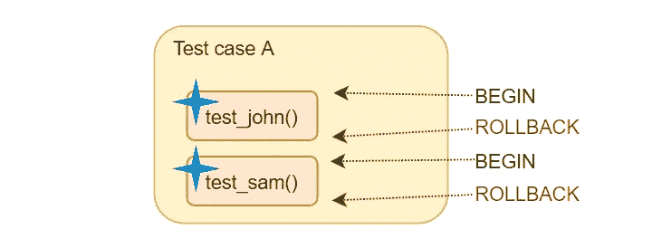
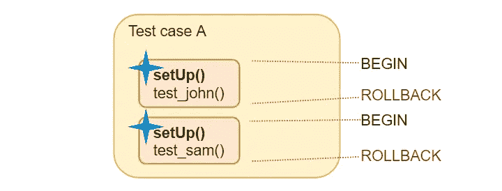
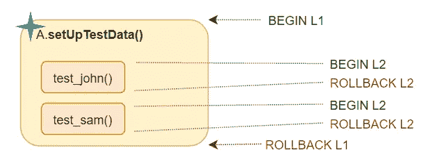
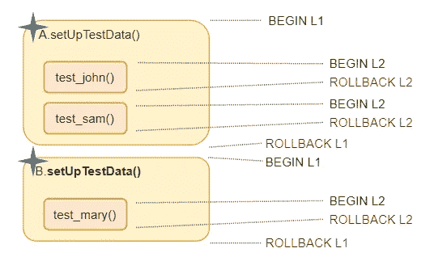
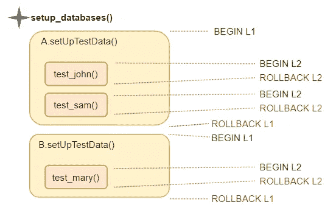
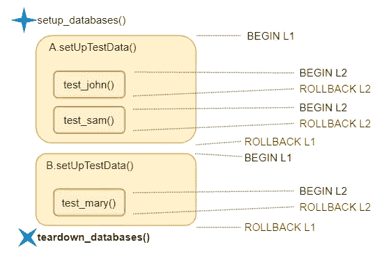
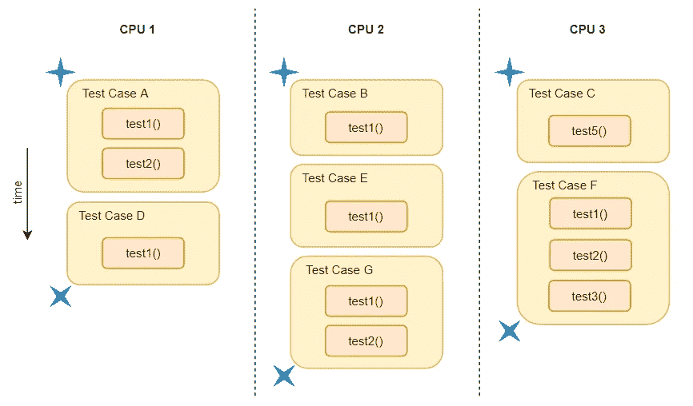

# 使用事务使 Django 测试运行得更快

> 原文：<https://levelup.gitconnected.com/using-transactions-to-make-django-tests-run-faster-224fdd695bfd>

## 一步一步的教程

## 本教程展示了如何使用 Django 测试框架的嵌套事务机制来避免测试模型的重新初始化。

来源:理查德·希思科特/盖蒂图片欧洲

Django 为您提供的验证模型的最简单的测试设置如下:

成功了，太棒了！现在您想要向您的测试套件添加更多的断言。实际上，你可以将它们直接添加到同一个测试函数中，如果一切正常，你不会注意到与为每个断言使用一个单独的函数相比有什么不同，但是一旦你的一个断言失败了，如果所有的断言都在一个函数中，你会得到一个不太有用的图片，告诉你哪里出错了。

此外，单独的函数有一个“保存游戏”的特性:不管前面的测试方法发生了什么，下一个测试方法都将从头开始(准确地说，从初始的`migrate`应用到新创建的测试数据库之后的状态开始)。

所以:

星号显示用户 John 的创建位置

由于每个测试都在一个单独的事务中运行(图中的橙色框),所以不需要手动删除测试记录，db 层会为您做这件事。

请注意，John 用户被创建了两次。不要重复自己！

setUp()方法执行两次

这无疑是向前迈进了一步:将模型创建重构到一个单独的函数中使得代码不容易出错并且更易于维护，但是实际上用户仍然会被创建两次！如果不止一个用户，那可能会导致速度大幅下降。

# 方法 1:测试用例级初始化

为了避免这种情况，您可以使用 django 测试框架的“嵌套”事务特性，这涉及到将初始化转移到`[setUpTestData](https://docs.djangoproject.com/en/3.0/topics/testing/tools/#django.test.TestCase.setUpTestData)()`类方法:

执行此代码将完成以下工作:

嵌套的 BEGIN/ROLLBACKs 更容易理解，但是 SQL 不支持它们。实际上，保存点在 L2 使用。

1.  首先创建用户 John
2.  “还原点”已创建
3.  `test_john()`正在运行，这将在数据库中“看到”约翰
4.  将`test_john()`中所做的一切回滚到步骤 2 中的恢复点
5.  `test_sam()`是凶多吉少。如果在`test_john()`中完成，它不会看到任何 db 修改，但是 John 用户仍然可见。
6.  在这个测试用例中创建的所有东西都被回滚，包括 John。

事实上，还有另一个类方法`tearDownClass()`，您可以在其中删除在`setUpTestData()`中创建的模型，但这并不是真正必要的，因为当回滚与上面步骤 6 中的测试用例相关的事务时，它们会被自动删除。

现在假设您需要另一个测试用例，例如，在另一个应用程序中，它也需要那个无处不在的 John 用户。

同样，在现实中，嵌套事务是通过保存点实现的，而不是通过嵌套 BEGIN/ROLLBACK 实现的

当执行进入测试用例 B 时，数据库层删除在`A.setUpTestData()`中创建的所有内容，这样就不需要手动清理这些对象。

但是如果我们对所有的测试都有相同的设置，我们又一次处于初始化被执行两次的情况中——这也是可以避免的！

# 方法 2:项目级初始化

姜戈有很多不同的跑步者。我们现在需要继承的是`[DiscoverRunner](https://docs.djangoproject.com/en/3.0/topics/testing/advanced/#defining-a-test-runner)`

通过保存点实现开始 L2 和回滚 L2

就像一个测试用例一样，这个 DiscoverRunner 类有一个名为`teardown_databases()`的拆卸方法，如果您使用`--keepdb`命令行选项运行测试，以避免每次运行测试时都创建测试数据库，这可能会很方便，因为在这种情况下，没有封闭的事务来自动回滚在`setup_databases()`方法中创建的模型。如果没有它，您将得到以下异常:

旋转星形表示模型清理；L2 开始/回滚通过保存点实现

调用 flush management 命令(与运行`./manage.py flush --no-input`相同)比只使用`delete()`函数要好，因为它一次处理所有的模型(只保存迁移表),而且它重置了序列，这样新创建的用户的 id 就不会无限增加。

同样值得注意的是，如果您计划向用户模型添加定制字段，最好在`tests.py`和`testrunner.py`中用`get_user_model()`导入它:

见我的[演练](https://medium.com/swlh/production-ready-method-of-extending-django-user-model-in-mid-project-3afa174b000b)在项目中间扩展用户模型。

这里有一个小问题:在 python 层面上，测试隔离并不是 100%可靠的:一个 2 分钟的阅读[注意](/next-django-version-will-have-better-testcases-isolation-71959eb7b62c)中的细节和解决方法。

继承自`DiscoverRunner`的方法也适用于并行测试执行(`manage.py test --parallel`)。在这个设置中，来自`MyTestRunner.setup_databases()`的初始化代码在每个进程中只出现一次。

蓝色星号表示创建用户 John 实例，旋转星号表示删除它。

# 结论

这两种技术——覆盖`TestCase.setUpTestData()`方法和扩展`DiscoverRunner`类——有助于构建不重复执行测试设置的测试，从而在运行测试套件时节省时间。它们可以与`--keepdb and --parallel`标志到`./manage.py test`命令结合使用，以进一步减少测试时间。

脚注:

1.  用 sqlite 后端`./manage.py flush`只重置 django 主分支中的序列(数据在任何版本都被刷新)，见 ticket[31479](https://code.djangoproject.com/ticket/31479)；其他后端可以与任何最新的 django 版本兼容。

2.`./manage.py tests --parallel`还不能在 Windows 上运行，只能在 Linux 上运行。