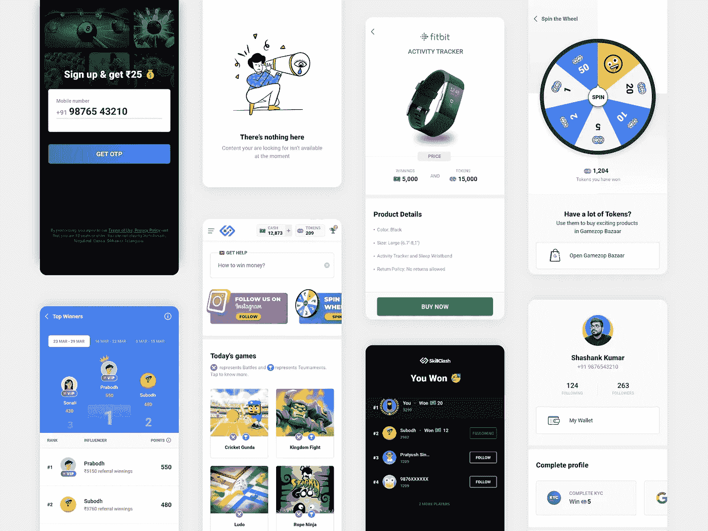

# 使用 Flutter 的可信 Web 活动(或 TWA ):第 1 部分

> 原文：<https://levelup.gitconnected.com/using-trusted-web-activities-twa-with-flutter-part-1-8722c3b3979b>

SkillClash 在 TWA 中全屏渲染

关于 Chrome 自定义标签和网页视图的实现，有很多文章。但是没有一篇文章或博客陈述了可信网络活动的高级和深入的知识。

*通过这篇文章，我试图实现这一点，并帮助所有 TWA 世界的新开发人员。本文是了解可信 Web 活动的系列文章的一部分。*

## 环球航空公司系列的所有零件:

1.  第 1 部分:通过 Flutter 使用可信 Web 活动
2.  第 2 部分:用可信 Web 活动注册多个域
3.  第 3 部分:在可信 Web 活动和 Flutter 之间建立通信
4.  第 4 部分:总结

# 什么是 TWA？

**可信网络活动**是一种使用基于自定义标签的协议从*您的* Android 应用程序打开*您的*网络应用程序内容的新方式，例如*您的*渐进式网络应用程序(PWA)。

1.  可信网络活动中的内容是**可信的**——应用程序和它打开的网站应该来自同一个开发者。(这是使用[数字资产链接](https://developers.google.com/digital-asset-links/v1/getting-started)验证的)。)
2.  可信 Web 活动中呈现的内容来自 **web** :它们由用户的浏览器呈现，与用户在浏览器中看到的方式完全相同，只是它们是全屏运行的。Web 内容应该首先在浏览器中是可访问的和有用的。
3.  如今，如果用户版本的 Chrome 不支持可信网络活动，Chrome 将退回到使用自定义标签的简单工具栏。其他浏览器也可以实现受信任的 Web 活动使用的相同协议。虽然主机应用程序对打开什么浏览器有最终决定权，但我们建议使用与自定义选项卡相同的策略:使用用户的默认浏览器，只要该浏览器提供所需的功能。

—来自 Android [TWA 集成指南](https://developer.chrome.com/docs/android/trusted-web-activity/overview/)

# SkillClash TWA 用法简介

我们的首席设计师 [Shashank](https://www.linkedin.com/in/shanksgee/) 展示的

SkillClash 是一个基于技能的真钱游戏平台，在这个平台上，人们可以在锦标赛和战斗中争夺真钱。有多种游戏可供选择，用户可以通过 Paytm、Amazon、UPI、银行转账或移动充值等热门选项兑现他们的奖金。

我们已经为 SkillClash 开发了一个移动应用程序(目前是 Android ),并且一直在使用 Flutter。这里有一个讨论的链接，讨论的目的是决定我们为什么选择 [Flutter 作为技术](https://medium.com/flutter-community/how-i-convinced-my-team-lead-to-go-for-flutter-and-kotlin-9e9bde16d73)。

虽然应用程序的主要部分是使用 Flutter 来构建我们的应用程序，但我们仍然需要在应用程序中显示一些网页。例如，显示常见问题、支持部分或条款和隐私页面。最重要的部分，游戏。为此，我们决定使用 WebView，而不是 Chrome 定制标签页(CCT)。因为 CCT 显示了一个 URL 栏，这在体验上有点碍眼。

# 为什么我们决定使用环球航空？

[SkillClash](https://bit.ly/skillclash-app) 移动应用早先使用官方 [Webiew 插件](https://pub.dev/packages/webview_flutter)来托管游戏(HTML5 游戏)。应用程序运行得非常好，游戏也运行得非常好。WebView 用于通过 javascript 通道与 Web 和 dart 端进行通信。但当我们比较 WebView 和 Chrome 本身的游戏流畅度和性能时，有一个明显的差异。这些游戏在 Chrome 上表现很好，但在 Webview 上表现很差。很多游戏开始口吃，这是非常明显的。

我们需要找到一个解决方案，既能提供 Chrome 的流畅感，又能提供 WebView 的突兀体验。由于顶部的地址栏，Chrome 自定义标签感觉是一个不完整的解决方案，这是我们关注 TWA(可信网络活动)的时候。但是没有插件。没有重要的有用的讨论或文档。所以我们决定从 Android 托管 TWA，使用平台渠道从 Dart 端调用。

# 我们是如何做到的？

我们遇到的第一个问题是，我们搜索的每个博客都有一个共同点，他们集成了 TWA，因为它是应用程序中的启动器活动，不需要额外的调用或启动它。虽然这听起来很简单，但它有重要的后果，所有这些我们将在本系列的后面发现。

在本文中，我们将打开应用程序，单击一个按钮，将启动一个 TWA 来呈现第一方内容。本文将假设您已经在笔记本电脑中安装了 Flutter SDK，并且知道如何创建 Flutter 项目。如果你还需要参考，这里有很好的[文档](https://flutter.dev/docs/get-started/install)。

这里是本教程的[Github 项目的链接。](https://bit.ly/twa_setup)

在你创建了一个空的 Flutter 项目之后，你需要设置一些平台(Android)方面的东西。

所有步骤都被添加为待办事项，可以从 Android Studio 中的待办事项列表中引用，如下图所示。

## 第一步:

如果需要，在 build.gradle 文件(应用程序级)中添加编译选项。你的文件看起来像这样。

现在重新构建项目，一切都会恢复正常。

## 第二步:

现在添加 TWA helper 依赖项，它将完成我们的大部分工作。这个依赖项将放在 build.gradle(应用程序级)文件的依赖块中。

再次重建项目，一切都恢复正常。

## 第三步:

现在，我们需要在 Manifest.xml 中添加一个活动，当我们单击一个按钮并提供第一方内容时，该活动将打开。

意图过滤器标签允许 TWA 处理从网络上触发的意图。我们将在本系列的后面讨论这个意图过滤器。
您会注意到清单中的 TWA Activity 标签有一个 exported:true 属性。添加这一点是因为如果您的活动、服务或广播接收器使用意向过滤器，targetSdkVersion 31 及更高版本不允许在没有导出属性的显式声明的情况下安装应用程序。

## 来自官方文件:

> 如果您的应用程序以 Android 12 为目标，并且包含使用意图过滤器的活动、服务或广播接收器，您必须为这些应用程序组件显式声明 android: exported 属性。
> 
> ***警告*** *:如果活动、服务或广播接收器使用意图过滤器，并且没有明确声明的 android:exported 值，则您的应用程序无法安装在运行 Android 12 的设备上。*

## 第四步:

完成上述步骤后，我们需要在位于 res 目录下的 strings.xml 文件中添加一个 boiler-plate 代码。如果没有，就创建一个。
您需要做的就是复制代码并粘贴到您的文件中，然后将站点参数更改为您想要打开的参数。当应用程序打开时，这段代码有助于建立从 Android 到 Web 的信任关系。

这部分代码被称为资产报表。这些声明用于验证。

## 第五步:

在我们添加了 asset-statement 之后，我们需要在我们的 AndroidManifest.xml 中引用它们。

## 第六步:

现在前往这个[资产生成器](https://developers.google.com/digital-asset-links/tools/generator)并生成您的资产链接。你需要添加你的应用的包名(在这种情况下:com.skillclash.twa_setup)，SHA256 指纹(你可以使用这个[链接](https://developer.android.com/studio/publish/app-signing#generate-key)生成)和你正在打开的网站(在这种情况下:【https://skillclash.com】的

生成的资产链接，您将需要在您的网站上托管在您生成资产链接时指定的位置，如下所示:

这个 json 资产声明文件需要存放在[https://skillclash.com/.well-known/assetlinks.json.](https://gamezop.com/.well-known/assetlinks.json.)

这是一个非常锅炉板的代码。你基本上不需要做任何事情。只需更改该语句中的 3 个参数值，一切都会为您生成。网站需要这段代码来验证 TWA 内部开放的内容的所有权。

## 第七步:

现在我们需要向 MainActivity.kt 文件添加代码，该文件接收来自 dart 端的调用，并使用平台通道启动 TWA。我们还需要添加将从我们的 Flutter 应用程序中引用的通道名称。

## 第八步:

现在我们只需要创建 launchTWA 方法，该方法实际上使用所需的 url 启动 TWA。

这是非常基本的东西。Android(平台)方面的事情现在已经完成。我们可以移到飞镖这边。

## 第九步:

现在是最容易的部分。用这个代码替换你的代码，并确保当你对按钮的 onPressed 进行编码时，通道名(method_channel/twa)和方法名(launchTWA)与 MainActivity.kt 中提到的完全相同

瞧啊。你的 flutter 应用程序现在可以打开一个成熟的 edge to edge TWA，在没有地址栏的情况下呈现你的内容，并具有你所期望的相同性能。

[来源](http://gif-free.com/uploads/posts/2017-11/1510654234_the-office-congratulations.gif)