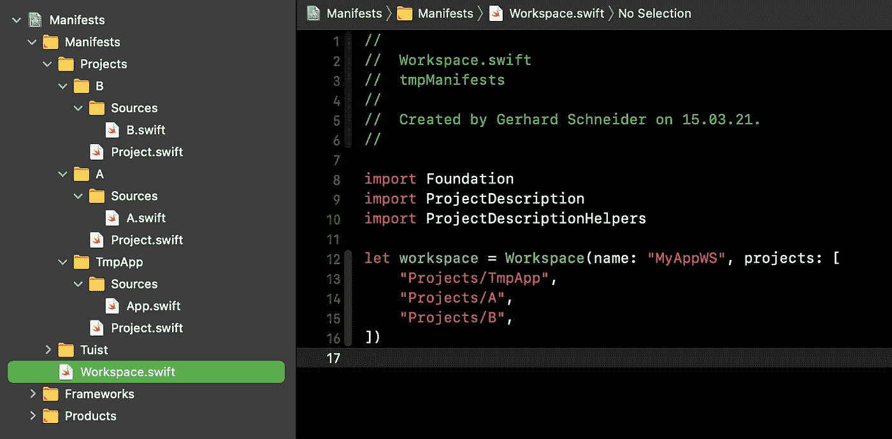
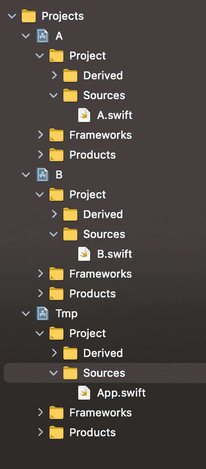

# 使用 tuist 构建工作空间

> 原文：<https://levelup.gitconnected.com/using-tuist-for-building-a-workspace-bdd5ccefbaa5>

虽然 [tuist](https://tuist.io) 是一个非常有用的工具，但是文档中缺少一些展示工作空间设置方式的例子。可以用 tuist 创建的默认项目本身只是创建一个工作区，其中各种目标是下面的文件夹。

然而，当考虑框架时，最好有一个 Xcode 工作空间，其中每个框架都是一个单独的 Xcode 项目。我花了一些努力才弄明白这是如何实现的。Pedro Buendia 的视频提供了最后的线索，最后，非常简单。

所以，让我来解释一下该怎么做，以便节省你一些时间。

我假设您知道如何使用终端，并且已经使用 tuist 完成了第一步。因为我将把重点放在 tuist 方面，所以我不会深入讨论这个演示应用程序及其框架所使用的代码。

首先，我们需要一个可以工作的文件夹。拿起终端，创建一个文件夹`tmp`。执行`tuist init`，以便相应地设置文件夹。最后，执行一个`tuist edit -P`来获得一个持久的清单项目，我们可以很容易地打开和编辑它。

接下来，我们需要一个工作空间定义。在 manifest 文件夹中创建一个文件`Workspace.swift`，并将该内容放入:

这定义了一个名为`MyAppWS`的工作区，其中包含三个名为`TmpApp`、`A`和`B`的项目，其中一个是 app(猜猜是哪个…)，另外两个是框架。

在 Xcode 中打开清单时，创建一些组和文件，如下所示:

为了解释这个步骤:我们创建一个文件夹“Projects”，并为我们想要创建的每个项目创建子文件夹(“TmpApp”、“A”和“B”)。我们需要在每个文件中创建一个`Project.swift`文件；我们一会儿会回到这个话题。

“源”文件夹需要提供作为项目一部分的源。但是，它们必须存在于磁盘上，而不一定存在于 Manifests 项目中；我们这样做只是为了本文的目的。

现在我们有了需要的基本结构，我们需要项目清单中的一些内容。

首先，应用程序的清单:

这只是一个标准的项目定义；重要的部分是我们设置为 a `.project`的`dependencies`属性，在本例中是“A”，因为我们需要框架“A”来运行应用程序。该路径相对于清单。

接下来，我们提供框架“A”的清单:

这里，和以前一样的游戏，但不是像以前一样作为产品`.app`，而是作为`.framework`。因为“A”需要“B”才能工作，所以我们在这里也添加了一个依赖项，方式和前面一样。

最后，框架“B”的清单:

我们只是稍微改变了一下，在这里使用了一个`.staticFramework`，没有更多的依赖。

对于生产代码(即应用程序和框架本身的 Swift 文件)，您可以随意放置。

所以现在，当执行一个`tuist generate --open`时，你会看到这个结果:

一个漂亮、干净的工作区结构，每个项目、应用程序和框架都有一个项目。当在`App.swift`代码中执行一个`import A`，在`A.swift`代码中执行一个`import B`时，这将完美地构建。

一个不错的副作用是，您可以使用 tuist 通过执行`tuist graph`来生成依赖关系的概览图:

所以，我们结束了。当您尝试重建我所做的事情时，您可能会注意到我们必须处理清单文件的目标成员。

虽然`Workspace.swift`文件必须是`*Manifests`目标的成员，但是项目的`Project.swift`文件不能是任何目标的成员。否则，由于文件名重复，将会出现 Xcode 错误。

我还注意到 Xcode 的语法突出显示和代码完成功能适用于顶级清单文件，但不适用于项目中的低级清单。我假设这是一种错误，但也许有不同的原因——如果你知道如何修复它，请告诉我！

谢谢你看了这篇小文章，如果你觉得有用，请别忘了鼓掌。