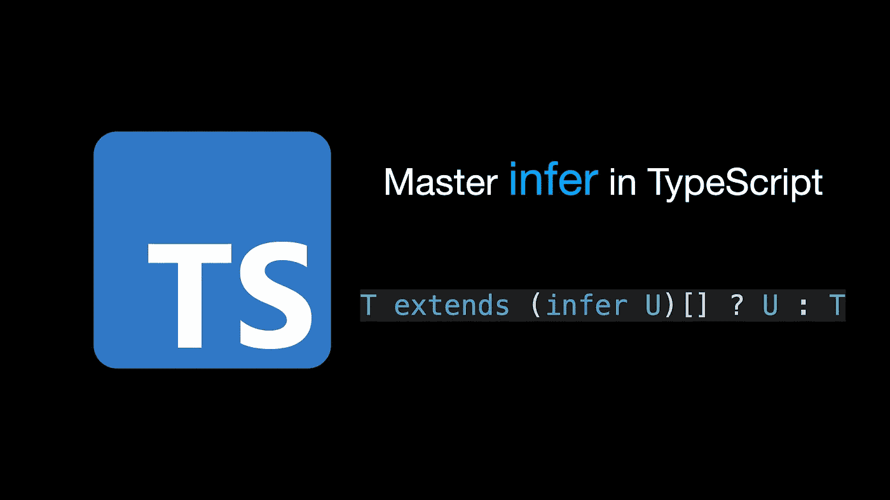
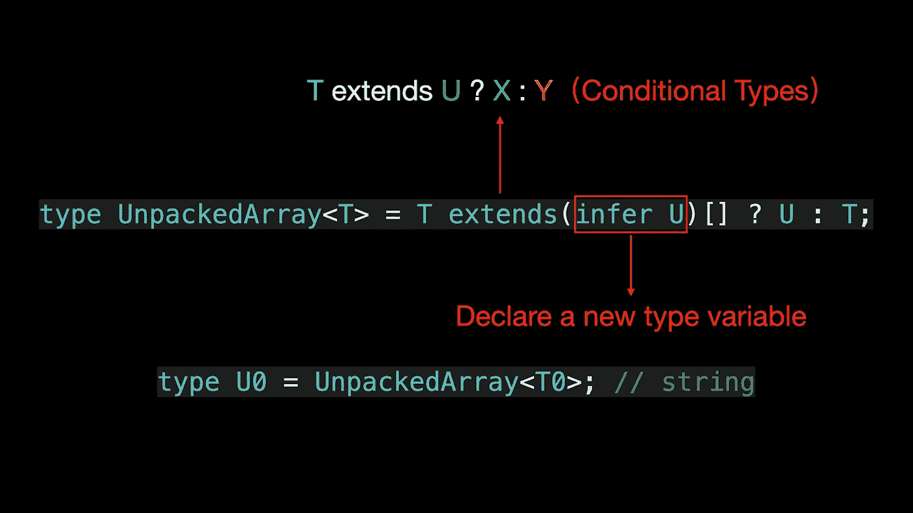
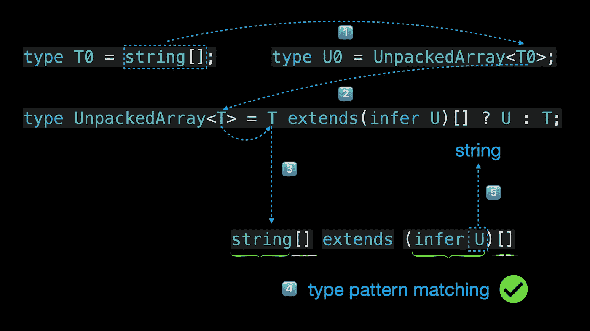
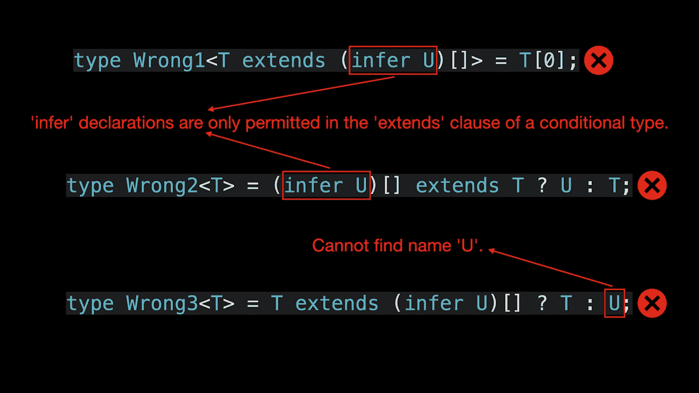
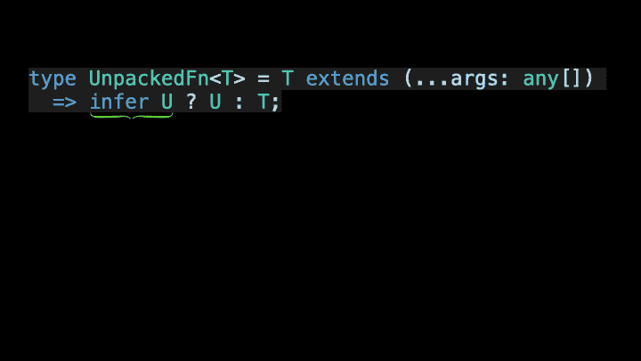
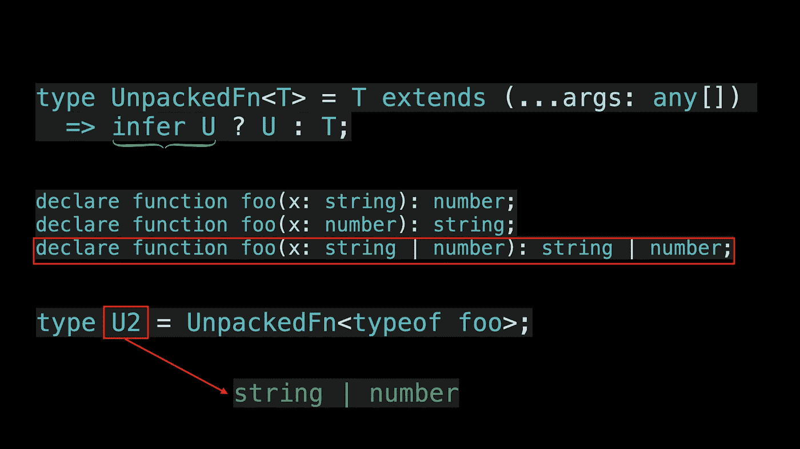
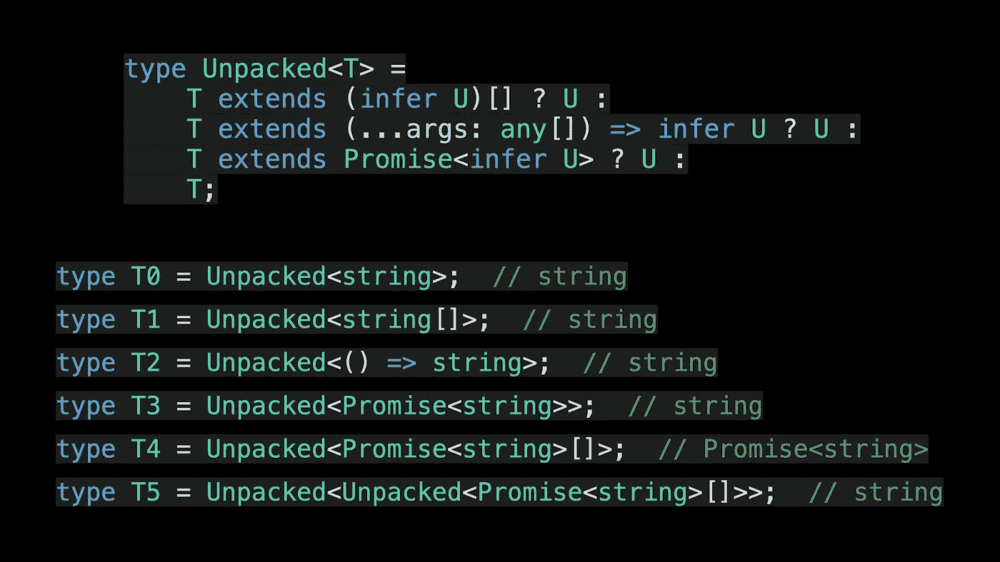
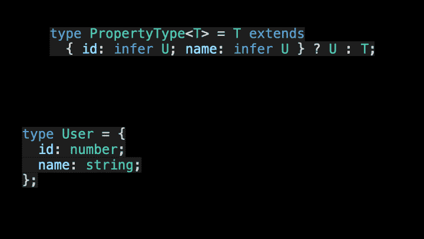
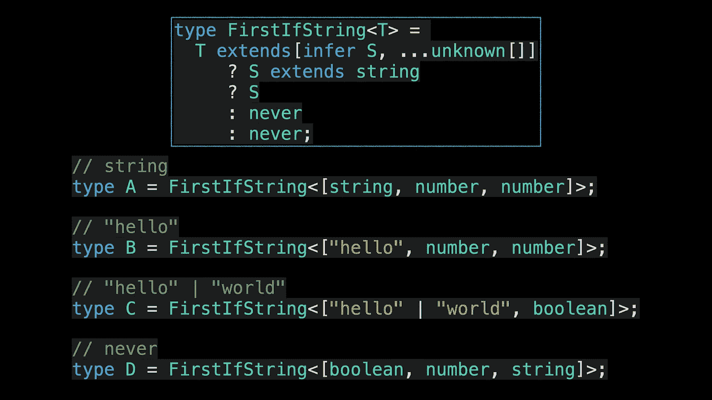
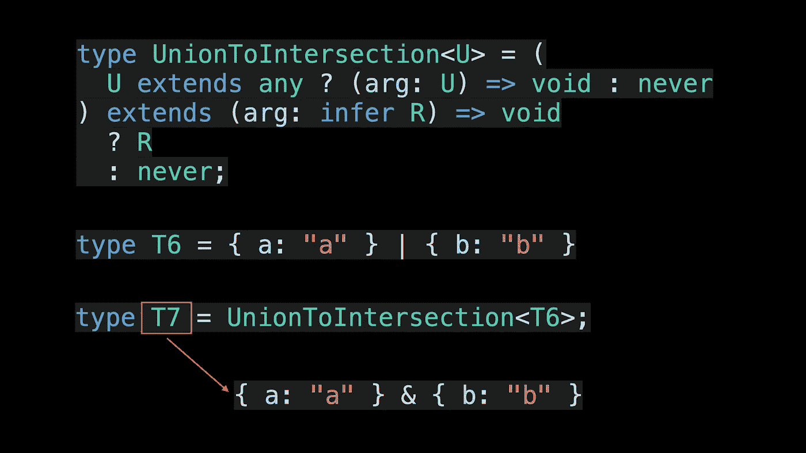

# 像专家一样使用 TypeScript 推断

> 原文：<https://levelup.gitconnected.com/using-typescript-infer-like-a-pro-f30ab8ab41c7>



欢迎来到**掌握打字稿**系列。本系列将以动画的形式介绍 TypeScript 的核心知识和技术。让我们一起学习吧！以前的文章如下:

*   [**TypeScript 泛型中的 K，T，V 是什么？**](https://medium.com/frontend-canteen/what-are-k-t-and-v-in-typescript-generics-9fabe1d0f0f3)
*   [**使用 TypeScript 像 Pro 一样映射类型**](https://javascript.plainenglish.io/using-typescript-mapped-types-like-a-pro-be10aef5511a)
*   [**使用 TypeScript 条件类型像亲**](https://javascript.plainenglish.io/use-typescript-conditional-types-like-a-pro-7baea0ad05c5)
*   [**使用 TypeScript 模板字面类型像亲**](https://medium.com/javascript-in-plain-english/how-to-use-typescript-template-literal-types-like-a-pro-2e02a7db0bac)
*   [**打字稿可视化:15 种最常用的实用类型**](https://javascript.plainenglish.io/15-utility-types-that-every-typescript-developer-should-know-6cf121d4047c)

知道如何获取 **T0** 数组类型中元素的类型和 **T1** 函数类型中返回值的类型吗？给自己几秒钟考虑一下。

```
type T0 = string[];
type T1 = () => string;
```

我们可以使用 TypeScript — **条件类型**和**推断**提供的类型模式匹配技术来完成前面的需求。

条件类型允许我们检测两个类型之间的关系，通过条件类型，我们可以确定两个类型是否兼容。 **Infer 用于声明类型变量，以存储模式匹配期间捕获的类型。**

让我们看看如何捕获 T0 数组类型中的元素类型:

```
type UnpackedArray<T> = T extends (infer U)[] ? U : T
type U0 = UnpackedArray<T0> *// string*
```



在上面的代码中，`T extends (infer U)[] ? U : T`是条件类型的语法，extends 子句**中的`infer U`引入了一个新的类型变量 U 来存储推断的类型**。

为了更好地理解，让我们演示一下 UnpackedArray 实用程序类型的执行流程。



**需要注意的是，infer 只能在条件类型的 extends 子句中使用，infer 声明的类型变量只能在条件类型的 true 分支中使用。**

```
type Wrong1<T extends (infer U)[]> = T[0] *// Error*
type Wrong2<T> = (infer U)[] extends T ? U : T *// Error*
type Wrong3<T> = T extends (infer U)[] ? T : U *// Error*
```



了解了这些知识之后，让我们看看如何获得 T1 函数类型的返回类型:

```
type UnpackedFn<T> = T extends (...args: any[]) => infer U ? U : T;

type U1 = UnpackedFn<T1>; *// string*
```

看了 UnpackedFn 实用程序类型的实现之后，是不是看起来很简单？**谈到函数重载场景，TypeScript 会使用最后一次调用签名进行类型推断。**



如果您不熟悉 TypeScript 的条件类型，可以阅读本文。

[](https://javascript.plainenglish.io/use-typescript-conditional-types-like-a-pro-7baea0ad05c5) [## 像专家一样使用 TypeScript 条件类型

### 用动画解释。掌握 TypeScript 条件类型并理解 TypeScript 的内置实用工具如何类型化…

javascript.plainenglish.io](https://javascript.plainenglish.io/use-typescript-conditional-types-like-a-pro-7baea0ad05c5) 

在上面的文章中，我们介绍了条件链接，它允许我们实现更强大的解包实用程序类型。

```
type Unpacked<T> =
    T extends (infer U)[] ? U :
    T extends (...args: any[]) => infer U ? U :
    T extends Promise<infer U> ? U :
    T;

type T0 = Unpacked<string>;  *// string*
type T1 = Unpacked<string[]>;  *// string*
type T2 = Unpacked<() => string>;  *// string*
type T3 = Unpacked<Promise<string>>;  *// string*
type T4 = Unpacked<Promise<string>[]>;  *// Promise<string>*
type T5 = Unpacked<Unpacked<Promise<string>[]>>;  *// string*
```



在上面的代码中，解包的实用程序类型利用条件类型和条件链来轻松推断数组类型中元素的类型、函数类型的返回值的类型以及承诺类型的返回值的类型。

事实上，使用条件类型和推断，我们还可以推断出对象类型中键的类型。接下来，我们举一个具体的例子:

```
type User = {
  id: number;
  name: string;
}

type PropertyType<T> =  T extends { id: infer U, name: infer R } ? [U, R] : Ttype U3 = PropertyType<User> *// [number, string]*
```


在 PropertyType 实用程序类型中，我们使用 infer 来声明两个类型变量 U 和 R，它们分别表示对象类型中 id 和 name 属性的类型。如果类型匹配，我们将 id 和 name 属性的类型作为一个元组返回。

**现在问题来了，如果在 PropertyType 实用程序类型中只声明了一个类型变量 U，会有什么结果？**下面我们来验证一下。

```
type PropertyType<T> =  T extends { id: infer U, name: infer U } ? U : T

type U4 = PropertyType<User> *// string | number*
```



从上面的代码可以看出，U4 类型返回字符串和数字类型的并集。为什么会返回这样的结果？**这是因为如果在协变位置有多个相同类型变量的候选，最终类型将被推断为联合类型。**

但是，在逆变位置，如果同一个类型变量有多个候选，最终的类型将被推断为交集类型。让我们再次验证这一点:

```
type Bar<T> = T extends { a: (x: infer U) => void, b: (x: infer U) => void } ? U : never;

type U5 = Bar<{ a: (x: string) => void, b: (x: number) => void }>;  *// string & number*
```


在上面的代码中，U5 类型返回一个由字符串和数字类型组成的交集类型，即最终类型是 never 类型。

**最后，让我介绍一个在 TypeScript 4.7 中引入的与 infer 相关的新特性，它使 infer 类型推断更加简洁。**在介绍与 infer 相关的新特性之前，我们先来看一个例子:

```
type FirstIfString<T> = T extends [infer S, ...unknown[]]
  ? S extends string
    ? S
    : never
  : never;
```

在上面的代码中， **FirstIfString** 实用程序类型使用 TypeScript 的条件类型、条件链和 infer 类型推断。在第一个条件类型中，我们确定类型参数 T 的实际类型是否为非空元组类型，并在模式匹配期间使用 infer 声明类型变量 S 以存储捕获的元组类型的第一个元素的类型。

在第二个条件类型中，我们继续判断类型变量 S 是否是字符串类型的子类型，如果满足条件则返回类型变量 S 对应的类型，否则条件类型的所有假分支都将返回 never 类型。

在介绍了 **FirstIfString** 实用程序类型的功能后，让我们验证一下它的功能。



从上面的结果可以看出， **FirstIfString** 实用程序类型工作正常。现在问题来了，既然实用程序类型内部使用了两个条件类型，我们能使用一个条件类型来实现相同的功能吗？ **TypeScript 4.7 允许我们向 infer 类型添加可选的 extends 子句，以指定对类型变量的显式约束。**

```
type FirstIfString<T> =
    T extends [infer S extends string, ...unknown[]]
        ? S
        : never;
```

相比之前的代码，是不是感觉干净了很多？看完这篇文章，相信你已经明白了条件类型的用途和推断。那么你能理解 **UnionToIntersection** 实用程序类型的具体实现吗？

```
type UnionToIntersection<U> = (
  U extends any ? (arg: U) => void : never
) extends (arg: infer R) => void
  ? R
  : never
```



如果你喜欢学习动画形式的 TypeScript，可以在 [Medium](https://medium.com/@bytefer) 或者 [Twitter](https://twitter.com/Tbytefer) 上关注我，了解更多关于 TS 和 JS 的内容！

# 资源


[](https://medium.com/@bytefer# 21496 Microsoft/TypeScript 在条件类型中进行类型推理</h2><div class=)

### [这个 PR 引入了在条件类型(#21316)中使用类型推断的能力，为…](https://medium.com/@bytefer# 21496 Microsoft/TypeScript 在条件类型中进行类型推理</h2><div class=)

[github.com](https://medium.com/@bytefer# 21496 Microsoft/TypeScript 在条件类型中进行类型推理</h2><div class=)

[](https://javascript.plainenglish.io/use-typescript-conditional-types-like-a-pro-7baea0ad05c5) [## 像专家一样使用 TypeScript 条件类型

### 用动画解释。掌握 TypeScript 条件类型并理解 TypeScript 的内置实用工具如何类型化…

javascript.plainenglish.io](https://javascript.plainenglish.io/use-typescript-conditional-types-like-a-pro-7baea0ad05c5) [](https://devblogs.microsoft.com/typescript/announcing-typescript-4-7/#extends-constraints-on-infer-type-variables) [## 发布 TypeScript 4.7

### 今天，我们很高兴地宣布 TypeScript 4.7 的可用性！如果您还不熟悉 TypeScript，它是一个…

devblogs.microsoft.com](https://devblogs.microsoft.com/typescript/announcing-typescript-4-7/#extends-constraints-on-infer-type-variables)