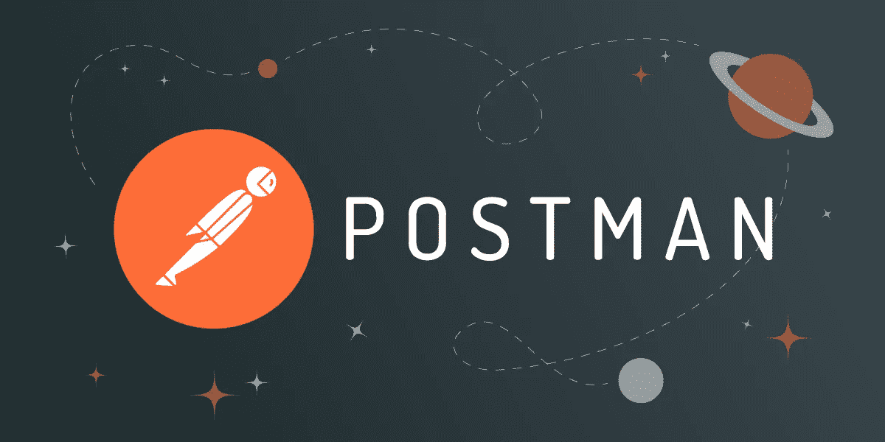
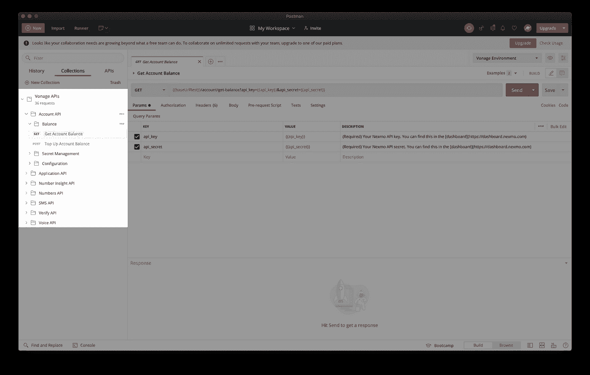
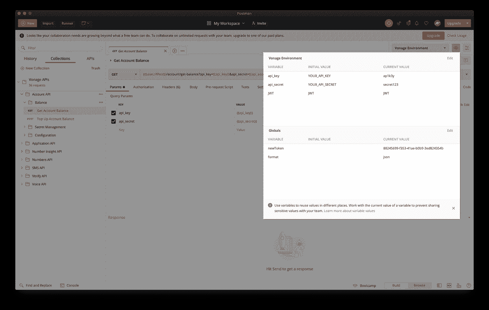
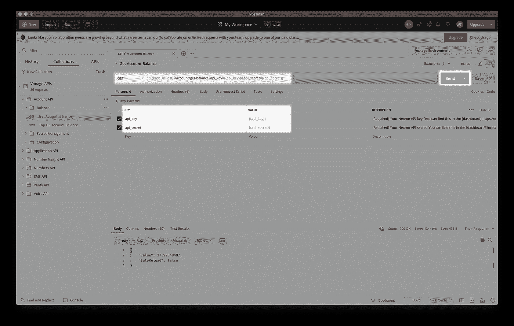
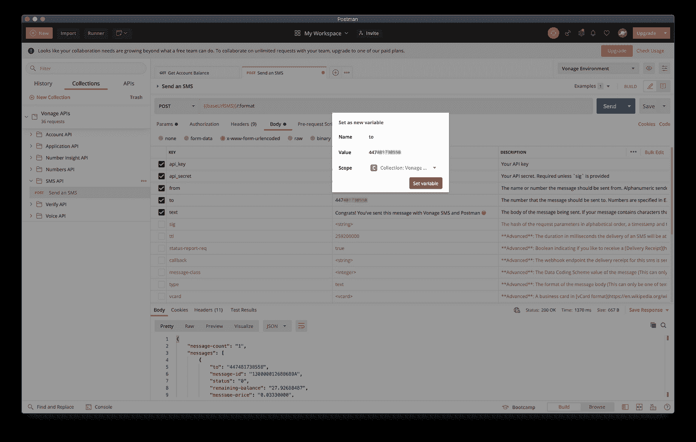

# 在 Postman 中使用变量和链接请求

> 原文：<https://levelup.gitconnected.com/using-variables-and-chaining-requests-in-postman-c821319d18f4>

在 Vonage，我们使用 OpenAPI 来描述我们所有的 API，并且我们也让那些规范[公开可用](https://developer.nexmo.com/concepts/guides/openapi)。我们最喜欢做的一件事就是将一个我们从未见过的 OpenAPI 文件导入到 [Postman](https://www.postman.com/) 中。因此，我们决定向前支付，并为我们的 API 创建一个 [Postman 集合](https://developer.nexmo.com/tools/postman)，以便评估和探索它们比以往更快更容易。

在本文中，我们强调了如何让在 Postman 中探索 API 变得更加容易。我们将使用[Vonage API Postman 集合](https://developer.nexmo.com/tools/postman)作为一个例子，所以如果你想继续的话，一定要仔细阅读先决条件列表。

# 先决条件

*   [邮递员账户](https://identity.getpostman.com/signup)

# Vonage API 帐户

要完成本教程，您将需要一个 [Vonage API 帐户](http://developer.nexmo.com/ed?c=blog_text&ct=2020-10-19-variables-and-chaining-requests-in-postman)。如果你还没有，你可以今天就[注册](http://developer.nexmo.com/ed?c=blog_text&ct=2020-10-19-variables-and-chaining-requests-in-postman)开始用免费的信用点数来建造。一旦你有了一个帐户，你可以在 [Vonage API 仪表板](http://developer.nexmo.com/ed?c=blog_text&ct=2020-10-19-variables-and-chaining-requests-in-postman)的顶部找到你的 API 密匙和 API 秘密。

本教程还使用了一个虚拟电话号码。要购买号码，请访问*Numbers* > *Buy Numbers*并搜索符合您需求的号码。

# 变量是你的朋友

当您第一次将[Vonage API 集合](https://developer.nexmo.com/tools/postman)导入 Postman 时，您会看到一个**Vonage API**文件夹出现在屏幕左侧的*集合*下。

您可能还会注意到收藏名称下的*“36 个请求”*。根据 auth 类型，大约需要 36 次添加`api_key`和`api_secret`作为请求参数。

幸运的是，Postman 支持环境、全局和集合级别的变量，这些都将使体验更加顺畅，也更少痛苦。这些变量使我们能够动态地获取这些值，而不是执行重复的任务，比如为每个请求填充相同的参数值。

我们的集合带有一个 *Vonage 环境*，在这里你可以提供你的密钥和秘密，然后所有的请求都将使用这些值。

这样，像用*帐户 API* 检查您的帐户余额这样的简单请求就变成了一键式工作。

其他一些请求可能需要额外的参数。例如，要让*发送短信*，您需要在请求正文中填写`to`、`from`和`text`，但是`api_key`和`api_secret`仍然会自动填充。您也可以选择将这些参数中的任何一个添加为变量，比如在下面的请求中，数字`to`已经被保存为一个集合变量。您可以通过直接编辑您的集合或环境，或者通过选择您想要用变量替换的硬编码值，然后单击**设置为变量** > **设置为新变量**来实现这一点。

# 链接请求

Postman 中的变量很棒，但它们不是解决所有麻烦事情的通用工具。
例如，当使用一个通过 JWTs 进行认证的 Vonage APIs 时，您需要在发出请求之前生成那个 JWT。要生成 JWT，您将需要一个应用程序 ID 和一个私钥，这两者都将在您创建 Vonage 应用程序时获得。这相当于必须提出三个独立的请求，这可能会让第一次探索这个 API 的人感到困惑。

幸运的是，对于多步骤的先决条件也有一个变通方法:链接请求。
Postman 提供了两个脚本区域，**预请求脚本**和**测试**，在这里你可以编写任何你喜欢的 JavaScript 代码——是的，也包括发出另一个 HTTP 请求。

# 请求前脚本

Vonage Voice API 使用 JSON Web 令牌(jwt)进行身份验证，因此要发送一个**创建出站调用**请求，我们首先需要:

1.  使用应用程序 API 创建一个 Vonage 应用程序
2.  从响应对象中获取`application_id`和`private_key`值，并使用它们生成 JWT。

# 测试:为什么不是请求后脚本？

Postman 允许您向单个请求、文件夹和集合添加测试。虽然这些测试对于确保您的 API 按预期运行和调试目的非常有用，但这里有一个问题:测试是 JavaScript 脚本，在发出请求后执行。这意味着我们使用*预请求脚本*的方式，我们也可以充分利用*测试*区域。

在我们的语音呼叫示例中，在成功完成时，我使用`pm.collectionVariables.set()`函数将`voice_call_uuid`保存为集合变量。如果我决定发出其他涉及语音 API 的请求，这个变量将会派上用场。或者，如果失败，我将使用`pm.environment.unset("JWT")`表达式清除`JWT`值，这样我就可以再次发送我的请求并生成一个新的 JWT。

在 [Postman 文档](https://learning.postman.com/docs/sending-requests/variables/#defining-variables-in-scripts)中阅读更多关于在脚本中定义变量的信息。

# 请求体

最后，让我们将所有这些放在一起，进行文本到语音的语音通话。您可以使用下面的代码片段，并将`to`和`from`作为变量或硬编码值提供。请记住，`to`是您要拨打的目的地号码，`from`是您的 Vonage 号码之一。如果你还没有的话，在你的仪表板上找一个。

*NCCO* 是我们的呼叫控制对象，它列出了呼叫被应答后要采取的所有动作。查看 [NCCO 参考资料](https://developer.nexmo.com/voice/voice-api/ncco-reference)，看看你还可以在你的电话流程中加入哪些行动。

这个请求现在可以开始了，所以按下**发送**按钮。恭喜你！你知道最棒的是什么吗？如果您保存您的更改并*共享集合*，下一个人只需填写缺失的变量值并按下*发送*按钮。

你会如何使用这些方便的邮递员功能？有什么技巧和窍门吗？让我们知道；我们期待着看到你想出的东西！

# 接下来去哪里？

*   [宣布 Vonage APIs Postman 集合](https://www.nexmo.com/blog/2020/09/16/announcing-the-vonage-apis-postman-collection)
*   [Vonage API 邮递员集合](https://explore.postman.com/vonage)
*   [使用变量指南](https://learning.postman.com/docs/sending-requests/variables/)
*   [账户 API 参考](https://developer.nexmo.com/api/account?theme=dark)
*   [短信 API 参考](https://developer.nexmo.com/api/sms?theme=dark)
*   [语音 API NCCO 参考](https://developer.nexmo.com/voice/voice-api/ncco-reference)

*最初发布于*[*https://www . NEX mo . com/blog/2020/10/19/variables-and-chaining-requests-in-postman*](https://www.nexmo.com/blog/2020/10/19/variables-and-chaining-requests-in-postman)