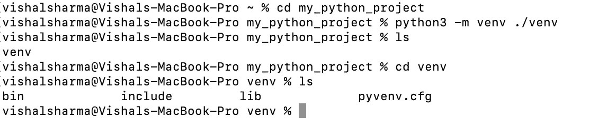

# 使用 venv 或虚拟环境安装 Python 包

> 原文：<https://levelup.gitconnected.com/using-venv-or-virtual-environment-for-installing-python-packages-94f93409384>

保存与虚拟环境的不同包依赖关系


使用 Python 的虚拟环境

在从事一个项目时，Python 程序员总是在寻找能够使他的编码部分或测试部分变得简单的库和模块。大多数程序员倾向于使用“pip”来安装 Python 中的包。

是啊！《匹普》的效果非常好。但是，有时当你在做两个不同的项目时。在这些项目中，您可能需要同一个库的两个不同版本。当您使用“pip”安装 Python 库时，这些包会全局安装在您的机器上。这意味着在所有程序中只能有一个版本的库。

这就是 venv 或虚拟环境成为救世主的原因。但是，是什么呢？

虚拟环境(也称为 virtualenv 或 venv)是一个 Python 环境，但却是一个孤立的环境。就像你电脑上运行的虚拟机一样！因此，要安装由项目分离的所有不同的依赖项，您必须使用 venv 安装您的包。

使用以下命令查看全局环境:

```
which pip3
```


全球环境位置

现在，创建一个新目录“new_python_project ”,让我们创建一个虚拟环境。

```
mkdir new_python_project 
cd new_python_project
python3 -m venv ./venv
```

它将在 new_python_project 目录的 venv 子目录中创建一个新的虚拟环境。



几乎整个 Python 都安装在这个目录中。现在，使用这个命令激活虚拟环境。

```
source ./venv/bin/activate
```


如果你寻找新的 Python 环境，它存在于“/venv/bin/pip3”中。


我通过简单的 pip 命令在我的 venv 中安装了一个新的 Python 库，即 *pip3 install mypy。*现在，如果你看一下 pip3 中的库，你会发现“mypy”，也是最近安装的一个。


现在，如果你想离开虚拟环境，只需简单地发出“停用”命令，你就会在全球环境中着陆。


停用之后，我的 Python 环境变了！瞧，使用虚拟环境就是这么简单。你现在可以随时访问 venv，只需激活命令，即*源。/venv/bin/activate "。*

**和平！**

如有疑问和讨论，请在下面留下评论。

[](https://skilled.dev) [## 编写面试问题

### 一个完整的平台，在这里我会教你找到下一份工作所需的一切，以及…

技术开发](https://skilled.dev)