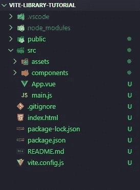

# 使用 Vite 将 Vue 组件发布到 NPM

> 原文：<https://levelup.gitconnected.com/using-vite-to-publish-a-vue-component-to-npm-7043a56cfa00>


Vite，读作“veet”是我创造的

构建工具一直是 JavaScript 世界中令人头疼的问题。尤雨溪希望改变 JavaScript 构建工具，使其更容易使用。他的解决办法:Vite。

# 什么是 Vite

Vite 是一个新的 JavaScript 工具库，旨在简化 JavaScript 工具。随着应用程序规模的增长，Webpack、parcel 和其他相关的 JavaScript 构建工具的性能开始下降。Vite 的目标是在坚持固执己见的约定的同时提高性能。

# 为什么要用 Vite？

JavaScript 工具很烂；使用 Vite 可以避免不必要的麻烦。没有 babel，浏览器无法立即解析流行的 JavaScript 框架的语法。有几个构建工具可以解决这个问题:Webpack、Parcel 和 Gulp。如果您曾经使用过前面提到的任何工具，您就会知道自己设置配置是一件痛苦的事情。

大多数 JavaScript 框架都受 CLI 支持，这使得开发服务器可以很容易地使用开箱即用的配置启动和运行。然而，如果你需要运行“弹出”，你知道这些命令行界面是不理想的。当前 JavaScript 工具生态系统中的另一个问题是膨胀。CRA 和 Vue-cli 安装了大量的包，所有这些包都使构建变得更慢，在 CI/CD 的状态下，更慢的构建=更高的成本。

这就是 Vite 的用武之地。在 JamstackConf 2021 上，尤雨溪描述了他在 Vite 背后的意图。本质上，Evan 你想要构建一个自以为是的工具来覆盖元框架和构建工具之间的鸿沟。

Vite 希望在构建工具中做更多的事情，而 Webpack 让开发人员来处理它的配置。[这应该会减少与现代构建工具如 CRA 或 Vue-CLI](https://news.ycombinator.com/item?id=19195148) 一起打包的膨胀量。现在，Vite 可以比 Webpack 做得更多。Vite 可以使用最佳实践来处理代码分割、编译 CSS 等等。

> “这是一种取舍，真的。Webpack 有很多可配置性，但在很多情况下，如果这些常见的情况如此相似，也许开箱即用会让最终用户更容易。”— [尤雨溪，Jamstack Conf 2021](https://youtu.be/phC14xfwvjc?t=899)

# 实践中的邀请

要真正理解一个工具，你必须学会如何使用它。因此，我们将构建一个组件，并将其发布到 NPM。这可以是使用 Vite 构建的组件库的模板。这应该让我们对 Vite 如何在已建立的工作流中工作有所了解。

## 创建新的 Vite 项目

要使用 Vite 创建一个新项目，我们只需遵循通用的工作流程:

使用 NPM:

```
npm init vite@latest my-app-name
```

使用纱线:

```
yarn create vite my-app-name
```

从这里开始，您将被提示选择一个框架。我们将选择 Vue，并在提示选择变体时选择 Vue。也可以使用 React 和 Svelte 等其他框架的模板。

我们给脚本一点时间来初始化新文件夹，一旦完成，我们可以使用`cd my-app-name`和`npm install`来安装所有必要的包。

## 构建组件

安装完所需的依赖项后，您的文件夹结构应该如下所示。



用于干净的 vite 安装的文件夹结构。

由于我们正在构建一个组件库，我们需要在`src/components/`中添加一个索引文件。这将是我们在教程后面的构建目标。

现在我们可以创建一个新的组件。我们将从一个简单的按钮组件开始，不要太花哨。在`src/components/`中创建一个名为`VButton.vue`的文件。这将是我们新的按钮组件:

接下来将您的按钮组件导入到`src/components/index.js`。我们将告诉 vite 在构建时将所有东西打包到这个文件中，所以我们应该将计划发布的组件包含在这个文件中。

现在我们需要测试我们的组件。Lucky Vite 使这变得简单，它打包了热模块替换，这是大多数其他开发工具如 create-react-app 和 vue-cli 的标准配置。

为了测试我们的新按钮组件，我们需要进入`App.vue`。首先删除 Vue 开始模板，并用我们的新按钮替换它。此时，您也可以删除`src/components/HelloWorld.vue`，因为它将不再被使用。完成后，您的`App.vue`文件应该如下所示:

现在来看看我们的新组件。我们所要做的就是运行`yarn dev`，这将启动开发服务器。一旦服务器运行，导航到 [http://localhost](http://localhost) :3000 来查看按钮的运行情况。

## 添加 TailwindCSS

现在我们的组件看起来有点乏味。Vite 使得在我们的应用程序中添加 CSS 处理变得非常容易。在本教程中，我们将使用 TailwindCSS 来设计我们的库。TailwindCSS 提供了一些模块化的 CSS 实用程序，使得设计风格变得轻而易举。[查看他们的文档，了解更多信息。](https://tailwindcss.com/docs)

首先安装所需的顺风套件:

```
yarn add --dev tailwindcss@latest postcss@latest autoprefixer@latest
```

这些包安装完成后，我们需要初始化 Tailwind。使用`npx tailwind init -p`来初始化 tailwind，这将为你的配置创建一个最小的`tailwind.config.js`文件，同时也将创建一个已经配置好的`postcss.config.js`。

接下来，我们需要告诉 tailwind 清除生产中任何未使用的样式。这是一个很好的实践，因为你不希望你的库带有任何未使用的文件，因为这会给最终用户带来膨胀。为此，在`tailwind.config.js`中配置`purge`属性。我们需要告诉 tailwind 我们在哪里使用样式，这样它就可以在构建时找到我们使用的样式。将您的`index.html`和您的 src 目录添加到清除配置选项中，如下所示:

接下来创建一个 css 文件来加载 tailwind 的内置样式。在`src/assets`中创建一个新文件，并将其命名为 index.js。您的 index.js 文件应该如下所示:

将新的 css 文件导入到目录根目录下的`main.js`中。这将允许我们在应用程序中使用 Tailwind 的 css 工具。

最后在`App.vue`中给你的按钮应用一些样式。如果您的开发服务器已经在运行，那么当您保存文件时，您的浏览器应该会自动重新加载。

现在我们有了一个好看的按钮，我们想和全世界分享它！

## 为库模式配置 Vite

为了准备新组件的发布，我们需要配置 Vite 来构建库模式。还有其他方式来构建产品，比如单页应用和多页应用。[查看文档，了解其他构建模式。](https://vitejs.dev/guide/build.html#building-for-production)

为了告诉 vite 构建库模式，我们需要对 Vite 配置中的`build.lib`选项进行一些更改。进入您的`vite.config.js`并进行以下更改:

那么，我们改变了什么？首先，我们告诉 Vite 我们想要打包的组件的位置:这是`entry`选项。我们组件库的入口文件将是`components/index.js`文件，因为这是我们公开想要打包的文件的文件。我们还指定了库的名称，以及构建文件的文件名。

接下来，我们需要外部化我们的库所依赖的任何依赖项。由于我们正在构建一个 Vue 组件库，我们需要将 Vue 指定为一个全局依赖项。最后，因为我们是为 vue 构建的，所以我们需要包含 Vite 的 Vue 插件。

现在配置都完成了，我们可以运行`vite build`，它将使用一个 Rollup 预置来构建两种格式的可发布库:`es`和`umd`。这可以在`build.lib`选项中进行配置。

现在我们的库建好了，就可以进入最后一步了:发布库！

## 发布到 NPM

我们几乎完成了，但在我们可以发布到 npm 之前，我们需要对我们的`package.json`做一些更改，以便它可以正确地列在 NPM 上。以下是推荐`package.json`应该寻找你的图书馆:

配置好`package.json`之后，我们可以继续发布了。不要忘记在每次更新软件包时修改版本号。由于这是第一次发布事件，我们的版本号将是`0.0.1`。

## 发布到 NPM

首先，确保您有一个 NPM 帐户，因为没有它您无法发布到 NPM。[遵循 NPM 的注册流程。](https://www.npmjs.com/signup)一旦创建了您的帐户，进入您的终端，通过运行`npm adduser`将您的 npm 帐户添加到您的 NPM 配置中。这将把您的 npm 凭据添加到您计算机上的`.npmrc`文件中。

最后可以运行`npm publish`。现在，你已经使用 Vite 成功地将你的 Vue 组件库发布到 NPM 了！

*感谢你阅读这篇文章，我希望你喜欢它，并学到一些新东西！不要害怕尝试一下 Vite，它是一个非常强大的工具，让我免去了很多头疼的事情。如果您喜欢这类内容，可以在 Twitter @the_victorv 上关注我，了解编程、商业和互联网的最新动态！*

## 资源

*   [Github 回购](https://github.com/victorvaldez5/vite-library-tutorial)
*   [邀请](https://vitejs.dev/)
*   [NPM 文件](https://docs.npmjs.com/)