# 使用 VS 代码构建 Azure 函数和 SQL 数据库应用程序。Azure 云上的 Net Core

> 原文：<https://levelup.gitconnected.com/using-vs-code-to-build-an-azure-function-and-sql-database-app-with-net-core-on-azure-cloud-9ab42febf9fa>

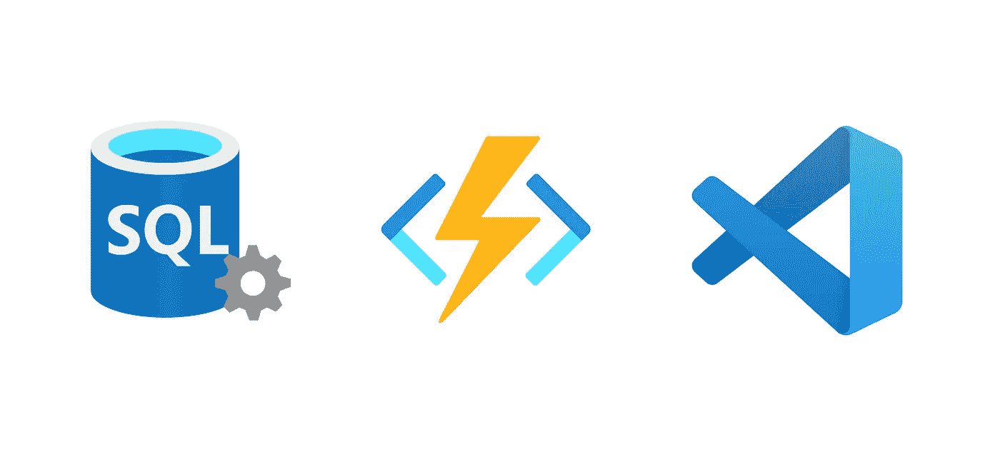

我真的很喜欢微软这几年的策略，它通过使用 VS 代码，让开发变得更容易，。Net Core 和 Azure cloud。这篇文章详细介绍了使用。net core 和 VS 代码，并将其部署到 Azure cloud。

在本文的最后，您可以找到示例项目的 repo 链接。

# VS 代码的扩展

我们要做的第一件事是设置我们的开发环境，也就是 VS 代码。所以你要安装这两个扩展:`Azure Functions Extension`和`NuGet Package Manager`。

借助 Azure Functions Extension，我们可以直接从 VS 代码中快速创建、调试、管理和部署无服务器应用。

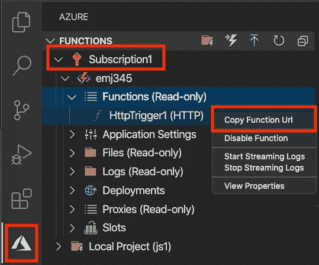

通过使用 NuGet 包管理器扩展，我们可以很容易地在 VS 代码中添加一个新的包。

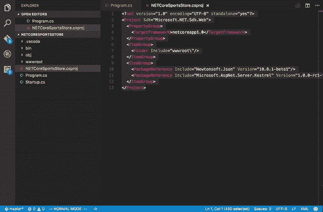

既然我们会用。Net Core 3.1 和我们的。NET Azure Functions app，因此，我们需要一些额外的 Nuget 包。

# 依赖注入和实体框架核心

在 VS 代码中安装了这些扩展之后，我们应该通过 Azure Functions 扩展创建 Azure Functions 项目。

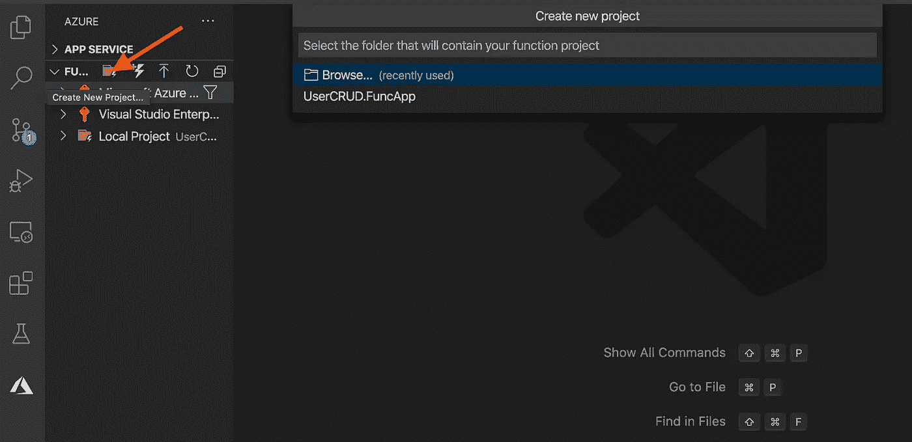

通过使用 Azure Functions 扩展，您可以选择您使用的编程语言和函数模板。现在我们建立我们的项目。

由于 Azure Functions 2 . x . Azure Functions 支持依赖注入，Azure Functions 中的依赖注入是建立在。NET 核心依赖注入特性。

为了使用依赖注入，我们必须安装两个 Nuget 包:

*   微软。Azure .函数.扩展
*   微软。函数

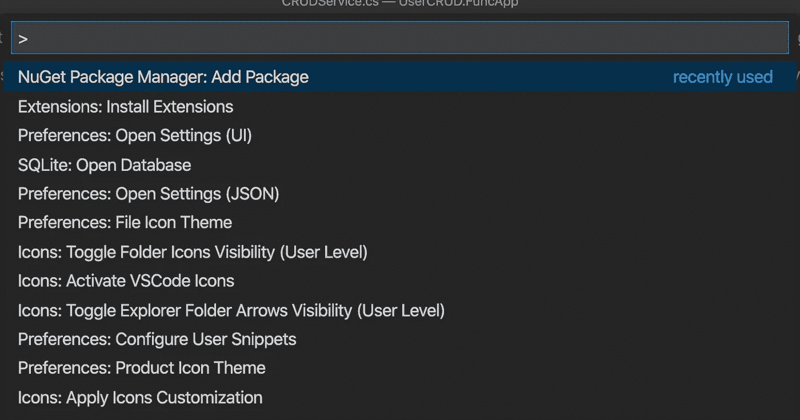

因此，我们可以使用我们安装的 NuGet 包管理器扩展来添加它们。

通过 NuGet 包管理器安装这些包后，你可以发现引用的项目被添加到项目文件夹的`.csproj`文件中。

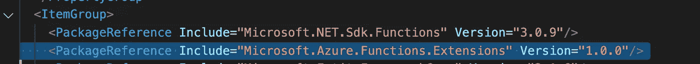

现在我们可以创建`Startup`类，并在`Configure`方法中配置所需的服务(与 Asp.Net 核心项目不同，它不在 ConfigureServices 方法中。)

```
**[assembly: FunctionsStartup(typeof(UserCRUD.FuncApp.Startup))]**namespace UserCRUD.FuncApp
{
    public class **Startup : FunctionsStartup**
    {
        public override void **Configure(IFunctionsHostBuilder builder)**
        {
            var connectionString = 
                Environment.**GetEnvironmentVariable("SqlServerConnection")**;
            **builder.Services.AddDbContext<DataContext>**(x =>
            {
                x.UseSqlServer(connectionString
                , options=>options.EnableRetryOnFailure());
            });**builder.Services.AddTransient<ICRUDService, CRUDService>();**
        }
    }
}
```

正如你在上面的代码中看到的，我们从环境变量中获得了 **SqlServerConnection** 字符串，这个值可以在`local.settings.json`文件中设置用于本地测试，也可以在 Azure Functions 面板中设置用于公共访问。

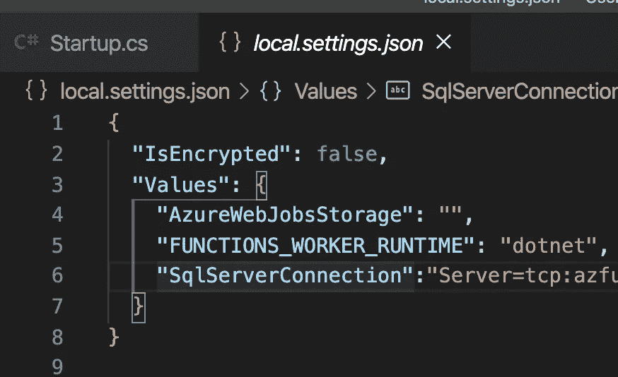

另一点值得注意的是，我们添加了`FunctionsStartup` assembly 属性来指定启动时使用的类型名。

接下来，我们将在我们的应用程序中引入 EntityFramework 核心。因为我们在使用。Net Core 3.1，需要注意的是，从 3.0 开始，ASP.NET 核心共享框架不包括英孚核心或任何英孚核心数据提供商。因此，我们应该通过 Nuget 包管理器添加这些包(EF Core 和 SqlServer provider)。

*   微软。实体框架工作核心
*   微软。EntityFrameworkCore.SqlServer

现在我们得到了应用程序所需的所有包。

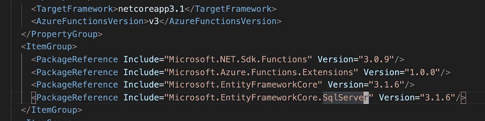

代码逻辑相对简单，下面是显示数据库中所有用户实体的函数示例。

```
namespace UserCRUD.Function
{
    public class ListHttpTrigger
    {
        private ICRUDService _service;
        **public ListHttpTrigger(ICRUDService service)**
        {
            _service = service;
        }**[FunctionName("list")]
**        public async Task<IActionResult> Run(
            [HttpTrigger(AuthorizationLevel.Anonymous, "get", Route = "list")] HttpRequest req, 
            ILogger log)
        {
            **var user = await _service.ListAsync();**
            return new OkObjectResult(user);
        }
    }
}
```

正如你在上面的代码中看到的，我们使用构造函数注入来将`ICRUDService`服务注入到 HTTP 触发的函数中。该服务使用 EF Core 从我们的数据库中读取用户列表。

然而，到目前为止，我们还没有设置我们的 Azure SQL 数据库。接下来，我们将设置 Azure SQL 数据库，并将我们的函数 app 与数据库连接。

# 设置 Azure SQL 数据库

现在让我们在 Azure 云平台上创建 Azure SQL 数据库服务。但是在创建新资源之前，我们应该首先创建一个资源组。您可以在以下网址了解更多原因:

[](/ci-cd-for-python-code-using-azure-jenkins-nginx-and-github-part-one-d0e1ab55e688) [## 使用 Azure、Jenkins、Nginx 和 GitHub 的 Python 代码的 CI/CD:第一部分

### 作为“使用 Azure、Jenkins、Nginx 和 GitHub 的 Python 代码的 CI/CD”系列的第一篇文章，我将介绍如何…

levelup.gitconnected.com](/ci-cd-for-python-code-using-azure-jenkins-nginx-and-github-part-one-d0e1ab55e688) 

然后你可以在 Azure 门户找到 Create a resource 按钮，创建一个 Azure SQL 服务。SQL 部署选项应该是 SQL 数据库。

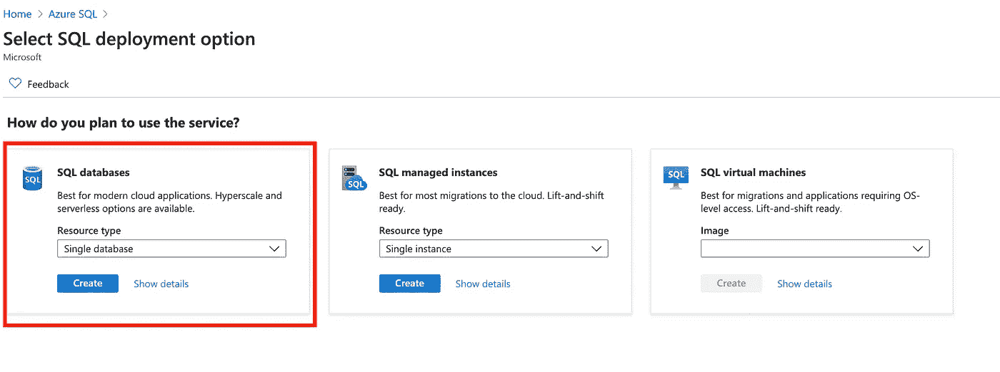

创建 Azure SQL 数据库服务后，我们应该为我们的无服务器功能应用程序配置数据库。

首先是我们数据库的**计算层**，你可以在设置/配置部分找到它。我们选择**无服务器**层，这意味着计算资源会根据使用的 vCores 自动调整每秒计费。

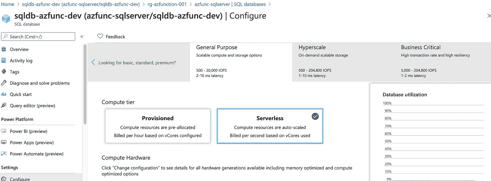

第二个是我们数据库的防火墙设置。这是因为来自互联网和 Azure 的连接尝试在到达我们的服务器或数据库之前必须通过防火墙。微软有一张图显示了流程。

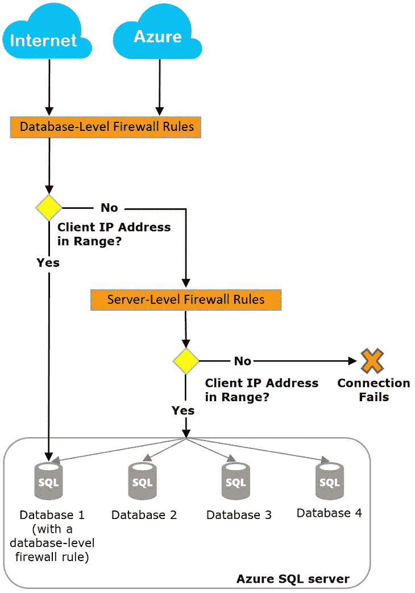

您可以在 SQL Server 的安全部分找到`***Firewalls and virtual networks***`按钮。而我们刚刚设定了`***Allow Azure services and resources to access this server***`。

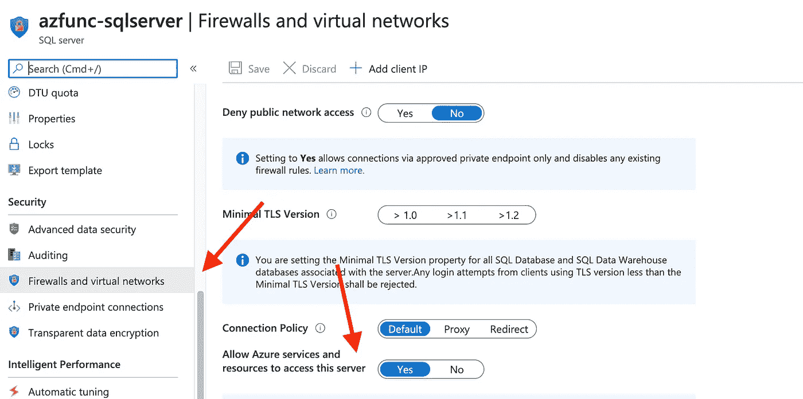

第三件事是，我们应该创建一个用于 Azure Functions 应用程序的表。

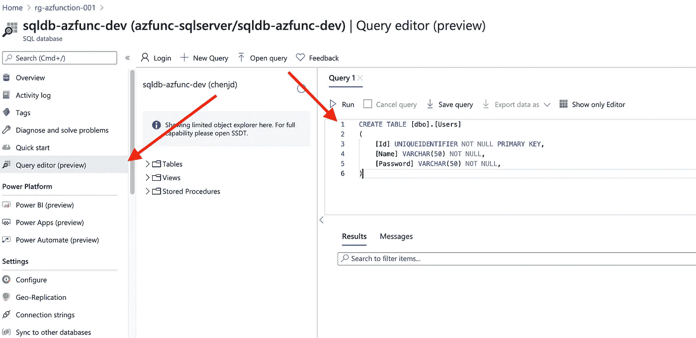

为了在我们的数据库中创建一个表，我们可以使用 ***查询编辑器*** 打开一个编辑器来使用 SQL 创建表。

现在我们已经在 Azure 云平台上建立了我们的 Azure 数据库。

# 在本地运行并发布到 Azure Cloud

正如我在*依赖注入和 EntityFramework 核心*一节中所说的，我们可以在`local.settings.json`文件中设置数据库连接字符串用于本地测试，在 Azure Functions 面板中设置数据库连接字符串用于公共访问。

因此，在我们可以在本地运行我们的应用程序或向公众发布它之前，我们应该做的第一件事是从我们的数据库中获取连接字符串。

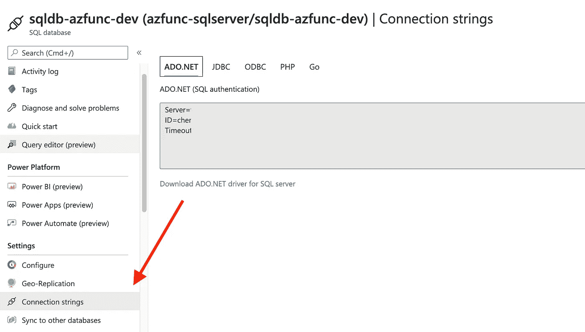

我们将连接字符串复制并粘贴到项目中的`local.settings.json`文件的值集合中。这是因为在本地开发时，应用程序设置来自文件中的值集合。

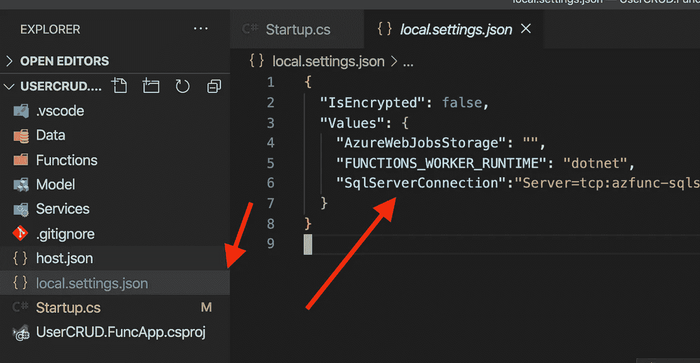

如您所见，该文件仅用于本地测试，不包含在 git 版本控制中。

现在有了 VS Code Azure 函数扩展，我们就可以在本地运行了。

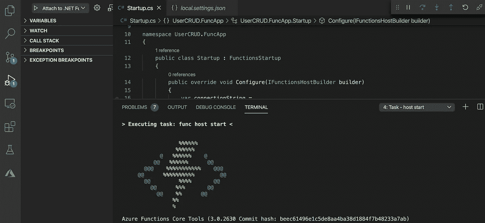

并且我们可以使用 Postman 向 localhost([http://localhost:7071/API/list](http://localhost:7071/api/list))发送 GET 请求来检索我之前创建的用户列表。

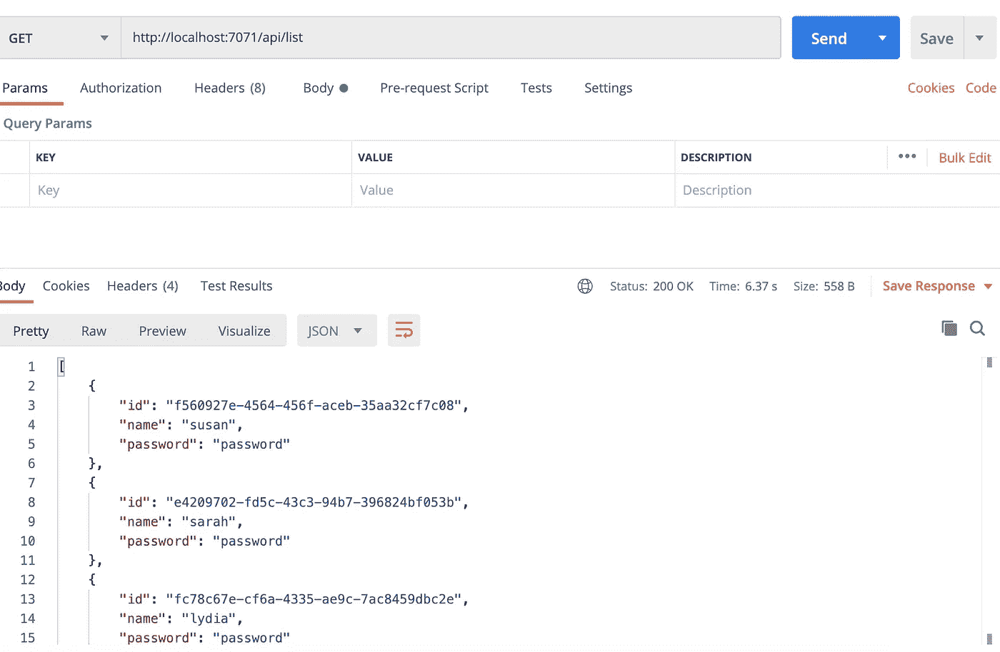

但是，如果我们想把我们的功能 app 推送到 Azure cloud 供公众访问，我们必须在 Azure Cloud 上的 Azure Function App 页面中设置连接字符串。

因为我们在代码中使用了***GetEnvironmentVariable***从设置中获取连接字符串。在本地和 Azure 环境中，`GetEnvironmentVariable("<app setting name>")`检索指定应用程序设置的值。因此，我们可以在“设置/配置”面板的“应用程序设置”部分设置它。

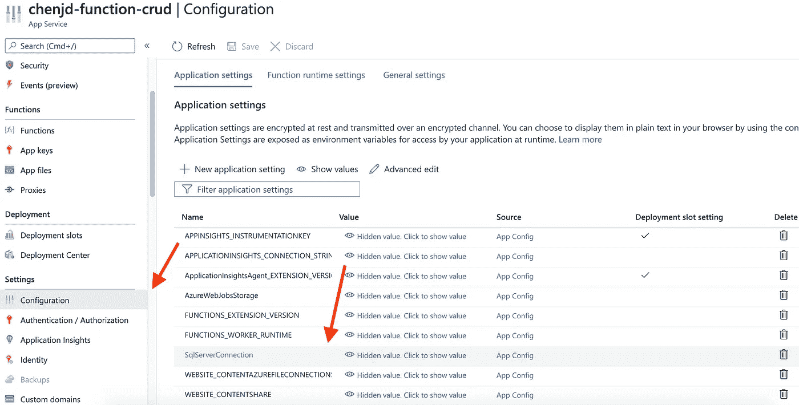

你可以在这里尝试一个简单的 API:[http://api.jiadongchen.com/api/list](http://api.jiadongchen.com/api/list)

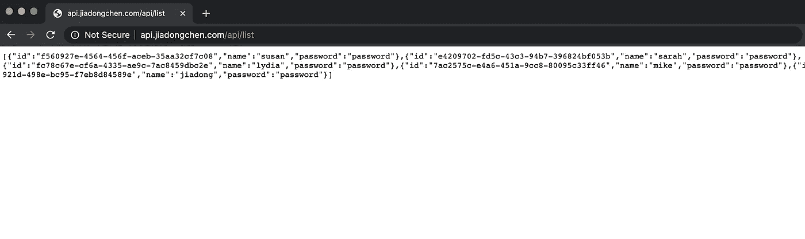

由于它仅用于演示目的，所选的服务计划存在冷启动问题，这意味着在功能应用程序空闲几分钟后，下一个请求可能会有从零扩展到一的额外延迟。所以保持耐心。

示例项目可以在这里找到:

[](https://github.com/chenjd/AzureFunction.UserCRUD) [## chenjd/AzureFunction。用户 CRUD

### 一个样例 CRUD 项目演示了 Azure Function 使用 EntityFramework Core 操作 Azure Sql 的过程…

github.com](https://github.com/chenjd/AzureFunction.UserCRUD) 

感谢阅读，希望对您有所帮助！

在[https://www.linkedin.com/in/chenjd/](https://www.linkedin.com/in/chenjd/)聊天