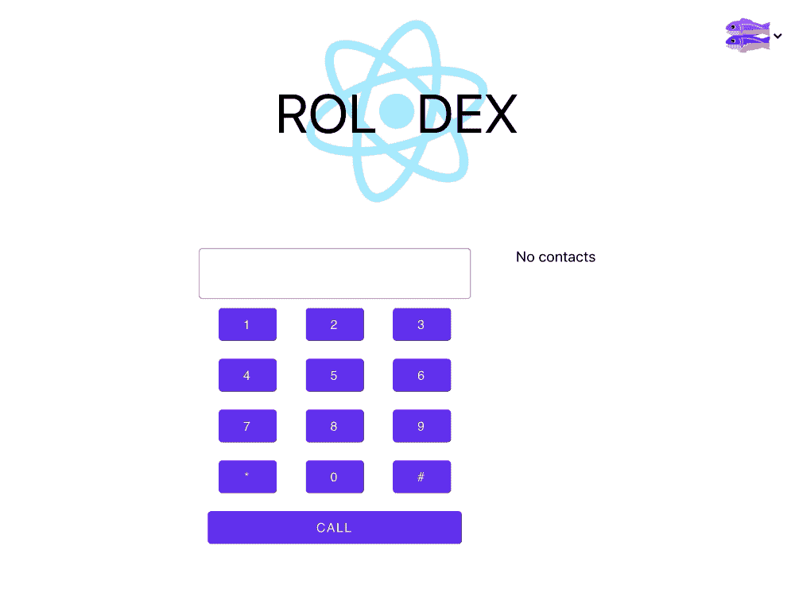
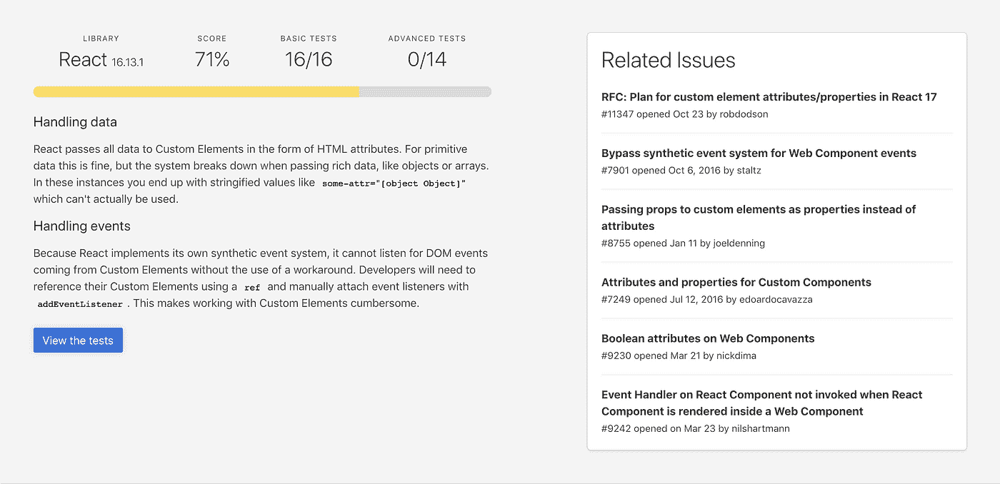

# 在 React 应用程序中使用 Web 组件

> 原文：<https://levelup.gitconnected.com/using-web-components-in-a-react-application-98dcfdb6d0b1>

在[之前的一篇文章](https://www.nexmo.com/blog/2020/08/13/creating-a-web-component-with-open-wc)中，我们向您展示了如何构建和发布 Web 组件。

现在是时候看看如何使用 Web 组件的顶级特性了:

> 基于 Web 组件标准构建的定制组件和小部件可以跨现代浏览器工作，并且可以与任何支持 HTML 的 JavaScript 库或框架一起使用。
> 
> ——【WebComponents.org 

在这篇文章中，我们将看看 Web 组件如何集成到一个 [React](https://reactjs.org/) 应用程序中。

# Vonage API 帐户

要完成本教程，您将需要一个 [Vonage API 帐户](http://developer.nexmo.com/ed?c=blog_text&ct=2020-10-07-using-web-components-in-a-react-application-dr)。如果您还没有，您可以今天就[注册](http://developer.nexmo.com/ed?c=blog_text&ct=2020-10-07-using-web-components-in-a-react-application-dr)并开始使用免费信用点数进行构建。一旦你有了一个帐户，你可以在 [Vonage API 仪表板](http://developer.nexmo.com/ed?c=blog_text&ct=2020-10-07-using-web-components-in-a-react-application-dr)的顶部找到你的 API 密匙和 API 秘密。

本教程还使用了一个虚拟电话号码。要购买号码，请前往*号码* > *购买号码*并搜索符合您需求的号码。

# Web 组件

首先，让我们看一下将在应用程序中使用的 Web 组件。

我们有来自[上一篇文章](https://www.nexmo.com/blog/2020/08/13/creating-a-web-component-with-open-wc)的键盘组件和联系人列表组件。联系人列表可以从浏览器的[本地存储器](https://developer.mozilla.org/en-US/docs/Web/API/Window/localStorage)中保存和加载被叫人的姓名和电话号码。Web 组件还可以在单击时将联系人的电话号码作为自定义事件发送给应用程序。

还有一个 [Material Web 组件对话框](https://www.npmjs.com/package/@material/mwc-dialog)，如果该号码不在联系人列表中，它将在通话结束后显示，因此可以保存。

# 问题

为了了解我们在 React 应用程序中使用这些 Web 组件时可能会遇到什么障碍，我们将到处引用[自定义元素](https://custom-elements-everywhere.com)。

他们承担了“确保框架和定制元素成为好朋友”的崇高责任🍻".

这是通过对框架/库进行各种测试并报告它们与 Web 组件的集成情况来实现的。

那么 React 的表现如何呢？截至本文发布之日，以下是结果:

看起来不太好，但我们可以做到。让我们来看看其中的一些问题。

向 Web 组件传递数据的一种方式是通过属性:

当在 React 应用程序中这样做时，数据被字符串化。所以传递数组(即[1，2，3，4])会变成“1，2，3，4”，对象(即{“key 1”:value 1，“key 2”:value 2 })会变成可怕的“[object Object]”。

另一个问题是 T2 如何处理 T3 事件。

React 有自己的[合成事件](https://reactjs.org/docs/events.html)实例，它是浏览器本地事件的包装器。Custom Elements Everywhere 的调查结果显示，React 的 SyntheticEvent“无法侦听来自自定义元素的 DOM 事件”。它们还提供了一种解决方案，我们接下来将研究这种解决方案。

# 解决方法

现在我们知道了等待我们的是什么，让我们努力克服这些问题。

计划是创建一个基本的 React“App”组件，然后将我们的 Web 组件放入其中。

在 React 应用程序中有两种方式编写组件——作为[类或函数](https://reactjs.org/docs/components-and-props.html#function-and-class-components)。

以前，如果您使用一个[类组件而不是函数组件](https://reactjs.org/docs/state-and-lifecycle.html)，那么在您的组件中需要使用“状态”是一个决定性因素。

然后在 React 16.8 中，引入了[钩子](https://reactjs.org/docs/hooks-intro.html)。"它们让你不用写类就可以使用状态和其他 React 特性."

因此，为了在这篇文章中尽可能彻底，我们将在 React 应用程序中包含 Web 组件，这些组件是使用带有钩子的类组件和函数组件创建的。

与任何时候使用 Web 组件一样，它们必须包含在项目中。您可以安装它们，也可以从 CDN 链接到它们。(这在[之前的帖子](https://www.nexmo.com/blog/2020/08/13/creating-a-web-component-with-open-wc)中有所涉及。)

对于这种集成，我们将从 CDN 中抽取。

在示例代码中的`public\index.html`文件的`<head>`标签中，您会发现:

# 类别组件

你可以在这个 [Glitch 项目](https://glitch.com/edit/#!/amethyst-wary-wedge?path=src%2FApp.js%3A4%3A0)中找到样本代码。

> 注意:我重新混合了 [Glitch React 启动器模板](https://glitch.com/~starter-react-template)。

## 处理事件

为了能够处理来自 Web 组件的事件，我们首先必须获得对它的引用，以便 React 知道它的存在，并可以添加事件侦听器。在`src\App.js`渲染函数中，你会发现一些`ref`标签:

`ref`标签让 React 知道要注意这些元素。

在`src\App.js`的`componentDidMount()`中，事件监听器被添加到我们刚刚设置的元素引用中。代码如下:

## 处理数据

对于我们的键盘组件，我们将字符串传递到属性中，因此在 React 中不需要对这些数据做任何特殊处理。

通话后保存联系人时，数据是一个对象:

这被传递到联系人列表 Web 组件中的一个方法中:

如果联系人列表组件没有使用对象来操作数据并保存到本地存储，我们可以像这样传递对象:

这同样适用于数组。

> ***重要提示！*** *用来获取对 Web 组件的引用的 API 被认为是遗留的，并且“可能会在将来的某个版本中被删除”* [*文档*](https://reactjs.org/docs/refs-and-the-dom.html#legacy-api-string-refs) *有更多的信息并提供替代方案。*

让我们展示一个提到的替代方案。

如果您使用的是 React 16.3 或更高版本，下面是使用 [React.createRef()](https://reactjs.org/docs/refs-and-the-dom.html#creating-refs) 的 Glitch 项目[示例代码](https://glitch.com/edit/#!/ionian-jelly-nasturtium?path=src%2FApp.js%3A1%3A0)。

几乎相同的想法，只是更多的语法。在构造函数中用`React.createRef()`创建引用:

将其连接到`render`中的 Web 组件:

在`componentDidMount()`中添加一个事件监听器:

调用 Web 组件的方法:

将“丰富”数据传递给 Web 组件:

# 带挂钩的功能组件

现在是最新的方法，从 React 16.8 开始，可以用来创建 Web 组件引用。

许多重物都是用钩子来搬运的。无论是处理状态、副作用还是 DOM 引用，可能都有一个钩子可以使用。

如果没有，您可以创建一个自定义挂钩。

在这种情况下，我们将使用的一个钩子是 [useRef](https://reactjs.org/docs/hooks-reference.html#useref) 。

这看起来很像`React.createRef()`的例子。

你可以在这个 [Glitch 项目](https://glitch.com/edit/#!/malleable-sable-relation?path=src%2FApp.js%3A1%3A0)中找到带有钩子样本代码的函数组件。

## 处理事件

首先，我们需要初始化每个 Web 组件的引用。这是通过以下代码完成的:

`null`是给定值的初始值。

然后在返回部分，我们用`ref={referenceName}`将引用附加到 Web 组件上。

代码如下:

现在让我们添加事件侦听器。

为此，我们将把它们放在一个[使用效果钩子](https://reactjs.org/docs/hooks-effect.html)中:

## 处理数据

如前所述，这将看起来非常类似于`React.createRef()`示例代码。

使用 Web 组件的方法发送数据:

要将“丰富”数据传递给 Web 组件:

# 到

我们已经连接好了我们的 Web 组件，为什么不用我们的 React 应用程序打个电话呢？

下面的步骤是一个修改版本，也是我们制作应用内语音通话教程[使用我们的 Web 组件的快速概述。](https://developer.nexmo.com/client-sdk/tutorials/app-to-phone/introduction/javascript)

你可以参考那个来了解更多的细节。

要使其发挥作用，需要:

**第一步:**重新混合这个[小故障项目](https://glitch.com/edit/#!/remix/carbonated-super-girdle)。

这不仅将设置带有 Web 组件的 React 应用程序，还将安装用于打电话的 [Nexmo 客户端 SDK](https://developer.nexmo.com/client-sdk/overview) 。

**步骤 2:** 安装 Nexmo CLI 工具。

在您的终端中，键入:

从你的[仪表板](https://dashboard.nexmo.com/settings)获取你的 Vonage 开发者 API 密匙和 API 秘密。

在终端中运行以下命令，同时用您自己的命令替换 api_key 和 api_secret:

确保你已经登录到 [GitHub](https://github.com) ，然后进入[https://gist.github.com](https://gist.github.com)。

在“包括扩展名的文件名”中输入`ncco.json`。

将以下 JSON 对象复制并粘贴到 gist 中:

用你的电话号码替换`PHONE_NUMBER`。Nexmo 编号采用 E.164 格式，“+”和“-”无效。请确保在输入您的号码时指定您的国家代码，例如，美国:14155550100，英国:447700900001。

点击`Create secret gist`按钮。

点击`Raw`按钮。

记下浏览器中显示的 URL，您将在下一步中使用它。

**步骤 4:** 创建一个 Nexmo 应用程序

如果尚未创建项目目录，请创建项目目录。

切换到项目目录。

通过将下面的命令复制并粘贴到终端来创建一个 Nexmo 应用程序:

> 确保通过用上一步中的要点 URL 替换`GIST-URL`来改变`--voice-answer-url`参数的值。

在您的项目目录中创建一个名为`.nexmo-app`的文件，它包含新创建的 Nexmo 应用程序 ID 和私钥。还创建了一个名为`private.key`的私钥文件。

请记下应用程序 ID，因为您将来会需要它。

**第五步:**创建用户

使用 Nexmo CLI，使用以下命令创建名为 Alice 的用户:

这将返回如下所示的用户 ID:

`User created: USR-aaaaaaaa-bbbb-cccc-dddd-0123456789ab`

**第六步:**生成 JWT

通过运行以下命令，使用 Nexmo CLI 生成一个 JWT，但请记住用您自己的值替换`APP_ID`变量:

生成的 JWT 将在接下来的 6 小时内有效。

将 JWT 复制并粘贴到`src/App.js` Glitch 项目文件中，这里写着“将爱丽丝·JWT 粘贴到这里”。

**第七步:**给自己打电话！

在键盘上拨打您的号码，然后按下*呼叫*。

如果一切正常，你的手机应该会收到一个电话。通话结束后，会弹出一个对话框，询问您是否要保存该号码。

> 注意:由于 NCCO 与您的电话号码是硬编码的，无论用键盘键入什么，您的号码都会被呼叫。要动态生成 NCCO，需要在后端完成。

嗯，就这样吧！我们现在已经在 React 应用程序中使用了 Web 组件。

成功了吗？很酷吗？

正如编码中的任何事情一样，做事有多种方式。

我在 [React](https://reactjs.org/docs/web-components.html) 和[模板 JS](https://stenciljs.com/docs/react) 文档中发现的另一种方法是将 Web 组件包装在 React 组件中。

你是用那种方式还是另一种方式做的？我真的很想在我们的[社区休闲频道](https://developer.nexmo.com/slack)中听到它或任何其他评论和问题。

*最初发布于*[*https://www . NEX mo . com/blog/2020/10/07/using-we B- components-in-a-react-application-dr*](https://www.nexmo.com/blog/2020/10/07/using-web-components-in-a-react-application-dr)