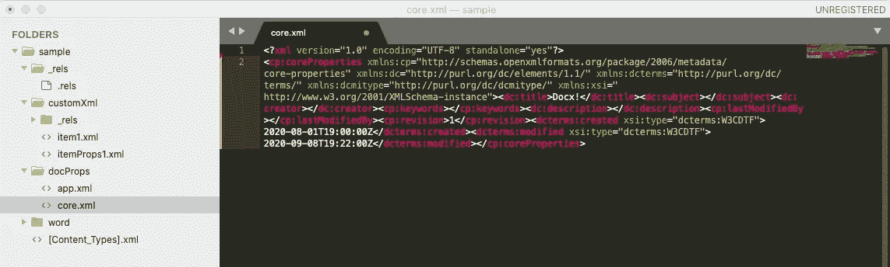
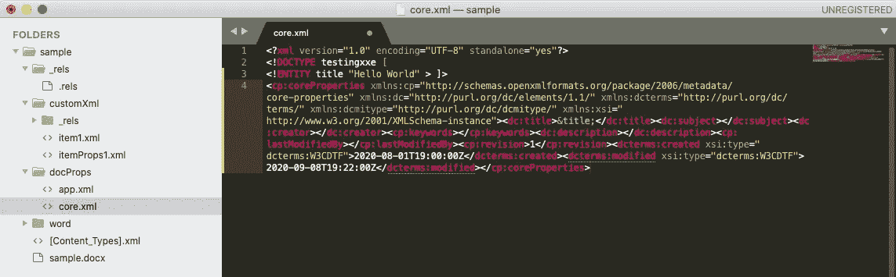
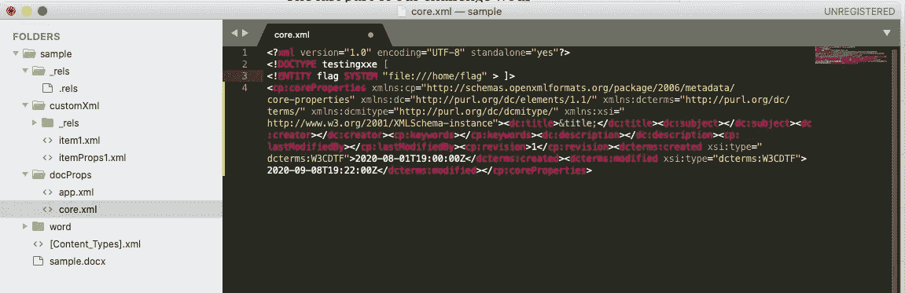

# 使用 Word 文档或”。docx”文件来获得对私有服务器资源的未授权访问

> 原文：<https://levelup.gitconnected.com/using-word-documents-or-docx-files-to-gain-unauthorised-access-to-server-private-resources-2477b3eafb7b>

我很高兴能参加 2020 年 11 月 19 日至 21 日由 cybertalents.com 举办的 CTF 网络安全大会。我很乐意与像我一样的 web 开发爱好者分享一些经验。本文演示了如何实现。docx 文件可能被滥用来限制对服务器上敏感资源的访问，如密码或网站源代码。

我将在本文中提出的挑战叫做“笔记本”。这是一个简单的网页，包含一个表格来上传 MSWord 文档或"。docx "文件传送到服务器。在表单的右侧，页面呈现 3 个字段:标题、主题和描述。在该表单下，有一个指向空的“sample.docx”文件的链接，我们可以下载该文件。
所以实际上，用户把笔记写在一个 docx 文件中(他可以使用提供的 sample.docx)，上传到服务器，然后在屏幕上看到笔记的标题、主题和描述。
在托管该应用程序的服务器中，有一个隐藏的标志，我们需要检索它才能成功完成挑战。

简单…

为了检查除了主页之外是否还有其他隐藏的路径，我向/robots.txt 发出了一个简单的请求，显示了/home/目录中一个名为“flag”的文件。这个提示告诉我们，这个标志存储在以前的受限目录中。挑战变得很明显，**我们** **需要使用上传表单来执行服务器端代码，并从给定的受限目录**中检索标志。

我开始尝试上传。txt，。php 和。html 文件，而不是 word 文件，试图崩溃的应用程序，但它只允许。docx 文件—运气不好！
反应快，我决定装糊涂。下的 php 文件。docx 扩展。这款应用比预期的更智能。显然，它是在检查文件结构以验证文档，而不仅仅是扩展名。在尝试了许多技术来欺骗服务器接受非 docx 文件并惨遭失败后，我得出结论，我们需要利用这些 MSWord 文档来利用服务器。

下一个明显的步骤是理解什么是. docx 文件，以及为什么它不同于其他扩展名，如。多克和。txt？docx 文件是一个归档文件(。zip 文件)，该文件具有 XML 结构。不像。多克和。txt 文件，如果您尝试使用文本编辑器打开. docx 文件，您会发现一长串十六进制字符。
这个。docx archive 包含非常具体的 XML 文件，这些文件负责定义文档的布局、字体、元数据、内容(文本和照片)以及许多其他属性。
换句话说，每个 docx 文件都是一个 zip 文件。但是，只有当 zip 文件包含必要的 XML 元素(这些元素是 docx 的构建块)时，它才是 docx。
让我们试着仔细观察一个典型的 docx 文件。我选择查看 web 应用程序提供的 sample.docx 文件:
*在 mac/linux 上尝试:
—% unzip[/path/to/]sample . docx-d[/path/to/]sample/
—% CD[/path/to/]sample/
—% ls-l* 创建了一个“sample”目录，我们可以在其中看到我们解压缩的 docx 的内容: */rels/
/custom XML/。xml*

好了，让我们回到我们的 web 应用程序。让我们试着在屏幕上打印一些东西。请记住，在表单的右侧，可以打印三个字段:标题、主题和描述。比如，我们写一张纸条，上面写着:
*标题:午餐
主题:餐厅选择
描述:我今天想吃一个汉堡。*

我们该怎么做呢？我们打开 sample.docx，把上面写的一模一样，保存后上传到服务器。屏幕上什么也没有显示。我的第一直觉是，服务器将寻找关键字“标题、主题和描述”，相应地解析输入文本，并在屏幕上显示这些值。但是很明显页面做了一些不同的事情:无论我们用 MSWord 在 docx 文件中写什么，在屏幕上都不会改变。所以从技术上来说，webapp 想要从 docx 中的其他地方获得“标题、主题和描述”。

使用一个简单的文本编辑器，我开始研究解压缩后的 sample.docx 文件。在查看了里面的所有 xml 文件后，我在/docProps/core.xml 中找到了这段代码:

core.xml 是定义 sample.docx 核心属性的文档。我们可以清楚地看到标题、主题和描述标签！让我们在相应的标签之间写下午餐笔记文本并保存。
我们现在需要将我们的新文档转换回 docx:
*—% zip-r sample _ updated . docx **
上传新的 docx 现在会将我们的注释打印到屏幕上！

我们挑战的最后一部分是在屏幕上写下/home/flag 的内容，而不是随机的午餐笔记。

**/home/是一个受限目录。这意味着我们需要非法地从网站目录(默认为/var/www/website-name)遍历到所需的/home/flag。**

这让我想到了在 XML 解析器**中发现的 **XXE 或 XML 外部实体**漏洞。**

在 XML 文档中，实体是可以在文件顶部定义并在文件内部任何地方重用的常量，就像任何其他编程语言中的常量一样。
我们修改 core.xml，如下所示，以包含一个“标题”实体:

&title 指的是上面的“Hello World”。

使用 XML 实体是危险的。在某些情况下，XML 解析器被配置为允许实体引用外部资源，比如受限文件的内容。让我们试着利用这个漏洞。

上面的“flag”实体指的是/home/flag 文件的内容。我们将它打印在<title>标签之间。如果我们保存文档，转换回。docx 格式并上传到服务器，我们会看到国旗印在屏幕上！</title>

这个简单的例子显示了 XXE 漏洞到底有多危险。
**如果我们将“file:///home/flag”替换为“file:///etc/passwd”就可以检索到存储在服务器**上的所有用户和密码，或者“file:///var/www/[secure bank]/[transfer funds . PHP]”，就可以得到网站源代码。

此外，如果加载了“expect”PHP 模块，我们可能会在服务器上执行随机代码，从而危及整个系统。

**如何预防 XXE？**

开发人员培训对于识别和减轻 XXE 至关重要。除此之外，预防 XXE 需要:

*   尽可能使用不太复杂的数据格式，如 JSON，并避免敏感数据的序列化。
*   修补或升级应用程序使用的或底层操作系统上的所有 XML 处理器和库。使用依赖检查器。将 SOAP 更新到 SOAP 1.2 或更高版本。
*   在应用程序的所有 XML 解析器中禁用 XML 外部实体和 DTD 处理。

其他方法包括使用虚拟补丁、API 安全网关、Web 应用程序防火墙(WAF)或交互式应用程序安全测试(IAST)工具来检测、监控和阻止 XXE 攻击。